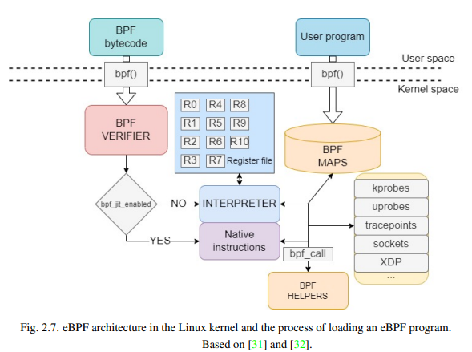
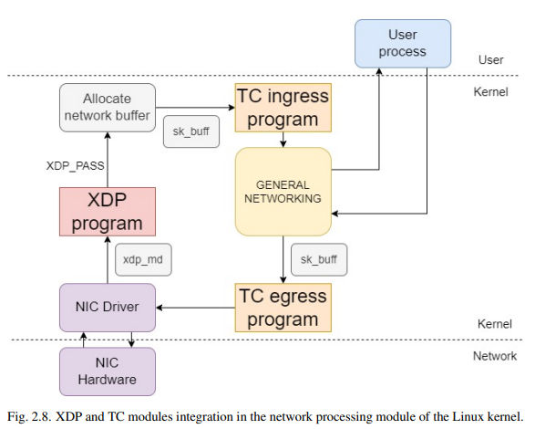
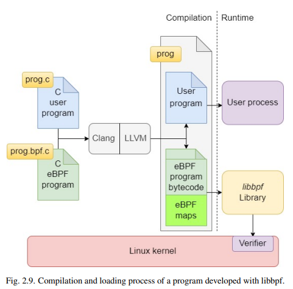

## Background

### Architecture

#### 系统架构

#### eBPF指令集

|      | IMM | OFF | SRC | DST | OPCODE |
| ---- | --- | --- | --- | --- | ------ |
| BITS | 32  | 16  | 4   | 4   | 8      |

| eBPF Register | x86_64 Register | Purpose    |
| ------------- | --------------- | ---------- |
| r0            | rax             | 返回值        |
| r1            | rdi             | 函数参数1      |
| r2            | rsi             | 函数参数2      |
| r3            | rdx             | 函数参数3      |
| r4            | rcx             | 函数参数4      |
| r5            | r8              | 函数参数5      |
| r6            | rbx             | 被调用者保存的寄存器 |
| r7            | r13             | 被调用者保存的寄存器 |
| r8            | r14             | 被调用者保存的寄存器 |
| r9            | r15             | 被调用者保存的寄存器 |
| r10           | rbp             | 栈帧指针，只读    |

注意，每个eBPF VM的寄存器都与一个x86 64寄存器相对应

#### JIT编译

JIT是否启用由一个变量 bpf_jit_enable 控制

#### eBPF验证

主要验证几个方面，以防止eBPF程序有未定义的行为

* 控制流安全
  
  * 不能有循环（5.2版本内核后允许有界循环）
  
  * 函数调用和跳转目标必须是可达的函数
  
  * 不允许sleep和block操作

* 指令测试
  
  * 不允许除零和无效的移位操作
  
  * 无效的栈访问和无效的越界数据结构访问
  
  * 读取未初始化寄存器和指针破坏

检测主要采用了两个技术

* 建立一个代表eBPF指令的图，以图的方式检测（如检测是否是一个DAG等）

* 模拟执行，遍历每个可能的路径，并观测每条指令栈和寄存器的状态

#### eBPF map结构

若需要创建一个map结构，需要结构体包含下列成员

| FIELD       | VALUE           |
| ----------- | --------------- |
| type        | eBPF map的类型     |
| key_size    | 作为key的数据结构的大小   |
| value_size  | 作为value的数据结构的大小 |
| max_entries | map结构的最大元素数量    |

map结构主要有以下几种type

| TYPE                    | DESCRIPTION                            |
| ----------------------- | -------------------------------------- |
| BPF_MAP_TYPE_HASH       | 哈希表型的map，元素使用元组存储                      |
| BPF_MAP_TYPE_ARRAY      | 元素保存在数组中                               |
| BPF_MAP_TYPE_RINGBUF    | 提供了一个单向的通信系统，从kernel到user，主要是用于传递event |
| BPF_MAP_TYPE_PROG_ARRAY | 存储eBPF程序的描述符                           |

#### bpf()系统调用

主要支持以下的操作

| COMMAND             | ATTRIBUTES               | DESCRIPTION         |
| ------------------- | ------------------------ | ------------------- |
| BPF_MAP_CREATE      | 一个上面描述的map info结构        | 创建一个map类型           |
| BPF_MAP_LOOKUP_ELEM | map id和一个包含key和value的结构  | 用一个特定的key获得对应的value |
| BPF_MAP_UPDATE_ELEM | map id和一个包含key和新value的结构 | 更新某个key对应的value     |
| BPF_MAP_DELETE_ELEM | map id和一个key             | 删除某个key对应的value     |
| BPF_PROG_LOAD       | 一个描述要加载的eBPF程序的结构        | 加载一个eBPF程序到内核       |

其中对于BPF_PROG_LOAD，可以load下列程序类型

* BPF_PROG_TYPE_KPROBE

* BPF_PROG_TYPE_UPROBE

* BPF_PROG_TYPE_TRACEPOINT

* BPF_PROG_TYPE_XDP

* BPF_PROG_TYPE_SCHED_CLS

#### helper函数

ebpf提供了一系列与系统交互的helper函数，如获取context、内存访问等。下面介绍程序类型时会简单介绍可能用到的helper函数

### eBPF程序类型

#### XDP

Express Data Path，使用bpf()的BPF_PROG_LOAD加载，其中程序类型应指定为 BPF_PROG_TYPE_XDP

XDP模块直接attach在网络接口驱动（Network Interface Controller）上，所以是系统中第一个获取网络包的模块

一般流程如下

* 分析包缓冲区内的数据

* 修改包的内容和包的长度

* 选择下列一种action

| ACTION   | DESCRIPTION              |
| -------- | ------------------------ |
| XDP_PASS | 让修改后的数据包继续被其他模块处理        |
| XDP_TX   | 在接收数据包的同一个NIC上返回数据包，保留修改 |
| XDP_DROP | 丢弃该网络包                   |

一些相关的XDP helper函数

| eBPF helper           | DESCRIPTION               |
| --------------------- | ------------------------- |
| bpf_xdp_adjust_head() | 通过移动第一个字节的位置来放大或缩小数据包的扩展  |
| bpf_xdp_adjust_tail() | 通过移动最后一个字节的位置来放大或缩小数据包的扩展 |

#### TC

Traffic Control，也是一个网络检测模块，挂载的位置如上图

与XDP主要有下列区别

* TC获取的数据封装程度高于XDP，因此较容易处理；但较XDP来说能修改的内容较少

* TC可以挂载在ingress和egress两个位置，所以可以处理发出的包

TC程序的主要工作过程如下

* TC程序定义了一个所谓queuing discipline(qdisc)，一个用FIFO处理包的packet scheduler

* 我们的TC eBPF程序挂载在qdisc上，工作方式类似过滤器

TC程序也有三种action

| ACTION            | DESCRIPTION       |
| ----------------- | ----------------- |
| TC_ACT_OK         | 让修改后的数据包继续被其他模块处理 |
| TC_ACT_RECLASSIFY | 将包返回到qdisc的队列末尾   |
| TC_ACT_SHOT       | 丢弃该数据包            |

一些相关的TC helper函数

| eBPF helper           | DESCRIPTION               |
| --------------------- | ------------------------- |
| bpf_l3_csum_replace() | 重新计算网络第三层（如IP层）的checksum  |
| bpf_l4_csum_replace() | 重新计算网络第四层（如TCP层）的checksum |
| bpf_skb_store_bytes() | 将一个缓冲区的数据写入包              |
| bpf_skb_pull_data()   | 读取包的一个数据序列到缓冲区            |
| bpf_skb_change_head() | 通过移动第一个字节的位置来放大或缩小数据包的扩展  |
| bpf_skb_change_tail() | 通过移动最后一个字节的位置来放大或缩小数据包的扩展 |

#### Tracepoints

该技术是用来hook linux内核函数的。注意，这些tracepoint是在内核开发的时候就被设置的，即只有被设置成tracepoint的内核函数才可以被hook

tracepoint的事件可以在 `/sys/kernel/debug/tracing/events` 浏览

大多数系统调用在进入和退出时都有tracepoint，如对于 sys_open 函数，存在两个tracepoint： sys_enter_open和sys_exit_open

大多数系统调用的tracepoint都会传入系统调用的参数，参数可以在 `/sys/kernel/debug/tracing/events/<subsystem>/<tracepoint>/format` 浏览。如对于sys_enter_open，可以在 `/sys/kernel/debug/tracing/events/syscalls/sys_enter_open/format` 浏览

#### Kprobes

类似tracepoints，不同点在于kprobe不需要预定义tracepoint，而是动态地attach到函数上。此外kprobe可以attach到除了个别黑名单中的指令外的任何指令上

kernel维护一个kernel symbol的表，包含它们的地址，可以用于kprobe。该表位于 `/proc/kallsyms`

#### Uprobes

uprobes与kprobes类似，但可以跟踪user space的程序

使用uprobes时，需要下列三个参数

* 程序名

* 要probe的指令的函数地址

* 要probe的指令相对函数开头的偏移

### eBPF开发

#### BCC

一套工具链，可以将eBPF编译为字节码并作为string嵌入python，并调用它运行

#### Bpftool

提供了下列功能

* 加载eBPF程序

* 列出当前运行的eBPF程序

* 从活动的eBPF程序dump字节码

* 从程序中提取程序的数据和统计信息

* 列出与操作eBPF的map

#### Libbpf

一个ebpf库，当前由内核维护，使用该库可以减少对内核的依赖

该库提供了对C rust和go的支持

该库还提供了一个管理eBPF程序的框架，主要用到了下列API

| FUNCTION NAME     | DESCRIPTION               |
| ----------------- | ------------------------- |
| <name>__open()    | 解析eBPF程序和映射               |
| <name>__load()    | 当eBPF程序可用时，将其映射加载到内核中     |
| <name>__attach()  | 使能eBPF程序，将其attach到内核的对应部分 |
| <name>__destroy() | 将eBPF程序从内核detach          |

### eBPF的安全特性

#### 访问控制

老版本内核的策略：

* 特权用户可以加载任何eBPF程序（root或CAP_SYS_ADMIN用户）

* 非特权用户只能加载 BPF_PROG_TYPE_SOCKET_FILTER 类型的程序

新版本内核有更细粒度的策略：

* 无CAP  只可以加载和attach BPF_PROG_TYPE_SOCKET_FILTER类型的程序，加载BPF_PROG_TYPE_CGROUP_SKB类型的程序

* CAP_BPF  加载（不是attach）任何eBPF程序，创建和访问大多数eBPF映射

* CAP_NET_ADMIN  attach到网络相关的eBPF程序（TC XDP等）

* CAP_PERFMON  attach到kprobes uprobes tracepoints，对内核内存有读权限

* CAP_SYS_ADMIN  任何eBPF程序

由此可知，若无CAP_SYS_ADMIN，若我们想运行一个网络的eBPF程序，需要CAP_BPF和CAP_NET_ADMIN

### proc文件系统

这里关于proc文件系统的一个重要描述是说 `/proc/<pid>/mem` 不仅可以被读还可以被写，而且这个写权限是不管该内存段的属性的

[enable writing to /proc/pid/mem [LWN.net]](https://lwn.net/Articles/433326/)

这里说是为了方便调试器操作对象的内存

## Analysis of Offensive Capabilities of EBPF
