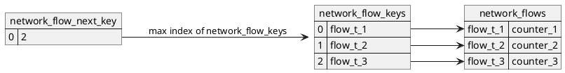

presentation: https://i.blackhat.com/USA21/Wednesday-Handouts/us-21-With-Friends-Like-EBPF-Who-Needs-Enemies.pdf

repo: https://github.com/Gui774ume/ebpfkit.git

## 概述

看了半天发现这个repo的go相关主要实现的是与ebpf交互的框架和通过网络交互的功能，ebpf的主要代码都在 `ebpf/ebpfkit` 的头文件中

### 使用的ebpf接口

#### main.o

```go
Probes: []*manager.Probe{
    {
        Section: "kprobe/do_exit",
    },
    {
        Section: "kprobe/__x64_sys_pipe",
    },
    {
        Section: "kprobe/__x64_sys_pipe2",
    },
    {
        Section: "kretprobe/__x64_sys_pipe",
    },
    {
        Section: "kretprobe/__x64_sys_pipe2",
    },
    {
        Section: "kprobe/__x64_sys_dup2",
    },
    {
        Section: "kprobe/__x64_sys_dup3",
    },
    {
        Section: "tracepoint/sched/sched_process_fork",
    },
    {
        Section: "kprobe/security_bprm_committed_creds",
    },
    {
        Section: "kprobe/__x64_sys_open",
    },
    {
        Section: "kretprobe/__x64_sys_open",
    },
    {
        Section: "kprobe/__x64_sys_openat",
    },
    {
        Section: "kretprobe/__x64_sys_openat",
    },
    {
        Section: "kprobe/__x64_sys_read",
    },
    {
        Section: "kretprobe/__x64_sys_read",
    },
    {
        Section: "kprobe/__x64_sys_close",
    },
    {
        Section: "tracepoint/raw_syscalls/sys_enter",
    },
    {
        Section: "tracepoint/raw_syscalls/sys_exit",
    },
    {
        UID:     "MainGetdents",
        Section: "kretprobe/__x64_sys_getdents64",
    },
}
```

主要是以下函数

* kprobe
  
  * do_exit 入口
  
  * sys_pipe / sys_pipe2  出入口
  
  * sys_dup2 / sys_dup3  入口
  
  * security_bprm_committed_creds  入口
  
  * sys_open  出入口
  
  * sys_openat  出入口
  
  * sys_read  出入口
  
  * sys_close  入口
  
  * sys_getdents64  出口

* tracepoint
  
  * sys_enter
  
  * sys_exit
  
  * sched_process_fork

* uprobe
  
  * `uprobe/ParseNormalizedNamed`  这里hook的是docker
  
  * `uprobe/md5_crypt_verify`
  
  * `uprobe/plain_crypt_verify`

#### bootstrap.o

```go
Probes: []*manager.Probe{
    {
        Section: "kprobe/__x64_sys_signal",
    },
    {
        Section: "kprobe/__x64_sys_kill",
    },
    {
        Section: "kprobe/__x64_sys_finit_module",
    },
    {
        Section: "kprobe/__x64_sys_unlink",
    },
    {
        Section: "kprobe/__x64_sys_unlinkat",
    },
    {
        Section: "kretprobe/__x64_sys_open",
    },
    {
        Section: "kretprobe/__x64_sys_openat",
    },
    {
        Section: "kprobe/vfs_open",
    },
    {
        Section: "kprobe/vfs_getattr",
    },
    {
        Section: "kretprobe/__x64_sys_stat",
    },
    {
        Section: "kretprobe/__x64_sys_lstat",
    },
    {
        Section: "kretprobe/__x64_sys_newlstat",
    },
    {
        Section: "kretprobe/__x64_sys_fstat",
    },
    {
        Section: "kretprobe/vfs_read",
    },
    {
        Section: "kprobe/__x64_sys_read",
    },
    {
        Section: "kretprobe/__x64_sys_read",
    },
    {
        Section: "kprobe/__x64_sys_getdents64",
    },
    {
        UID:     "BootstrapGetdents",
        Section: "kretprobe/__x64_sys_getdents64",
    },
}
```

* kprobe
  
  * sys_signal  入口
  
  * sys_kill  入口
  
  * sys_fini_module  入口
  
  * sys_unlink  入口
  
  * sys_unlinkat  入口
  
  * sys_open  出口
  
  * sys_openat  出口
  
  * vfs_open  入口
  
  * vfs_getattr  入口
  
  * vfs_read  出口
  
  * sys_stat  出口
  
  * sys_lstat  出口
  
  * sys_newlstat  出口
  
  * sys_fstat  出口
  
  * sys_read  出入口
  
  * sys_getdents64  出入口

* xdp  主要实现路由
  
  * ingress
    
    * `xdp/ingress_dispatch`  这里似乎是通过hook了ingress的dispatch来拦截传入的GET参数，从而实现路由功能（这个模块注释为XDP router）因为下面的section名都为ebpfkit自定义的命令名称，如 `Section: "xdp/ingress/handle_dns_resp"` ，远程主机使用http的GET方法来调用这些功能

* tc
  
  * egress
    
    * `classifier/egress_dispatch`  似乎也是hook了分发函数来实现路由。注释为 tc route

* tracepoint
  
  * `tracepoint/raw_syscalls/newfstatat`  newfstatat与lstat fstat等差别不大，这里应该是用于hook文件的返回信息

## ebpf/ebpfkit

### 预定义的映射

#### 网络相关

##### 网络包

###### raw_packets

保存了ARP包和TCP SYN包的默认结构

##### 网络流监控

这里使用的存储结构如下



###### network_flows

用于存储某个流对象（一个流对象由源/目的地址、源/目的端口和协议确定）与对应计数器的映射

* 类型  BPF_MAP_TYPE_LRU_HASH

* key类型  flow_t

* value类型  network_flow_counter_t

###### network_flow_next_key

该映射实际上只是一个计数器，用于标记当前最新的flow_t对应的数组下标

* 类型  BPF_MAP_TYPE_ARRAY

* key类型  u32

* value类型  u32

###### network_flow_keys

类似一个存储flow_t结构的ringbuffer

* 类型 BPF_MAP_TYPE_ARRAY

* key类型  u32

* value类型  flow_t

##### 网络扫描

###### network_scans

保存网络扫描任务，保存各个扫描地址及端口范围（network_scan_t类型）与当前扫描状态的映射

- 类型 BPF_MAP_TYPE_LRU_HASH

- key类型 network_scan_t

- value类型 network_scan_state_t

###### tcp_ip_scan_key

正在进行的TCP端口扫描的列表

* 类型  BPF_MAP_TYPE_LRU_HASH

* key类型  u32

* value类型  network_scan_t

###### arp_ip_scan_key

正在进行的ARP扫描列表，这里用ARP获取目的地址的mac后进行SYN扫描

- 类型 BPF_MAP_TYPE_LRU_HASH

- key类型 u32

- value类型 network_scan_t

##### arp监控

###### arp_cache

存储arp包的sip和sha的映射

* 类型 BPF_MAP_TYPE_LRU_HASH

* key类型  u32

* value类型  arp包的sha

##### http后门

###### http_routes

该map定义了http后门的入口路由，在manager.go中定义，request字段形如 `GET /add_fswatch` ，是一个http请求

* 类型  BPF_MAP_TYPE_HASH

* key类型  request的字段

* value类型  http_handler_t类型

###### http_response_gen

该映射只是用来动态获取一个handler_t结构，默认只有一个项，用于在 [handle_req_on_ret](#handle_req_on_ret) 中获取一个新的对http_response映射的索引项

* 类型  BPF_MAP_TYPE_PERCPU_ARRAY

* key类型  u32

* value类型  http_response_handler_t

###### http_response

该映射根据一个http请求的源/目的地址和端口来索引一个对应的http返回

* 类型  BPF_MAP_TYPE_LRU_HASH

* key类型  http_response_key_t

* value类型  http_response_handler_t

###### http_resp_gen

动态获取一个http_resp_t结构

* 类型  BPF_MAP_TYPE_PERCPU_ARRAY

* key类型  u32

* value类型  http_resp_t  该结构用来保存http请求返回的字段

###### http_resp_pattern

用于保存一些预定义的返回，默认只有`HTTP/1.1 200 OK`

* 类型  BPF_MAP_TYPE_HASH

* key类型  字符串

* value类型  u8

##### DNS劫持

###### dns_name_gen

该映射与其他的gen后缀映射一样，用于动态获取一个空结构，这里是dns_name_t

* 类型  BPF_MAP_TYPE_PERCPU_ARRAY

* key类型  u32

* value类型  dns_name_t  用于记录一个域名

###### dns_table

该映射为后门程序初始化的用于DNS劫持的映射

* 类型  BPF_MAP_TYPE_LRU_HASH

* key类型  dns_name_t  域名

* value类型  u32  对应的IP

###### dns_request_cache

用于保存DNS查询报文及其对应要劫持的ip信息的映射，这里在实现DNS劫持的时候，首先发送时会根据要查询的域名确定是否为待劫持域名，但照样发送查询报文；等到收到查询返回报文时再对信息进行修改

* 类型  BPF_MAP_TYPE_LRU_HASH

* key类型  dns_request_cache_key_t

* value类型  dns_request_cache_t

#### 远程文件监控

##### fs_watch_gen

用于获取一个fs_watch_t结构

##### fs_watches

用于记录监控的文件

- 类型 BPF_MAP_TYPE_LRU_HASH

- key类型 fs_watch_key_t

- value类型 fs_watch_t

##### open_cache

用于记录通过open/openat打开的文件，是个临时的存储，在kprobe中创建，在kretprobe中销毁

##### watched_fds

用于记录正在watch的文件的描述符

#### 文件/进程隐藏

##### fa_path_attrs

* 类型  BPF_MAP_TYPE_HASH

* key类型  fa_path_key_t

* value类型  fa_path_attr_t

##### fa_fd_attrs

* 类型  BPF_MAP_TYPE_LRU_HASH

* key类型  fa_fd_key_t

* value类型  fa_fd_attr_t

##### fa_fd_actions

* 类型  BPF_MAP_TYPE_LRU_HASH

* key类型  u64

* value类型  fa_fd_action_t

##### fa_getdents

* 类型  BPF_MAP_TYPE_LRU_HASH

* key类型  u64

* value类型  fa_getdents_t

##### fa_fd_contents

* 类型  BPF_MAP_TYPE_HASH

* key类型  fa_fd_content_key_t

* value类型  fa_fd_content_t

#### 程序分发

这里用到的一个重要技术就是：建立BPF_MAP_TYPE_PROG_ARRAY类型的映射，该映射保存的是bpf程序，从而可以实现在bpf程序中调用其他的bpf程序（采用bpf_tail_call进行调用）

###### xdp_progs

* 其他调用
  
  * 索引  0  HTTPActionHandler  HTTP_ACTION_HANDLER
  
  * 函数  xdp_ingress_http_action

* 入口  GET /add_fswatch
  
  * 索引  1  AddFSWatchHandler
  
  * 函数  xdp_ingress_add_fs_watch

* 入口  GET /del_fswatch
  
  * 索引  2  DelFSWatchHandler
  
  * 函数  xdp_ingress_del_fs_watch

* 入口  GET /get_fswatch
  
  * 索引  3  GetFSWatchHandler  HTTP_GET_FS_WATCH_HANDLER

* 其他函数
  
  * 索引  4  DNSResponseHandler  DNS_RESP_HANDLER
  
  * 函数  xdp_ingress_handle_dns_resp

* 入口  GET /put_pipe_pg
  
  * 索引  5  PutPipeProgHandler
  
  * 函数  xdp_ingress_put_pipe_prog

* 入口  GET /del_pipe_pg
  
  * 索引  6  DelPipeProgHandler
  
  * 函数  xdp_ingress_del_pipe_prog

* 入口  GET /put_doc_img
  
  * 索引  7  PutDockerImageHandler
  
  * 函数  xdp_ingress_put_doc_img

* 入口  GET /del_doc_img
  
  * 索引  8  DelDockerImageHandler
  
  * 函数  xdp_ingress_del_doc_img

* 入口  GET /put_pg_role
  
  * 索引  9  PutPostgresRoleHandler
  
  * 函数  xdp_ingress_put_pg_role

* 入口  GET /del_pg_role
  
  * 索引  10  DelPostgresRoleHandler
  
  * 函数  xdp_ingress_del_pg_role

* 其他函数
  
  * 索引  11  XDPDispatch  XDP_DISPATCH
  
  * 函数  xdp_ingress_dispatch

* 入口  GET /get_net_dis
  
  * 索引  13  GetNetworkDiscoveryHandler
  
  * 函数  xdp_ingress_get_net_dis

* 入口  GET /get_net_sca
  
  * 索引  14  NetworkDiscoveryScanHandler
  
  * 函数  xdp_ingress_get_net_sca

* 其他函数
  
  * 索引  15  ARPMonitoringHandler  ARP_MONITORING_HANDLER
  
  * 函数  xdp_ingress_arp_monitoring

* 其他函数
  
  * 索引  16  SYNLoopHandler  SYN_LOOP_HANDLER
  
  * 函数  xdp_ingress_syn_loop

##### tc_progs

* 其他函数
  
  * 索引  12  TCDispatch  TC_DISPATCH
  
  * 函数  egress_dispatch

##### fa_progs

* 其他函数
  
  * 索引  FaKMsgProg
  
  * 函数  fa_kmsg_user

* 其他函数
  
  - 索引 10  FaFillWithZeroProg  FA_FILL_WITH_ZERO_PROG
  
  - 函数 fa_fill_with_zero_user

* 其他函数
  
  - 索引 2  FaOverrideContentProg  FA_OVERRIDE_CONTENT_PROG
  
  - 函数 fa_override_content_user

* 其他函数
  
  - 索引 11  FaOverrideGetDentsProg  FA_OVERRIDE_GET_DENTS_PROG
  
  - 函数 fa_override_getdents

### 网络相关

网络模块主要实现了下列几个功能

#### xdp.h

该函数为一个顶层的分配器，根据协议、字段等不同将控制权转移到对应的bpf函数上

##### xdp_ingress

probe点为

```
xdp/ingress
```

该点即为xdp的ingress入口点

- 首先调用 [parse_xdp_packet_no_l7](#parse_xdp_packet_no_l7) 处理包

- 若协议为UDP或TCP
  
  - 调用 [monitor_flow_xdp](#monitor_flow_xdp) 统计流量数据

- bpf_tail_call调用 [xdp_ingress_dispatch](#xdp_ingress_dispatch)

##### xdp_ingress_dispatch

probe点为

```
xdp/ingress_dispatch
```

这里实现的是一个dispatcher的功能，解析当前的包是否满足下列条件

* 调用 [parse_xdp_packet](#parse_xdp_packet) ，若不符合条件直接返回
- 若为TCP包，则调用 [route_http_req](#route_http_req)

- 若为UDP包，且目的端口为DNS端口
  
  - 通过bpf_tail_call调用 [xdp_ingress_handle_dns_resp](#xdp_ingress_handle_dns_resp)

#### tc.h

##### egress

probe点：

```
classifier/egress
```

* 首先过滤TCP和UDP包

* 将当前的传输流加入 [network_flows](#network_flows)

* bpf_tail_call 调用 egress_dispatch

##### egress_dispatch

* 过滤TCP和UDP包
  
  * 若为TCP包且源端口为http后门
    
    * 调用 [handle_http_resp](#handle_http_resp)
  
  * 若为UDP包且目的端口为DNS
    
    * 调用 [handle_dns_req](#handle_dns_req)

#### parse.h

主要定义了两个对包的解析和判断函数，用于xdp的任务分发

##### parse_xdp_packet

判断是否满足下列条件

- IPv4

- 目的端口为rootkit开启的server端口，且符合下面条件之一
  
  - 是TCP包
  
  - 是UDP包

##### parse_xdp_packet_no_l7

- 若为ARP包，则bpf_tail_call调用 [xdp_ingress_arp_monitoring](#xdp_ingress_arp_monitoring)

- 若为TCP包，且目的端口为0xc001，则bpf_tail_call调用[xdp_ingress_syn_loop](#xdp_ingress_syn_loop)

#### arp.h

主要用于ARP扫描

##### xdp_ingress_arp_monitoring

- 解析当前传入的包，若为arp包
  
  - 调用 [monitor_flow](#monitor_flow) 统计包的个数
  
  - 将当前arp包的信息保存到[arp_cache](#arp_cache)
  
  - 若arp包的源地址在当前的arp扫描列表中（[arp_ip_scan_key](#arp_ip_scan_key)）
    
    - 若正在扫描当前的地址（[network_scans](#arp_ip_scan_key)），则说明该arp包是目标返回的，则扫描成功
    
    - 将其从arp_ip_scan_key中删除
    
    - drop该包（XDP_DROP）

- 一切其他情况都正常传出该包（XDP_PASS）

#### http_router.h

##### route_http_req

该函数是处理http后门请求的顶层函数

* 在 [http_routes](#http_routes) 映射中查询当前request是否有对应的route，若没有直接返回

* 若对应的handler为 `HTTP_GET_FS_WATCH_HANDLER`
  
  * 调用 [handle_req_on_ret](#handle_req_on_ret) 记录
  * bpf_tail_call调用 [xdp_ingress_http_action](#xdp_ingress_http_action) 处理http请求，并**返回**

* 其他情况则直接bpf_tail_call对应route的[handler](#xdp_progs)处理

##### handle_req_on_ret

* 根据当前传入的http包的源/目的地址/端口，以及传入的handler函数（对应请求的bpf程序索引），并将对应的返回信息保存到 [http_responses](#http_responses) 中

#### http_action.h

##### xdp_ingress_http_action

* 调用 [parse_xdp_packet](#parse_xdp_packet) 判断包类型

* 若符合条件
  
  * 若包连接到了后门http服务器
    
    * 调用 [handle_http_action](#handle_http_action) 处理请求

##### handle_http_action

* 在 [http_routes](#http_routes) 中查找http请求的路由
  
  * 若找到，根据返回的handler结构体的action成员判断下一步动作
    
    * HTTP_DROP  直接丢弃
    
    * HTTP_EDIT  继续处理
    
    * 其他  pass掉
  
  * 将http请求改为默认的HealthCheckRequest并pass掉

#### http_response.h

##### handle_http_resp

* 判断http返回是否在 [http_resp_pattern](#http_resp_pattern) ，即是否为200 OK，若不在直接返回

* 调用route_resp

##### route_resp

#### network_discovery.h

主要用于统计包信息，以及网络扫描相关功能

##### xdp_ingress_syn_loop

用于SYN端口扫描

* 首先进行包过滤，过滤到目的端口为0xc001的TCP包
* 若当前包的源地址在 [tcp_ip_scan_key](#tcp_ip_scan_key) 中，取出对应记录扫描状态的结构体
  * 若当前的扫描状态在 [network_scans](#network_scans) 中
    * 若当前扫描阶段为SYN_LOOP_STEP
      * 为当前的连接创建一个传输流结构，并调用 [monitor_flow](#monitor_flow) 统计包长度
      * 判断当前扫描的端口是否在扫描的范围内
        * 若是则构造新的SYN包对新端口进行扫描，并把新的流加入 [monitor_flow](#monitor_flow) 中统计
        * 否则表示扫描结束，将当前的扫描从 [tcp_ip_scan_key](#tcp_ip_scan_key) 中删除
      * 否则说明扫描完成，改变状态为SCAN_FINISHED

##### monitor_flow

用于统计当前网络的传输流，包含

* 源/目的地址

* 源/目的端口

* 类型

这里只统计了每个传输流的字节数。

若传入的flow在 [network_flows](#network_flows) 中有记录，则增加更新数据，否则创建一个新纪录

##### monitor_flow_xdp

捕获一个包，过滤出TCP和UDP包并传入 [monitor_flow](#monitor_flow) 进行统计

##### xdp_ingress_get_net_sca

* 调用 [parse_xdp_packet](#parse_xdp_packet) 判断包类型

* 若包为TCP且目的地址为http后门
  
  * 调用 [handle_get_net_sca](#handle_get_net_sca) 获取网络扫描信息
  
  * bpf_tail_call [xdp_ingress_http_action](#xdp_ingress_http_action)

##### handle_get_net_sca

* 根据传入的请求解析下列信息
  
  * 目的地址
  
  * 目的端口
  
  * 端口范围

* 检查当前的扫描是否在 [network_scans](#network_scans) 中
  
  * 若没有则创建一个新的扫描

* 若当前扫描已经结束则返回（当扫描之前已经存在时可能发生）

* 若当前扫描阶段为ARP（当创建一个新的扫描时，默认为ARP）
  
  * 若当前 [arp_cache](#arp_cache) 中保存了目的地址的mac，则说明进行过ARP扫描，将扫描阶段改为SYN，继续SYN扫描
  
  * 否则
    
    * 从 [raw_packets](#raw_packets) 中获取一个默认的ARP包
    
    * 改写ARP包信息为要扫描的地址和端口
    
    * 将当前扫描阶段改为等待ARP返回 ARP_REPLY_STEP，并将当前的扫描加入 [arp_ip_scan_key](#arp_ip_scan_key)
    
    * 新建一个传输流的计数器，并调用 [monitor_flow](#monitor_flow) 进行记录

* 若当前扫描阶段为SYN
  
  * 从 [raw_packets](#raw_packets) 中获取默认SYN包，并从 [arp_cache](#arp_cache) 中获取目标的mac地址
  
  * 改写TCP包信息
  
  * 将当前扫描阶段改为等待ARP返回 SYN_LOOP_STEP，并将当前的扫描加入 [tcp_ip_scan_key](#tcp_ip_scan_key)

* 若当前阶段为 SCAN_FINISHED
  
  * 将当前的SYN扫描结果加入 [network_scans](#network_scans)

#### dns.h

用于DNS劫持，该功能是由两个部分组成的，其中 handle_dns_resp函数在xdp的ingress中被调用，而handle_dns_req则是在TC的egress中被调用

##### xdp_ingress_handle_dns_resp

判断包类型是否为UDP，端口是否为DNS端口，若是则调用 [handle_dns_resp](#handle_dns_resp) 具体处理

##### handle_dns_req

* 记录当前请求的域名，并在 [dns_table](#dns_table) 中查找对应的域名信息，若没有则直接返回

* 记录当前查询的id（DNS查询的报文和其对应的返回报文id相同），以及源/目的地址/端口

* 将上述信息和对应要劫持的ip作为键值对存入 [dns_request_cache](#dns_request_cache)

##### handle_dns_resp

* 在 [dns_request_cache](#dns_request_cache) 映射中查找是否有对应的DNS记录

* 若无则直接返回

* 若有则改写DNS查询结果并返回

### 容器检测

#### cgroup.h

##### is_in_container

这里判断的方式应该是一个trick

* 先调用bpf_get_current_task获取当前的task_struct

* 通过一层一层获取下面的成员来判断
  
  ```
  task_struct->cgroups->subsys[0]->cgroup->kn->name
  对应的数据结构
  task_struct
      css_set
          cgroup_subsys_state
              cgroup
                  kernfs_node
                      char*
  ```
  
  最终，若name为空，则不在容器中，否则在

### 远程文件监控

#### fs_watch.h

这些是与http后门交互的接口

##### xdp_ingress_add_fs_watch

进行简单判断后调用 handle_add_fs_watch 处理逻辑

##### handle_add_fs_watch

解析请求中的路径和监控类型并将其加入 [fs_watches](#fs_watches) 映射

##### xdp_ingress_del_fs_watch

进行简单判断后调用 handle_del_fs_watch处理逻辑

##### handle_del_fs_watch

解析请求中的路径和监控类型并将其从 [fs_watches](#fs_watches) 映射中删除

##### handle_get_fs_watch

从 [fs_watches](#fs_watches) 中获取一个fs_watch_t记录

#### fs.h

##### syscall kprobe

###### open

* 调用 [handle_open](#handle_open)

###### openat

* 调用 [handle_open](#handle_open)

###### read

* 调用 [handle_read](#handle_read)

###### close

* 调用 [handle_close](#handle_close)

##### syscall kretprobe

###### open

* 调用 [handle_open_ret](#handle_open_ret)

###### openat

* 调用 [handle_open_ret](#handle_open_ret)

###### read

* 调用 [handle_read_ret](#handle_read_ret)

##### 函数

###### handle_open

* 检查当前文件是否在 [fs_watches](#fs_watches) 中，注意这里fs_watch_key_t的flag成员为 [is_in_container](#is_in_container) 的结果

* 若在映射中，则将当前信息加入 [open_cache](#open_cache) 映射

###### handle_open_ret

* 检查当前文件是否在 [open_cache](#open_cache) 中

* 若在则读取返回的fd描述符并保存在 [watched_fds](#watched_fds) 中

* 将当前文件从 [open_cache](#open_cache) 中删除

###### handle_read

* 若当前文件描述符在 [watched_fds](#watched_fds) 中
  
  * 将读取的fd和buf指针保存到 [read_cache](#read_cache)

###### handle_read_ret

* 若当前pid在 [read_cache](#read_cache) 中
  
  * 若描述符为0，调用 [handle_stdin_read](#handle_stdin_read) 处理标准输入
  
  * 若可以在 [fs_watches](#fs_watches) 找到文件名且对应内容不为空，说明已被读取完，将当前项从read_cache中删除并返回
  
  * 否则将读取的内容保存到fs_watches中的对应项
  
  * 将当前项从read_cache中删除

###### handle_close

* 若当前项在 [fs_watches](#fs_watches) 中，则将其移除

### 文件/进程隐藏

#### fs_action.h

##### syscall kprobe

###### close

* 调用 [fa_handle_close](#fa_handle_close)

###### unlink

* 调用 [fa_handle_unlink](#fa_handle_unlink)

###### unlinkat

* 调用 [fa_handle_unlink](#fa_handle_unlink)

###### read

* 获取当前pid和fd，查找 [fa_fd_attrs](#fa_fd_attrs) 映射是否有对应项

* 若有，且设置了FA_OVERRIDE_RETURN_ACTION，则直接通过bpf_override_return返回指定值

* 否则更新 [fa_fd_attrs](#fa_fd_attrs) 的read_buf为buf，且更新 [fa_fd_actions](#fa_fd_actions) 映射

##### syscall kretprobe

###### open

* 调用 [fa_path_accessed](#fa_path_accessed)

###### openat

* 调用 [fa_path_accessed](#fa_path_accessed)

###### stat

* 调用 [fa_path_accessed](#fa_path_accessed)

###### lstat

* 调用 [fa_path_accessed](#fa_path_accessed)

###### newlstat

* 调用 [fa_path_accessed](#fa_path_accessed)

###### fstat

* 调用 [fa_path_accessed](#fa_path_accessed)

###### read

* 调用 [fa_handle_read_ret](#fa_handle_read_ret)

###### getdents64

* 若当前pid_tgid在 [fa_getdents](#fa_getdents) 中
  
  * bpf_tail_call [fa_override_getdents](#fa_override_getdents)

##### kprobe点

###### __x64_sys_getdents64

```
kprobe/__x64_sys_getdents64
```

* 若当前fd和pid在 [fa_fd_attrs](#fa_fd_attrs) 中
  
  * 将当前的dirent和要隐藏的哈希加入 [fa_getdents](#fa_getdents) 中

###### vfs_open

```
kprobe/vfs_open
```

* 调用 [fa_access_path](#fa_access_path)

###### vfs_getattr

```
kprobe/vfs_getattr
```

* 调用 [fa_access_path](#fa_access_path)

##### kretprobe点

###### vfs_read

```
kretprobe/vfs_read
```

* 若当前pid在 [fa_fd_actions](#fa_fd_actions) 中
  
  * 试图获取对应的 [fa_fd_attrs](#fa_fd_attrs)
    
    * 若对应的action含有 FA_OVERRIDE_CONTENT_ACTION位
      
      * bpf_tail_call调用 [fa_override_content_user](#fa_override_content_user)
    
    * 否则bpf_tail_call调用对应的action.id指定的 [fa_progs](#fa_progs) 中的函数

##### 函数

###### fa_access_path

* 获取pid_tgid，首先过滤pid为ebpfkit自身的情况

* 调用 [get_path_attr](#get_path_attr) 获取对应的path_attr
  
  * 若存在，则更新对应的 [fa_fd_actions](#fa_fd_actions) 映射的项

###### get_path_attr

* 从传入的dentry结构体，迭代向上解析每一层目录的属性（最大16层），并通过目录名获取hash对应的fa_path_attr_t结构

* 查找 [fa_path_attrs](#fa_path_attrs) 中对应的hash有没有对应项
  
  * 若有，则调用 [fa_path_attr_matches](#fa_path_attr_matches) 判断映射中的记录与传入的项是否相同，若相同则返回fa_path_attr_t结构

###### fa_path_attr_matches

```c
int fa_path_attr_matches(struct fa_path_attr_t *path_attr, struct dentry *dentry);
```

* 根据dentry对应的文件信息（inode type name等）获取哈希，并比较新的hash与传入的path_attr的hash是否相等

* 比较当前进程名的hash与传入的path_attr的hash是否相等

###### fa_path_accessed

* 查找 [fa_fd_actions](#fa_fd_actions) 中是否存在对应项

* 若有，则将对应项的action属性保存到 [fa_fd_attrs](#fa_fd_attrs) 中

* 若action属性中有 FA_OVERRIDE_RETURN_ACTION 位
  
  * 调用bpf_override_return改写返回值

###### fa_handle_close

* 将当前的pid_tgid从 [fa_fd_actions](#fa_fd_actions) 和 [fa_getdents](#fa_getdents) 中删掉

* 将当前的pid_tgid和fd从 [fa_fd_attrs](#fa_fd_attrs) 中删掉

###### fa_handle_read_ret

* 一样获取fa_fd_actions和fa_fd_attrs

* 若存在，则根据action.id进行下列操作之一
  
  * 若置位 FA_OVERRIDE_CONTENT_ACTION，表示要重写读取的内容
    
    * 若置位 FA_APPEND_CONTENT_ACTION
      
      * 若read的返回非空，则调用 [fa_override_content](#fa_override_content) 进行填充（因为这里是append模式）
    
    * 否则直接调用[fa_override_content](#fa_override_content) 进行填充
  
  * 若置位 FA_OVERRIDE_RETURN_ACTION，表示要改写返回值
    
    * 调用bpf_override_return改写返回值
    
    * 若置位了FA_KMSG_ACTION，则将FA_OVERRIDE_RETURN_ACTION标志清零

###### fa_handle_unlink

* 将文件路径中的各个目录遍历并求哈希

* 若当前路径的哈希等于ebpfkit_hash，则直接通过 bpf_override_return 返回 ENOENT

#### fs_action_user.h

##### syscall kretprobe

###### getdent64

##### 函数

###### fa_override_content_user

###### fa_override_getdents

###### fa_fill_with_zero_user

###### fa_kmsg_user

## Go前置知识

关于go ebpf的使用

[ebpf package - github.com/cilium/ebpf - Go Packages](https://pkg.go.dev/github.com/cilium/ebpf#pkg-overview)

这边有一些比较清晰的示例

### go ebpf流程

#### 概述

一样分为kernel和user两边的程序

* kernel侧可以由C编写ebpf程序，再由该包提供的工具bpf2go转换为go程序。bpf2go会把C编写的ebpf程序编译出的.o文件转换为byte数组embed到go程序中。（所以说到底ebpf的程序还是得用C写）

* user侧则主要是一个main.go，调用函数为ebpf程序建立映射并加载

#### 具体流程

这里拿一个 [example](https://github.com/cilium/ebpf/tree/master/examples/kprobe) 来解析 

##### main.go

* 调用 `rlimit.RemoveMemlock()` 移除内存锁，让当前进程可以访问eBPF的资源

* 调用loadBpfObjects（该函数由bpf2go生成，用于映射内存并加载ebpf），传入一个bpfObjects类型的参数用于获取bpf映射的结果

* 调用link.Kprobe（这里载入的是kprobe程序）连接ebpf程序

* 进行其他操作

##### bpf2go生成的文件

###### loadBpfObjects

顶层函数，由main.go直接调用，主要做两个操作

* 调用loadBpf加载bpf程序

* 调用 `ebpf.CollectionSpec` 结构的LoadAndAssign方法分配内存并加载ebpf程序

###### loadBpf

将bpf2go中embed的bpf程序对应的二进制串读入 `ebpf.CollectionSpec` 结构

###### bpfSpecs

一个必须的结构，用于定义ebpf程序用来加载时的结构，包含两个成员

* bpfProgramSpecs  在程序加载前包含程序本身（二进制串）和一个自动生成的程序类型，如这里的例子是这样定义的
  
  ```go
  type bpfProgramSpecs struct {
      KprobeExecve *ebpf.ProgramSpec `ebpf:"kprobe_execve"`
  }
  ```

* bpfMapSpecs  在加载前包含程序的映射信息
  
  ```go
  type bpfMapSpecs struct {
      KprobeMap *ebpf.MapSpec `ebpf:"kprobe_map"`
  }
  ```

###### bpfObjects

另一个必须的结构，用于维护ebpf程序加载后的结构，包含两个成员

* bpfPrograms  包含程序被加载入内核后的信息
  
  ```go
  type bpfPrograms struct {
      KprobeExecve *ebpf.Program `ebpf:"kprobe_execve"`
  }
  ```

* bpfMaps  包含程序被加载入内核后的所有映射信息
  
  ```go
  type bpfMaps struct {
      KprobeMap *ebpf.Map `ebpf:"kprobe_map"`
  }
  ```

## 预编译文件

### pkg/asset/probe.go

使用bindata包对ebpf下编译后的main.o和bootstrap.o进行打包（这两个对应的.c文件主要是包含了一系列ebpf用到的头文件），转换为embeded的文件

## ebpfkit

主要内容在pkg/ebpfkit下，定义了EBPFKit类

### ebpfkit.go

定义了EBPFKit结构体（类）及其成员函数

#### 结构体

```go
type EBPFKit struct {
    options   Options
    startTime time.Time

    httpPatterns            *ebpf.Map
    bootstrapManager        *manager.Manager
    bootstrapManagerOptions manager.Options
    mainManager             *manager.Manager
    mainManagerOptions      manager.Options

    faPathAttr map[FaPathKey]FaPathAttr
}
```

#### 成员函数

##### Start

start函数的顶层封装

##### start

安装并初始化rootkit，其中使用的用于管理ebpf生命周期的manager包在 [ebpf/manager at master · DataDog/ebpf · GitHub](https://github.com/DataDog/ebpf/tree/master/manager) 然后这又是一个文档写在注释里的库，不过它其实是fork [GitHub - cilium/ebpf: Pure-Go library to read, modify and load eBPF programs and attach them to various hooks in the Linux kernel.](https://github.com/cilium/ebpf) 的代码并加上一个manager类。这个库就有文档了。

* 获取 [预编译文件](#预编译文件) 中的 bootstrap.o

* 调用 [setupManagers](#setupManagers) 初始化mainManager和bootstrapManager及其相关的结构，用于管理ebpf的生命周期

* 调用InitWithOptions API初始化bootstrapManager

* 调用 Start 成员函数启动bootstrapManager

## client

### main.go

是一个cobra的模板程序，提供命令行解析的顶层函数

[cobra/user_guide.md at a0aadc68eb88af3acad9be0ec18c8b91438fd984 · spf13/cobra · GitHub](https://github.com/spf13/cobra/blob/a0aadc68eb88af3acad9be0ec18c8b91438fd984/user_guide.md)

### cmd.go

使用cobra提供了顶层的命令行封装
