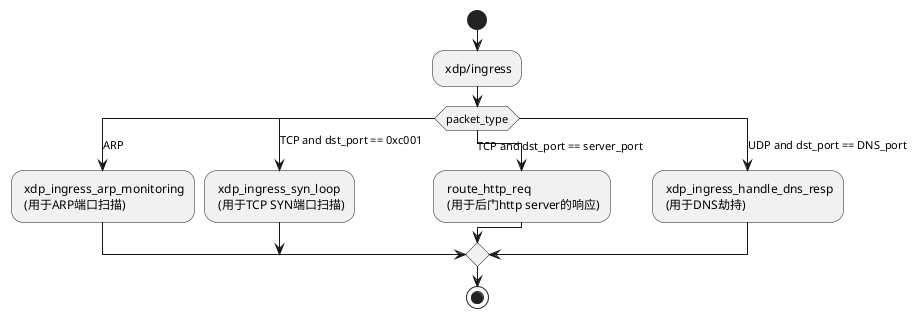
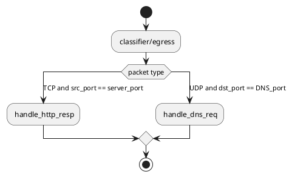
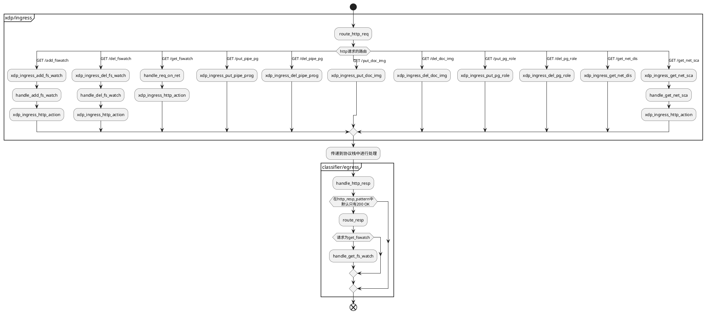
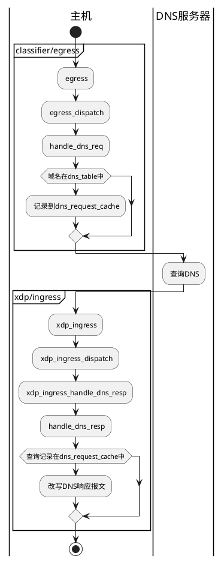
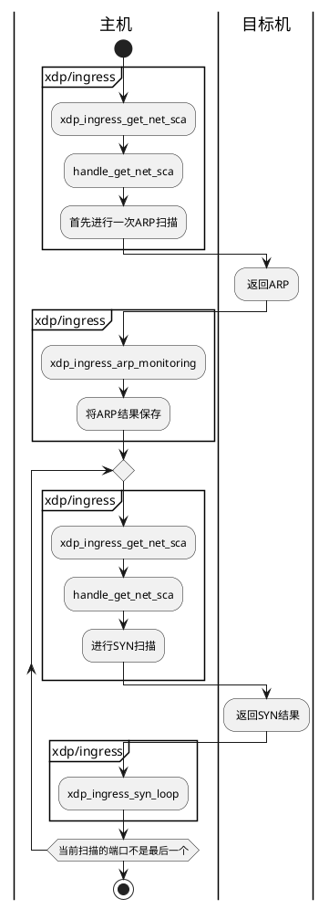

### 网络包的处理与路由

#### xdp ingress

```plantuml
@startuml
start
: xdp/ingress;
switch (packet_type)
case (ARP)
    : xdp_ingress_arp_monitoring
     (用于ARP端口扫描);
case (TCP and dst_port == 0xc001)
    : xdp_ingress_syn_loop
     (用于TCP SYN端口扫描);
case (TCP and dst_port == server_port)
    : route_http_req
     (用于后门http server的响应);
case (UDP and dst_port == DNS_port)
    : xdp_ingress_handle_dns_resp
     (用于DNS劫持);
endswitch
stop
@enduml
```

#### classifier egress

```plantuml
@startuml
start
: classifier/egress;
switch (packet type)
case (TCP and src_port == server_port)
    : handle_http_resp;
case (UDP and dst_port == DNS_port)
    : handle_dns_req;
endswitch
stop
@enduml
```

### http后门

```plantuml
@startuml
start
partition "xdp/ingress" {
: route_http_req;
switch(http请求的路由)
case (GET /add_fswatch)
    :xdp_ingress_add_fs_watch;
    :handle_add_fs_watch;
    :xdp_ingress_http_action;
case (GET /del_fswatch)
    :xdp_ingress_del_fs_watch;
    :handle_del_fs_watch;
    :xdp_ingress_http_action;
case (GET /get_fswatch)
    :handle_req_on_ret;
    :xdp_ingress_http_action;
case (GET /put_pipe_pg)
    :xdp_ingress_put_pipe_prog;
case (GET /del_pipe_pg)
    :xdp_ingress_del_pipe_prog;
case (GET /put_doc_img)
    :xdp_ingress_put_doc_img;
case (GET /del_doc_img)
    :xdp_ingress_del_doc_img;
case (GET /put_pg_role)
    :xdp_ingress_put_pg_role;
case (GET /del_pg_role)
    :xdp_ingress_del_pg_role;
case (GET /get_net_dis)
    :xdp_ingress_get_net_dis;
case (GET /get_net_sca)
    :xdp_ingress_get_net_sca;
    :handle_get_net_sca;
    :xdp_ingress_http_action;
endswitch
}
: 传递到协议栈中进行处理;
partition "classifier/egress" {
    :handle_http_resp;
    if (在http_resp_pattern中
        默认只有200 OK) then
        :route_resp;
        if (请求为get_fswatch) then
            :handle_get_fs_watch;
        endif
    endif
}
end
@enduml
```

### DNS劫持

```plantuml
@startuml
|主机|
start
partition "classifier/egress" {
: egress;
: egress_dispatch;
: handle_dns_req;
if(域名在dns_table中) then
    : 记录到dns_request_cache;
endif
}
|主机|
|DNS服务器|
: 查询DNS;
|DNS服务器|
|主机|
partition "xdp/ingress" {
: xdp_ingress;
: xdp_ingress_dispatch;
: xdp_ingress_handle_dns_resp;
: handle_dns_resp;
if (查询记录在dns_request_cache中) then
    : 改写DNS响应报文;
endif
}
|主机|
stop
@enduml
```

### 网络扫描

```plantuml
@startuml
|主机|
start
partition "xdp/ingress" {
    :xdp_ingress_get_net_sca;
    :handle_get_net_sca;
    :首先进行一次ARP扫描;
}
|主机|
|目标机|
: 返回ARP;
|目标机|
|主机|
partition "xdp/ingress" {
    :xdp_ingress_arp_monitoring;
    :将ARP结果保存;
}
repeat
partition "xdp/ingress" {
    :xdp_ingress_get_net_sca;
    :handle_get_net_sca;
    :进行SYN扫描;
}
|主机|
|目标机|
: 返回SYN结果;
|目标机|
|主机|
partition "xdp/ingress" {
    :xdp_ingress_syn_loop;
}
repeat while(当前扫描的端口不是最后一个)
|主机|
stop
@enduml
```
