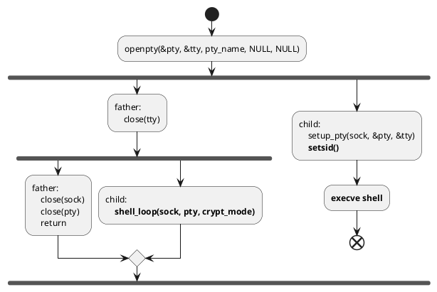

### azazel.c

与jynx相同，触发点是accept函数

#### 重要的全局变量

##### syscall_list

一个函数指针表，用于保存被hook函数的原始地址

#### 重要的宏

* HIDE_TERM_STR  定义了一个环境变量，异或了0xfe加密，用于标识当前shell属于rootkit

* SHELL_PASSWD  反弹shell的密码

* SHELL_TYPE  指定shell的类型（默认 `/bin/bash` ）

* HIST_FILE  指定HIST_FILE的值（默认 `HISTFILE=/dev/null` ）

* TERM  TERM环境变量（默认xterm）

* CLEANUP_LOGS  需要被清理log的用户名

* C_LDD ldd路径（默认 `bin/ldd`）

* LD_LINUX  ld-linux路径（默认 `ld-linux`）

* C_UNHIDE  unhide路径（默认`bin/unhide`），该程序是一个用于查找隐藏进程和TCP/UDP端口的，对抗rootkit的程序 https://www.unhide-forensics.info/

* LD_TRACE  默认LD_TRACE_LOADED_OBJECTS

* LOW_PORT  后门端口范围的下限

* HIGH_PORT  后门端口范围的上限

* CRYPT_LOW  加密后门端口范围下限

* CRYPT_HIGH  加密后门端口范围上限

* PANM_PORT  PAM后门端口

#### 函数

##### is_owner

该函数算是azazel的构造器，但与jynx的init不同，该函数不作为so的构造器，而是在几个函数的入口点调用

用于判断当前的shell是否是rootkit创建的

- 调用 [init](#init)
- 若owner变量不为-1，即初始化过，则返回
- 获取环境变量 [HIDE_TERM_STR](#重要的宏)
- 若环境变量不为NULL
  - 调用ttyname获取terminal名字
  - 调用 [clean_wtmp](#clean_wtmp)
  - 调用 [clean_utmp](#clean_utmp)
  - owner变量置为1
- 否则owner变量置为0

##### Init

* 调用 [azazel_init](#azazel_init) 进行初始化

##### azazel_init

该函数主要的作用就是初始化 [syscall_list](#syscall_list) ，具体是对syscall_table常量中的各个元素进行异或解密，再dlsym对应的符号

##### cleanup

用于销毁动态解密的字符串，注意，这里在free内存块前将内存的内容memset为0，从而防止在内存中遗留下这些敏感字符串

```c
void cleanup(void *var, int len);
```

##### clean_wtmp

用于清除 `/var/log/wtmp` 与rootkit用户相关的记录

```c
void clean_wtmp(char *pts, int verbose);
```

* 打开日志文件（这里使用的是syscall_list的fopen）
* 循环读取每个utmp记录
  * 若 `utmp.ut_line` 开头与传入的pts相同
    * 将该utmp清零
    * 写回文件

##### clean_utmp

用于清除 `/var/log/utmp`与rootkit用户相关的记录

```c
void clean_utmp(char *pts, int verbose);
```

 实现与 [clean_wtmp](#clean_wtmp) 类似，只是换了个文件

##### is_invisible

用于查找传入的path是否存在rootkit相关的路径

```c
int is_invisible(const char *path)
```

* 调用 [init](#init)

* 若path中含有 [MAGIC_STRING](#MAGIC_STRING) 或 [CONFIG_FILE](#CONFIG_FILE) ，则说明存在rootkit相关的路径，则**返回1**

* 若path在 `/proc` 中
  
  * 调用xstat（通过syscall_list）获取path的信息
    
    * 若成功则试图获取对应进程的环境变量 `%path/environ`
    
    * 若可以获取，则遍历环境变量，看里面是否包含 [HIDE_TERM_STR](#重要的宏)
    
    * 若包含则返回1，说明当前遍历的进程与rootkit相关

* 否则都返回0

##### is_procnet

判断传入的filename是否为 `/proc/net/tcp` 或 `/proc/net/tcp6` ，若是返回1

```c
int is_procnet(const char *filename);
```

##### hide_ports

这里的流程与jynx的端口隐藏过程类似

```c
FILE *hide_ports(const char *filename);
```

- 调用 [init](#init)

- 通过tmpfile打开一个tmp文件

- 打开filename对应的文件（即`/proc/net/tcp`或`/proc/net/tcp6`）

- 读取文件内容，并解析出连接的一些信息，如远程端口、本地端口、uid等
  
  - 把除了rootkit相关连接外的连接配置保存到tmp文件中（具体判断条件为远程端口或本地端口在LOW_PORT到HIGH_PORT间，或uid为MAGIC_UID）

- 返回tmp文件内容来伪造真实文件

##### shell_loop

作为一个管道，负责socket与shell的通信，与jynx的cmd_loop函数类似

```c
void shell_loop(int sock, int pty, int crypt)
```

* 根据crypt决定与socket通信使用 [crypt_write](#crypt_write) / [crypt_read](#crypt_read) 还是read和write系统调用

* 进入死循环
  
  * select读取socket和pty的内容
  
  * 若socket有输入，则将输入读出（若指定了crypt会调用解密），并传给pty
  
  * 若pty有输入，则将输入读出，并传给socket（若指定了crypt会加密）

##### setup_pty

```c
void setup_pty(int sock, int *pty, int *tty);
```

* 关闭 stdin stdout stderr pty和sock文件描述符

* 调用setsid脱离父进程

* 设置信号和ioctl

* 将stdin stdout和stderr设置为tty（dup2）

* 用execve启动一个 [SHELL_TYPE](#重要的宏) 指定的shell，环境变量为 [HIDE_TERM_VAR](#重要的宏) [HIST_FILE](#重要的宏) [TERM](#重要的宏)

##### check_shell_password

```c
int check_shell_password(int sock, int crypt);
```

* 异或解密 [SHELL_PASSWD](#重要的宏)

* 若定义了crypt，则采用加密通信方式，调用 [crypt_read](#crypt_read) 读入并比较密码

* 否则直接read读入并比较密码

##### drop_shell

```c
int drop_shell(int sock, struct sockaddr *addr);
```

* 调用 [init](#init)

* 判断端口号
  
  * 若端口号在 LOW_PORT 与 HIGH_PORT 之间，则用于写入的函数为write函数
  
  * 若端口号在 CRYPT_LOW 与 CRYPT_HIGH 之间，则用于写入的函数为crypt_write函数
  
  * 其他情况下直接返回传入的socket

* 调用 [check_shell_password](#check_shell_password) 检查输入的密码
  
  * 若错误则关闭连接

* 调用openpty获取终端

* 根据终端名，调用 [clean_utmp](#clean_utmp) 和 [clean_wtmp](#clean_wtmp) 删除log，这里的终端名应该是 `/dev/xxx` ，在wtmp和utmp中的记录应该是xxx登录的信息

* fork一个进程，用于启动一个交互式的shell
  
  * 子进程调用 [setup_pty](#setup_pty) 创建一个shell，注意，在该流程里子进程会调用setsid脱离父进程单独运行，所以之后的fork流程这里不会再走
  
  * 父进程关闭tty文件描述符，即子进程在setup_pty中使用的文件描述符

* 再fork一个进程，用于启动一个与shell建立的管道
  
  * 子进程调用 [shell_loop](#shell_loop) 与上面创建的shell和socket进行通信
  
  * 父进程关闭socket和shell的文件描述符，返回

这里的fork比较复杂一些，用下图来表示



#### hook函数

与jynx相比，hook的手法复杂了不少，加入了一些异或加密来进行简单的混淆

在 [azazel_init](#azazel_init) 它建立了一个 [syscall_list](#syscall_list) 函数调用表，通过自定义的const来索引各个系统调用。

此外，这里使用了 [is_owner](#is_owner) 函数来判断当前的shell是否为rootkit创建，若是则返回正常调用结果，此外使用了 [is_invisible](#is_invisible) 函数来判断当前的路径是否需要被隐藏

##### accept

该rootkit同样通过hook accept触发

* 调用 [is_owner](#is_owner) 判断当前shell是否为rootkit创建的
  
  - 若是则返回正常调用的结果，这里是通过 [syscall_list](#syscall_list) 调用的

* 调用正常函数

* 返回 [drop_shell](#drop_shell)

##### stat系列

这几个函数的hook都类似，但似乎比之前少了fstat相关的hook，即直接传入fd获取信息的hook（可能是因为hook了fopen和open所以没必要再处理fd相关的？）

* access

* lstat

* lstat64

* stat

* stat64

* __lxstat

* __lxstat64

* __xstat

* __xstat64

* open

* rmdir

* unlink

* unlinkat

* opendir

* link  新的hook函数

上述几个函数的hook流程如下

* 调用 [is_owner](#is_owner) 判断当前shell是否为rootkit创建的
  
  * 若是则返回正常调用的结果，这里是通过 [syscall_list](#syscall_list) 调用的

* 调用 [is_invisible](#is_invisible) 判断路径是否与rootkit相关，若相关返回-1

* 否则返回正常调用结果，同样通过syscall_list调用

##### fopen / fopen64

与上述流程多了一个 is_procnet 的判断

- 调用 [is_owner](#is_owner) 判断当前shell是否为rootkit创建的
  
  - 若是则返回正常调用的结果，这里是通过 [syscall_list](#syscall_list) 调用的

- 调用 [is_procnet](#is_procnet) 判断当前打开的路径是否是rootkit相关的网络接口
  
  - 若是，返回 [hide_ports](#hide_ports)

- 调用 [is_invisible](#is_invisible) 判断路径是否与rootkit相关，若相关返回-1

- 否则返回正常调用结果，同样通过syscall_list调用

##### readdir / readdir64

* 调用 [is_owner](#is_owner) 判断当前shell是否为rootkit创建的
  
  - 若是则返回正常调用的结果，这里是通过 [syscall_list](#syscall_list) 调用的

* 循环判断当前读取的dirent结构，若为下述几个则跳过
  
  * `.` `/`
  
  * [is_invisible](#is_invisible) 判断为真的内容
  
  * 若 `/proc` 中存在对应文件名且为 [is_invisible](#is_invisible) 中的内容

* 返回dirent结构

##### execve

* 调用 [init](#init) 初始化

* 获取 [CLEANUP_LOGS](#重要的宏) 环境变量，这里应该是保留给rootkit自己生成的shell用的后门
  
  * 若非空，调用 [clean_utmp](#clean_utmp) [clean_wtmp](#clean_wtmp) 对log进行清理
  
  * 将该环境变量unset
  
  * **exit退出程序**

* 若传入的路径中包含 [C_LDD](#重要的宏) / [LD_LINUX](#重要的宏) / [C_UNHIDE](#重要的宏) ，或环境变量中包含 [LD_TRACE](#重要的宏) ，这里执行的是隐藏 `/etc/ld.so.preload` 的操作
  
  * getuid保存原始uid
  
  * 使用setuid提权为root
  
  * 将 `/etc/ld.so.preload` 更名为 `./etc/ld.so.preload` （这里其实是使用两个宏LD_NORMAL和LD_HIDE设置的名字）
  
  * fork
    
    * 子进程调用execve执行指令
    
    * 父进程等待
  
  * 将上面更改的名字改回来
  
  * setuid设置回原始uid

* 否则正常执行execve

##### ptrace

这里hook ptrace用于反调试，直接exit

### crypthook.c

加密通信相关

#### 重要的宏

* PASSPHRASE  用于生成的全局密码

* KEY_SALT  用于生成的全局盐

#### 函数

##### gen_key

调用PKCS5_PBKDF2_HMAC_SHA1使用密码[PASSPHRASE](#重要的宏-1)和盐[KEY_SALT](#KEY_SALT)生成一个全局的key

##### encrypt_data

```c
static int encrypt_data(char *in, int len, char *out);
```

* 若全局key还没生成，则调用 [gen_key](#gen_key) 生成

* 调用 RAND_bytes 生成一个随机的iv

* 初始化一个上下文，使用aes256gcm进行加密，密钥为全局key

* 封包传输，包格式为
  
  * 1字节    header标识
  
  * 1字节    包长度高8位
  
  * 1字节    包长度低8位
  
  * 12字节  加密的IV
  
  * 16字节  消息认证码
  
  * 加密数据
  
  * padding

##### decrypt_data

就是对 [encrypt_data](#encrypt_data) 的解密

```c
static int decrypt_data(char *in, int len, char *out);
```

##### crypt_read

接收包，作为顶层函数

```c
ssize_t crypt_read(int sockfd, void *buf, size_t len);
```

* 从socket读取3字节，判断第一字节是否为header标识

* 若是则拼接出下面的包长度，并从socket读取这一长度的内容

* 调用 [decrypt_data](#decrypt_data) 解密数据

##### crypt_write

发送包，作为顶层函数

```c
ssize_t crypt_write(int sockfd, const void *buf, size_t len);
```

* 调用 [encrypt_data](#encrypt_data) 加密数据

* send发送到socket

### pcap.c

对pcap的hook

#### 函数

##### got_packet

该函数用来逃避pcap抓到后门的包

* 若抓到的包为TCP包
  
  * 判断
    
    * 源端口是否在 LOW_PORT HIGH_PORT间，或在CRYPT_LOW CRYPT_HIGH间
    
    * 目的端口是否在 LOW_PORT HIGH_PORT间，或在CRYPT_LOW CRYPT_HIGH间
    
    * 源端口和目的端口是否为 PAM_PORT
      
      * 若是则直接返回，不返回抓到的包
  
  * 否则与后门的包无关，调用原始用户传入的回调

* 否则不为TCP包，直接调用用户传入的回调

#### hook函数

##### pcap_loop

* 调用 [azazel_init](#azazel_init) 初始化
* 保存原始传入的回调函数
* 以[got_packet](#got_packet)为回调函数调用pcap_loop

### pam.c

PAM介绍

[Linux下PAM模块学习总结 - 散尽浮华 - 博客园](https://www.cnblogs.com/kevingrace/p/8671964.html)

PAM模块用于linux的用户认证方面，这里通过hook这个认证模块实现反弹shell和提权

#### hook函数

##### 几个形式相同的hook

* pam_authenticate  根据提供的token来认证用户

* pam_sm_authenticate  pam_authenticate的service module版本

* pam_open_session  根据token来打开一个会话

* pam_acct_mgmt  用于检测用户账户是否可用

大多数被hook的函数都有如下的形式

* 调用 [azazel_init](#azazel_init) 初始化

* 获取当前token对应的用户名

* 若用户名是 [BLIND_LOGIN](#BLIND_LOGIN) 指定的用户（pam_get_item或pam_get_user）
  
  * 直接返回成功

* 否则执行正常流程

##### getpwnam / getpwnam_r

这两个函数通过用户名获取对应的密码

* 调用 [azazel_init](#azazel_init) 初始化

* 若传入的用户名为[BLIND_LOGIN](#BLIND_LOGIN) 指定的用户名
  
  * 将name参数改写为root，传入真实的函数执行并饭返回

* 否则正常执行该函数

### 可能的bug

#### crypthook.c

感觉crypt_read到decrypt_data这里可能有栈溢出，因为两边的buf最大值都定义为MAX_LEN，但前者理论上可能写入更多字节
