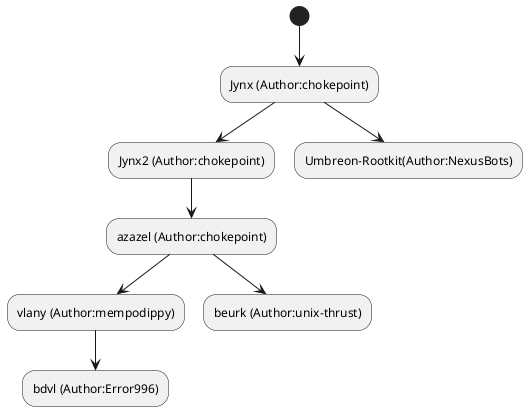
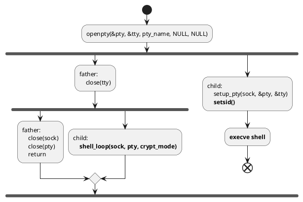

## 概述

**user mode** 模式下的rootkit实现方式主要是通过LD_PRELOAD加载恶意的so来替换标准so文件，通过hook的方式来达到各种目的

下面是根据各个开源rootkit的代码特性总结出的一个关系图



## 现有rootkit分析

### jynxkit / jynx2

[GitHub - chokepoint/jynxkit](https://github.com/chokepoint/jynxkit)

[GitHub - chokepoint/Jynx2](https://github.com/chokepoint/Jynx2)

比较古老的rootkit，很多其他user mode的rootkit是基于这两个项目修改的。jynx2是jynxkit的改进版，下面大概描述两个rootkit的技术细节，具体实现的源码解析见 [jynx.md](jynx/jynx.md)

另外有一篇别人写的分析 [Jynx2 Sneak Peek &amp; Analysis - Infosec Resources](https://resources.infosecinstitute.com/topic/jynx2-sneak-peek-analysis/)

#### 触发/驻留方式

jynx会启动一个pcap抓包进程，对所有的tcp包进行过滤，触发方式是当发现某个tcp包的SEQ和ACK字段被设置成特殊字段时，就会向发送该包的源地址和端口反弹一个shell。这种方式有个明显的缺点就是需要有个进程常驻内存运行，比较容易被发现。

jynx2的触发方式隐蔽很多，它通过劫持so链接库hook了accept函数，当发现发起连接的端口号在范围内，则反弹一个shell

此外，两个rootkit都采用了更改 `ld.so.preload` 文件的方式来实现**长期的so劫持**。[linux - What is / does ld.so.preload do? - Super User](https://superuser.com/questions/1183037/what-is-does-ld-so-preload-do)

该文件与 `LD_PRELOAD` 环境变量的区别在于，存在setuid/setgid属性的可执行文件会忽略环境变量，因为非root用户就可以任意设置环境变量，但拥有setuid/setgid属性的可执行文件是提权到root运行的。但对于 ld.so.preload 就没有该限制。

#### 文件隐藏/进程隐藏

对于这两个功能，jynx和jynx2都是通过hook几个相关的系统调用来实现的，主要hook的系统调用列表有：

- fstat
- fstat64
- __fxstat
- __fxstat64
- lstat
- lstat64
- __lxstat
- __lxstat64
- stat
- stat64
- __xstat
- __xstat64
- open
- rmdir
- unlink
- unlinkat
- fdopendir
- opendir
- readdir
- readdir64

jynx和jynx2在安装时都会将自身的用户组改为MAGIC_GID（jynx2还会修改UID）。而hook的函数里几乎都会判断返回文件内容的gid是否为MAGIC_GID，若是则这些函数都会返回-1。此外对于一些传入的内容是字符串路径的函数，hook的函数屏蔽了一些特殊指定的路径

#### 端口隐藏

通过对fopen/fopen64的hook实现，当发现传入的参数为 `/proc/net/tcp` 或 `/proc/net/tcp6` ，则对两个文件进行遍历，若找到符合的端口，则过滤该条内容。最后会将除过滤外的内容写到一个tmpfile中，并返回tmpfile的文件指针

#### 提权

jynx2提供了一种称为suid_shell的提权方式，原文介绍见readme

大致原理就是jynx2 增加了一些系统调用的hook，这些hook里会判断当前程序的euid是否为root，若是则提权并执行指令（见源码分析的drop_suid_shell_if_env_set函数）

增加的hook函数为

- accept

- access

- fopen / fopen64

- write

这是利用了linux系统中一些拥有setuid属性的可执行文件可以让普通用户以root权限执行代码的特性来实现提权。这种方式也使得jynx2在反弹shell的时候并不需要总是反弹一个root权限的shell，而是可以通过suid的机制随时进行提权

#### 一些技术细节

##### 反弹shell

###### 加密通信

jynx和jynx2都采用了SSL通信，其中jynx2升级了这一方式，使其拥有证书。

###### 识别

由于采用hook函数的方式，所以该类rootkit需要在hook函数中识别当前函数的调用者是否为rootkit所有者，若是应该返回正确结果，否则返回修改后的结果

jynx/jynx2标识当前shell是否为rootkit的shell的方式为指定一个 MAGIC_GID，所有rootkit shell都使用该gid

###### 实现方式

jynx的shell实现较为简陋，直接调用一个popen执行命令，将命令执行结果回写。这样当命令阻塞时shell会被一同阻塞

jynx2的shell进行了比较大的升级，fork了一个子进程启动bash执行命令，父进程则通过管道与子进程通信，循环使用select函数监听socket和子进程是否存在输入，若有则传输两者的通信

##### hook

###### jynx

jynx的hook方式如下：

* 在加载自身so的时候，在构造函数中对各个要hook的函数指针进行定位并保存
  
  ```c
  old_fxstat = dlsym(RTLD_NEXT, "__fxstat");
  ```

* 在hook的函数调用中，在进行完流程后调用原来的函数
  
  ```c
  return old_fxstat(ver,fildes, buf);
  ```

###### jynx2

jynx2与jynx不同，其有点类似elf的plt表，采用了延迟绑定的方式。该方式不需要全局构造函数，只需要在每个hook的函数入口运行如下的代码：

```c
if (!libc)
  libc = dlopen (LIBC_PATH, RTLD_LAZY)

if (old_fxstat == NULL)
  old_fxstat = dlsym (libc, "__fxstat");

...

return old_fxstat (ver, fildes, buf);
```

### azazel

https://github.com/chokepoint/azazel

azazel的作者与jynx的作者一致，可以算是jynx的大幅升级版。下面大概描述该rootkit的技术细节，具体实现的源码解析见 [azazel.md](azazel/azazel.md)

#### 触发/驻留方式

与jynx2类似，azazel使用的触发方式也是hook了accept，判断是否需要反弹shell也是通过判断端口号来进行的，需要注意的是azazel提供了三种反弹shell形式：加密的反弹shell  未加密的反弹shell 和 PAM shell，详细内容在下面说明

驻留也是通过修改 `/etc/ld.so.preload` 实现的

#### 文件/进程隐藏

基本与jynx的方式相同，通过hook一些系统调用实现。这里有细微区别的地方在于azazel少hook了几个系统调用

* fstat / fstat64

* `__fxstat / __fxstat64`

* fdopendir

而增加了几个hook

* fopen / fopen64

* link

从原理上来说，azazel hook了所有可以打开文件描述符的系统调用，使得不再需要hook与文件描述符相关的系统调用，而是只需要处理路径相关的内容（隐藏进程的路径、文件的路径等）

#### 端口隐藏

方式与jynx2相同

#### 日志清除

azazel对 `/var/log/wtmp` 和 `/var/log/utmp` 中与rootkit相关的信息进行了删除

[Difference /var/run/utmp vs /var/log/wtmp Files in Linux](https://linoxide.com/difference-between-utmp-wtmp-files-in-linux/)

此外，在rootkit启动的shell中加入了环境变量 `HIST_FILE=/dev/null` 使得该终端的命令历史不会被保留

#### 反调试

这里实现反调试的方法很简单，直接hook了ptrace函数，若调用了直接exit。（感觉这个处理有点粗糙，相当于全部的文件都无法调试了）

#### 反检测工具

azazel通过对execve系统调用的hook来逃避工具检测，这里逃避的检测工具有以下三种

* ld-linux
* ldd
* unhide

前两者都是用于列出程序链接的静态库，较容易发现这种使用so劫持的rootkit。后者是一个用于检测rootkit的开源取证工具 https://www.unhide-forensics.info/

当发现execve执行了这几个程序，rootkit会简单隐藏自己的行为，具体为

* 将 `/etc/ld.so.preload` 更名为 `/etc/.ld.so.preload`

* 正常执行要调用的程序

* 重新命名回来

此外，azazel对程序引用的字符串进行了简单的混淆，掩盖了部分静态特性。见[混淆](#混淆)

#### 网络通信包隐藏

azazel hook了pcap_loop函数，该hook函数改写了pcap_loop的回调，当发现当前抓到的包为rootkit通信包时会直接返回，不是的话才正常执行用户提供的回调函数

#### 混淆

azazel对使用的字符串进行了简单的混淆（包括在dlsym时要定位的函数的字符串），具体来说使用了很简单的异或混淆，程序中保存的所有字符串都是原文异或了0xfe后的结果，rootkit运行时才进行动态解密。

另一个混淆方式是对于要hook的函数，azazel在初始化时建立了一个调用表，对应每个要hook的函数的原入口，之后通过调用表+索引的方式进行调用

此外，大部分字符串动态解密后的结果在使用完之后会被填充0x00后再释放对应内存，这一定程度上对抗了以动态内存扫描的方式进行的rootkit检测

#### 提权

azazel删除了jynx2提供的suid_shell方式，转而采用PAM shell的方式进行提权，见[PAM shell](#PAM shell)

#### 一些技术细节

##### 反弹shell

###### 加密通信

azazel实现了两种shell，一种是明文，另一种是加密的。由SSL实现的加密shell比jynx2更完善的地方在于它定义了一套包结构，其中使用了HMAC来保证了消息完整性，数据加密则采用aes256-gcm

##### PAM shell

PAM模块用于linux的用户认证方面，这里通过hook这个认证模块实现了反弹shell和提权

当传入认证的用户名参数为某个指定的用户名时，认证函数会直接返回认证成功，被hook的认证函数包括

- pam_authenticate 根据提供的token来认证用户

- pam_sm_authenticate pam_authenticate的service module版本

- pam_open_session 根据token来打开一个会话

- pam_acct_mgmt 用于检测用户账户是否可用

而查找对应用户名的密码的函数会被hook，转而查找root用户对应的密码，被hook的函数包括

* getpwnam

* getpwnam_r

###### 识别

azazel不再使用MAGIC_GID的方式识别shell，而是换用了一种更加隐蔽的方法：若是rootkit启动的shell，则在环境变量中加入一个环境变量（默认为`HIDE_THIS_SHELL=please`），在运行hook函数时先检测当前shell有没有该环境变量

###### 实现方式

azazel对shell的实现更加复杂。见下图



程序先用openpty获取了一个伪终端，fork后子进程用于命令执行，注意这里使用了setsid使得子进程脱离父进程单独运行，若该反弹shell被发现，用户也较难溯源到启动该shell的进程。

父进程则再次经过fork，运行了一个类似jynx2的通过select实现的分发函数，实现socket与shell的通信

##### hook

与jynx相比，hook的手法复杂了不少，加入了一些异或加密对dlsym的系统调用进行简单的[混淆](#混淆)

它不采用jynx2的延迟绑定机制，也是类似jynx使用一个全局构造函数init在载入so时进行构造，此外也在每个被hook函数的入口都放了该函数，若调用时发现没有进行过初始化，则初始化hook函数调用表。这种方式的必要性我是在 [beurk源码](https://github.com/unix-thrust/beurk/blob/dev/src/init.c#L91) 上看到的，因为对于打了SElinux patch的文件不会自动调用so的全局构造函数，所以必须在hook函数入口也添加init函数

之后通过自定义的const来索引各个系统调用，类似下面的方式：

```c
return (long)syscall_list[SYS_LXSTAT].syscall_func(ver, file, buf);
```

### beurk

整体看下来有点乏善可陈，甚至让我在想是否azazel才是从beurk改进过来的（但看github的记录beurk比azazel要晚了近两年，但比较有意思的是beurk与azazel有一个相同的contributor）。它取消了很多azazel的特性，如加密shell等，hook函数与azazel基本一致，可能从项目上看比较多的改进是加入了单元测试的内容，以及代码组织上要清晰一些。下面是对其的简要分析

#### 触发/驻留方式

与azazel相同

#### 文件/进程隐藏

与azazel相同

#### 端口隐藏

与azazel相同

#### 日志清除

与azazel相同

#### 反调试

无

#### 反检测工具

在readme中说有这方面的功能

> Bypass unhide, lsof, ps, ldd, netstat analysis

但类似azazel是通过hook execve来实现这一功能，而beurk完全没有hook execve。所以不知道是否真的可以绕过

#### 网络通信包隐藏

无，因为beurk没有hook pcap

#### 混淆

与azazel一样，也以调用表的形式来保存原系统调用的地址。此外用异或加密了需要dlsym的字符串，但beurk没有对常用字符串的加密，且没有对解密后字符串的清零处理

#### 一些技术细节

##### 反弹shell

建立shell的方式与azazel一致，使用了两个fork，我觉得有一定改进的地方在于

- beurk的转发进程也从父进程中独立出来了，在azazel中只独立了shell执行的进程，没有独立出转发进程

- beurk加入了一些对fork失败的资源释放操作，azazel似乎遗漏了这点

但beurk的shell都是明文shell

其他类似识别的方式于azazel一致

##### hook

基本与azazel一致，只有一些细微的差别

* 增加了对2个参数的open系统调用的处理（azazel只处理了三个参数的）

* 减少了execve ptrace系统调用和pcap库、pam库的hook

## 对抗方式

### hook

* 通过比对dlsym返回的函数指针是否与当前系统调用函数的地址相同来检测
