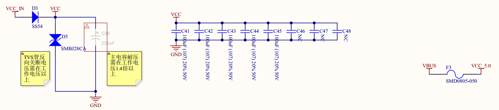
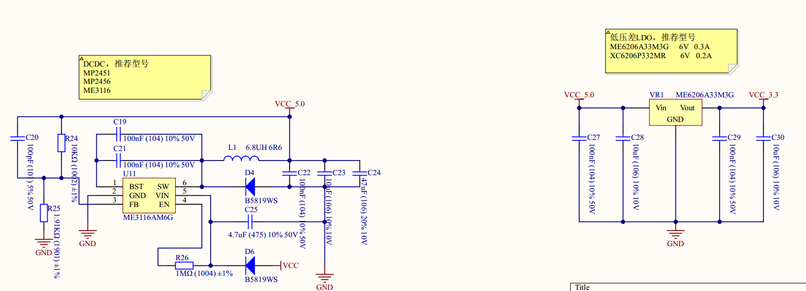
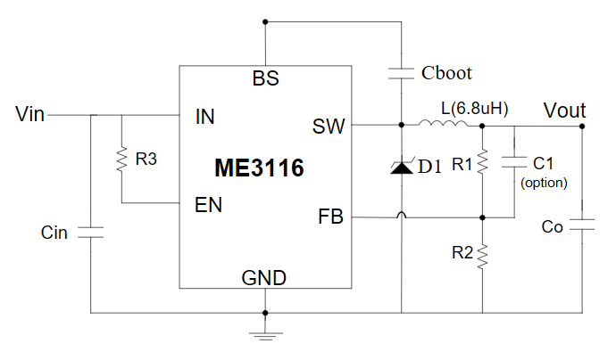

## 硬件

### 电源

#### 输入

输入VCC_IN过一个二极管作为电源的整体输入VCC，使用一个TVS保护，并且与地并了一个极性电容和一排小电容滤波

#### DCDC与LDO

这里使用[ME3116](https://www.alldatasheet.com/datasheet-pdf/view/1817112/ETC/ME3116.html) 典型应用图如下：

VCC经过二极管输入VIN，通过R26拉高EN，C25为Cin，C22 C23 C24则为Co，C19和C21并联作为Cboot（[自举电容](https://blog.csdn.net/qq_32764651/article/details/132236285)），反馈电阻R24 R25，根据手册反馈电压为0.8V，因此Vout为0.8*(10k+1.91k)/1.91k=4.988V

LDO为典型的5V降3V3

#### 电机驱动

## 软件

### 开发板端口定义

这边有三个头文件用于定义开发板端口，都放在`Firmware_APP/Base_Drivers`下，分别为board.h  XDrive_REIN_Basic_H1_0.h  XDrive_REIN_Basic_H1_1.h

board.h默认配置：

* 3个按键，分别是OK UP DOWN

* 4个控制IO，分别是AP AM BP BM

* 2个PWM，APWM和BPWM，及其配属的一个定时器

* MT6816
  
  * 一个控制IO
  
  * PWM采集：一个PWM及其定时器，并设置了定时器中断
  
  * ABZ采集：一个外部IO中断，两个IO和一个定时器
  
  * SPI采集：CS CLK MISO MOSI四个IO，及其对应的SPI硬件

* OLED
  
  * SPI通信：RES DC SCK和MOSI四个IO，及其对应的SPI硬件

* 信号端口
  
  * 两个IO及外部中断
  
  * 一个IO及定时器
  
  * 三路PWM及其IO和定时器

以board.h为基础对比其他两款的配置

* XDrive_REIN_Basic_H1_0跟board差不多，多了个MT6816 SPI的分频器和OLED SPI的分频器，添加了OLED翻转显示的配置，少了个TIM2的中断

* XDrive_REIN_Basic_H1_1改动较大
  
  * 添加了两组ADC
  
  * 减少OK按钮
  
  * 去掉了MT6816的PWM ABZ采集模式，只保留SPI
  
  * 添加modbus配置
  
  * 增加OLED的CS接口，增加OLED分频器
  
  * 减少TIM2中断
