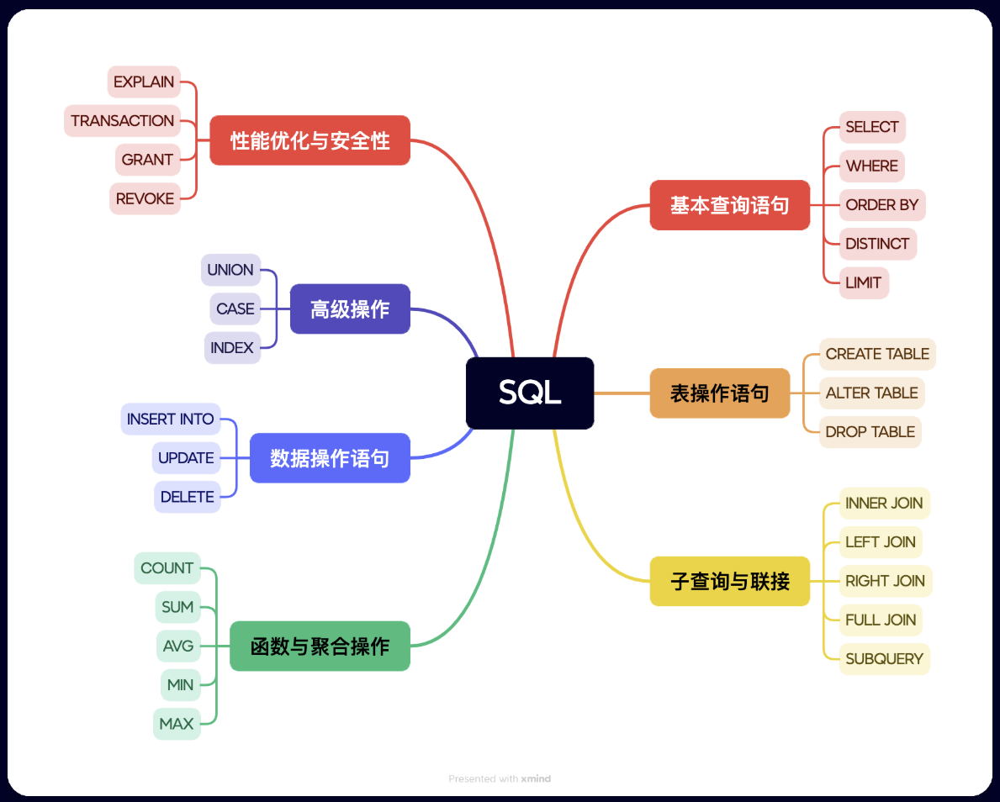

[SQL SELECT DISTINCT 语句 | 菜鸟教程](https://www.runoob.com/sql/sql-distinct.html)

### 基础语法

#### SELECT

用于从数据库中选取数据

```sql
SELECT col1, col2, ... FROM table_name;
SELECT * FROM table_name
```

#### SELECT DISTINCT
