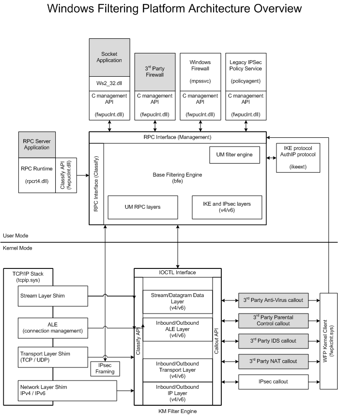
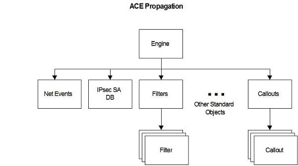

## ref

[Windows Filtering Platform - Win32 apps | Microsoft Learn](https://learn.microsoft.com/en-us/windows/win32/fwp/windows-filtering-platform-start-page)

[Using Windows Filtering Platform - Win32 apps | Microsoft Learn](https://learn.microsoft.com/en-us/windows/win32/fwp/using-windows-filtering-platform)  各种示例代码

## 架构

### Filter Engine

筛选引擎分为两个部分，一部分是内核态的，一部分是用户态的

用户态的筛选引擎用于筛选RPC和IPSec，包含约10个filter layer

内核态的筛选引擎则用于处理TCPIP协议栈的网络层跟传输层，该组件在分类过程中调用对应的callout函数，包含约50个filter layer

### Base Filtering Engine

是一个用户态服务，在svchost中以bfe.dll加载运行。该服务用于添加或删除filter、配置filter和wfp等。应用程序可以通过WFP管理函数与其通信

### Callout Drivers

可以通过callout drivers向WFP附加callout函数，从而获得额外的过滤能力，callout提供包括但不限于修改数据包的能力。用户管理函数和内核驱动都可以为wfp添加callout函数

## WFP API

### Object Model

下面是WFP使用和管理的对象

* Filter WFP中最复杂的一种对象，用于定义筛选条件及其对应的动作（类似防火墙，如阻断所有端口号大于1024的TCP连接）

* Callout  当一些条件满足时调用的回调函数

* Layer  filter的容器，代表网络传输处理过程中筛选引擎插入的一些特殊的点

* Sublayer  layer的子部件

* Provider  用于标记WFP规则的提供者，如windows防火墙

* Provider Context  由WFP规则提供者使用的数据块，可以将该上下文传递给callout

### Object Management

#### Sessions

WFP的API是面向会话的，即大多数函数调用都以一个会话作为上下文

* FwpmEngineOpen0  创建会话

* FwpmEngineClose0  关闭会话

可以在创建会话时传入FWPM_SESSION_FLAG_DYNAMIC来创建动态会话，这样当会话关闭时在会话中创建的所有对象都会自动删除

#### Transactions

大多数WFP的API都是事务型的，即在一个事务的上下文运行

可以使用下列函数显式控制事务

* FwpmTransactionBegin0

* FwpmTransactionCommit0

* FwpmTransactionAbort0

若函数没有在一个显式的事务中运行，则其会在一个隐式事务中运行

事务要么是制度的，要么是可读可写的，且执行严格的原子一致性隔离持久语义（[ACID](https://learn.microsoft.com/en-us/windows/win32/cossdk/acid-properties)）

每个会话只能同时处理一个事务，若会话结束则事务自动终止

事务开始时，BFE会等待会话，该等待有超时时间（默认为15秒），每个事务本身也有超时，若超过就会释放事务。该时间无法配置，对于内核调用者超时时间为无限，对于用户模式调用者则为1小时

#### Object Lifetimes

对象可以拥有下列四种生命周期

* Dynamic（动态对象）  使用动态会话句柄创建对象时为该类型，会话结束时释放

* Static（静态对象）  默认类型，当其被显式删除、BFE服务停止或系统关闭时释放

* Persistent（持久化对象）  会一直存储，直到被删除

* Built-in（内建对象）  由BFE预定义，不能添加或删除，会一直存在

#### Object Associations

一些对象可能引用其他对象，如filter对象总是会引用layer对象

对象引用有下列限制，核心规则是对象只能引用生命周期比它长的对象

* 动态对象不能引用另一个会话中的动态对象

* 静态对象不能引用动态对象

* 持久化对象不能引用动态、静态对象，以及其他provider建立的持久化对象

一个对象只有在引用它的对象都删除后才可以被释放

#### LUIDs and GUIDs

所有的用户态WFP对象（FWPM）都由一个GUID标记，且只要求同类型的对象有不同GUID（若一个Layer对象和一个Filter对象GUID相同是没关系的）。GUID可以由调用者分配

所以的内核态WFP对象（FWPS）由一个LUID标记，且通过LUID引用其他对象。LUID由BFE分配

## WFP Operation

### Layers

Layer是一个用于将filter组织为集合的容器。每个layer都定义了一系列可加入到layer中的过滤器类型（[Filtering conditions available at each filtering layer (Fwpmu.h) - Win32 apps | Microsoft Learn](https://learn.microsoft.com/en-us/windows/win32/fwp/filtering-conditions-available-at-each-filtering-layer)，可用的过滤器列表）

Layer可能含有sublayer，用于防止规则的冲突。WFP包含一系列预定义的sublayer，每个layer都是从这些sublayer继承而来

### Filters

Filter即一条规则，用于匹配入向或出向的数据包，当匹配时可以有多种动作，包括调用callout函数

Boot-time filter是一种在tcpip.sys加载时就生效，等到BFE启动后就失效的filter

Run-time filter则是在BFE启动后生效的filter，其生命周期可以是上述三种中的任一种

### Shims

Shim是一个内核模式组件，当包、数据流或事件经过网络栈时，shim解析数据中是否符合相应的条件，并将其分发到不同layer的filter。filter可能会执行一个或多个callout，并将结果返回到shim，最终由shim根据结果来执行诸如dropout的动作

### Callouts

Callout是filter的回调函数，其可以被注册到任意一个内核态的layer中，可以修改入向出向的网络包，并可以返回Block Permit Continue等针对网络包的动作

在调用callout前需要创建与注册callout函数

* FwpmCalloutAdd0  需要在filter引用相应callout前调用。若对应的callout是一个持久化对象则只需要创建一次

* FwpsCalloutRegister  需要在使用相应回调前注册

### Classification

Classification是用于将filter应用于网络传输中的过程。对于一个数据包、传输流或事件，在每一层都会调用一次对应的classification

在classification过程中，会解析数据的对应属性（如端口、IP等），并与filter的条件进行比较

Classification过程由Shim调用，其最终动作有下列几种

- Permit
- Block
- Callout
  - Permit
  - Block
  - Continue
  - Defer
  - Need more data
  - Drop connection

### WFP Operation

* 在系统启动时，当TCPIP协议栈加载（tcpip.sys），系统会先加载boot-time filter

* 直到BFE启动后，持久化的filter对象会被加载，boot-time filter则被关闭。BFE初始化结束后通过FwpmBfeStateSubscribeChanges0函数向所有的callout驱动发送消息。此时平台已经准备好加载run-time filter

* 由boot-time filter转向持久化filter的时间一般为几秒，并且该动作是原子的，因此不会存在两种filter都不作用的时间窗口

* BFE启动后，可以添加run-time filter，BFE会将其分发到对应的layer；还可以进行IPSec密钥模块的配置

* BFE启动后可以通过RPC在任意时刻添加删除修改filter或认证配置

工作数据流

* 数据包进入协议栈

* 协议栈调用shim

* shim在特定的layer调用classification

* 在classification中会对filter条件进行匹配，并根据结果采取对应行动

* 若在classification中匹配条件的filter注册了callout，则调用对应callout

* shim根据filter的返回结果最后执行对数据包的行动（如drop数据包）

### TCP协议及其对应Layer的流程

[TCP Packet Flows - Win32 apps | Microsoft Learn](https://learn.microsoft.com/en-us/windows/win32/fwp/tcp-packet-flows)

### UDP协议及其对应Layer的流程

[UDP Packet Flows - Win32 apps | Microsoft Learn](https://learn.microsoft.com/en-us/windows/win32/fwp/udp-packet-flows)

### 过滤器仲裁

过滤器决定了WFP应如何处理网络传输

#### 过滤器仲裁动作

* 所有的网络传输都会被WFP框架劫持

* 即使一个高优先级的filter放行了传输，其他过滤器也可以阻止该传输

* 多个provider可以在同一个layer劫持流量

#### 过滤模型

每个filter层都被划分为按优先级排序的sublayer，当一次网络传输到达时，WFP会从高优先级到低优先级遍历sublayer，直到所有sublayer遍历完才会对一次网络传输进行仲裁

一个sublayer中过滤器仲裁的流程

* 计算匹配的过滤器，并按优先级由高到低排序

* 执行每个过滤器对应的动作

* 返回最后一个filter的action

一个layer中过滤器仲裁的流程

* 计算每个sublayer中匹配的过滤器，并按优先级由高到低排序

* 执行每个sublayer中的过滤，即使高优的sublayer决定block掉传输也会执行其他sublayer的决策

* 返回对应的仲裁决定

下图举了个例子，外框表示一个layer，图中包含两个layer；内框表示包含filter的sublayer

根据上面过滤器仲裁在layer和sublayer上的工作原理，唯一可以bypass某个过滤器的方式为：若在同一个sublayer有一个更高优先级的filter，且该filter返回block或permit，则低优先级的filter会被bypass。因此要使一个filter能看到所有的传输，可以将其单独添加进一个sublayer中

#### 可配置的替代策略

基本的策略如下

* 按sublayer优先级从高到低的顺序执行过滤器

* block可以覆盖permit

* block则不会被覆盖，且可以停止下面的评估（应该是同一sublayer内的）

为了支持其他的一些需求，可以通过设置**FWPS_RIGHT_ACTION_WRITE**标志修改过滤器的替代策略。Provider可以使用该flag决定filter是否可以被覆盖

| 动作     | FWPS_RIGHT_ACTION_WRITE | 描述                                          |
| ------ | ----------------------- | ------------------------------------------- |
| Permit | True                    | Soft Permit: 传输可以在其他sublayer被block          |
| Permit | False                   | Hard Permit: 传输只能被其他sublayer的callout veto覆盖 |
| Block  | True                    | Soft Block: 传输可以在其他sublayer被permit          |
| Block  | False                   | Hard Block: 传输不可以在其他sublayer被permit         |

默认条件下filter和callout的动作

| Action         | Default Behavior |
| -------------- | ---------------- |
| Filter permit  | Soft permit      |
| Callout permit | Soft permit      |
| Filter block   | Hard block       |
| Callout block  | Soft block       |

一个被调用前先设置了**FWPS_RIGHT_ACTION_WRITE**标志的filter若返回了block动作，则称之为**Veto**。Veto可以block掉hard permit放行的数据包

当存在veto时，表示不同的filter间存在冲突，因此当发生veto时会进行下列动作来缓解冲突

* 该传输被block

* 生成一个审计事件

* 生成一个通知

## WFP Configuration

### Access Control

在创建WFP对象时可以指定安全描述符，从而为其指定访问控制权限。安全描述符使用下列两类函数进行管理

* `Fwpm*GetSecurityInfo0`

* `Fwpm*SetSecurityInfo0`

默认安全描述符继承自引擎根对象，具体配置见[访问控制（Windows 筛选平台） - Win32 apps | Microsoft Learn](https://learn.microsoft.com/zh-cn/windows/win32/fwp/access-control)

BFE支持DACL的ACE，不支持SACL的ACE。ACE继承关系如下：

BFE还自定义了一系列特殊的权限，以及不同API需要的权限见原文

BFE通过一些特殊权限防止管理员误操作将自己锁定在BFE外

## Application Layer Enforcement(ALE)

ALE是WFP内核模式的layers，用于stateful filtering（有状态筛选）

Stateful filtering可以保存网络连接的状态，并且只允许符合状态的数据通过

在ALE中，网络传输可以获取连接信息或socket操作信息，而非ALE中只能获取数据包的信息（即筛选的视角不同，ALE中可以跟踪单个连接）。且ALE是WFP中唯一可以根据应用程序实例进行筛选的layer

此外，如使用IPSec时，可以使用ALE根据远程机器或用户的身份进行过滤，其中远程机器或用户身份在IPSec会话建立时被保存

### ALE Layer

可用的ALE列表见 [ALE 层 - Win32 apps | Microsoft Learn](https://learn.microsoft.com/zh-cn/windows/win32/fwp/ale-layers)。可以看到ALE的layer基本都与socket操作相关

### ALE Stateful Filtering

ALE过滤的基本单位是ALE Flow，一个ALE FLow通过五元组进行区分（SIP DIP SPort DPort Protocol）

当一个连接获得授权（入向在FWPM_LAYER_ALE_AUTH_CONNECT_V{4|6}授权，出向在FWPM_LAYER_ALE_AUTH_RECV_ACCEPT_V{4|6}授权），一个ALE FLow被创建，该连接的入向和出向流量都会默认授权，除非发生策略修改

ALE FLow只对流量的第一个数据包进行筛选，从而大大减少了筛选的工作量（这里的意思是ALE通过跟踪连接来判断是否允许连接，因此只需要对连接过程进行控制即可，而不需要过滤每个数据包），此外ALE还可以对入向流量与出向流量配置不同的策略

**注意**：ALE Flow提到的入向和出向流量指的是连接方向（即出向连接与入向连接），而不是数据包的流动方向。一个入向连接是指主机监听来自外部的连接，对应的ALE Flow可以有入向和出向的数据包

#### TCP ALE Flow

一个TCP连接对应一个ALE Flow，且根据五元组进行区分。ALE FLow与TCP连接本身的生命周期一样长

#### UDP ALE Flow

UDP连接也通过五元组识别。当UDP连接创建时，ALE Flow通过保存对端的IP和端口来识别，注意UDP的传输可能是一对多的。

当UDP连接关闭时，对应ALE Flow也释放

若套接字未关闭，但超过一定时间未发送或接收数据（默认60秒），ALE Flow也会释放。若系统的ALE Flow数量大，该超时时间阈值会缩短

#### ICMP ALE Flow

ICMP通过六元组识别（SIP DIP ICMP_type ICMP_code Protocol ICMP_ID）。由于ICMP没有socket连接，因此其对应ALE Flow有个可配置的超时时间（默认60秒）。若系统ALE Flow过多一样会缩短阈值

### ALE Multicast/Broadcast Traffic

所有的入向组播/广播流量都通过一个ALE Flow处理；对接收到组播/广播流量的返回则会在FWPM_LAYER_ALE_AUTH_CONNECT_V{4|6} layer被分类，并会为每个返回创建对应的ALE Flow

出向的组播/广播则会创建一个4秒的ALE Flow，且默认情况下发出后会允许任意地址的入站流量，不管是单播、组播还是广播，时间为4秒；除非在4秒中出现了匹配对应ALE Flow的出向流量，否则4秒后对应的ALE Flow会被释放

### ALE Reauthorization

ALE Flow重认证可能被下列事件触发

* ALE Flow创建或认证时所在的layer发生了策略变更

* 与ALE Flow创建或认证时所在接口不同的到达接口（强主机模式与弱主机模式，其中强主机模式会将网络接口与IP绑定，弱主机则不会）

* 待处理的连接  callout函数可以通过FwpsPendOperation0和FwpsCompleteOperation0来延迟分类处理的事件，在FwpsCompleteOperation0调用后会进行重认证

重认证只会在FWPM_LAYER_ALE_AUTH_CONNECT_V{4|6}或FWPM_LAYER_ALE_AUTH_RECV_ACCEPT_V{4|6}两个layer

### ALE Customization

[ALE Flow Customization - Win32 apps | Microsoft Learn](https://learn.microsoft.com/en-us/windows/win32/fwp/ale-flow-customization)

## IPSec Configuration

看文档吧，这部分可能更多是给VPN用的
