[项目文件预览 - Windows驱动开发技术详解_高清PDF下载:Windows驱动开发技术详解_高清PDF下载 - GitCode](https://gitcode.com/open-source-toolkit/6290d/blob/main/Windows%E9%A9%B1%E5%8A%A8%E5%BC%80%E5%8F%91%E6%8A%80%E6%9C%AF%E8%AF%A6%E8%A7%A3_%E9%AB%98%E6%B8%85.rar)

这本书比较老，装的还是DDK和winxp

# 第1章 从两个最简单的驱动谈起

## HelloDDK

头文件Driver.h

```c
#pragma once


#ifdef __cplusplus
extern "C"
{
#endif
#include <NTDDK.h>
#ifdef __cplusplus
}
#endif

#define PAGEDCODE code_seg("PAGE")
#define LOCKEDCODE code_seg()
#define INITCODE code_seg("INIT")

#define PAGEDDATA data_seg("PAGE")
#define LOCKEDDATA data_seg()
#define INITDATA data_seg("INIT")

#define arraysize(p) (sizeof(p)/sizeof(p[0]))

typedef struct _DEVICE_EXTENSION {
    PDEVICE_OBJECT pDevice;
    UNICODE_STRING ustrDeviceName;
    UNICODE_STRING ustrSymLinkName;
} DEVICE_EXTENSION, *PDEVICE_EXTENSION;

NTSTATUS CreateDevice (IN PDRIVER_OBJECT pDriverObject);
VOID HelloDDKUnload(IN PDRIVER_OBJECT pDriverObject);
NTSTATUS HelloDDKDispatchRoutine(IN PDEVICE_OBJECT pDevObj, IN PIRP pIrp);
```

主要代码，主要有下述函数

* DriverEntry 入口函数
  
  * 注册Unload回调
  
  * 注册几个IRP回调（Dispatch例程）
  
  * 创建设备
  
  * 创建指向设备的软连接

* Unload 卸载函数
  
  * 遍历驱动上挂载的设备，删除软链接和设备

* Dispatch例程 用于处理IRP，这里没有什么具体的操作

```c
#include "Driver.h"

#pragma INITCODE
extern "C" NTSTATUS DriverEntry(
    IN PDRIVER_OBJECT pDriverObject,
    IN PUNICODE_STRING pRegistryPath )
{
    NTSTATUS status;
    KdPrint(("Enter DriverEntry\n"));

    pDriverObject->DriverUnload = HelloDDKUnload;
    pDriverObject->MajorFunction[IRP_MJ_CREATE] = HelloDDKDispatchRoutine;
    pDriverObject->MajorFunction[IRP_MJ_CLOSE] = HelloDDKDispatchRoutine;
    pDriverObject->MajorFunction[IRP_MJ_WRITE] = HelloDDKDispatchRoutine;
    pDriverObject->MajorFunction[IRP_MJ_READ] = HelloDDKDispatchRoutine;

    status = CreateDevice(pDeviceObject);
    KdPrint(("DriverEntry end\n"));
    return status;
}

#pragma INITCODE
NTSTATUS CreateDevice (IN PDRIVER_OBJECT pDriverObject)
{
    NTSTATUS status;
    PDEVICE_OBJECT pDevObj;
    PDEVICE_EXTENSION pDevExt;

    UNICODE_STRING devName;
    RtlInitUnicodeString(&devName, L"\\Device\\MyDDKDevice");

    status = IoCreateDevice(pDriverObject,
                            sizeof(DEVICE_EXTENSION),
                            &(UNICODE_STRING) devName,
                            FILE_DEVICE_UNKNOWN,
                            0, TRUE,
                            &pDevObj);
    if (!NT_SUCCESS(status))
        return status;

    pDevObj->Flags |= DO_BUFFERED_IO;
    pDevExt = (PDEVICE_EXTENSION) pDevObj->DeviceExtension;
    pDevExt->pDevice = pDevObj;
    pDevExt->ustrDeviceName = devName;

    UNICODE_STRING symLinkName;
    RtlInitUnicodeString(&symLinkName, L"\\??\\HelloDDK");
    pDevExt->ustrSymLinkName = symLinkName;
    status = IoCreateSymbolicLink(&symLinkName, &devName);
    if (!NT_SUCCESS(status))
    {
        IoDeleteDevice(pDevObj);
        return status;
    }
    return STATUS_SUCCESS;
}

#pragma PAGEDCODE
VOID HelloDDKUnload(IN PDRIVER_OBJECT pDriverObject)
{
    PDEVICE_OBJECT pNextObj;
    KdPrint(("Enter DriverUnload\n"));
    pNextObj = pDriverObject->DeviceObject;
    while (pNextObj != NULL)
    {
        PDEVICE_EXTENSION pDevExt = (PDEVICE_EXTENSION)pNextObj->DeviceExtension;
        UNICODE_STRING pLinkName = pDevExt->ustrSymLinkName;
        IoDeleteSymbolicLink(&pLinkName);
        pNextObj = pNextObj->NextDevice;
        IoDeleteDevice(pDevExt->pDevice);
    }
}

#pragma PAGEDCODE
NTSTATUS HelloDDKDispatchRoutine(IN PDEVICE_OBJECT pDevObj, IN PIRP pIrp)
{
    KdPrint(("Enter HelloDDKDispatchRoutine\n"));
    NTSTATUS status = STATUS_SUCCESS;
    pIrp->IoStatus.Status = status;
    pIrp->IoStatus.Information = 0;
    IoCompleteRequest(pIrp, IO_NO_INCREMENT);
    KdPrint(("Leave HelloDDKDispatchRoutine\n"));
    return status;
}
```

## HelloWDM

头文件HelloWDM.h

```c
#pragma once


#ifdef __cplusplus
extern "C"
{
#endif
#include <wdm.h>
#ifdef __cplusplus
}
#endif

typedef struct _DEVICE_EXTENSION {
    PDEVICE_OBJECT fdo;
    PDEVICE_OBJECT NextStackDevice;
    UNICODE_STRING ustrDeviceName;
    UNICODE_STRING ustrSymLinkName;
} DEVICE_EXTENSION, *PDEVICE_EXTENSION;

#define PAGEDCODE code_seg("PAGE")
#define LOCKEDCODE code_seg()
#define INITCODE code_seg("INIT")

#define PAGEDDATA data_seg("PAGE")
#define LOCKEDDATA data_seg()
#define INITDATA data_seg("INIT")

#define arraysize(p) (sizeof(p)/sizeof(p[0]))

NTSTATUS HelloWDMAddDevice(IN PDRVIER_OBJECT DriverObject,
                           IN PDRVIER_OBJECT PhysicalDeviceObject);
NTSTATUS HelloWDMPnp(IN PDEVICE_OBJECT fdo, IN PIRP Irp);
NTSTATUS HellWDMDispatchRoutine(IN PDEVICE_OBJECT fdo, IN PIRP Irp);
void HelloWDMUnload(IN PDRIVER_OBJECT DriverObject);

extern "C" NTSTATUS DriverEntry(IN PDRIVER_OBJECT DriverObject
                                IN PUNICODE_STRING RegistryPath);
```

主要代码，WDM的代码稍微复杂一些，因为涉及到AddDevice和PNP回调

```c
#pragma INITCODE
extern "C" NTSTATUS DriverEntry(IN PDRIVER_OBJECT pDriverObject
                                IN PUNICODE_STRING pRegistryPath)
{
    KdPrint(("Enter DriverEntry\n"));

    pDriverObject->DriverExtension->AddDevice = HelloWDMAddDevice;
    pDriverObject->MajorFunction[IRP_MJ_PNP] = HelloWDMPnp;
    pDriverObject->MajorFunction[IRP_MJ_DEVICE_CONTROL] = HelloWDMDispatchRoutine;
    pDriverObject->MajorFunction[IRP_MJ_CREATE] = HelloWDMDispatchRoutine;
    pDriverObject->MajorFunction[IRP_MJ_READ] = HelloWDMDispatchRoutine;
    pDriverObject->MajorFunction[IRP_MJ_WRITE] = HelloWDMDispatchRoutine;
    pDriverObject->DriverUnload = HelloWDMUnload;

    KdPrint(("Leave DriverEntry\n"));
    return STATUS_SUCCESS;
}

// 指明将此例程分派在分页内存中
#pragma PAGEDCODE
NTSTATUS HelloWDMAddDevice(IN PDRIVER_OBJECT DriverObject,
                           IN PDEVICE_OBJECT PhysicalDeviceObject)
{
    // 该宏指定当例程所在的中断请求级超过APC_LEVEL时会产生一个断言
    PAGED_CODE();
    KdPrint(("Enter HelloWDMAddDevice\n"));

    NTSTATUS status;
    PDEVICE_OBJECT fdo;
    UNICODE_STRING devName;

    // 创建设备
    RtlInitUnicodeString(&devName, L"\\Device\\MyWDMDevice");
    status = IoCreateDevice(
        DriverObject,
        sizeof(DEVICE_EXTENSION),
        &(UNICODE_STRING) devName,
        FILE_DEVICE_UNKNOWN,
        0,
        FALSE,
        &fdo);
    if (!NT_SUCCESS(status))
        return status;

    // 获取设备对象扩展数据结构，并将当前fdo（功能设备对象）挂载到设备堆栈上
    PDEVICE_EXTENSION pdx = (PDEVICE_EXTENSION) fdo->DeviceExtension;
    pdx->fdo = fdo;
    pdx->NextStackDevice = IoAttachDeviceToDeviceStack(fdo, PhysicalDeviceObject);

    // 创建设备的符号链接
    UNICODE_STRING symLinkName;
    RtlInitUnicodeString(&symLinkName, L"\\DosDevice\\HelloWDM");
    pdx->ustrDeviceName = devName;
    pdx->ustrSymLinkName = symLinkName;
    status = IoCreateSymbolicLink(&(UNICODE_STRING)symLinkName, &(UNICODE_STRING)devName);
    if(!NT_SUCCESS(status))
    {
        IoDeleteSymbolicLink(&pdx->ustrSymLinkName);
        status = IoCreateSymbolicLink(&symLinkName, &devName);
        if(!NT_SUCCESS(status))
        {
            return status;
        }
    }

    // 设置设备为BUFFERED_IO设备，指明驱动初始化完成
    fdo->Flags |= DO_BUFFERED_IO | DO_POWER_PAGABLE;
    fdo->Flags &= ~DO_DEVICE_INITIALIZING;
    KdPrint(("Leave HelloWDMAddDevice\n"));
    return STATUS_SUCCESS;
}

#pragma PAGEDCODE
// PNP回调例程
NTSTATUS HelloWDMPnp(IN PDEVICE_OBJECT fdo, IN PIRP Irp)
{
    PAGED_CODE();

    KdPrint(("Enter HelloWDMPnp\n"));
    NTSTATUS status = STATUS_SUCCESS;
    PDEVICE_EXTENSION pdx = (PDEVICE_EXTENSION) fdo->DeviceExtension;
    PIO_STACK_LOCATION stack = IoGetCurrentIrpStackLocation(Irp);
    static NTSTATUS (*fcntab[])(PDEVICE_EXTENSION pdx, PIRP Irp) = 
    {
        DefaultPnpHandler,        // IRP_MN_START_DEVICE
        DefaultPnpHandler,        // IRP_MN_QUERY_REMOVE_DEVICE
        HandleRemoveDevice,       // IRP_MN_REMOVE_DEVICE
        DefaultPnpHandler,        // IRP_MN_CANCEL_REMOVE_DEVICE
        DefaultPnpHandler,        // IRP_MN_STOP_DEVICE
        DefaultPnpHandler,        // IRP_MN_QUERY_STOP_DEVICE
        DefaultPnpHandler,        // IRP_MN_CANCEL_STOP_DEVICE
        DefaultPnpHandler,        // IRP_MN_QUERY_DEVICE_RELATIONS
        DefaultPnpHandler,        // IRP_MN_QUERY_INTERFACES
        DefaultPnpHandler,        // IRP_MN_QUERY_CAPABILITIES
        DefaultPnpHandler,        // IRP_MN_QUERY_RESOURCES
        DefaultPnpHandler,        // IRP_MN_QUERY_RESOURCE_REQUIREMENTS
        DefaultPnpHandler,        // IRP_MN_QUERY_DEVICE_TEXT
        DefaultPnpHandler,        // IRP_MN_FILTER_RESOURCE_REQUIREMENTS
        DefaultPnpHandler,        // 
        DefaultPnpHandler,        // IRP_MN_READ_CONFIG
        DefaultPnpHandler,        // IRP_MN_WRITE_CONFIG
        DefaultPnpHandler,        // IRP_MN_EJECT
        DefaultPnpHandler,        // IRP_MN_SET_LOCK
        DefaultPnpHandler,        // IRP_MN_QUERY_ID
        DefaultPnpHandler,        // IRP_MN_QUERY_PNP_DEVICE_STATE
        DefaultPnpHandler,        // IRP_MN_QUERY_BUS_INFORMATION
        DefaultPnpHandler,        // IRP_MN_DEVICE_USAGE_NOTIFICATION
        DefaultPnpHandler,        // IRP_MN_SURPRISE_REMOVAL
    };

    ULONG fcn = stack->MinorFunction;
    if (fcn >= arraysize(fcntab))
    {
        status = DefaultPnpHandler(pdx, Irp);
        return status;
    }

    // 调试输出
#if DBG
    static char* fcnname[] =
    {
        "IRP_MN_START_DEVICE",
        "IRP_MN_QUERY_REMOVE_DEVICE",
        "IRP_MN_REMOVE_DEVICE",
        "IRP_MN_CANCEL_REMOVE_DEVICE",
        "IRP_MN_STOP_DEVICE",
        "IRP_MN_QUERY_STOP_DEVICE",
        "IRP_MN_CANCEL_STOP_DEVICE",
        "IRP_MN_QUERY_DEVICE_RELATIONS",
        "IRP_MN_QUERY_INTERFACES",
        "IRP_MN_QUERY_CAPABILITIES",
        "IRP_MN_QUERY_RESOURCES",
        "IRP_MN_QUERY_RESOURCE_REQUIREMENTS",
        "IRP_MN_QUERY_DEVICE_TEXT",
        "IRP_MN_FILTER_RESOURCE_REQUIREMENTS",
        "",
        "IRP_MN_READ_CONFIG",
        "IRP_MN_WRITE_CONFIG",
        "IRP_MN_EJECT",
        "IRP_MN_SET_LOCK",
        "IRP_MN_QUERY_ID",
        "IRP_MN_QUERY_PNP_DEVICE_STATE",
        "IRP_MN_QUERY_BUS_INFORMATION",
        "IRP_MN_DEVICE_USAGE_NOTIFICATION",
        "IRP_MN_SURPRISE_REMOVAL",
    }

    KdPrint(("PNP Request (%s)\n", fcnname[fcn]));
#endif

    status = (*fcntab[fcn])(pdx, Irp);
    KdPrint(("Leave HelloWDMPnp\n"));
    return status;
}


#pragma PAGEDCODE
// 默认的Pnp设备回调
NTSTATUS DefaultPnpHandler(PDEVICE_EXTENSION pdx, PIRP Irp)
{
    PAGED_CODE();
    KdPrint(("Enter DefaultPnpHandler\n"));
    IoSkipCurrentIrpStackLocation(Irp);        // 不做任何处理
    KdPrint(("Leave DefaultPnpHandler\n"));
    return IoCallDriver(pdx->NextStackDevice, Irp);
}

#pragma PAGEDCODE
// 处理Pnp设备卸载事件
NTSTATUS HandleRemoveDevice(PDEVICE_EXTENSION pdx, PIRP Irp)
{
    PAGED_CODE();
    KdPrint(("Enter HandleRemoveDevice\n"));
    Irp->IoStatus.Status = STATUS_SUCCESS;
    // 首先调用Pnp默认回调
    NTSTATUS status = DefaultPnpHandler(pdx, Irp);
    // 删除符号链接
    IoDeleteSymbolicLink(&(UNICODE_STRING)pdx->ustrSymLinkName);
    // 若有下一个设备，则从设备堆栈中卸载该设备对象
    if (pdx->NextStackDevice)
        IoDetachDevice(pdx->NextStackDevice);
    // 删除设备
    IoDeleteDevice(pdx->fdo);
    KdPrint(("Leave HandleRemoveDevice\n"));
    return status;
}

#pragma PAGEDCODE
// 默认的IRP回调
NTSTATUS HelloWDMDispatchRoutine(IN PDEVICE_OBJECT fdo, IN PIRP Irp)
{
    PAGED_CODE();
    KdPrint(("Enter HelloWDMDispatchRoutine\n"));
    Irp->IoStatus.Status = STATUS_SUCCESS;
    Irp->IoStatus.Information = 0;
    IoCompleteRequest(Irp, IO_NO_INCREMENT);
    KdPrint(("Leave HelloWDMDispatchRoutine\n"));
    return STATUS_SUCCESS;
}


#pragma PAGEDCODE
void HelloWDMUnload(IN PDRIVER_OBJECT DriverObject)
{
    PAGED_CODE();
    KdPrint(("Enter HelloWDMUnload\n"));
    KdPrint(("Leave HelloWDMUnload\n"));
}
```

# 第2章 Windows操作驱动的基本概念

## 操作系统分层

### 总体架构

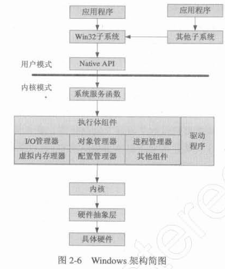

### Windows子系统

子系统是为了兼容不同平台应用程序产生的，主要分为以下子系统

* Win32子系统  Windows的原生子系统

* POSIX子系统  用于兼容POSIX标准

* OS/2子系统  用于兼容16位OS/2系统

* WOW子系统  Windows On Windows，为了兼容16位Windows

* VDM子系统  Virtual Dos Machine，为了兼容DOS

但实际上除了Win32子系统外其他子系统很少被用到（现在WOW64应该也是作为一个子系统提供的）

# 第3章 Windows驱动编译环境配置、安装及调试

NT驱动可以通过创建服务，打开服务的方式加载

WDM驱动只能通过inf文件安装，安装完inf文件后，在注册表中会设置一些特定的值

* 硬件子键  `HKEY_LOCAL_MACHINE\SYSTEM\CurrentControlSet\Enum` 该项本身就是以设备树的形式展现的，如一级子项中包含PCI ROOT USB等项，分别代表不同的设备总线

* 类子键 `HKEY_LOCAL_MACHINE\SYSTEM\CurrentControlSet\Control\Class` 每个设备都从属于一个设备类，每个设备类都以UGUID记录

* 服务子键 `HKEY_LOCAL_MACHINE\SYSTEM\CurrentControlSet\Service` 兼容NT的服务模式，以服务的形式显示挂载的驱动

# 第4章 驱动程序的基本结构

## Windows驱动程序中重要的数据结构

### 驱动对象 DRIVER_OBJECT

每个驱动程序都有唯一的驱动对象

```c
typedef struct _DRIVER_OBJECT {
    CSHORT Type;
    CSHORT Size;
    PDEVICE_OBJECT DeviceObject;
    ULONG Flags;
    PVOID DriverStart;
    ULONG DriverSize;
    PVOID DriverSection;
    PDRVIER_EXTENSION DriverExtension;
    UNICODE_STRING DriverName;
    PUNICODE_STRING HardwareDatabase;
    PFAST_IO_DISPATCH FastIoDispatch;
    PDRIVER_INITIALIZE DriverInit;
    PDRIVER_STARTIO DriverStartIo;
    PDRIVER_UNLOAD DriverUnload;
    PDRIVER_DISPATCH MajorFunction[IRP_MJ_MAXIMUM_FUNCTION + 1];
} DRIVER_OBJECT;
typedef struct _DRIVER_OBJECT* PDRIVER_OBJECT;
```

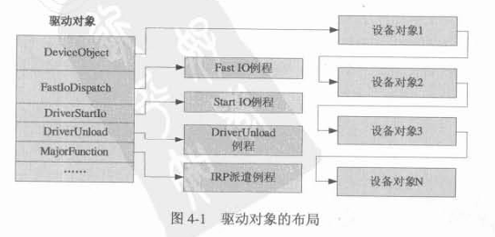

* DeviceObject  每个驱动程序都有一个或多个设备对象，每个设备对象都有一个指针指向下一个驱动对象

* DriverName  驱动名

* HardwareDatabase   记录设备的硬件数据库键名，一般为`\REGISTRY\MACHINE\HARDWARE\DESCRIPTION\SYSTEM`

* DriverStartIo  StartIo例程的函数地址

* DriverUnload   驱动卸载时的回调地址

* MajorFunction   一个函数指针数组，记录每个IRP对应的回调

* FastIoDispatch  文件驱动中使用的派遣函数

### 设备对象 DEVICE_OBJECT

每个驱动程序会创建一个或多个设备对象

```c
typedef struct _DEVICE_OBJECT {
    ...
    struct _DRIVER_OBJECT *DriverObject;
    struct _DRIVER_OBJECT *NextDevice;
    struct _DRIVER_OBJECT *AttachedDevice;
    struct _IRP *CurrentIrp;
    ULONG Flags;
    struct _DEVOBJ_EXTENSION *DeviceObjectExtension;
    ...
} DEVICE_OBJECT;
typedef struct _DEVICE_OBJECT *PDEVICE_OBJECT;
```

* DriverObject  指向驱动对象

* NextDevice  指向该驱动的下一个设备对象

* AttachedDevice 指向下一个设备对象，这里的下一个主要是更高一层的驱动（若有更高一层的驱动附加到这个驱动的话）

* CurrentIrp  使用StartIO例程时，该字段指向当前IRP结构

* Flags  32位无符号整型，描述设备对象的一些属性，如是否使用读写缓冲等

* DeviceExtension  指向设备扩展对象

* DeviceType  指明设备的类型

* StackSize  驱动堆栈的层数

* AlignmentRequirement  内存对齐要求

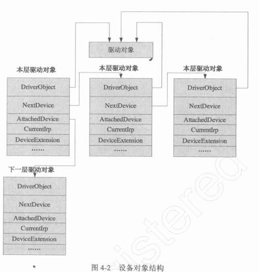

设备对象一般存储通用的设备信息，而设备扩展对象用于存储一些特定的信息

一类信息是设备驱动的全局变量。因为全局变量会导致重入性问题，因此驱动的全局变量最好定义在设备扩展中，并加入适当的同步措施。此外设备扩展还会记录以下内容

* 指向设备对象的指针

* 设备状态或驱动环境信息

* 中断对象指针

* 控制器对象指针

### 设备扩展 DEVICE_EXTENSION

```c
typedef struct _DEVICE_EXTENSION {
    PDEVICE_OBJECT pDevice;                // 指向设备对象
    UNICODE_STRING ustrDeviceName;         // 设备名
    UNICDOE_STRING ustrSymLinkName;        // 设备符号链接名
} DEVICE_EXTENSION, *PDEVICE_EXTENSION;
```

### 其他结构

#### UNICODE_STRING

```c
typedef struct _UNICODE_STRING {
    USHORT Length;
    USHORT MaximunLength;
    PWSTR Buffer;
} UNICODE_STRING *PUNICODE_STRING;
```

#### NTSTATUS

```c
#define STATUS_SUCCESS            ((NTSTATUS)0x00000000L)
#define STATUS_BUFFER_OVERFLOW    ((NTSTATUS)0x80000005L)
#define STATUS_UNSUCCESSFUL       ((NTSTATUS)0xC0000001L)
#define STATUS_NOT_IMPLEMENTED    ((NTSTATUS)0xC0000002L)
#define STATUS_ACCESS_VIOLATION   ((NTSTATUS)0xC0000005L)
#define STATUS_INVALID_HANDLE     ((NTSTATUS)0xC0000008L)
#define STATUS_INVALID_PARAMETER  ((NTSTATUS)0xC000000DL)
```

## NT式驱动的基本结构

### 驱动加载过程与驱动入口函数 DriverEntry

```c
NTSTATUS DriverEntry(IN PDRIVER_OBJECT pDriverObject,
                     IN PUNICODE_STRING pRegistryPath);
```

用于对驱动程序进行初始化工作，由System进程调用，该进程在系统启动时就被创建

驱动加载时：

* System启动新的线程，调用执行体组件中的对象管理器，创建一个驱动对象

* System调用执行体组件中的配置管理程序，查询此驱动程序对应的注册表的项（一般是`\REGISTRY\MACHINE\SYSTEM\ControlSet\Service\[服务名]`）

* 上述两个对象被作为参数传入DriverEntry

### 创建设备对象

```c
NTSTATUS IoCreateDevice(
    IN PDRIVER_OBJECT DriverObject,            // 驱动对象
    IN ULONG DeviceExtensionSize,              // 设备扩展大小
    IN PUNICODE_STRING DeviceName OPTIONAL,    // 设备对象名
    IN DEVICE_TYPE DeviceType,
    IN ULONG DeviceCharacteristics,            // 设置设备对象的特征
    IN BOOLEAN Exclusive,                      // 设置设备对象是否位内核模式下使用
    OUT PDEVICE_OBJECT *DeviceObject           // 输出的设备对象
);
```

这里设备名必须是`\Device\[设备名]`的形式，若不指定则会自动分配一个形如`\Device\00000001`的名字

指定设备名后，设备可以被其他驱动识别，但**无法被应用程序识别**。应用程序访问设备的方式一种是通过符号链接，另一种是通过设备接口（WDM中较常用）。如访问磁盘时，`C:`是符号链接，实际设备是`Device\HarddiskVolume1`。创建符号链接的函数是

```c
NTSTATUS IoCreateSymbolicLink(
    IN PUNICODE_STRING SymbolicLinkName,
    IN PUNICODE_STRING DeviceName
);
```

符号链接在内核模式下一般以`\??\`或`\DosDevices\`开头，如C盘的符号链接是`\??\C:`或`\DosDevices\C:`。用户模式下则是以`\\.\`开头，如`\\.\C:`

### DriverUnload例程

在驱动被卸载时调用。一般需要对创建的对象进行清理，较通用的是需要清理创建的设备和符号链接

删除设备：

```c
VOID IoDeleteDevice(IN PDEVICE_OBJECT DeviceObject);
```

删除符号链接：

```c
NTSTATUS IoDeleteSymbolicLink(IN PUNICODE_STRING SymbolicLinkName);
```

## WDM式驱动的基本结构

### 物理设备对象与功能设备对象

WDM模型中，完成一个设备的操作需要两个设备对象共同完成，一个是物理设备对象（Physical Device Object，PDO），一个是功能设备对象（Function Device Object，FDO），关系是附加与被附加

设备插入PC时，PDO会自动创建（由总线驱动创建）。PDO不能单独操作设备，而是会通知系统检测到新设备，安装驱动程序。这里的驱动程序就是WDM，该驱动负责创建FDO并附加到PDO上。描述的关系如下图

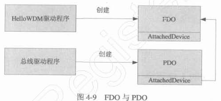

其中FDO的上层和下层还可能有额外的过滤驱动，如下图，构成一个设备对象堆栈

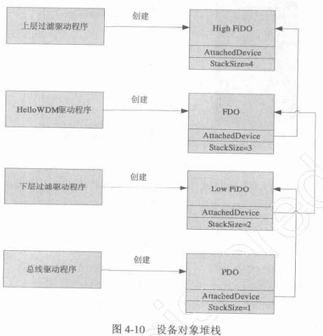

WDM与传统NT驱动的区别在于，NT驱动只能被动加载，而WDM驱动是在插入设备后系统自动创建PDO，提示用户安装FDO。这种模式使得WDM模型支持即插即用功能

### WDM驱动的入口程序

也是DriverEntry，但有以下区别

* 创建设备对象的责任不在DriverEntry中，而是在AddDevice例程中，因为NT驱动是主动加载设备的，而WDM是被动加载。操作系统加载PDO后调用驱动的AddDevice例程，例程中创建FDO，并附加到PDO上

* 需要设置IRP_MJ_PNP的回调，用来处理即插即用

### WDM驱动的AddDevice例程

首先在DriverEntry需要设置AddDevice回调。这里回调函数可以任意命名

```c
pDriverObject->DriverExtension->AddDevice = HelloWDMAddDevice;
```

回调的定义如下

```c
NTSTATUS HelloWDMAddDevice(IN PDRIVER_OBJECT DriverObject
                           IN PDRIVER_OBJECT PhysicalDeviceObject);
```

DriverObject是驱动对象，PhysicalDeviceObject则是总线驱动创建的PDO设备对象。AddDevice需要完成的一项重要工作是将FDO附加在PDO上

AddDevice一般可以分为下列步骤

* 通过IoCreateDevice函数创建FDO设备对象

* 将FDO地址保存，保存位置一般是设备扩展中（前面提过使用设备扩展保存驱动的全局变量）

* 将FDO附加在PDO上，一般需要调用下列函数
  
  ```c
  PDEVICE_OBJECT IoAttachDeviceToDeviceStack(
      IN PDEVICE_OBJECT SourceDevice;
      IN PDEVICE_OBJECT TargetDevice;
  );
  ```
  
  返回值是附加设备的下层设备，若下级没有过滤驱动则返回PDO，否则为过滤设备

* 附加操作完成后，需要设定符号链接，以便应用程序访问设备

* 设置fdo的Flags子域，注意有一步是必须的，即将`DO_DEVICE_INITIALIZING`清零，以表示设备初始化完毕

### DriverUnload例程

WDM驱动中，删除设备和取消符号链接等操作需要通过`IRP_MN_REMOVE_DEVICE`处理，因此DriverUnload例程一般用来处理如内存回收的操作

### IRP_MN_REMOVE_DEVICE

该IRP的回调函数定义为

```c
NTSTATUS HandleRemoveDevice(PDEVICE_EXTENSION pdx, PIRP Irp);
```

需要做三件事

* 删除设备的符号链接

* 将设备从设备栈中脱离，使用下列函数
  
  ```c
  VOID IoDetachDevice(IN OUT PDEVICE_OBJECT TargetDevice);
  ```

* 删除FDO设备

## 设备的层次结构

### 驱动程序的垂直层次结构

注意这里底层的驱动有链接到上层驱动的指针，但反之没有，只能通过自定义设备扩展来记录第一层的设备对象（AddDevice例程传入的参数）


### 驱动程序的水平层次结构

同一驱动程序可能挂载多个设备，称为水平层次结构

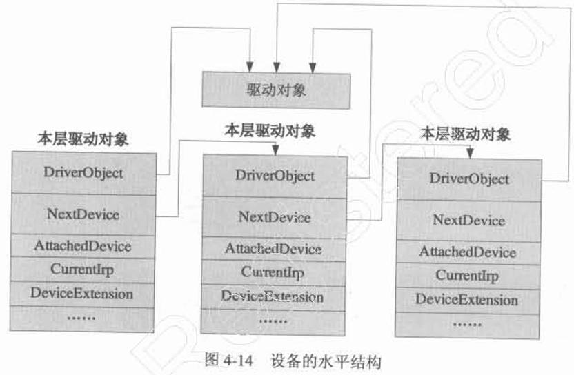

### 驱动程序的复杂层次结构

水平层次结构和垂直层次结构共同构成了设备对象的复杂层次结构（树形结构）

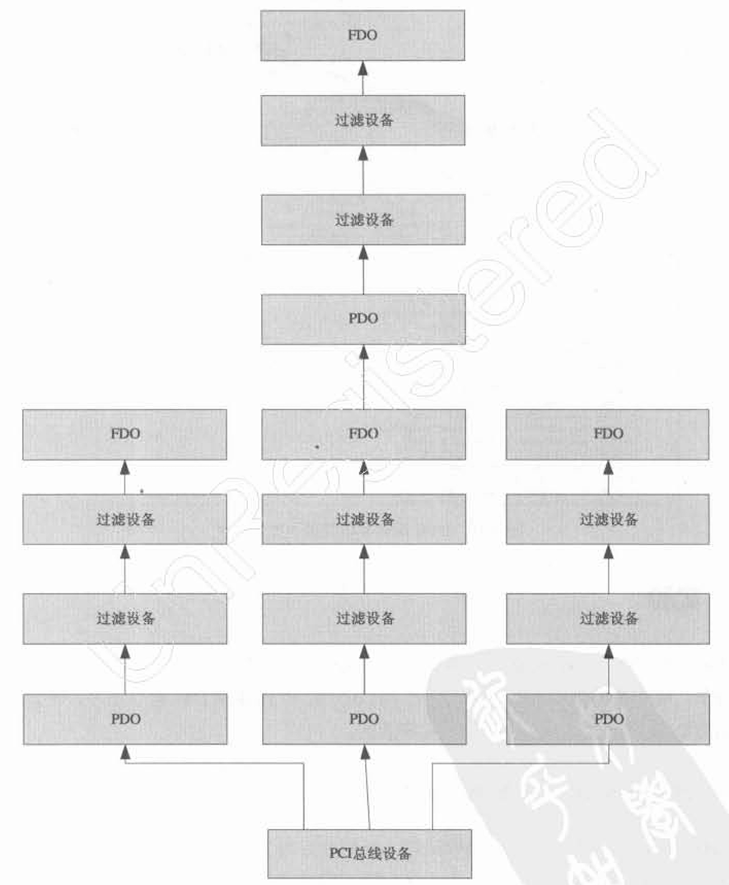

# 第5章 Windows内存管理

## 内存管理概念

### Windows驱动程序和进程的关系

DriverEntry例程和AddDevice例程是运行在System中的，而其他的一些例程，如IRP_MJ_READ IRP_MJ_WRITE等运行在进程的上下文中

### 分页与非分页内存

分页内存可以交换到文件中，非分页内存则不可以

若程序的中断请求级在DISPATCH_LEVEL之上，程序只能使用非分页内存

### 分配内核内存

堆中申请内存的函数

```c
PVOID ExAllocatePool(IN POOL_TYPE PoolType, IN SIZE_T NUmberOfBytes);
PVOID ExAllocatePoolWithTag(IN POOL_TYPE PoolType, IN SIZE_T NUmberOfBytes, IN ULONG Tag);
PVOID ExAllocatePoolWithQuota(IN POOL_TYPE PoolType, IN SIZE_T NUmberOfBytes);
PVOID ExAllocatePoolWithQuotaTag(IN POOL_TYPE PoolType, IN SIZE_T NUmberOfBytes, IN ULONG Tag);
```

* PoolType  有下列几种
  
  * NonPagedPool 非分页内存
  
  * PagedPool 分页内存
  
  * NonPagedPoolMustSucceed 非分页内存，且必须分配成功
  
  * DontUseThisType 未指定
  
  * NonPagedPoolCacheAligned 非分页内存，且必须内存对齐
  
  * PagedPoolCachedAligned 分页内存，且必须内存对齐
  
  * NonPagedPoolCacheAlignedMustS 非分页内存，且必须内存对齐，必须分配成功

* Tag  该参数作为内存呢的标签，可以在调试时找到对应标签的未释放内存

堆中释放内存的函数

```c
VOID ExFreePool(IN PVOID P);
NTKERNELAPI VOID ExFreePoolWithTag(IN PVOID P, IN ULONG Tag);
```

## 在驱动中使用链表

### 链表结构

```c
typedef struct _LIST_ENTRY {
    struct _LIST_ENTRY *Flink;
    struct _LIST_ENTRY *Blink;
} LIST_ENTRY, *PLIST_ENTRY;
```

使用时需要在自己的数据结构中用LIST_ENTRY作为自定义结构的一个子域

```c
typedef struct _MYDATASTRUCT {
    LIST_ENTRY ListEntry;
    MyData mydata;
};
```

### 链表操作

```c
// 初始化
InitializeListHead()

// 判空
IsListEmpty()


// 头插
InsertHeadList()

// 尾插
InsertTailList()

// 头删与尾删Remove
RemoveHeadList()
RemoveTailList()

// 当LIST_ENTRY不在第一项时获取数据结构头指针，类似linux中的container_of
CONTAINING_RECORD()
```

## Lookaside结构

若驱动程序需要频繁申请、回收固定大小的内存，可以使用Lookaside结构，以防产生内存碎片

相关操作函数如下

```c
// 初始化
ExInitializeNPagedLookasideList()
ExInitializePagedLookasideList()

// 申请内存（非分页/分页）
ExAllocateFromNPagedLookasideList()
ExAllocateFromPagedLookasideList()

// 回收内存（非分页/分页）
ExFreeToNPagedLookasideList()
ExFreeToPagedLookasideList()

// 删除对象
ExDeleteNPagedLookasideList()
ExDeletePagedLookasideList()
```

## 运行时函数

```c
// 内存间复制（非重叠）
RtlCopyMemory()

// 内存间复制（重叠）
RtlMoveMemory()

// 填充内存
RtlFillMemory()
RtlZeroMemory()

// 内存比较
RtlEqualMemory()
```

## 其他

### 数据类型

DDK对一些C语言的数据结构做了封装

| C语言       | DDK封装    |
| --------- | -------- |
| void      | VOID     |
| char      | CHAR     |
| short     | SHORT    |
| long      | LONG     |
| wchar_t   | WCHAR    |
| char*     | PCHAR    |
| wchar_t*  | PWCHAR   |
| long long | LONGLONG |

64位整数还有一个表示方式

```c
typedef union _LARGE_INTEGER {
    struct {
        ULONG LowPart;
        LONG HighPart;
    };
    struct {
        ULONG LowPart;
        LONG HighPart;
    } u;
    LONGLONG QuadPart;
} LARGE_INTEGER;
```

### 返回状态值

大部分返回值为NTSTATUS

```c
typedef LONG NTSTATUS;
```

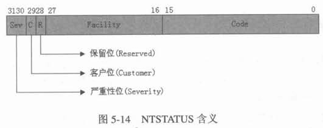

### 检查内存可用性

为了防止系统崩溃，使用下列两个函数检查内存可用性

```c
VOID ProbeForRead(
    IN CONST VOID *Address,
    IN SIZE_T Length,
    IN ULONG ALignment
);

VOID ProbeForWrite(
    IN CONST VOID *Address,
    IN SIZE_T Length,
    IN ULONG Alignment
);
```

### 结构化异常处理

```c
__try
{
}
__except(filter_value)
{
}
```

这里filter_value可能的取值为

* EXCEPTION_EXECUTE_HANDLER  数值为1，表示except错误处理后不再回到try块

* EXCEPTION_CONTINUE_SEARCH  数值为0，表示不使用该层的except，而是继续向上抛出异常

* EXCEPTION_CONTINUE_EXECUTION  数值为-1，重复先前错误的指令继续运行

此外可以使用一些函数手动触发异常，如

* ExRaiseStatus

* ExRaiseAccessViolation

* ExRaiseDatatypeMisalignment

还有一种try finally块

```c
__try
{
}
__finally
{
}
```

# 第6章 Windows内核函数

书中对于每个列出的函数都有定义以及示例，这边只列出用到的关键函数

## 内核模式下的字符串操作

### 字符串定义

```c
typedef struct _STRING {
    USHORT Length;
    USHORT MaximumLength;
    PCHAR Buffer;
} STRING;
typedef STRING ANSI_STRING;

typedef struct _UNICODE_STRING {
    USHORT Length;
    USHORT MaximumLength;
    PWSTR Buffer;
} UNICODE_STRING;
```

### 字符串操作

```c
// 初始化
RtlInitAnsiString()
RtlInitUnicodeString()

// 复制
RtlCopyString()
RtlCopyUnicodeString()

// 比较
RtlCompareString()
RtlCompareUnicodeString()

// 转大写
RtlUpperString()
RtlUpcaseUnicodeString()

// 字符串与整型转换
RtlUnicodeStringToInteger()
RtlIntegerToUnicodeString()

// ANSI字符串与Unicode字符串互转
RtlUnicodeStringToAnsiString()
RtlAnsiStringToUnicodeString()
```

## 文件操作

```c
// 创建
ZwCreateFile()

// 初始化对象属性
InitializeObjectAttributes()

// 打开文件
ZwOpenFile()

// 获取/修改文件属性
ZwQueryInformationFile()
ZwSetInformationFile()

// 写文件
ZwWriteFile()

// 读文件
ZwReadFile()
```

其中有三种Information Class，分别是FileStandardClass FileBasicInformation和FileNameInformation

## 注册表操作

```c
// 创建新键
ZwCreateKey()

// 打开键
ZwOpenKey()

// 添加、修改键值
ZwSetValueKey()

// 查询键值
ZwQueryValueKey()

// 枚举子项
ZwQueryKey()
ZwEnumerateKey()

// 枚举子键
ZwEnumerateValueKey()

// 删除子项
ZwDeleteKey()
```

此外DDK还提供了一系列Rtl开头的运行时函数，是对上述函数的封装。相比上述函数简化了操作

```c
RtlCreateRegistryKey()
RtlCheckRegistryKey()
RtlWriteRegistryValue()
RtlDeleteRegistryValue()
```

# 第7章 派遣函数

## IRP与派遣函数

### IRP

IO Request Package，操作系统会将所有IO请求转换为IRP，不同类型的IRP会被传递到不同的派遣函数内

IRP的两个最基本的属性分别为MajorFunction和MinorFunction，分别为IRP的主类型和子类型

DRIVER_OBJECT结构的MajorFunction成员用于记录IRP的派遣函数地址，若没有设置则默认为`_IopInvalidDeviceRequest`

IRP类似于WIndows应用程序的消息，于IO相关的函数，如CreateFile在调用时会使系统产生相关的IRP（IRP_MJ_CREATE），常见IRP列表如下

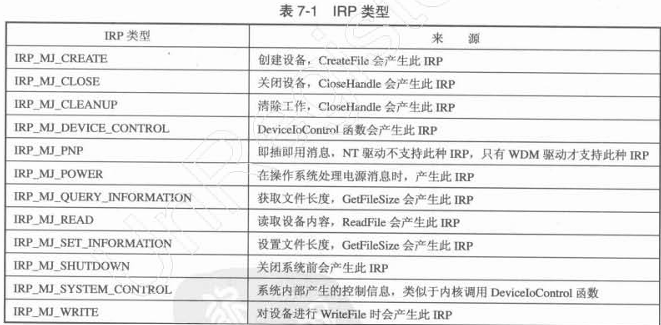

### 对派遣函数的简单处理

处理IRP的最简单的方法如下

```c
NTSTATUS HelloDDKDispatchRoutine(IN PDEVICE_OBJECT pDevObj, IN PIRP pIrp)
{
    NSTATUS status = STATUS_SUCCESS;
    pIrp->IoStatus.Status = status;            // 设置IRP完成状态
    pIrp->IoStatus.Information = 0;            // 设置IRP请求操作了多少字节
    IoCompleteRequest(pIrp, IO_NO_INCREMENT);  // IRP请求结束
    return status;
}
```

其中IoCompleteRequest的第二个参数代表线程恢复时的优先级。为了解释优先级，需要了解一下与文件IO相关的Win32 API操作过程

* ReadFile调用ntdll的NtReadFile

* NtReadFile进入内核模式，调用系统服务中的NtReadFile函数

* NtReadFile系统服务函数创建IRP_MJ_WRITE类型的IRP，将这个IRP发送到某个驱动程序的派遣函数中，并等待事件，此时线程进入Pending状态

* 派遣函数通过IoCompleteRequest函数设置线程等待的事件，唤醒系统服务线程

这里的优先级若为IO_NO_INCREMENT表示以原有优先级恢复线程运行，但若需要更快的反应，则可以以高优先级唤醒被阻塞线程，几个优先级设置如下

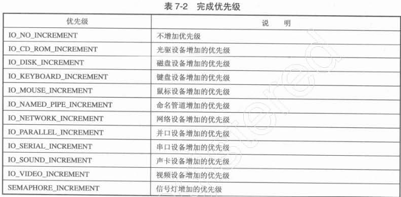

### 通过设备链接打开设备

驱动程序通过IoCreateSymbolicLink创建的符号链接可以被应用程序访问，访问时需要改变符号链接路径：如原为`\??\HelloDDK`，需改写为`\\.\HelloDDK`，加入转义符后的C字符串为`\\\\.\\HelloDDK`

### 更通用的派遣函数

```c
NTSTATUS HelloDDKDispatchRoutine(IN PDEVICE_OBJECT pDevObj, IN PIRP pIrp)
{
    PIO_STACK_LOCATION stack = IoGetCurrentIrpStackLocation(pIrp);
    UCHAR type = stack->MajorFunction;
    KdPrint(("IRP: %d\n", type));
    NTSTATUS status = STATUS_SUCCESS;
    pIrp->IoStatus.Status = status;
    pIrp->IoStatus.Information = 0;
    IoCompleteRequest(pIrp, IO_NO_INCREMENT);
    return status;
}
```

## 缓冲区方式读写操作

### 缓冲区设备

设备对象共有三种读写方式：缓冲区方式读写（DO_BUFFERED_IO）、直接方式读写（DO_DIRECT_IO）和其他方式读写（0）

读写操作一般由ReadFile或WriteFile触发，以WriteFile为例，用户程序会传入一段存储要写入内容的内存，但驱动程序若直接引用这段内存很危险，因为操作系统随时可能切换到其他任务导致缓冲区地址指向的内存不可用

缓冲区读写方式会先将应用程序的缓冲区数据复制到内核模式下的一个缓冲区中，再进行具体的读写操作。这样解决了用户模式地址可能失效的问题，但需要复制数据

### 缓冲区设备读写

系统会将一些请求的关键信息放在传入的参数中，包含

* `pIrp->AssociatedIrp.SystemBuffer`  系统分配的读写缓冲区，其中pIrp为指向IRP结构的指针

* `stack->Parameters.Read.Length`  读操作请求的字节数，其中stack为IO_STACK_LOCATION结构

* `stack->Parameters.Read.ByteOffset.QuadPart`  读操作请求的偏移，其中stack为IO_STACK_LOCATION结构

* `stack->Parameters.Write.Length`  写操作请求的字节数，其中stack为IO_STACK_LOCATION结构

* `stack->Parameters.Write.ByteOffset.QuadPart`  写操作请求的偏移，其中stack为IO_STACK_LOCATION结构

```c
NTSTATUS HelloDDKRead(IN PDEVICE_OBJECT pDevObj, IN PIRP pIrp)
{
    NTSTATUS status = STATUS_SUCCESS;
    PIO_STACK_LOCATION stack = IoGetCurrentIrpStackLocation(pIrp);
    ULONG ulReadLength = stack->Parameters.Read.Length;
    pIrp->IoStatus.Status = status;
    pIrp->IoStatus.Information = ulReadLength;
    memset(pIrp->AssociatedIrp.SystemBuffer, 0xAA, ulReadLength);
    IoCompleteRequest(pIrp, IO_NO_INCREMENT);
    return status;
}
```

### 缓冲区设备模拟文件读写

书上的一个示例，使用内存缓冲区来模拟文件的读写操作，需要实现三个IRP回调：读、写和获取文件长度

```c
// 由WriteFile触发，IRP_MJ_WRITE
NTSTATUS HelloDDKWrite(IN PDEVICE_OBJECT pDevObj, IN PIRP pIrp)
{
    NTSTATUS status = STATUS_SUCCESS;
    PDEVICE_EXTENSION pDevExt = (PDEVICE_EXTENSION)pDevObj->DeviceExtension;
    PIO_STACK_LOCATION stack = IoGetCurrentIrpStackLocation(pIrp);
    ULONG ulWriteLength = stack->Parameter.Write.Length;
    ULONG ulWriteOffset = (ULONG)stack->Parameters.Write.ByteOffset.QuadPart;
    if (ulWriteOffset + ulWriteLength > MAX_FILE_LENGTH)
    {
        status = STATUS_FILE_INVALID;
        ulWriteLength = 0;
    }
    else
    {
        // 复制写入内容到缓冲区
        memcpy(pDevExt->buffer + ulWriteOffset, pIrp->AssociatedIrp.SystemBuffer, ulWriteLength);
        status = STATUS_SUCCESS;
        if (ulWriteLength + ulWriteOffset > pDevExt->file_length)
        {
            pDevExt->file_length = ulWriteLength + ulWriteOffset;
        }
    }
    pIrp->IoStatus.Status = status;
    pIrp->IoStatus.Information = ulWriteLength;    // 实际操作的字节数
    IoCompleteRequest(pIrp, IO_NO_INCREMENT);
    return status;
}

// 由ReadFile触发，IRP_MJ_READ
NTSTATUS HelloDDKRead(IN PDEVICE_OBJECT pDevObj, IN PIRP pIrp)
{
    NTSTATUS status = STATUS_SUCCESS;
    PDEVICE_EXTENSION pDevExt = (PDEVICE_EXTENSION)pDevObj->DeviceExtension;
    PIO_STACK_LOCATION stack = IoGetCurrentIrpStackLocation(pIrp);
    ULONG ulReadLength = stack->Parameters.Read.Length;
    ULONG ulReadOffset = (ULONG)stack->Parameters.Read.ByteOffset.QuadPart;
    if (ulReadOffset + ulReadLength > MAX_FILE_LENGTH)
    {
        status = STATUS_FILE_LENGTH;
        ulReadLength = 0;
    }
    else
    {
        memcpy(pIrp->AssociatedIrp.SystemBuffer, pDevExt->buffer+ulReadOffset, ulReadLength);
        status = STATUS_SUCCESS;
    }
    pIrp->IoStatus.Status = status;
    pIrp->IoStatus.Information = ulReadLength;
    IoCompleteRequest(pIrp, IO_NO_INCREMENT);
    return status;
}

// 由GetFileSize触发，IRP_MJ_QUERY_INFORMATION
NTSTATUS HelloDDKQueryInformation(IN PDEVICE_OBJECT pDevObj, IN PIRP pIrp)
{
    PIO_STACK_LOCATION stack = IoGetCurrentIrpStackLocation(pIrp);
    PDEVICE_EXTENSION pDevExt = (PDEVICE_EXTENSION)pDevObj->DeviceExtension;
    FILE_INFORMATION_CLASS info = stack->Parameters.QueryFile.FileInformationClass;
    // 若为标准文件信息，则将当前文件长度填充到结构体中
    if (info == FileStandardInformation)
    {
        PFILE_STANDARD_INFORMATION file_info = (PFILE_STANDARD_INFORMATION)pIrp->AssociatedIrp.SystemBuffer;
        file_info->EndOfFile = RtlConvertLongToLargeInteger(pDevExt->file_length);
    }
    NTSTATUS status = STATUS_SUCCESS;
    pIrp->IoStatus.Status = status;
    pIrp->IoStatus.Information = stack->Parameters.QueryFile.Length;
    IoCompleteRequest(pIrp, IO_NO_INCREMENT);
    return status;
}
```

## 直接方式读写操作

### 直接读取设备

使用直接方式读写设备时，操作系统会将用户模式下的缓冲区锁住，然后将该缓冲区在内核模式映射一遍，以此保证进程切换时缓冲区内容不会改变

操作系统锁住用户模式内存后，使用内存描述符表（MDL）记录这段内存

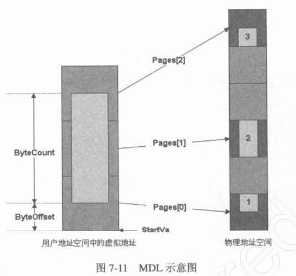

DDK提供了几个操作MDL的宏

```c
#define MmGetMdlByteCount(Mdl)        ((Mdl)->ByteCount)
#define MmGetMdlByteOffset(Mdl)       ((Mdl)->ByteOffset)
#define MmGetMdlVirtualAddress(Mdl)
            ((PVOID) (PCHAR) ( (Mdl)->StartVa) + (Mdl)->ByteOffset) )
```

### 直接读取设备的读写

```c
NTSTATUS HelloDDKRead(IN PDEVICE_OBJECT pDevObj, IN PIRP pIrp)
{
    PDEVICE_EXTENSION pDevExt = (PDEVICE_EXTENSION) pDevObj->DeviceExtension;
    NTSTATUS status = STATUS_SUCCESS;
    PIO_STACK_LOCATION stack = IoGetCurrentIrpLocation(pIrp);
    ULONG ulReadLength = stack->Parameters.Read.Length;

    ULONG mdl_length = MmGetMdlByteCount(pIrp->MdlAddress);
    PVOID mdl_address = MmGetMdlVirtualAddress(pIrp->MdlAddress);
    ULONG mdl_offset = MmGetMdlByteOffset(pIrp->MdlAddress);

    if (mdl_length != ulReadLenght)
    {
        pIrp->IoStatus.Information = 0;
        status = STATUS_UNSUCCESSFUL;
    }
    else
    {
        // 获取MDL在内核模式下的映射地址
        PVOID kernel_address = MmGetSystemAddressForMdlSafe(pIrp->MdlAddress, NormalPagePriority);
        // 这里假设读取的全为0xAA
        memset(kernel_address, 0xAA, ulReadLength);
        pIrp->IoStatus.Information = ulReadLength;
    }
    pIrp->IoStatus.Status = status;
    IoCompleteRequest(pIrp, IO_NO_INCREMENT);
    return status;
}
```

## 其他方式读写操作

### 其他方式设备

这种方式中操作系统只会给驱动应用程序的缓冲区地址。直接操作应用程序的缓冲区地址很危险，只有驱动程序和应用程序运行在相同线程上下文时才可以使用该方式。

### 其他方式读写

```c
NTSTATUS HelloDDKRead(IN PDEVICE_OBJECT pDevObj, IN PIRP pIrp)
{
    PDEVICE_OBJECT pDevExt = (PDEVICE_EXTENSION)pDevObj->DeviceExtension;
    NTSTATUS status = STATUS_SUCCESS;

    PIO_STACK_LOCATION stack = IoGetCurrentIrpStackLocation(pIrp);
    ULONG ulReadLength = stack->Parameters.Read.Length;
    ULONG ulReadOffset = (ULONG)stack->Parameters.Read.ByteOffset.QuadPart;
    PVOID user_address = pIrp->UserBuffer;
    __try
    {
        ProbeForWrite(user_address, ulReadLength, 4);
        memset(user_address, 0xAA, ulReadLength);
    }
    __except(EXCEPTION_EXECUTE_HANDLER)
    {
        status = STATUS_UNSUCCESSFUL;
    }
    pIrp->IoStatus.Status = status;
    pIrp->IoStatus.Information = ulReadLength;
    IoCompleteRequest(pIrp, IO_NO_INCREMENT);
    return status;
}
```

## IO设备控制操作

应用程序可以通过DeviceIoControl操作设备（IOCTL）

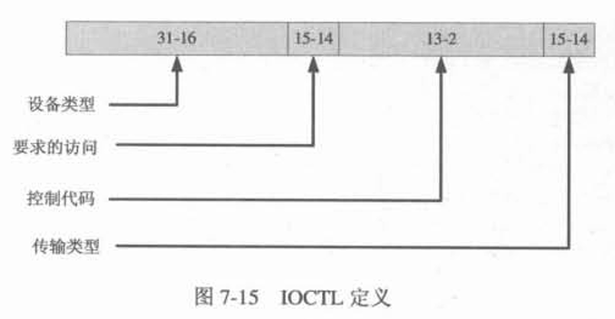

DDK提供了一个宏CTL_CODE

```c
CTL_CODE(DeviceType, Function, Method, Access)
```

* DeviceType  设备对象的类型

* Function  驱动程序自定义的IOCTL码
  
  * 0x0000~0x7FFF  微软保留
  
  * 0x0800~0x0FFF  程序员自定义

* Method  操作模式，共四种
  
  * METHOD_BUFFERED  使用缓冲区方式操作
  
  * METHOD_IN_DIRECT  使用直接写方式操作
  
  * METHOD_OUT_DIRECT  使用直接读方式操作
  
  * METHOD_NEITHER  使用其他方式操作

* Access  访问权限，一般使用FILE_ANY_ACCESS

### 缓冲内存模式IOCTL

几个关键的参数

* `pIrp->AssociatedIrp.SystemBuffer`  DeviceControl传入的内存，可以从这里获得输入缓冲区数据，且可以直接在这个缓冲区上修改。函数返回后系统会将缓冲区内容写回到用户缓冲区中

* `pIrp->IoStatus.Information`  实际操作的字节数

* `stack->Parameters.DeviceIoControl.InputBufferLength`  输入缓冲区大小

* `stack->Parameters.DeviceIoControl.OutputBufferLength`  输出缓冲区大小

* `stack->Parameters.DeviceIoControl.IoControlCode`  IOCTL代码

```c
NTSTATUS HelloDDKDeviceIOControl(IN PDEVICE_OBJECT pDevObj, IN PIRP pIrp)
{
    NTSTATUS status = STATUS_SUCCESS;
    PIO_STACK_LOCATION stack = IoGetCurrentIrpStackLocation(pIrp);
    ULONG cbin = stack->Parameters.DeviceIoControl.InputBufferLength;
    ULONG cbout = stack->Parameters.DeviceIoControl.OutputBufferLength;
    ULONG code = stack->Parameters.DeviceIoControl.IoControlCode;
    ULONG info = 0;
    switch(code)
    {
        case IOCTL_TEST1:
        {
            UCHAR* InputBuffer = (UCHAR*)pIrp->AssociatedIrp.SystemBuffer;

        }
    }
}
```

# 第8章 驱动程序的同步处理

## 中断请求级（IRQL）

早期用的中断控制器是类似8259A这种可编程中断控制器（PIC），后来都使用高级可编程中断控制器（APIC），IRQ数量增加到24个

Windows提出了一个中断请求级（IRQL）概念，规定了32个中断请求级别

* 0~2  软件中断

* 3~31  硬件中断  设备中断请求级（DIRQL）

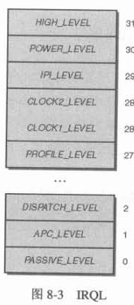

用户模式代码一般运行在最低优先级PASSIVE_LEVEL，包括驱动程序的DriverEntry、派遣函数、AddDevice等；StartIO例程、DPC例程、中断服务例程则运行在DISPATCH_LEVEL或更高的IRQL

Windows负责线程调度的组件则运行在DISPATCH_LEVEL，在线程调度后又会切换回PASSIVE_LEVEL

还有一点需要注意：**页故障（缺页异常）允许出现在PASSIVE_LEVEL的程序中，但如果在DISPATCH_LEVEL或更高级别的IRQL的程序都会导致系统崩溃**。因此在StartIO等例程中不能使用分页内存

驱动可以自行提升或降低IRQL

```c
KeGetCurrentIrql()                    // 获取当前IRQL
KeRaiseIrql(new_irql, &old_irql)      // 提升IRQL
KeLowerIrql(old_irql)                 // 降低IRQL
```

## 自旋锁

访问自旋锁时，若锁已被获取，则会轮询等待解锁而不会切换线程，因此对自旋锁的占用不应过长

驱动程序必须在小于等于DISPATCH_LEVEL的IRQL使用自旋锁

自旋锁一般应定义在设备扩展中

```c
typedef struct _DEVICE_EXTENSION {
    ...
    KSPIN_LOCK My_SpinLock;
} DEVICE_EXTENSION, *PDEVICE_EXTENSION;
```

使用下列函数操作

* KeInitializeSpinLock

* KeAcquireSpinLock

* KeReleaseSpinLock  该函数和上一个函数都有两个参数，一个指向自旋锁，另一个是获取锁前的IRQL/释放锁后恢复的IIRQL

* KeAcquireSpinLockAtDpcLevel

* KeReleaseSpinLockFromDpcLevel  这两个函数不改变IRQL

## 用户模式下的同步对象

这里先介绍用户模式下如何进行同步，从而与内核模式下进行对比

### 用户模式的等待

等待同步对象

```c
DWORD WaitForSingleObject(
    HANDLE hHandle,
    DWORD dwMilliseconds
);

DWORD WaitForMultipleObjects(
    DWORD nCount,
    CONST HANDLE *lpHandles,
    BOOL bWaitAll,
    DWORD dwMilliseconds
);
```

### 用户模式开启多线程

```c
HANDLE CreateThread(
    LPSECURITY_ATTRIBUTES lpThreadAttributes,
    SIZE_T dwStackSize,
    LPTHREAD_START_ROUTINE lpStartAddress,
    LPVOID lpParameter,
    DWORD dwCreationFlags,
    LPDWORD lpThreadId
);
```

此外这本书建议创建线程使用`_beginthreadex`而不是CreateThread

### 用户模式的事件

```c
HANDLE CreateEvent(
    LPSECURITY_ATTRIBUTES lpEventAttributes,
    BOOL bManualReset,
    BOOL bInitialState,
    LPCTSTR lpName
);
```

书里总结了一个比较有趣的事实：**所有第一个参数是LPSECURITY_ATTRIBUTES的CreateXXX函数都会创建一个内核对象**

### 用户模式的信号量

只要信号量计数大于0则为触发状态

```c
HANDLE CreateSemaphore(
    LPSECURITY_ATTRIBUTES lpSemaphoreAttributes,
    LONG lInitialCount,
    LONG lMaximumCount,
    LPCTSTR lpName
);
```

使用ReleaseSemaphore增加计数，WaitForSingleObject则会减少计数

### 用户模式的互斥体

```c
HANDLE CreateMutex(
    LPSECURITY_ATTRIBUTES lpMutexAttributes,
    BOOL bInitialOwner,
    LPCTSTR lpName
);
```

使用WaitForSingleObject获取锁，ReleaseMutex释放锁

### 等待线程完成

使用WaitXXX（WaitForSingleObject、WaitForMultipleObjects）等待子线程运行结束

## 内核模式下的同步对象

### 内核模式下的等待

```c
NTSTATUS KeWaitForSingleObject(
    IN PVOID Object,
    IN KWAIT_REASON WaitReason,
    IN KPROCESSOR_MODE WaitMode,
    IN BOOLEAN Alertable,
    IN PLARGE_INTEGER Timeout OPTIONAL
);

NTSTATUS KeWaitForMultipleObjects(
    IN ULONG Count,
    IN PVOID Object[],
    IN WAIT_TYPE WaitType,
    IN KWAIT_REASON WaitReason,
    IN KPROCESSOR_MODE WaitMode,
    IN BOOLEAN Alertable,
    IN PLARGE_INTEGER Timeout OPTIONAL,
    IN PKWAIT_BLOCK WaitBlockArray OPTIONAL
);
```

### 内核模式开启多线程


# 附录

## 书中介绍的一些工具

### 性能测试

* 控制面板->管理工具->性能  P35
  
  可以查看CPU在内核模式和用户模式的运行情况

### 二进制依赖

* Dependency  P39
  
  可以查看可执行文件、DLL文件等依赖的DLL

### 编译工具

* build  P60
  
  类似make的构建工具

* MSVC  P62
  
  这里介绍了一些编译和链接选项

### 调试与查看工具

* DbgView  P67
  
  主要用于查看KdPrint的内容

* WinObj  P98
  
  用于查看驱动对象、设备对象及其符号链接

* DeviceTree  P101
  
  一样可以查看驱动对象、设备对象等信息，但能提供更详细的内容，如设备IO堆栈、派遣函数、Unload函数地址、设备类型、设备对象分层结构等

* IRPTrace  P194
  
  该工具可以实时跟踪IRP的传递、转发、结束等操作，查看IRP经过的驱动程序堆栈，并且可以加载符号表来看到相关的符号信息

### 其他

* GUIDGEN  P84
  
  用于生成GUID


