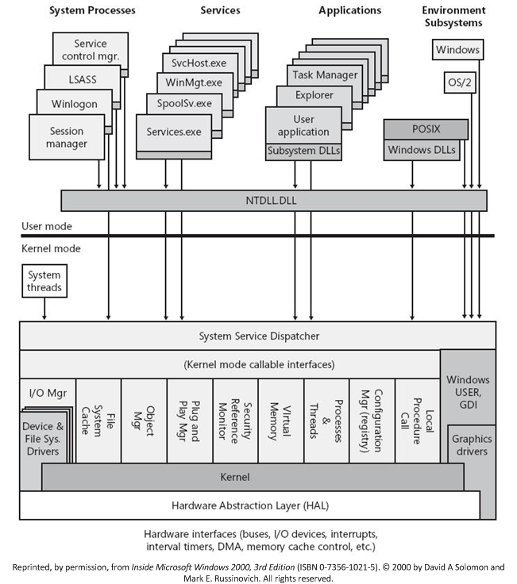

# ref

[内核模式驱动程序体系结构设计指南 - Windows drivers | Microsoft Learn](https://learn.microsoft.com/zh-cn/windows-hardware/drivers/kernel/)

[开发、测试以及部署驱动程序 - Windows drivers | Microsoft Learn](https://learn.microsoft.com/zh-cn/windows-hardware/drivers/develop/)

# 内核模式驱动程序体系结构设计指南

## 概述

### Windows组件概述



### Windows驱动程序类型

有两种基本类型

* 用户模式驱动程序  在用户模式下运行，通常用于在应用程序和内核模式驱动间提供一个接口

* 内核模式驱动程序

内核模式的驱动程序又可以划分为多个类型


* 最上层  用于提供符合某种统一操作模型的接口，如文件系统的FAT NTFS驱动

* 中间层  与设备类型相关的类驱动程序，如文件系统的载体可能是磁盘，也可能是虚拟磁盘、镜像等。可以进一步细分如下
  
  * 功能驱动程序  控制IO总线上的特定设备
  
  * 筛选器驱动程序  在功能驱动程序之上或之下的驱动程序
  
  * 软件总线驱动程序  用于提供一组子设备
  
  * 任何系统提供的类驱动程序

* 最下层  控制外围设备连接到的IO总线
  
  * 硬件总线驱动程序  系统提供，通常动态控制可配置的IO总线
  
  * 直接控制物理设备的旧版驱动程序

### 内核模式驱动程序设计目标

#### 可移植

应

* 使用C语言编写

* 仅使用WDK中提供的编程接口与windows交互

最好避免

* 依赖与平台相关的数据类型

* 调用处于维护状态的标准C函数

* 调用操作系统实现的一些标准C函数

#### 可配置性

这里存在两种可配置性

* 硬件可配置性  设备可以接受系统硬件资源（如IO端口号）的不同分配，而无需进行物理修改

* 软件可配置性
  
  * 可动态接收和更改其设备的硬件资源
  
  * 驱动程序不假设可能位于其驱动堆栈上方或下方的其他驱动程序

* 始终可抢占/始终可中断  即任何线程都可以被优先级较高的线程抢占，且任何驱动程序的中断服务例程都可以被更高的IRQ中断

* 多处理器兼容  其中windows的模型为对称多处理器（SMP），因此存在下列特性
  
  * 所有CPU都是相同的
  
  * 所有CPU共享内存，并统一访问内存
  
  * 每个CPU都可以访问内存、中断和IO控制寄存器
  
  因此要确保安全运行，必须确保在一个处理器上执行的代码不会同时访问和修改另一个处理器正在访问和修改的数据

* 基于对象  NT内核基于对象，执行中的各种组件定义一个或多个对象类型，每个组件导出支持用于操作其对象类型的例程，任何组件都不能直接访问另一个组件的对象，而只能使用其导出的例程来调用

* 数据包驱动的IO与可重用IRP
  
  * IO管理器执行以下步骤
    
    * 接收应用程序的IO请求
    
    * 创建表示IO请求的IRP
    
    * 将IRP路由到相应的驱动程序
    
    * 跟踪IRP直到完成
    
    * 将状态返回给每个IO操作的原始请求者
  
  IO管理器可能会将IRP路由到多个驱动程序，这组驱动程序称为驱动程序堆栈。因此每个IRP都有一个固定部分，外加一个特定于驱动程序的IO堆栈位置
  
  * 固定部分中，IO管理器维护原始请求的相关信息
  
  * 在最高级别的驱动程序中（即IRP第一个传递到的驱动程序），其会设置特定于驱动程序的参数，并可以设置驱动程序堆栈中下一个驱动程序的IO堆栈位置
  
  每个驱动程序处理IRP时，可以访问IRP中的IO堆栈位置，从而在驱动程序操作的每个阶段重用IRP。较高级别的驱动程序也可以创建或重用IRP，下发到低级别的驱动程序

* 支持异步IO  即内核驱动不一定按照发送到IO管理器的相同顺序处理IO请求，IO管理器或高级别驱动程序可以重新排列请求，也可以将大型数据传输请求拆分为较小的传输请求，还可以重叠IO请求处理

## Windows内核组件

### 对象管理器

主要执行下列任务来管理windows对象

* 对象的创建和销毁

* 保留对象命名空间数据库以跟踪对象信息

* 跟踪分配给每个进程的资源

* 跟踪特定对象的访问权限以提供安全性

* 管理对象的生存期，并确定何时自动销毁对象以回收资源空间

接口以Ob作为前缀（ObGetObjectSecurity）

### 内存管理器

主要执行下列任务来管理内存

* 以虚拟和动态方式分配和释放内存

* 支持内存映射文件、共享内存以及写时复制机制

接口以Mm作为前缀（MmGetPhysicalAddress）

### 进程和线程管理器

[Windows 内核模式进程和线程管理器 - Windows drivers | Microsoft Learn](https://learn.microsoft.com/zh-cn/windows-hardware/drivers/kernel/windows-kernel-mode-process-and-thread-manager)

链接中主要讲了进程和线程相关回调例程的写法，以及WSL相关的进程管理

接口以Ps作为前缀（PsCreateSystemThread）

### IO管理器

用于管理应用程序和设备驱动程序提供的接口之间的通信

通过IO请求数据包（IRP）解决设备运行速度与操作系统不匹配的问题

接口以Io作为前缀（IoCreateDevice）

### 即插即用管理器

是IO管理器的子系统，用于管理诸如U盘等即插即用（PnP）设备

PnP没有直接的接口或例程，但WDF提供了一组库来实现一些功能

### 电源管理器

使用电源管理技术来降低电脑功耗，如使电脑处于睡眠或休眠状态

接口以Po作为前缀（PoSetPowerState）

### 配置管理器

用于管理注册表

接口以Cm（Configuration Manager）作为前缀（CmRegisterCallback）

### 内核事务管理器

用于提供事务管理，如及那个每次数据操作作为事务，则可以提交事务，以原子单元的形式执行事务，发生故障可以回滚事务

### 安全引用监视器

使用ACL来确定哪些对象具有哪些安全性

接口以Se作为前缀（SeAccessCheck）

### 内核库

一些与内核有关的接口

接口以Ke作为前缀（KeGetCurrentThread）

### 执行支持库

为设备驱动提供下列服务

* 对象管理

* 内存管理

* 进程、线程管理

* 输入、输出管理

* 配置管理

接口以Ex作为前缀（ExCreatePool）

### 运行时库

内核模式组件所需的一些通用例程

大多数以Rtl作为前缀（RtlCheckRegistryKey）

### 安全字符串库

属于运行时库的一个，主要提供安全字符串操作函数

前缀为Rtl（RtlStringCbCatW）

### DMA库

用于控制DMA传输

例程列表 [Windows 内核 - Windows drivers | Microsoft Learn](https://learn.microsoft.com/zh-cn/windows-hardware/drivers/ddi/_kernel/#dma)

### HAL库

硬件抽象层

例程列表 [HAL Library Routines (Windows Drivers) | Microsoft Learn](https://learn.microsoft.com/zh-cn/previous-versions/windows/hardware/drivers/ff546644(v=vs.85))

### CLFS库

用于提供事务日志记录的系统

前缀为Clfs

### PRM库

平台运行时机制，是基于GUID的接口，可以使驱动程序调用UEFI中预加载的处理程序

### WMI库

提供用于管理组件的常规机制

前缀为Wmi [Windows 驱动程序工具包 (WDK) 的 API 参考文档 - Windows drivers | Microsoft Learn](https://learn.microsoft.com/zh-cn/windows-hardware/drivers/ddi/index)

## Windows驱动程序模型（WDM）

### WDM简介

新一点的框架是KMDF，接口比WDM更简单

WDM驱动程序一般可以分为三类

* 总线驱动程序

* 函数驱动程序

* 筛选器驱动程序

三类程序的关系如下图


### 驱动程序类型

#### 总线驱动程序

为总线控制器、适配器或网桥提供服务

主要职责：

* 枚举总线上的设备

* 响应即插即用IRP和电源管理IRP

* 对某些总线进行多路复用访问

* 管理总线上的设备

注意，总线上设备的读写请求一般由函数驱动程序处理，仅当子设备在raw mode下才由总线驱动程序接管

#### 函数驱动程序

一般的设备都由函数驱动程序提供操作接口，包括处理对设备的读写和管理设备电源策略

#### 筛选器驱动程序

是可选的驱动程序，可为设备提供增强功能或修改设备行为，可以为一个或多个设备服务

一般也可以分为三种

* 总线筛选器驱动程序  为总线提供增强功能

* 下层筛选器驱动程序  通常会修改设备硬件行为

* 上层筛选器驱动程序  通常为设备提供增强功能

### WDM驱动程序层次示例

示例是一个USB游戏杆


上述硬件的驱动程序栈为


自底向上分别为

* PCI总线驱动

* USB主控制器总线驱动

* USB hub总线驱动

* 底层筛选器驱动，可以提供诸如游戏杆模拟鼠标的功能

* USB HID类驱动程序（函数驱动程序）

* 高层筛选器驱动，可以提供诸如宏按钮的功能

### 设备与驱动程序配置

这边是一个鼠标和键盘设备的示例。鼠标和键盘可能直接挂载到总线，也可能通过一个设备控制器来提供输入


对应的驱动程序分层如下


无论以何种方式接入，最终都会使用鼠标和键盘类驱动程序进行处理，这类独立于具体硬件接口提供统一设备驱动的程序称为类驱动程序。相应的，与具体端口相关的称为端口驱动程序

如图，可以在键盘和鼠标类驱动程序前添加新的中间驱动程序到配置中

### WDM标准驱动程序例程

#### 标准例程需要实现的接口

必须实现下面几种接口例程

* DriverEntry  驱动程序入口

* AddDevice  初始化设备并创建设备对象

* Dispatch  接收和处理IRP

* Unload  卸载，释放驱动程序的资源

下列接口例程则为可选项

* ReInitialize  重新初始化

* StartIo  在物理设备上启动IO操作

* ISR  中断服务例程，在中断时保存设备状态

* 延迟过程调用  在ISR保存设备状态后完成设备中断的处理

* SynchCritSection  用于同步对驱动数据的访问

* AdapterControl  启动DMA

* IoCompletion  完成驱动程序对IRP的处理

* Cancel  取消驱动程序处理IRP

* CustomTimerDc IoTimer  计时和同步事件

#### DriverObject

是DriverEntry默认传入的参数


注意，DDDispatch是一个函数指针数组，指向处理对应IRP的回调函数，其下标即为IRP号IRP_MJ_xxx

#### DriverEntry例程

DriverEntry应该完成下述职责

* 为驱动程序提供回调函数，如
  
  ```c
  DriverObject->DriverExtension->AddDevice = CbAddDevice;
  DriverObject->MajorFunction[IRP_MJ_PNP] = CbDispatchPnp;
  DriverObject->MajorFunction[IRP_MJ_POWER] = CbDispatchPower;
  ```

* 创建和初始化驱动程序的全局对象、类型和资源

* 释放不再需要的内存

* 返回NSTATUS指示是否成功加载，并可以接收和处理来自PnP管理器的请求，以配置、添加、启动设备

DriverEntry还可能负责下述事务

* 需要存储驱动程序全局数据
  
  * 可以使用IoAllocateDriverObjectExtension创建驱动程序对象扩展
  
  * 可以使用ExAllocatePoolWithTag创建内存
  
  * 可以使用MmAllocateNonCachedMemory或MmAllocateContiguousMemory

* 创建工作线程（PsCreateSystemThread）

* 注册ReInitialize例程

* 处理一些特殊的初始化要求

DriverEntry的返回值：NTSTATUS。若成功返回STATUS_SUCCESS，若失败，返回前应该释放所有系统对象、资源

#### ReInitialize例程

任何需要在运行阶段中自行初始化的驱动程序都可以包含重新初始化例程。如系统包含PnP管理器无法检测到的旧端口，可能就需要在检测到新设备挂载后调用重新初始化例程来执行为新接口创建设备对象等操作

DriverEntry中可以调用IoRegisterDriverReinitialization来显式调用重新初始化例程，后者将被排队执行；重新初始化例程本身也可以调用IoRegisterDriverReinitialization

若驱动程序具有重新初始化例程，其初始化的基本步骤应与DriverEntry一致

#### AddDevice例程

支持PnP的驱动程序都需要具有AddDevice例程，用于创建一个或多个设备对象，并将设备对象附加到设备堆栈

##### 函数或筛选器驱动程序中的AddDevice例程

AddDevice应包含下列步骤

* 调用IoCreateDevice为要添加的设备创建功能或筛选器对象

* 创建一个或多个指向设备的符号链接，调用IoRegisterDeviceInterface来注册设备功能，且驱动程序在处理IRP_MN_START_DEVICE时应调用IoSetDeviceInterfaceState来启用接口

* 

# 开发、测试以及部署驱动程序

[开发、测试以及部署驱动程序 - Windows drivers | Microsoft Learn](https://learn.microsoft.com/zh-cn/windows-hardware/drivers/develop/)

这份指南主要说明开发驱动时的一些工具，如何编译、部署、测试、调试驱动程序，何为DCH涉及原则等

## Windows驱动程序

### DCH设计原则和最佳实践

#### DCH设计原则

* D 声明性：仅使用声明性INF指令安装驱动程序包

* C 组件化：与版本相关的特定驱动程序包、OEM自定义项和可选自定义项独立于基本驱动程序包

* H 硬件支持应用：与驱动程序包关联的任何UI组件都必须打包为硬件支持应用或预装在OEM设备上

#### 概述

符合DCH设计原则的驱动程序包中有INF文件，且由下列部分组成

* 基本驱动程序包

* 可选组件包

* 可选硬件支持应用

其中基本驱动程序包包含所有核心功能和共享代码，可选组件包包含自定义项和其他设置

### 驱动程序包隔离

新驱动程序要求驱动程序包隔离，使其更有弹性、更容易更新和安装

|              | 非独立驱动程序                                              | 独立驱动程序                       |
| ------------ | ---------------------------------------------------- | ---------------------------- |
| 安装路径         | inf将文件复制到%windir%\System32或%windir%\System32\drivers | 驱动程序从驱动程序存储区运行               |
| 与设备堆栈/驱动程序交互 | 使用硬编码路径                                              | 使用系统提供的功能或设备接口               |
| 注册表访问        | 路径硬编码到全局注册表                                          | 使用HKR和系统提供的功能获取注册表和文件状态的相对位置 |
| 文件写入位置       | 运行时文件可能写入任何位置                                        | 文件位置是相对于操作系统所提供的位置编写的        |

#### 从驱动程序存储区运行

文档中涉及一系列不同框架（WDM WDF 用户模式驱动等）获取对应信息的API，这里不列出，仅介绍概念

##### 读取和写入状态

该方式不会使用硬编码的绝对注册表路径和文件路径，因此需要调用相关函数获取

###### 注册表状态

对于下列注册表状态，提供了对应的API获取其配置

* PnP设备注册表状态：独立驱动程序包和用户模式组件通常需要使用注册表存储两类设备状态，分别是
  
  * 用于设备的硬件密钥（设备密钥）  关于单个设备实例如何与硬件交互的设置
  
  * 用于设备的软件密钥（驱动程序密钥）  关于单个设备实例如何与系统和其他软件交互的设置

* 设备接口注册表状态

* 服务注册表状态  分为三类
  
  * 不可变服务注册表状态  用于存储安装服务的驱动程序包的状态，这些状态会在inf文件指定，运行时只能读取不能修改
  
  * 内部服务注册表状态  在运行时写入的状态，仅由服务本身拥有和管理，仅可供该服务访问
  
  * 共享服务注册表状态  运行时写入的状态，如果其他用户模式组件有足够权限则可以共享

###### 文件状态

对于下列文件状态，提供了对应的API获取其配置

* 设备文件状态  需要在运行时写入与设备相关的文件

* 服务文件状态  包含三个类别
  
  * 不可变服务文件状态  作为驱动程序包的一部分的文件
  
  * 内部服务文件状态  在运行时写入的状态，仅由服务本身拥有和管理，仅供该服务访问
  
  * 共享服务文件状态  运行时写入的状态，若其他用户模式组件有足够权限则可以共享

* DriverData和ProgramData  可与其他组件共享但不属于共享服务文件状态的文件可写入这两个位置

* 临时文件  即`%TEMP%`指向的路径，通常被用于中间操作

###### 属性状态

设备和设备接口都支持通过PnP属性模型来存储状态，该模型允许针对设备或设备接口存储结构化的属性数据

原文介绍了不同框架下一系列访问属性状态的API

###### 使用设备接口

若驱动程序想要允许其他组件读取或修改驱动程序内部状态，则可以公开一个接口让其他组件调用，一般是下列两种类型

* IO协议（即IOCTL）

* 直接调用查询接口，如通过发送IRP_MN_QUERY_INTERFACE从驱动程序检索函数指针进行调用

#### 从驱动程序存储区动态查找和加载文件

[从驱动程序存储区运行 - Windows drivers | Microsoft Learn](https://learn.microsoft.com/zh-cn/windows-hardware/drivers/develop/run-from-driver-store#dynamically-finding-and-loading-files-from-the-driver-store)

#### 删除驱动程序包

[从驱动程序存储区运行 - Windows drivers | Microsoft Learn](https://learn.microsoft.com/zh-cn/windows-hardware/drivers/develop/run-from-driver-store#dynamically-finding-and-loading-files-from-the-driver-store)
