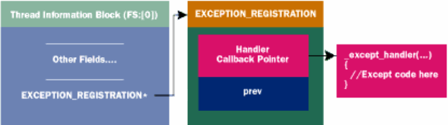
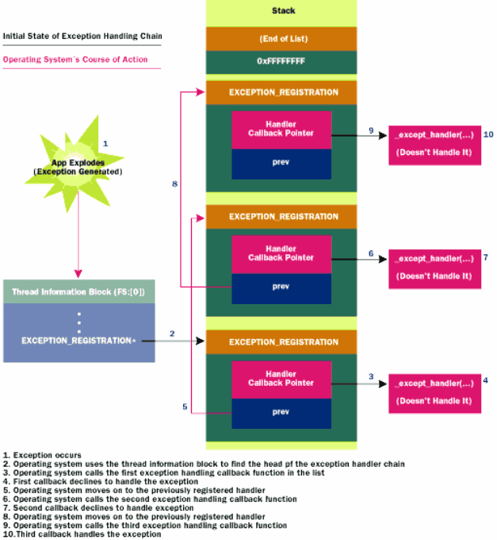
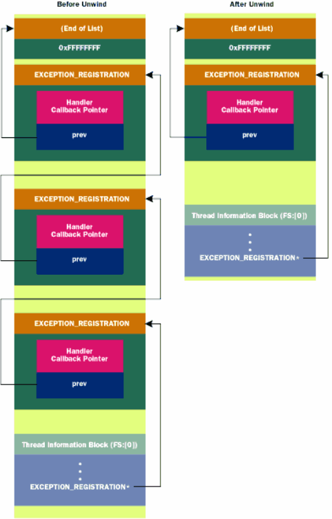

主要内容依据ref1的经典文章写，辅以其他资料的补充

## x86

### 结构体和函数定义

#### 结构体与类型

```c
#define EXCEPTION_CHAIN_END ((struct _EXCEPTION_REGISTRATION_RECORD * POINTER_32)-1)

// 定义了exception的类型
typedef enum _EXCEPTION_DISPOSITION {
    ExceptionContinueExecution,
    ExceptionContinueSearch,
    ExceptionNestedException,
    ExceptionCollidedUnwind
} EXCEPTION_DISPOSITION;

// 保存exception信息的结构
typedef struct _EXCEPTION_RECORD {
    DWORD ExceptionCode;        // 异常号
    DWORD ExceptionFlags;
    struct _EXCEPTION_RECORD *ExceptionRecord;
    PVOID ExceptionAddress;     // 异常发生地址
    DWORD NumberParameters;
    ULONG_PTR ExceptionInformation[EXCEPTION_MAXIMUM_PARAMETERS];
} EXCEPTION_RECORD;

typedef EXCEPTION_RECORD *PEXCEPTION_RECORD;

// 指向错误处理函数的函数指针类型
typedef EXCEPTION_DISPOSITION
       (*PEXCEPTION_ROUTINE) (
            IN struct _EXCEPTION_RECORD *ExceptionRecord,
            IN PVOID EstablisherFrame,
            IN OUT struct _CONTEXT *ContextRecord,
            IN OUT PVOID DispatcherContext
            );

// SEH链结构
typedef struct _EXCEPTION_REGISTRATION_RECORD {
    struct _EXCEPTION_REGISTRATION_RECORD *Next;
    PEXCEPTION_ROUTINE Handler;
} EXCEPTION_REGISTRATION_RECORD;

typedef EXCEPTION_REGISTRATION_RECORD *PEXCEPTION_REGISTRATION_RECORD;

// 保存SEH的上下文信息
 typedef struct _CONTEXT
 {
     DWORD ContextFlags;
     DWORD   Dr0;
     DWORD   Dr1;
     DWORD   Dr2;
     DWORD   Dr3;
     DWORD   Dr6;
     DWORD   Dr7;
     FLOATING_SAVE_AREA FloatSave;
     DWORD   SegGs;
     DWORD   SegFs;
     DWORD   SegEs;
     DWORD   SegDs;
     DWORD   Edi;
     DWORD   Esi;
     DWORD   Ebx;
     DWORD   Edx;
     DWORD   Ecx;
     DWORD   Eax;
     DWORD   Ebp;
     DWORD   Eip;
     DWORD   SegCs;
     DWORD   EFlags;
     DWORD   Esp;
     DWORD   SegSs;
 } CONTEXT;
```

* EXCEPTION_DISPOSITION
  
  * ExceptionContinueExecution 处理完SEH后继续从抛出异常的点执行
  
  * ExceptionContinueSearch 没有处理异常，继续遍历下一个节点
  
  * ExceptionNestedException 没有处理异常，从指定的新异常继续遍历
  
  * ExceptionCollidedUnwind

* EXCEPTION_RECORD
  
  * 记录异常抛出点的信息
    * 异常号
    * 异常flag（是否可以继续执行等）
    * 下一个异常指针，用于嵌套异常时的异常链
    * 异常地址
    * 一些异常的额外参数信息

* PEXCEPTION_ROUTINE
  
  * 一个函数指针，指向一个异常处理函数
    
    `IN struct _EXCEPTION_RECORD *ExceptionRecord` 传入EXCEPTION_RECORD

* EXCEPTION_REGISTRATION_RECORD
  
  * EXCEPTION_REGISTRATION_RECORD`注册一个异常处理结构
    
    - `struct _EXCEPTION_REGISTRATION_RECORD *Next` 指向下一个SEH
    - `PEXCEPTION_ROUTINE Handler` handler指向处理函数

* _CONTEXT
  
  * 用于保存异常时的上下文信息，这里是intel x86的定义，该结构体定义与架构相关

#### 函数

##### _except_handler

```c
EXCEPTION_DISPOSITION
__cdecl _except_handler(
    struct _EXCEPTION_RECORD *ExceptionRecord,
    void * EstablisherFrame,
    struct _CONTEXT *ContextRecord,
    void * DispatcherContext
    );
```

### 异常处理顺序

* 若挂了调试器
  
  * 操作系统会先通知调试器（一般若调试器设置了断点，会在这里处理）
  
  * 若调试器不处理该异常，则从当前栈帧的异常处理函数开始遍历，然后依次遍历调用栈上的栈帧
  
  * 若栈帧上找不到处理函数，则会第二次通知调试器（若调试器不接收该异常，则会直接终止被调试进程）

* 若未挂调试器
  
  * 从当前栈帧的异常处理函数开始遍历，然后依次遍历调用栈上的栈帧
  
  * 若未找到处理函数，则系统根据异常类型调用默认的处理函数

### 工作机制

**Win32中**每个线程都有自己的exception handler链，其头指针保存在线程信息块（TIB/TEB）的第一个成员上，而fs寄存器始终指向TIB。所以handler链的头指针在`FS:[0]`



#### 简单例子

```c
#define WIN32_LEAN_AND_MEAN
#include <windows.h>
#include <stdio.h>

DWORD  scratch;

EXCEPTION_DISPOSITION
__cdecl
_except_handler(
    struct _EXCEPTION_RECORD *ExceptionRecord,
    void * EstablisherFrame,
    struct _CONTEXT *ContextRecord,
    void * DispatcherContext )
{
    unsigned i;

    // Indicate that we made it to our exception handler
    printf( "Hello from an exception handler\n" );

    // Change EAX in the context record so that it points to someplace
    // where we can successfully write
    ContextRecord->Eax = (DWORD)&scratch;

    // Tell the OS to restart the faulting instruction
    return ExceptionContinueExecution;
}

int main()
{
    DWORD handler = (DWORD)_except_handler;

    __asm
    {                           // Build EXCEPTION_REGISTRATION record:
        push    handler         // Address of handler function
        push    FS:[0]          // Address of previous handler
        mov     FS:[0],ESP      // Install new EXECEPTION_REGISTRATION
    }

    __asm
    {
        mov     eax,0           // Zero out EAX
        mov     [eax], 1        // Write to EAX to deliberately cause a fault
    }

    printf( "After writing!\n" );

    __asm
    {                           // Remove our EXECEPTION_REGISTRATION record
        mov     eax,[ESP]       // Get pointer to previous record
        mov     FS:[0], EAX     // Install previous record
        add     esp, 8          // Clean our EXECEPTION_REGISTRATION off stack
    }
    return 0;
}
```

* SEH安装
  * `push handler  push FS:[0]`  在栈上构造了一个`_EXCEPTION_REGISTRATION`结构
  * `mov FS:[0], ESP`  将链表头指针更新为当前节点
* SEH触发
  * 这里赋值给0地址触发异常
* SEH执行内容
  * 将eax赋值为可访问地址&scratch
  * 返回值为ExceptionContinueExecution，表示继续执行代码
* SEH退出
  * `mov eax, [ESP]  mov FS:[0], eax`  将构造的`_EXCEPTION_REGISTRATION`结构的prev赋值回`FS:[0]`
  * `add esp, 8`  销毁`_EXCEPTION_REGISTRATION`

#### SEH链

实际SEH是被设置成一个链表的，操作系统根据每个handler的返回值判断该handler是否处理了异常。若没有处理则会调用链上的下一个handler



##### 另一个例子

```c
#define WIN32_LEAN_AND_MEAN
 #include <windows.h>
 #include <stdio.h>

 EXCEPTION_DISPOSITION
 __cdecl
 _except_handler(
     struct _EXCEPTION_RECORD *ExceptionRecord,
     void * EstablisherFrame,
     struct _CONTEXT *ContextRecord,
     void * DispatcherContext )
 {
     printf( "Home Grown handler: Exception Code: %08X Exception Flags %X",
              ExceptionRecord->ExceptionCode, ExceptionRecord->ExceptionFlags );

     if ( ExceptionRecord->ExceptionFlags & 1 )
         printf( " EH_NONCONTINUABLE" );
     if ( ExceptionRecord->ExceptionFlags & 2 )
         printf( " EH_UNWINDING" );
     if ( ExceptionRecord->ExceptionFlags & 4 )
         printf( " EH_EXIT_UNWIND" );
     if ( ExceptionRecord->ExceptionFlags & 8 )
         printf( " EH_STACK_INVALID" );
     if ( ExceptionRecord->ExceptionFlags & 0x10 )
         printf( " EH_NESTED_CALL" );

     printf( "\n" );

     // Punt... We don't want to handle this... Let somebody else handle it
     return ExceptionContinueSearch;
 }

 void HomeGrownFrame( void )
 {
     DWORD handler = (DWORD)_except_handler;

     __asm
     {                           // Build EXCEPTION_REGISTRATION record:
         push    handler         // Address of handler function
         push    FS:[0]          // Address of previous handler
         mov     FS:[0],ESP      // Install new EXECEPTION_REGISTRATION
     }

     *(PDWORD)0 = 0;             // Write to address 0 to cause a fault

     printf( "I should never get here!\n" );

     __asm
     {                           // Remove our EXECEPTION_REGISTRATION record
         mov     eax,[ESP]       // Get pointer to previous record
         mov     FS:[0], EAX     // Install previous record
         add     esp, 8          // Clean our EXECEPTION_REGISTRATION off stack
     }
 }

 int main()
 {
     _try
     {
         HomeGrownFrame(); 
     }
     _except( EXCEPTION_EXECUTE_HANDLER )
     {
         printf( "Caught the exception in main()\n" );
     }

     return 0;
}
```

这里在HomeGrownFrame中同样安装了一个SEH，给0地址赋值产生异常。差别就是SEH执行完后返回ExceptionContinueSearch，这会使操作系统继续搜索下一个SEH执行

运行结果如下

```
Home Grown handler: Exception Code: C0000005 Exception Flags 0
Home Grown handler: Exception Code: C0000027 Exception Flags 2
                                             EH_UNWINDING
Caught the Exception in main()
```

##### unwinding

当系统找到一个可以处理异常的handler时，会首先执行一遍handler。此后系统会**第二次遍历链表**直到刚刚处理异常的handler，并且**将ExceptionFlags置为2（EH_UNWINDING）**。这是为了让所有可能被该exception影响到的执行析构函数和finally块（所以在设计handler时，EH_UNWINDING对应的处理内容应该是调用析构或执行finally块代码），因为在代码抛出exception的情况下，通常情况下函数无法正常退出，而像C++的局部类的析构函数大多是在函数结尾被调用的。

在handler中，若需要指定接下来的运行地址，应考虑到设置ebp和esp的问题（比如如果在handler中希望跳到某函数的中间执行）



SEH unwinding之后，所有unwinding的SEH都从链表上被移除

##### exception中的错误

文章里没细讲，就是提到了如果用户代码写的handler也引发了异常的情况是可能出现的，因此提供了**ExceptionNestedException**和**ExceptionCollidedUnwind**两个返回值

#### 默认handler

下面这段代码显示，在系统创建进程并且调用主函数时，整个调用过程都是写在try块中的，因此即使程序没有安装任何SEH，最终BaseProcessStart的SEH也可以捕获到异常

```c
BaseProcessStart( PVOID lpfnEntryPoint )
{
    DWORD retValue
    DWORD currentESP;
    DWORD exceptionCode;

    currentESP = ESP;

    _try
    {
        NtSetInformationThread( GetCurrentThread(),
                                ThreadQuerySetWin32StartAddress,
                                &lpfnEntryPoint, sizeof(lpfnEntryPoint) );

        retValue = lpfnEntryPoint();

        ExitThread( retValue );
    }
    _except(// filter-expression code
            exceptionCode = GetExceptionInformation(),
            UnhandledExceptionFilter( GetExceptionInformation() ) )
    {
        ESP = currentESP;

        if ( !_BaseRunningInServerProcess )         // Regular process
            ExitProcess( exceptionCode );
        else                                        // Service
            ExitThread( exceptionCode );
    }
}
```

若UnhandledExceptionFilter返回了EXCEPTION_EXECUTE_HANDLER，则会调用except的内容，其中对当前运行的进程进行判断，若是一个服务进程，则终止当前线程，若是一个普通进程则终止进程

### 编译器实现的SEH

每个函数只有一个SEH块，但我们可以在一个函数中写很多个try块。在VC runtime中用户SEH都指向`__except_handler3`这个函数

#### The Extended Exception Handling Frame

VC runtime对EXCEPTION_REGISTRATION扩展了定义如下

```c
struct _EXCEPTION_REGISTRATION{
     struct _EXCEPTION_REGISTRATION *prev;
     void (*handler)(PEXCEPTION_RECORD,
                     PEXCEPTION_REGISTRATION,
                     PCONTEXT,
                     PEXCEPTION_RECORD);
     struct scopetable_entry *scopetable;
     int trylevel;
     int _ebp;
     PEXCEPTION_POINTERS xpointers;
};
```

在保留原来prev（新版的成员名是next）和handler的情况下拓展了4个成员

* `_ebp`  一个比较有趣的做法，实际上这个ebp的位置是函数序言执行`push ebp`时对应的地址，由于该结构在栈上，函数序言执行`push ebp; mov ebp, esp`后栈底指向`_ebp`域，从而可以通过ebp寻址结构体，如`[ebp-0x04]`为trylevel

* xpointers  指向EXCEPTION_POINTERS结构的指针，可以通过GetExceptionInformation返回，注意该成员在实际的栈帧内存布局上并不是位于`_ebp`的上方，而是在prev的下方，因此使用`[ebp-0x14]`可以访问该成员

* trylevel  对应handler寻址的表索引

* scopetable  handler索引表地址

scopetable保存了handler，trylevel则为对应的索引，因此多个try块可以对应同一个handler。scoptable的成员类似下面的定义

```c
typedef struct _SCOPETABLE
{
    DWORD       previousTryLevel;   // 前一个try块索引，用于try块嵌套
    DWORD       lpfnFilter          // filter expression
    DWORD       lpfnHandler         // handler
} SCOPETABLE, *PSCOPETABLE;
```

除此之外，在xpointer下方，还保存了一个esp的当前值。因此VC++为try块创建的SEH结构内存布局如下

```
EBP-00    _ebp
EBP-04    trylevel
EBP-08    scopetable pointer
EBP-0C    handler function address
EBP-10    previous EXCEPTION_REGISTRATION
EBP-14    GetExceptionPointers
EBP-18    Standard ESP in frame
```

#### __except_handler3

文中给了伪代码

```c
int __except_handler3(
    struct _EXCEPTION_RECORD * pExceptionRecord,
    struct EXCEPTION_REGISTRATION * pRegistrationFrame,
    struct _CONTEXT *pContextRecord,
    void * pDispatcherContext )
{
    LONG filterFuncRet
    LONG trylevel
    EXCEPTION_POINTERS exceptPtrs
    PSCOPETABLE pScopeTable

    CLD     // Clear the direction flag (make no assumptions!)

    // if neither the EXCEPTION_UNWINDING nor EXCEPTION_EXIT_UNWIND bit
    // is set...  This is true the first time through the handler (the
    // non-unwinding case)

    if ( ! (pExceptionRecord->ExceptionFlags
            & (EXCEPTION_UNWINDING | EXCEPTION_EXIT_UNWIND)) )
    {
        // Build the EXCEPTION_POINTERS structure on the stack
        exceptPtrs.ExceptionRecord = pExceptionRecord;
        exceptPtrs.ContextRecord = pContextRecord;

        // Put the pointer to the EXCEPTION_POINTERS 4 bytes below the
        // establisher frame.  See ASM code for GetExceptionInformation
        *(PDWORD)((PBYTE)pRegistrationFrame - 4) = &exceptPtrs;

        // Get initial "trylevel" value
        trylevel = pRegistrationFrame->trylevel 

        // Get a pointer to the scopetable array
        scopeTable = pRegistrationFrame->scopetable;

search_for_handler: 

        if ( pRegistrationFrame->trylevel != TRYLEVEL_NONE )
        {
            if ( pRegistrationFrame->scopetable[trylevel].lpfnFilter )
            {
                PUSH EBP                        // Save this frame EBP

                // !!!Very Important!!!  Switch to original EBP.  This is
                // what allows all locals in the frame to have the same
                // value as before the exception occurred.
                EBP = &pRegistrationFrame->_ebp 

                // Call the filter function
                filterFuncRet = scopetable[trylevel].lpfnFilter();

                POP EBP                         // Restore handler frame EBP

                if ( filterFuncRet != EXCEPTION_CONTINUE_SEARCH )
                {
                    if ( filterFuncRet < 0 ) // EXCEPTION_CONTINUE_EXECUTION
                        return ExceptionContinueExecution;

                    // If we get here, EXCEPTION_EXECUTE_HANDLER was specified
                    scopetable = pRegistrationFrame->scopetable

                    // Does the actual OS cleanup of registration frames
                    // Causes this function to recurse
                    __global_unwind2( pRegistrationFrame );

                    // Once we get here, everything is all cleaned up, except
                    // for the last frame, where we'll continue execution
                    EBP = &pRegistrationFrame->_ebp

                    __local_unwind2( pRegistrationFrame, trylevel );

                    // NLG == "non-local-goto" (setjmp/longjmp stuff)
                    __NLG_Notify( 1 );  // EAX == scopetable->lpfnHandler

                    // Set the current trylevel to whatever SCOPETABLE entry
                    // was being used when a handler was found
                    pRegistrationFrame->trylevel = scopetable->previousTryLevel;

                    // Call the _except {} block.  Never returns.
                    pRegistrationFrame->scopetable[trylevel].lpfnHandler();
                }
            }

            scopeTable = pRegistrationFrame->scopetable;
            trylevel = scopeTable->previousTryLevel

            goto search_for_handler;
        }
        else    // trylevel == TRYLEVEL_NONE
        {
            retvalue = DISPOSITION_CONTINUE_SEARCH;
        }
    }
    else    // EXCEPTION_UNWINDING or EXCEPTION_EXIT_UNWIND flags are set
    {
        PUSH EBP    // Save EBP
        EBP = pRegistrationFrame->_ebp  // Set EBP for __local_unwind2

        __local_unwind2( pRegistrationFrame, TRYLEVEL_NONE )

        POP EBP     // Restore EBP

        retvalue = DISPOSITION_CONTINUE_SEARCH;
    }
}
```

代码主要分为两块大逻辑，一块处理非unwind异常，另一块处理unwind

* 非unwind逻辑
  
  * 首先填充pRegistrationFrame-4的地址，实际上这里是xpointer成员的地址，即GetExceptionPointers获取的地址
  
  * 获取trylevel和scopetable
  
  * 寻找对应的handler，以trylevel为scopetable的索引
    
    * 若找到则保存ebp，更换为保存的ebp并执行filter function
      
      * 若返回EXCEPTION_CONTINUE_SEARCH，则表示没匹配到当前try块，则通过previousTryLevel遍历上一层的try块（若存在嵌套）。若都没有找到将返回DISPOSITION_CONTINUE_SEARCH
      
      * 若返回EXCEPTION_EXECUTE_HANDLER，则说明匹配了当前try块，此时首先调用`__global_unwind2`将前面的EXCEPTION_REGISTRATION结构移除，再调用`__local_unwind2`对当前帧进行一些清理（应该是清理一些局部变量之类），此后将trylevel设置为上一层的try块编号，最后调用handler，且调用handler后不会返回

* unwind逻辑
  
  * 调用`__local_unwind2`对当前帧进行一些清理

#### SEH Frame

文中写了一个程序打印VC try块中的SEH Frame

```c
//==================================================
// ShowSEHFrames - Matt Pietrek 1997
// Microsoft Systems Journal, February 1997
// FILE: ShowSEHFrames.CPP
// To compile: CL ShowSehFrames.CPP
//==================================================
#define WIN32_LEAN_AND_MEAN
#include <windows.h>
#include <stdio.h>
#pragma hdrstop

//----------------------------------------------------------------------------
// !!! WARNING !!!  This program only works with Visual C++, as the data
// structures being shown are specific to Visual C++.
//----------------------------------------------------------------------------

#ifndef _MSC_VER
#error Visual C++ Required (Visual C++ specific information is displayed)
#endif

//----------------------------------------------------------------------------
// Structure Definitions
//----------------------------------------------------------------------------

// The basic, OS defined exception frame

struct EXCEPTION_REGISTRATION
{
    EXCEPTION_REGISTRATION* prev;
    FARPROC                 handler;
};


// Data structure(s) pointed to by Visual C++ extended exception frame

struct scopetable_entry
{
    DWORD       previousTryLevel;
    FARPROC     lpfnFilter;
    FARPROC     lpfnHandler;
};

// The extended exception frame used by Visual C++

struct VC_EXCEPTION_REGISTRATION : EXCEPTION_REGISTRATION
{
    scopetable_entry *  scopetable;
    int                 trylevel;
    int                 _ebp;
};

//----------------------------------------------------------------------------
// Prototypes
//----------------------------------------------------------------------------

// __except_handler3 is a Visual C++ RTL function.  We want to refer to
// it in order to print it's address.  However, we need to prototype it since
// it doesn't appear in any header file.

extern "C" int _except_handler3(PEXCEPTION_RECORD, EXCEPTION_REGISTRATION *,
                                PCONTEXT, PEXCEPTION_RECORD);


//----------------------------------------------------------------------------
// Code
//----------------------------------------------------------------------------

//
// Display the information in one exception frame, along with its scopetable
//

void ShowSEHFrame( VC_EXCEPTION_REGISTRATION * pVCExcRec )
{
    printf( "Frame: %08X  Handler: %08X  Prev: %08X  Scopetable: %08X\n",
            pVCExcRec, pVCExcRec->handler, pVCExcRec->prev,
            pVCExcRec->scopetable );

    scopetable_entry * pScopeTableEntry = pVCExcRec->scopetable;

    for ( unsigned i = 0; i <= pVCExcRec->trylevel; i++ )
    {
        printf( "    scopetable[%u] PrevTryLevel: %08X  "
                "filter: %08X  __except: %08X\n", i,
                pScopeTableEntry->previousTryLevel,
                pScopeTableEntry->lpfnFilter,
                pScopeTableEntry->lpfnHandler );

        pScopeTableEntry++;
    }

    printf( "\n" );
}   

//
// Walk the linked list of frames, displaying each in turn
//

void WalkSEHFrames( void )
{
    VC_EXCEPTION_REGISTRATION * pVCExcRec;

    // Print out the location of the __except_handler3 function
    printf( "_except_handler3 is at address: %08X\n", _except_handler3 );
    printf( "\n" );

    // Get a pointer to the head of the chain at FS:[0]
    __asm   mov eax, FS:[0]
    __asm   mov [pVCExcRec], EAX

    // Walk the linked list of frames.  0xFFFFFFFF indicates the end of list
    while (  0xFFFFFFFF != (unsigned)pVCExcRec )
    {
        ShowSEHFrame( pVCExcRec );
        pVCExcRec = (VC_EXCEPTION_REGISTRATION *)(pVCExcRec->prev);
    }       
}

void Function1( void )
{
    // Set up 3 nested _try levels (thereby forcing 3 scopetable entries)
    _try
    {
        _try
        {
            _try
            {
                WalkSEHFrames();    // Now show all the exception frames
            }
            _except( EXCEPTION_CONTINUE_SEARCH )
            {
            }
        }
        _except( EXCEPTION_CONTINUE_SEARCH )
        {
        }
    }
    _except( EXCEPTION_CONTINUE_SEARCH )
    {
    }
}

int main()
{
    int i;

    // Use two (non-nested) _try blocks.  This causes two scopetable entries
    // to be generated for the function.

    _try
    {
        i = 0x1234;     // Do nothing in particular
    }
    _except( EXCEPTION_CONTINUE_SEARCH )
    {
        i = 0x4321;     // Do nothing (in reverse)
    }

    _try
    {
        Function1();    // Call a function that sets up more exception frames
    }
    _except( EXCEPTION_EXECUTE_HANDLER )
    {
        // Should never get here, since we aren't expecting an exception
        printf( "Caught Exception in main\n" );
    }

    return 0;
}
```


## ref

* [[已完工][经典文章翻译]A Crash Course on the Depths of Win32 Structured Exception Handling - 中道学友 - 博客园](https://www.cnblogs.com/awpatp/archive/2010/06/15/1758763.html)

* [www-user.tu-chemnitz.de/~heha/hsn/chm/Win32SEH.chm/Win32SEH.htm](https://www-user.tu-chemnitz.de/~heha/hsn/chm/Win32SEH.chm/Win32SEH.htm)  上面文章翻译的原文，微软官网已经找不到了

* [Structured Exception Handling - Win32 apps | Microsoft Learn](https://learn.microsoft.com/en-us/windows/win32/debug/structured-exception-handling)  现在微软官网的文档

* [异常处理第一讲(SEH),筛选器异常,以及__asm的扩展,寄存器注入简介 - iBinary - 博客园 (cnblogs.com)](https://www.cnblogs.com/iBinary/p/7566380.html)