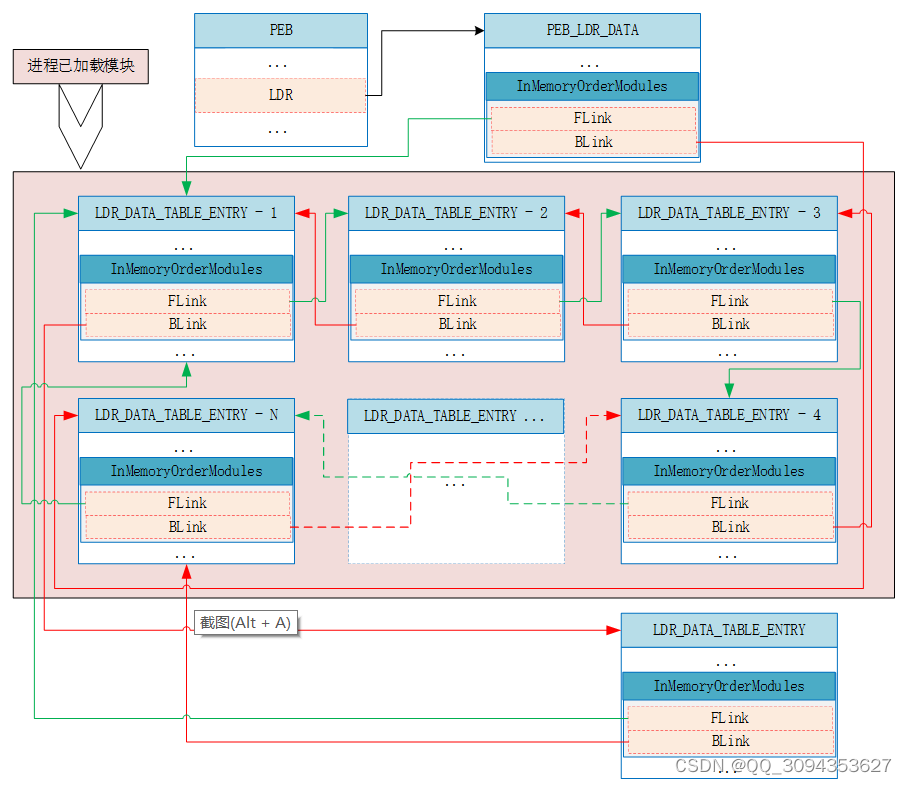
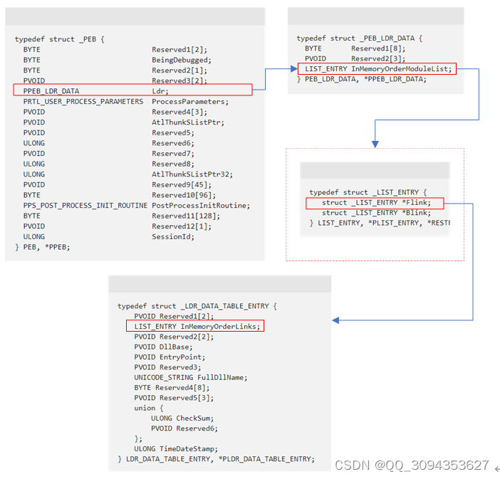

## 数据结构

### PEB

#### 官方定义

[定义](https://learn.microsoft.com/en-us/windows/win32/api/winternl/ns-winternl-peb)

```c
typedef struct _PEB {
  BYTE                          Reserved1[2];
  BYTE                          BeingDebugged;
  BYTE                          Reserved2[1];
  PVOID                         Reserved3[2];
  PPEB_LDR_DATA                 Ldr;
  PRTL_USER_PROCESS_PARAMETERS  ProcessParameters;
  PVOID                         Reserved4[3];
  PVOID                         AtlThunkSListPtr;
  PVOID                         Reserved5;
  ULONG                         Reserved6;
  PVOID                         Reserved7;
  ULONG                         Reserved8;
  ULONG                         AtlThunkSListPtr32;
  PVOID                         Reserved9[45];
  BYTE                          Reserved10[96];
  PPS_POST_PROCESS_INIT_ROUTINE PostProcessInitRoutine;
  BYTE                          Reserved11[128];
  PVOID                         Reserved12[1];
  ULONG                         SessionId;
} PEB, *PPEB;
```

#### pdb定义

其中Reserved字段在不同操作系统中可能有不同的定义。在我的测试环境（win11 22621.2283）定义如下（这里通过官方提供的pdb文件获取定义）：

```
Reserved1  2B
   +0x000 InheritedAddressSpace : UChar
   +0x001 ReadImageFileExecOptions : UChar

BeingDebugged  1B
   +0x002 BeingDebugged    : UChar

Reserved2  5B
   +0x003 BitField         : UChar
   +0x003 ImageUsesLargePages : Pos 0, 1 Bit
   +0x003 IsProtectedProcess : Pos 1, 1 Bit
   +0x003 IsImageDynamicallyRelocated : Pos 2, 1 Bit
   +0x003 SkipPatchingUser32Forwarders : Pos 3, 1 Bit
   +0x003 IsPackagedProcess : Pos 4, 1 Bit
   +0x003 IsAppContainer   : Pos 5, 1 Bit
   +0x003 IsProtectedProcessLight : Pos 6, 1 Bit
   +0x003 IsLongPathAwareProcess : Pos 7, 1 Bit
   +0x004 Padding0         : [4] UChar

Reserved3  16B
   +0x008 Mutant           : Ptr64 Void
   +0x010 ImageBaseAddress : Ptr64 Void

Ldr  8B
   +0x018 Ldr              : Ptr64 _PEB_LDR_DATA

ProcessParameters  8B
   +0x020 ProcessParameters : Ptr64 _RTL_USER_PROCESS_PARAMETERS

Reserved4  24B
   +0x028 SubSystemData    : Ptr64 Void
   +0x030 ProcessHeap      : Ptr64 Void
   +0x038 FastPebLock      : Ptr64 _RTL_CRITICAL_SECTION

AtlThunkSListPtr  8B
   +0x040 AtlThunkSListPtr : Ptr64 _SLIST_HEADER

Reserved5  8B
   +0x048 IFEOKey          : Ptr64 Void

Reserved6  8B (4B padding)
   +0x050 CrossProcessFlags : Uint4B
   +0x050 ProcessInJob     : Pos 0, 1 Bit
   +0x050 ProcessInitializing : Pos 1, 1 Bit
   +0x050 ProcessUsingVEH  : Pos 2, 1 Bit
   +0x050 ProcessUsingVCH  : Pos 3, 1 Bit
   +0x050 ProcessUsingFTH  : Pos 4, 1 Bit
   +0x050 ProcessPreviouslyThrottled : Pos 5, 1 Bit
   +0x050 ProcessCurrentlyThrottled : Pos 6, 1 Bit
   +0x050 ProcessImagesHotPatched : Pos 7, 1 Bit
   +0x050 ReservedBits0    : Pos 8, 24 Bits
   +0x054 Padding1         : [4] UChar

Reserved7  8B
   +0x058 KernelCallbackTable : Ptr64 Void
   +0x058 UserSharedInfoPtr : Ptr64 Void

Reserved8  4B
   +0x060 SystemReserved   : Uint4B

AtlThunkSListPtr32  4B
   +0x064 AtlThunkSListPtr32 : Uint4B

Reserved9 Reserved10  456B
   +0x068 ApiSetMap        : Ptr64 Void
   +0x070 TlsExpansionCounter : Uint4B
   +0x074 Padding2         : [4] UChar
   +0x078 TlsBitmap        : Ptr64 _RTL_BITMAP
   +0x080 TlsBitmapBits    : [2] Uint4B
   +0x088 ReadOnlySharedMemoryBase : Ptr64 Void
   +0x090 SharedData       : Ptr64 Void
   +0x098 ReadOnlyStaticServerData : Ptr64 Ptr64 Void
   +0x0a0 AnsiCodePageData : Ptr64 Void
   +0x0a8 OemCodePageData  : Ptr64 Void
   +0x0b0 UnicodeCaseTableData : Ptr64 Void
   +0x0b8 NumberOfProcessors : Uint4B
   +0x0bc NtGlobalFlag     : Uint4B
   +0x0c0 CriticalSectionTimeout : _LARGE_INTEGER
   +0x0c8 HeapSegmentReserve : Uint8B
   +0x0d0 HeapSegmentCommit : Uint8B
   +0x0d8 HeapDeCommitTotalFreeThreshold : Uint8B
   +0x0e0 HeapDeCommitFreeBlockThreshold : Uint8B
   +0x0e8 NumberOfHeaps    : Uint4B
   +0x0ec MaximumNumberOfHeaps : Uint4B
   +0x0f0 ProcessHeaps     : Ptr64 Ptr64 Void
   +0x0f8 GdiSharedHandleTable : Ptr64 Void
   +0x100 ProcessStarterHelper : Ptr64 Void
   +0x108 GdiDCAttributeList : Uint4B
   +0x10c Padding3         : [4] UChar
   +0x110 LoaderLock       : Ptr64 _RTL_CRITICAL_SECTION
   +0x118 OSMajorVersion   : Uint4B
   +0x11c OSMinorVersion   : Uint4B
   +0x120 OSBuildNumber    : Uint2B
   +0x122 OSCSDVersion     : Uint2B
   +0x124 OSPlatformId     : Uint4B
   +0x128 ImageSubsystem   : Uint4B
   +0x12c ImageSubsystemMajorVersion : Uint4B
   +0x130 ImageSubsystemMinorVersion : Uint4B
   +0x134 Padding4         : [4] UChar
   +0x138 ActiveProcessAffinityMask : Uint8B
   +0x140 GdiHandleBuffer  : [60] Uint4B

PostProcessInitRoutine  8B
   +0x230 PostProcessInitRoutine : Ptr64     void 

Reserved11 Reserved12  134B (4B padding)
   +0x238 TlsExpansionBitmap : Ptr64 _RTL_BITMAP
   +0x240 TlsExpansionBitmapBits : [32] Uint4B

SessionId  4B
   +0x2c0 SessionId        : Uint4B

Other Things Undoc
   +0x2c4 Padding5         : [4] UChar
   +0x2c8 AppCompatFlags   : _ULARGE_INTEGER
   +0x2d0 AppCompatFlagsUser : _ULARGE_INTEGER
   +0x2d8 pShimData        : Ptr64 Void
   +0x2e0 AppCompatInfo    : Ptr64 Void
   +0x2e8 CSDVersion       : _UNICODE_STRING
   +0x2f8 ActivationContextData : Ptr64 _ACTIVATION_CONTEXT_DATA
   +0x300 ProcessAssemblyStorageMap : Ptr64 _ASSEMBLY_STORAGE_MAP
   +0x308 SystemDefaultActivationContextData : Ptr64 _ACTIVATION_CONTEXT_DATA
   +0x310 SystemAssemblyStorageMap : Ptr64 _ASSEMBLY_STORAGE_MAP
   +0x318 MinimumStackCommit : Uint8B
   +0x320 SparePointers    : [2] Ptr64 Void
   +0x330 PatchLoaderData  : Ptr64 Void
   +0x338 ChpeV2ProcessInfo : Ptr64 _CHPEV2_PROCESS_INFO
   +0x340 AppModelFeatureState : Uint4B
   +0x344 SpareUlongs      : [2] Uint4B
   +0x34c ActiveCodePage   : Uint2B
   +0x34e OemCodePage      : Uint2B
   +0x350 UseCaseMapping   : Uint2B
   +0x352 UnusedNlsField   : Uint2B
   +0x358 WerRegistrationData : Ptr64 Void
   +0x360 WerShipAssertPtr : Ptr64 Void
   +0x368 EcCodeBitMap     : Ptr64 Void
   +0x370 pImageHeaderHash : Ptr64 Void
   +0x378 TracingFlags     : Uint4B
   +0x378 HeapTracingEnabled : Pos 0, 1 Bit
   +0x378 CritSecTracingEnabled : Pos 1, 1 Bit
   +0x378 LibLoaderTracingEnabled : Pos 2, 1 Bit
   +0x378 SpareTracingBits : Pos 3, 29 Bits
   +0x37c Padding6         : [4] UChar
   +0x380 CsrServerReadOnlySharedMemoryBase : Uint8B
   +0x388 TppWorkerpListLock : Uint8B
   +0x390 TppWorkerpList   : _LIST_ENTRY
   +0x3a0 WaitOnAddressHashTable : [128] Ptr64 Void
   +0x7a0 TelemetryCoverageHeader : Ptr64 Void
   +0x7a8 CloudFileFlags   : Uint4B
   +0x7ac CloudFileDiagFlags : Uint4B
   +0x7b0 PlaceholderCompatibilityMode : Char
   +0x7b1 PlaceholderCompatibilityModeReserved : [7] Char
   +0x7b8 LeapSecondData   : Ptr64 _LEAP_SECOND_DATA
   +0x7c0 LeapSecondFlags  : Uint4B
   +0x7c0 SixtySecondEnabled : Pos 0, 1 Bit
   +0x7c0 Reserved         : Pos 1, 31 Bits
   +0x7c4 NtGlobalFlag2    : Uint4B
   +0x7c8 ExtendedFeatureDisableMask : Uint8B
```

### PEB_LDR_DATA

在PEB.Ldr中，记录了进程加载的模块

#### 官方定义

[定义](https://learn.microsoft.com/en-us/windows/win32/api/winternl/ns-winternl-peb_ldr_data)

```c
typedef struct _PEB_LDR_DATA {
  BYTE       Reserved1[8];
  PVOID      Reserved2[3];
  LIST_ENTRY InMemoryOrderModuleList;
} PEB_LDR_DATA, *PPEB_LDR_DATA;
```

#### pdb定义

```
Reserved1  8B
   +0x000 Length           : Uint4B
   +0x004 Initialized      : UChar
 
Reserved2  24B
   +0x008 SsHandle         : Ptr64 Void
   +0x010 InLoadOrderModuleList : _LIST_ENTRY
   +0x020 InMemoryOrderModuleList : _LIST_ENTRY

InMemoryOrderModuleList  16B
   +0x030 InInitializationOrderModuleList : _LIST_ENTRY

Other Things Undoc
   +0x040 EntryInProgress  : Ptr64 Void
   +0x048 ShutdownInProgress : UChar
   +0x050 ShutdownThreadId : Ptr64 Void
```

### LDR_DATA_TABLE_ENTRY

记录具体加载的模块内容

#### 官方定义

[定义](https://learn.microsoft.com/en-us/windows/win32/api/winternl/ns-winternl-peb_ldr_data)

```c
typedef struct _LDR_DATA_TABLE_ENTRY {
    PVOID Reserved1[2];
    LIST_ENTRY InMemoryOrderLinks;
    PVOID Reserved2[2];
    PVOID DllBase;
    PVOID EntryPoint;
    PVOID Reserved3;
    UNICODE_STRING FullDllName;
    BYTE Reserved4[8];
    PVOID Reserved5[3];
    union {
        ULONG CheckSum;
        PVOID Reserved6;
    };
    ULONG TimeDateStamp;
} LDR_DATA_TABLE_ENTRY, *PLDR_DATA_TABLE_ENTRY;
```

#### pdb定义

```
Reversed1  16B
   +0x000 InLoadOrderLinks : _LIST_ENTRY

InMemoryOrderLinks  16B
   +0x010 InMemoryOrderLinks : _LIST_ENTRY

Reversed2  16B
   +0x020 InInitializationOrderLinks : _LIST_ENTRY

DllBase  8B
   +0x030 DllBase          : Ptr64 Void

EntryPoint  8B
   +0x038 EntryPoint       : Ptr64 Void

Reversed3  8B
   +0x040 SizeOfImage      : Uint4B

FullDllName  16B
   +0x048 FullDllName      : _UNICODE_STRING

Reversed3 Reversed4  32B
   +0x058 BaseDllName      : _UNICODE_STRING
   +0x068 FlagGroup        : [4] UChar
   +0x068 Flags            : Uint4B
   +0x068 PackagedBinary   : Pos 0, 1 Bit
   +0x068 MarkedForRemoval : Pos 1, 1 Bit
   +0x068 ImageDll         : Pos 2, 1 Bit
   +0x068 LoadNotificationsSent : Pos 3, 1 Bit
   +0x068 TelemetryEntryProcessed : Pos 4, 1 Bit
   +0x068 ProcessStaticImport : Pos 5, 1 Bit
   +0x068 InLegacyLists    : Pos 6, 1 Bit
   +0x068 InIndexes        : Pos 7, 1 Bit
   +0x068 ShimDll          : Pos 8, 1 Bit
   +0x068 InExceptionTable : Pos 9, 1 Bit
   +0x068 ReservedFlags1   : Pos 10, 2 Bits
   +0x068 LoadInProgress   : Pos 12, 1 Bit
   +0x068 LoadConfigProcessed : Pos 13, 1 Bit
   +0x068 EntryProcessed   : Pos 14, 1 Bit
   +0x068 ProtectDelayLoad : Pos 15, 1 Bit
   +0x068 ReservedFlags3   : Pos 16, 2 Bits
   +0x068 DontCallForThreads : Pos 18, 1 Bit
   +0x068 ProcessAttachCalled : Pos 19, 1 Bit
   +0x068 ProcessAttachFailed : Pos 20, 1 Bit
   +0x068 CorDeferredValidate : Pos 21, 1 Bit
   +0x068 CorImage         : Pos 22, 1 Bit
   +0x068 DontRelocate     : Pos 23, 1 Bit
   +0x068 CorILOnly        : Pos 24, 1 Bit
   +0x068 ChpeImage        : Pos 25, 1 Bit
   +0x068 ChpeEmulatorImage : Pos 26, 1 Bit
   +0x068 ReservedFlags5   : Pos 27, 1 Bit
   +0x068 Redirected       : Pos 28, 1 Bit
   +0x068 ReservedFlags6   : Pos 29, 2 Bits
   +0x068 CompatDatabaseProcessed : Pos 31, 1 Bit
   +0x06c ObsoleteLoadCount : Uint2B
   +0x06e TlsIndex         : Uint2B
   +0x070 HashLinks        : _LIST_ENTRY

TimeDateStamp  4B
   +0x080 TimeDateStamp    : Uint4B

Other Things Undoc
   +0x088 EntryPointActivationContext : Ptr64 _ACTIVATION_CONTEXT
   +0x090 Lock             : Ptr64 Void
   +0x098 DdagNode         : Ptr64 _LDR_DDAG_NODE
   +0x0a0 NodeModuleLink   : _LIST_ENTRY
   +0x0b0 LoadContext      : Ptr64 _LDRP_LOAD_CONTEXT
   +0x0b8 ParentDllBase    : Ptr64 Void
   +0x0c0 SwitchBackContext : Ptr64 Void
   +0x0c8 BaseAddressIndexNode : _RTL_BALANCED_NODE
   +0x0e0 MappingInfoIndexNode : _RTL_BALANCED_NODE
   +0x0f8 OriginalBase     : Uint8B
   +0x100 LoadTime         : _LARGE_INTEGER
   +0x108 BaseNameHashValue : Uint4B
   +0x10c LoadReason       : _LDR_DLL_LOAD_REASON
   +0x110 ImplicitPathOptions : Uint4B
   +0x114 ReferenceCount   : Uint4B
   +0x118 DependentLoadFlags : Uint4B
   +0x11c SigningLevel     : UChar
   +0x120 CheckSum         : Uint4B
   +0x128 ActivePatchImageBase : Ptr64 Void
   +0x130 HotPatchState    : _LDR_HOT_PATCH_STATE
```

## 其他数据结构

### UNICODE_STRING

[定义](https://learn.microsoft.com/en-us/windows/win32/api/ntdef/ns-ntdef-_unicode_string)

```c
typedef struct _UNICODE_STRING {
  USHORT Length;
  USHORT MaximumLength;
  PWSTR  Buffer;
} UNICODE_STRING, *PUNICODE_STRING;
```

### LIST_ENTRY

链表结构

```c
typedef struct _LIST_ENTRY {
  struct _LIST_ENTRY *Flink;
  struct _LIST_ENTRY *Blink;
} LIST_ENTRY, *PLIST_ENTRY, PRLIST_ENTRY;
```

## 数据结构的组织形式

## 进程加载的模块

每个描述进程加载模块的结构都通过[LDR_DATA_TABLE_ENTRY](#LDR_DATA_TABLE_ENTRY)结构中的InMemoryOrderModules成员构成双向链表





## 参考资料

### 数据结构

https://blog.csdn.net/QQ_3094353627/article/details/124616462  枚举Windows进程中模块的几种方法-PEB内核结构详解
