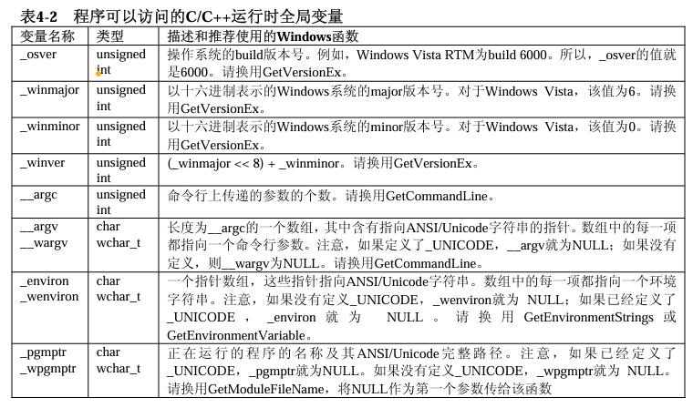

# Windows via C&C++

## 第一章 对程序错误的处理

错误码存储在TLS中，使得线程可以维护自己的错误状态

相关API

```c
DWORD GetLastError();    // 获取线程的最后一个错误
DWORD FormatMessage(     // 将错误代码转为文本错误
    DWORD dwFlags, 
    LPCVOID pSource, 
    DWORD dwMessageId, 
    DWORD dwLanguageId, 
    PTSTR pszBuffer, 
    DWORD nSize, 
    va_list *Arguments);
VOID SetLastError(DWORD dwErrCode);    // 设置最后一个错误
```


## 第二章 字符串和字符串处理

### 字符集

* 单字节字符集  ASCII

* 双字节字符集  DBCS -> ANSI字符串

* 宽字节字符集  Unicode

win98只支持ANSI，到win2k使用unicode重构，但也保持对ANSI的支持，wince则是只支持unicode

### C runtime对unicode的支持

windows原生使用的unicode编码方式为utf16

```c
typedef unsigned short wchar_t;
```

unicode函数

```c
wchar_t* wcscat(wchar_t*, const wchar_t*);
wchar_t* wcschr(const wchar_t*, wchar_t);
int wcscmp(const wchar_t*, const wchar_t*);
wchar_t* wcscpy(wchar_t*, const wchar_t*);
size_t wcslen(const wchar_t*);
```

windows.h中定义了下列几种类型来描述unicode

* WCHAR

* PWSTR  指向宽字符串的指针

* PCWSTR  指向const宽字符串的指针

### ANSI版本与UNICODE版本

在windows中，使用TCHAR TEXT PTSTR等宏来统一字符串的使用，使得程序既可以在ANSI模式下编译也可以在unicode模式下编译

```c
#ifdef UNICODE
typedef WCHAR TCHAR, *PTCHAR,PTSTR;
typedef CONST WCHAR *PCTSTR;
#define __TEXT(quote) quote;
#define __TEXT(quote) L##quote;

#else

typedef CHAR TCHAR, *PTCHAR,PTSTR;
typedef CONST CHAR *PCTSTR;
#define __TEXT(quote) quote

#endif

#define TEXT(quote) __TEXT(quote)
```

对于WINAPI提供A和W两个版本，A接收ANSI字串，W接收Unicode字串，如CreateWindoEx有CreateWindowExA和CreateWindowExW

```C
#ifdef UNICODE
#define CreateWindowEx CreateWindowExW
#else
#define CreateWindowEx CreateWindowExA
#endif
```

**ANSI版本的函数会在函数调用中转为UNICODE**

### windows的字符串函数

#### 普通字符串函数

##### 常用函数

windows自己提供了许多用于操作ANSI字符串和unicode字符串的函数

* StrCat StrChr StrCmp，主要是之前处理ANSI字符串的函数，但现在可以通过A和W指定ANSI或unicode，如StrCatA StrCatW

* lstrcat lstrcmp lstrcpy，主要是处理unicode字符串的函数，但同样可以通过A和W转换

* CharLower CharUpper  用于unicode转换大小写（C语言库没有很好地支持这个功能）

* IsCharAlpha IsCharAlphaNumber等，用于判断unicode字符类型

* wsprintf和sprintf等可以使用%s或%S来指定ANSI字符串或unicode字符串

##### 判断是否为Unicode

```c
BOOL IsTextUnicode(CONST PVOID pvBuffer, int cb, PINT pResult);
```

判断编码类型，但这个函数通过统计学方法判断，可能输出错误结果

##### CompareString

###### CompareString

```
int CompareString(
    LCID locale;
    DWORD dwCmdFlags.
    PCTSTR pString1,
    int cch1,
    PCTSTR pString2,
    int cch2);
```

LCID根据区域比较字符集

dwCmdFlags可以设置一系列语言相关的比较属性

###### CompareStringOrdinal

不考虑字符集的比较

**注意，Windows字符串比较函数返回与C标准不同，0表示失败，1小于，2等于，3大于**

#### 安全的字符串函数

##### 区别

```
PTSTR _tcscpy(PTSTR strDestination, PCTSTR strSource);
error_no _tcscpy_s(PTSTR strDestination, size_t numberOfcharacters, PCTSTR strSource);

PTSTR _tcscat(PTSTR strDestination, PCTSTR strSource);
error_no _tcscat_s(PTSTR strDestination, size_t numberOfcharacters, PCTSTR strSource);
```

s版本函数指示缓冲区大小，可以通过使用 **_countof** 宏指定

s版本函数当发生错误时指定**errno**，并在退出程序时指定退出代码。

##### 参数的错误处理

###### 处理函数

```
void InvaildParameterHandler(PCTSTR expression, PCTSTR function, PCTSTR file, unsigned int line, uintptr_t /*pReserved*/);
```

* expression:错误信息

* function file line  源码的位置

若没有定义**DEBUG**则不会这几个参数都是NULL

###### 注册处理函数

```
_set_invaild_parameter_handler
```

###### 禁止弹出Debug Assertion Failed对话框

```
_CrtSetReportMode(_CRT_ASSERT, 0);
```

##### 扩展的字符串函数(Strsafe.h)

```
HRESULT StringCchCat(PTSTR pszDest, size_t cchDest, PCTSTR pszSrc);
HRESULT StringCchCatEx(PTSTR pszDest, size_t cchDest, PCTSTR pszSrc, PTSTR *ppszDestEnd, size_t *pcchRemaining, DWORD dwFlags);
```

类似函数还有 StringCchCopy StringCchCopyEx，StringCchPrinf StringCchPrintfEx等

其中Cch表示Count of charaters，通常用 **_countof** 获取（cchDest参数）

此外还有一组Cb的函数，用**sizeof**获取缓冲区大小（cbDest参数）

* pcchRemaining  指向一个变量，用于返回缓冲区内还有多少字符未用

* ppszDestEnd  指向缓冲区中字符串的末尾

* dwFlags  提供多种处理剩余缓冲区的方法，是下面几个选项的组合
  
  * STRSAFE_FILL_BEGIND_NULL  若函数成功 dwFlags低字节用于填充剩余的缓冲区（'\0'后的部分）
  * STRSAFE_IGNORE_NULLS  把值为NULL的字符串指针视为TEXT("")
  * STRSAFE_FILL_ON_FAILURE  若函数失败则用dwFlags低位填充缓冲区，但最后一字节是'\0'
  * STRSAFE_NULL_ON_FAILURE  若失败则把缓冲区第一字节改为'\0'
  * STRSAFE_NO_TRUNCATION  与上述一样
  
  一些细节看MSDN

### ANSI和Unicode互相转换

主要使用WideCharToMultiByte和MultiByteToWideChar函数，下面摘了一个例子，分别写了Unicode版本和ANSI版本（该版本先将字符串转为Unicode后处理），用于反转字符串，UNICODE版本如下，实现具体功能

```c
BOOL StringReverseW(PWSTR pWideCharStr, DWORD cchLength)
{
    PWSTR pEndOfStr = pWideCharStr + wcsnlen_s(pWideCharStr, cchLength) - 1;
    wchar_t cCharT;

    while (pWideCharStr < pEndOfStr)
    {
        cCharT = *pEndOfStr;
        *pEndOfStr = *pWideCharStr;
        *pWideCharStr = cCharT;
        pEndOfStr--;
        pWideCharStr++;
    }
    return(TRUE);
}
```

ANSI版本先转换ANSi字符串为unicode字符串，后调用unicode版本处理，再将unicode返回转回ANSI

```c
BOOL StringReverseA(PSTR pMultiByteStr, DWORD cchLength)
{
    PWSTR pWideCharStr;
    int nLenOfWideCharStr;
    BOOL fOk = FALSE;

    nLenOfWideCharStr = MultiByteToWideChar(CP_ACP, 0, pMultiByteStr, cchLength, NULL, 0);
    //Set cchWideChar to 0 to get length of multibyte string
    pWideCharStr = (PWSTR)HeapAlloc(GetProcessHeap(),
        0, nLenOfWideCharStr * sizeof(wchar_t));
    if (pWideCharStr == NULL)
        return(fOk);

    MultiByteToWideChar(CP_ACP, 0, pMultiByteStr, cchLength,
        pWideCharStr, nLenOfWideCharStr);
    fOk = StringReverseW(pWideCharStr, cchLength);

    if (fOk)
    {
        WideCharToMultiByte(CP_ACP, 0, pWideCharStr, -1,
            pMultiByteStr, (int)strlen(pMultiByteStr), NULL, NULL);
    }
    HeapFree(GetProcessHeap(), 0, pWideCharStr);

    return(fOk);
}
```

### 编程规范

* 使用通用字符串类型**TCHAR/PTSTR**

* 使用通用字节类型**BYTE/PBYTE**

* 字符（串）常量**TEXT/_T**

* 使用 **_countof(szBuffer)** 而不是sizeof(szBuffer)，特别是分配内存时
  
  ```
  #define chmalloc(nCharacters) (TCHAR*)malloc(nCharacters*sizeof(TCHAR))
  ```

* ANSI与UNICODE转换 **WideCharToMultiByte/MultiByteToWideChar**

* 指定**UNICODE**同时指定 **_UNICODE**

* **/GS** 检测缓冲区溢出

* 不用kernel32.dll的函数进行字符串处理，如lstrcat/lstrcpy

##### Unicode与ANSI转换需要注意

```
int WideCharToMultiByte(
    UINT uCodePage,
    DWORD dwFlags,
    PCWSTR pWideCharStr,
    int cchWideCHar,
    PSTR pMultiByteStr,
    int cbMultiByte,
    PCSTR pDefaultChar,
    PBOOL pfUsedDefaultChar
);
```

当遇到代码页无法转换的字符时，使用**pDefaultChar**，当这个参数为NULL时，默认一般为'?'，这在文件路径中是一个通配符，**可能导致安全问题**

若有字符不能转换会置位**pfUsedDefaultChar**

## 第三章 内核对象

概念：访问令牌、事件、文件、文件映射、IO、作业、邮件槽、互斥量、管道、进程、线程、信号量、计时器、线程池等对象都属于内核对象

内核对象由句柄（handle）进行标识，且一个句柄只能标识属于某个进程的内核对象，跨进程的内核对象共享需要使用特殊方法

### 基本概念

#### 引用计数

操作系统通过引用计数的方式管理和释放内核对象，以防止当内核对象被进程共享时其被错误释放

#### 内核对象安全性

内核对象可以由安全描述符保护，安全描述符定义了对象创建者，允许访问的拒绝访问的组/用户。

##### 结构

```
typedef struct _SECURITY_ATTRIBUTES{
    DWORD nLength;
    LPVOID lpSecurityDescriptor;    //此成员定义了安全描述符
    BOOL bInheritHandle;            //此成员表示是否允许对象继承
} SECURITY_ATTRIBUTES;
```

当传入API的结构为NULL时，表示其带有默认安全性，即对象的管理组和对象创建者拥有对该对象的控制权，而其他所有人无权访问该对象

##### 定义与初始化

```
SECURITY_ATTRIBUTE sa;
sa.nLength = sizeof(sa);
sa.lpSecurityDescriptor = pSD;    //为NULL时表示默认安全性
sa.bInheritHandle = FLASE;

HANDLE hFileMapping = CreateFileMapping(INVAILD_HANDLE_VALUE, &sa, 
                                PAGE_READWRITE, 0, 1024, TEXT("MyFileMapping"));
```

此时如果调用OpenFileMapping，在返回有效句柄值前将检查当前用户允不允许访问，返回NULL句柄，使用GetLastError将得到ERROR_ACCRSS_DENIED。

资料：[GDI和用户对象](<https://blogs.msdn.microsoft.com/dsui_team/2013/04/23/debugging-a-gdi-resource-leak/>)

### 进程内核对象句柄表

每个进程都对应一个内核对象句柄表，其只用于内核对象，不用于GDI对象或用户对象

#### 结构


* 指向内核对象内存块的指针
* 访问掩码
* 标志

#### 创建

调用创建内核对象的函数时，

* 为对象分配并初始化一个内存块
* 扫描内核对象句柄表，找到一个空表项
* 表项的指针指向内核对象内存块，掩码为**拥有完全访问权限**

函数一般返回一个句柄，句柄可供进程中的所有线程使用。

目前来说，创建内核对象返回句柄值是**进程内核对象句柄表的索引**（实际上是索引*4，因为考虑表项长度）

因此句柄是不可以在不同进程中使用的。

一般来说，**调用失败**返回的句柄为**NULL**,但也有例外，如返回-1（**INVALID_HANDLE_VALUE**）

很多WinAPI可以创建一个内核对象，如CreateTread CreateFile CreateFileMapping CreateSemaphore CreateMutex

#### 关闭

```
BOOL CloseHandle(HANDLE hobject);
```

* 检查主调进程的句柄表

* 验证传入的句柄值对应表项有无权访问

* 若有效则系统获取内核对象数据结构地址，递减引用计数，且当计数为0时销毁。

* 清除进程句柄表中对应表项（无论内核对象是否被销毁都会执行这步，这说明若内核对象没被销毁则其被其他进程使用）

**注意**：CloseHandle后应将参数的值置为NULL，以防止程序调用以释放的内核对象句柄。特别当该句柄对应表项填充了一个新的相同内核对象，此时bug将难以查找，并将导致程序损坏。

### 跨进程共享内核对象

目的：进程间通信及数据共享

#### 使用对象句柄继承

当两进程为**父子进程**，可以通过0该方法使子进程共享父进程内核对象

##### 方法

###### 创建可继承对象

在创建要继承的内核对象时必须创建SECURITY_ATTRIBUTES结构并指定其继承属性为True

```c
SECURITY_ATTRIBUTES sa;
sa.nLength = sizeof(sa);
sa.lpSecurityDescriptor = NULL
sa.bInheritHandle = TRUE;            // 指定继承对象为TRUE
HANDLE hMutex = CreateMutex(&sa, FALSE, NULL);    // 创建Mutex对象
```

###### 创建子进程并设置继承标志位

```
BOOL CreateProcessA(
  LPCSTR                lpApplicationName,
  LPSTR                 lpCommandLine,
  LPSECURITY_ATTRIBUTES lpProcessAttributes,
  LPSECURITY_ATTRIBUTES lpThreadAttributes,
  BOOL                  bInheritHandles,
  DWORD                 dwCreationFlags,
  LPVOID                lpEnvironment,
  LPCSTR                lpCurrentDirectory,
  LPSTARTUPINFOA        lpStartupInfo,
  LPPROCESS_INFORMATION lpProcessInformation
);
```

* 在create内核对象时指定**SECURITY_ATTRIBUTE**结构并将其**bInheritHandle**成员设为True

* CreateProcess时将**bInheritHandle**设为True

当CreateProcess时系统除了创建进程外将做如下操作

* 遍历内核对象句柄表

* 若对应表项是**可继承**的，则将其**复制**到子进程内核对象表的**索引相同的表项**

* 内核对象**引用计数+1**

复制完后，父进程应将可用的句柄传给子进程，可以使用 *命令行参数 进程间通信 添加环境变量* 等方式传递

[关于环境变量传递](<https://support.microsoft.com/zh-cn/help/190351/how-to-spawn-console-processes-with-redirected-standard-handles>)

##### 注意

* 内核对象被保存在内核地址空间中，对于32位系统为0x80000000到0xFFFFFFFF，64位为0x00000400 00000000到0xFFFFFFFF FFFFFFFF
* 若子进程同样适用CreateProcess创建孙进程，其同样可以继承父进程内核对象
* 在创建子进程后**父进程创建新的内核对象不会被同步到子进程**
* 子进程无法获取从父进程继承了哪些内核对象，因此需要由父进程传参（共享对象的句柄在父进程和子进程中是相同的）

#### 改变句柄标志

使用情形：父进程创建了内核对象，得到一个可继承的句柄，并创建两个子进程，但只希望其中一个继承内核对象

##### 函数

```C
BOOL SetHandleInformation(
    HANDLE hObject,
    DWORD dwMask;
    DWORD dwFlags
);
```

* dwMask  想改变的标志
* dwFlags   标志的新值

```C
BOOL GetHandleInformation(
    HANDLE hObject,
    PDWORD pdwFlags
)
```

##### 方法

每个句柄默认都关联了两个标志

**HANDLE_FLAG_INHERIT**  是否可继承

**HANDLE_FLAG_PROTECT_FROM_CLOSE**  是否有句柄关闭保护

```C
SetHandleInformation(hObj,HANDLE_FLAG_INHERIT,HANDLE_FLAG_INHERIT); //开启对象继承
SetHandleInformation(hObj,HANDLE_FLAG_INHERIT,0);    //关闭对象继承

SetHandleInformation(hObj,HANDLE_FLAG_PROTECT_FROM_CLOSE,
                     HANDLE_FLAG_PROTECT_FROM_CLOSE)    //开启句柄关闭保护
                                                    //此时若CloseHandle(hObj)将引发异常
```

第二个方法一般用于防止子进程创建孙进程前CloseHandle，使孙进程获取一个无效的内核对象

但若子进程存在以下代码，孙进程内核对象依然可能无效

```C
SetHandleInformation(hObj,HANDLE_FLAG_PROTECT_FROM_CLOSE,0);
CloseHandle(hObj);
```

#### 为对象命名

可以通过命名内核对象实现内核对象跨进程共享，但**只有Create函数有pszName选项**的内核对象可以命名，若该参数为**NULL**则创建一个**匿名内核对象** （CreateMutex CreateEvent CreateSemaphore CreateWaitableTimer CreateFileMapping CreateJobObject）

**注意：系统中所有内核对象共享一个命名空间，且无法保证当前要命名的对象名称与已有对象不冲突**，若系统存在同名对象且类型不同，Create函数将失败并设置Errcode为ERROR_INVALID_HANDLE

##### 方法1：Create*函数

假设在ProcessA执行

```C
HANDLE hMutexProcessA = CreateMutex(NULL,FALSE,TEXT("MutexA"));
```

然后在ProcessB执行

```C
HANDLE hMutexProcessB = CreateMutex(NULL,FALSE,TEXT("MutexA"));
```

系统会执行下列检查

* 检查命名空间是否存在MutexA

* 存在，检查内核对象类型是否一致

* 类型都为Mutex，检查ProcessB是否有对MutexA的完全访问权限

* 有则在B的句柄表中寻找一个空白表项并填入，否则返回NULL

关于内核对象的权限详见[文档](<https://docs.microsoft.com/zh-cn/windows/desktop/Sync/synchronization-object-security-and-access-rights>)，一般需要使用Create\*Ex函数创建，并指定**dwDesiredAccess**参数。**这种方法共享的内核对象可能出现进程A和进程B中句柄值不一样的情况**

**注意：调用Create\*函数后调用GetLastError()若返回ERROR_ALREADY_EXITSTS，则表明该对象已经存在**

##### 方法2：Open*函数

原型与Create\*类似

差别在于若对象不存在Create\*会创建，而Open\*不会

**GetLastError错误代码：**

* ERROR_FILE_NOT_FOUND  未找到
* ERROR_INVALID_HANDLE  类型或访问权限不同

#### 终端服务命名空间

对于运行终端服务的计算机，其有多个命名空间

* 全局命名空间  主要由服务使用
* 本地命名空间  每个用户端会话有自己的命名空间，以防会话之间的干扰

除服务器外，**远程桌面**和**快速用户切换特性**都由终端服务实现

**注意：无用户登录时，服务从session0启动，用户应用程序则在一个新的会话启动。而由于服务运行在与应用程序不同的会话上，因此要共享对象必须在全局命名空间中创建对象**

具体关于Session 0隔离问题可见[文档](http://www.firmlogix.com/whitepapers/Impact-of-Session0_Vista.doc)

##### 方法

获知当前会话的SessionID

```
DWORD processID = GetCurrentProcessId();
DWORD sessionID;
if(ProcessIdToSessionId(processID,&sessionID))
    tprintf("Process %u runs in Terminal Services session %u\n",processID,sessionID);
```

在终端服务器中，可以使用Global Local或Session显式创建全局命名对象或局部命名对象

```C
HANDLE h = CreateEvent(NULL,FALSE,FALSE,TEXT("Global\\Myname"));  //全局命名对象
                                                        //使用Global\\
HANDLE h = CreateEvent(NULL,FALSE,FALSE,TEXT("Local\\Myname"));      //局部命名对象
                                                        //使用Local\\
HANDLE h = CreateEvent(NULL,FALSE,FALSE,TEXT("SessionX\\Myname"));//局部命名对象
                                                        //若Session不是当前的sessionID
                                                        //则报错
```

#### 专有命名空间

虽然内核对象可以传递SECURITY_ATTRIBUTES结构指针，但在vista发布前没有机制防止共享对象名称被劫持，任何权限对象都可创建任意名字的内核对象，这会使程序误以为自身已经有实例在运行，从而导致**DoS攻击**。

为了保护名称免糟劫持，程序可以定义一个专有前缀作为专有命名空间。负责创建对象的服务器进程将定义边界描述符进行保护。

#### 复制对象句柄

该方法使用DuplicateHandle将句柄从一个进程拷贝到另一个进程

```c
BOOL DuplicateHandle(
    HANDLE hSourceProcessHandle,
    HANDLE hSourceHandle,
    HANDLE hTargetProcessHandle,
    PHANDLE phTargetHandle,
    DWORD dwDesiredAccess,
    BOOL bInheritHandle,
    DWORD dwOptions);
```

##### 方法

下面的例子演示了拥有内核对象S的进程A如何将内核对象拷贝给进程B

```c
HANDLE hObjS = CreateMutex(NULL, FALSE, NULL);    // 在进程中创建内核对象S
HANDLE hProcessB = OpenProcess(PROCESS_ALL_ACCESS, FALSE, dwProcessIdB);
                                                  // 获取进程B句柄
HANDLE hObjB;
DuplicateHandle(
    GetCurrentProcess(),        // 当前进程句柄
    hObjS,                      // 内核对象句柄
    hProcessB,                  // 进程B句柄
    &hObjB,                     // 用于保存内核对象拷贝到进程B后的信息
    0,                          // 下面设置拷贝后内核对象的属性
    FALSE,
    DUPLICATE_SAME_ACCESS);
```

之后进程A需要通过一些IPC方式将hObjB传给进程B，否则进程B将无法获知拷贝过来的内核对象句柄

该方法还可以用于为现有对象创建新句柄，从而对其赋予新的权限 属性等

```c
HANDLE hFileMapRW = CreateFileMapping(INVALID_HANDLE_VALUE, NULL, PAGE_READWRITE, 0, 10240, NULL);
HANDLE hFileMapRO;
DuplicateHandle(
    GetCurrentProcess(),
    hFileMapRW,
    GetCurrentProcess(),
    &hFileMapRO,
    FILE_MAP_READ,
    FALSE,
    0);                 // 复制hFileMapRW并赋予只读权限
```

## 第四章 进程

### 编写第一个Windows应用程序

#### 启动函数

不同应用程序类型与其对应的启动函数

| 应用程序类型             | 入口函数      | 启动函数               |
| ------------------ | --------- | ------------------ |
| 使用ANSI字符串的GUI程序    | _tWinMain | WinMainCRTStartup  |
| 使用Unicode字符串的GUI程序 | _tWinMain | wWinMainCRTStartup |
| 使用ANSI字符串的命令行程序    | _tmain    | mainCRTStartup     |
| 使用Unicode字符串的命令行程序 | _tmain    | wmainCRTStartup    |

启动函数的源码可以在VS的C运行库源码crtexe.c中找到，它们主要负责进行如下操作

* 获取指向新进程完整命令行的一个指针

* 获取指向新进程环境变量的一个指针

* 初始化C/C++运行库的全局变量

* 初始化C运行库内存分配函数和其他低级IO例程的堆

* 调用全局和静态C++类对象的构造函数



从入口函数返回后，启动函数将调用exit，其主要做下列操作

* 调用`_onexit`函数，其会遍历并调用所有注册的退出函数

* 调用所有全局和静态C++类对象的析构函数

* 若编译为DEBUG二进制文件，并设置了_CRTDBG_LEAK_CHECK_DF，则生成内存泄漏报告

* 调用ExitProcess退出进程

#### 进程实例句柄

用于标识进程的内核对象句柄，被定义为HINSTANCE类型（需要指出的是HMODULE与HINSTANCE实际上是一个东西，定义为两类是在16位windows时代遗留下来的问题）

进程实例句柄的值实际为进程可执行文件映像的基地址

* WinMain或wWinMain的第一个参数是该进程的HINSTANCE

* GetModuleHandle可以通过参数传入想获取的模块名，其返回模块的句柄；若传入NULL则返回当前的进程实例句柄

* GetModuleHandleEx使用GET_MODULE_HANDLE_EX_FLAG_FROM_ADDRESS作为第一个参数

#### 进程的前一个实例句柄

WinMain的hPrevInstance参数，但32位windows以后这个参数实际为NULL

#### 进程的命令行

* 获取完整命令行
  
  * WinMain的pszCmdLine参数
  
  * GetCommandLine

* 拆分命令行
  
  * `__argc __argv __wargv` 全局变量和tmain的argc argv
  
  * CommandLineToArgvW  注意，该函数会为解析出的参数分配内存，因此可能需要考虑手动释放内存

#### 进程的环境变量

* 获取
  
  * 采用GetEnvironmentStrings获取，FreeEnvironmentStrings释放，这种方法获取的是包含所有环境变量（包含\0截断）的缓冲区
  
  * tmain函数传入的envp参数，这种方法获取的是形同`A=B`的变量列表

* 判断是否存在
  
  * 可以使用`DWORD GetEnvironmentVariable(PCTSTR pszName, PTSTR pszValue, DWORD cchValue);` 其中ccValue设置为0并调用该函数时，函数会返回对应环境变量值的长度，一般的流程为：先以ccValue参数为0调用，若对应环境变量存在则会返回值的长度，之后使用该长度malloc缓冲区，之后再调用该函数获取实际环境变量值

* 环境变量的展开  环境变量中存在一些依赖别的环境变量的定义，如%USERPROFILE%
  
  * 可以使用`DWORD ExpandEnvironmentStrings(PTCSTR pszSrc, PTSTR pszDst, DWORD chSize);`对环境变量进行展开，调用方式同GetEnvironmentVariable

* 设置环境变量
  
  * 可以使用`BOOL SetEnvironmentVariable(PCTSTR pszName, PCTSTR pszValue);`

此外，对于默认的环境变量值，由下列两个注册表项定义

* `HKEY_LOCAL_MACHINE\SYSTEM\CurrentControlSet\Control\Session Manager\Environment`  全局环境变量

* `HKEY_CURRENT_USER\Environment`  用户环境变量

windows用户登录后，默认创建一个shell，该shell就采用上面两个表项作为环境变量，而后续所有其他进程实际上都是该shell进程的子进程，而环境变量就继承自该进程。因此理论上来说要使环境变量的改动对所有程序生效应重启，但一些应用程序处理了WM_SETTINGCHANGE消息，该消息通知应用程序相关设置被更新

#### 进程的错误模式

错误模式指定了进程在遇到一些错误时采用什么方式处理

`UINT SetErrorMode(UINT fuErrorMode)`


#### 进程当前目录

##### 获取当前目录

```c
DWORD GetCurrentDirectory(
    DWORD cchCurDir,
    PTSTR pszCurDir);
BOOL SetCurrentDiretory(PCTSTR pszCurDir);
```

**注意：Windows最大文件长度在WinDef.h中定义为MAX_PATH，值为260，因此对于路径的缓冲区可以使用该值约束**

##### 在环境变量中设置默认目录

可以通过环境变量指定进程在不同盘符中的运行目录，形如

```
=C:=C:\Utility\Bin
=D:=D:\Program Files
```

在进程被创建时，若定义了这类环境变量，则根据所在盘符选择对应的目录作为当前目录；若没有定义，则使用当前创建进程时的shell目录作为进程的当前目录。即，假设进程中使用CreateFile打开`D:Readme.txt`，则默认访问的是`D:\Program Files\Readme.txt`

##### 切换当前目录

一般使用C运行库的`_chdir`切换目录，比起SetCurrentDirectory，该函数额外还会通过SetEnvironmentVariable函数设置其环境变量

若父进程在创建子进程时指定了一个环境变量块，则子进程模块不会继承父进程的当前目录，则需要使用GetFullPathName获取其当前目录

#### 系统版本

```c
DWORD GetVersion();
        // 低字节为major版本号，高字节为minor版本号
BOOL GetVersionEx(POSVERSIONINFOEX pVersionInformation);
        // 返回一个OSVERSIONINFOEX结构，版本内容更丰富
BOOL VerifyVersionInfo(
    POSVERSIONINFOEX pVersionInformation,
    ULONG dwTypeBitMask,
    ULONG dwConditionMask);
        // 用于比较本机的版本和应用程序要求的版本
```

### CreateProcess函数

```c
BOOL CreateProcess(
    PCTSTR pszApplicationName,
    PTSTR pszCommandLine,
    PSECURITY_ATTRIBUTES psaProcess,
    PSECURITY_ATTRIBUTES psaThread,
    BOOL bInheritHandles,
    DWORD fdwCreate,
    PVOID pvEnvironment,
    PCTSTR pszCurDir,
    PSTARTUPINFO psiStartInfo,
    PPROCESS_INFORMATION ppiProcInfo);
```

* pszCommandLine  要执行的命令行，注意不是一个const字符串，因为函数中可能对该字串进行修改。默认解析第一个token为可执行文件名，若无后缀则自动扩展exe后缀，并依照下列顺序对可执行文件进行查找
  
  * 主调进程的exe所在目录
  
  * 主调进程当前目录
  
  * windows系统目录（即System32）
  
  * WIndows目录
  
  * PATH环境变量中的目录

* pszApplicationName 要执行的应用程序名，一般为NULL而采用pszCommandLine，但也可以两个都使用，此时应用程序的命令行会显示pszCommandLine指定的内容，且将其作为命令行参数传入

* psaProcess  用于指定进程内核对象的安全性，可被子进程继承

* psaThread  用于指定线程内核对象的安全性，可被子进程继承

* bInheritHandles  用于指定子进程是否可以继承父进程的内核对象

* fdwCreate  标识新进程的创建方式，且可以为进程定义优先级类（但不建议这样做）
  
  * DEBUG_PROCESS  父进程要调试子进程
  
  * DEBUG_ONLY_THIS_PROCESS  指定了此标志后，若被调试子进程又创建了子进程，则只会接收第一个子进程本身的消息
  
  * CREATE_SUSPENDED  创建好子进程后马上挂起，以便父进程对一些设置进行修改。修改好后可以调用ResumeThread通知子进程执行代码
  
  * DETACHED_PROCESS  若子进程是CUI应用，则不能访问父进程的控制台窗口，并通知系统将输出发送到一个新的控制台（用AllocConsole创建）
  
  * CREATE_NEW_CONSOLE  为新进程创建一个新的控制台窗口，不能与DETACHED_PROCESS一起使用
  
  * CREATE_NO_WINDOW  创建无窗口的应用
  
  * CREATE_NEW_PROCESS_GROUP  为新进程单独创建一个进程组。在进程遇到如Ctrl+C Ctrl+Break时会发送消息的目标是进程组
  
  * CREATE_DEFAULT_ERROR_MODE  表示新进程不会继承父进程的错误模式
  
  * CREATE_SEPARATE_WOW_VDM  16位应用专属：指示系统创建一个单独的DOS虚拟机（VDM Virtual DOS Machine）
  
  * CREATE_SHARED_WOW_VDM  16位应用专属：系统默认让所有16位程序共享DOS虚拟机
  
  * CREATE_UNICODE_ENVIRONMENT  子进程环境块包含Unicode字符
  
  * CREATE_FORCEDOS  强制系统运行一个嵌入OS2应用中的DOS应用
  
  * CREATE_BREAKAWAY_FROM_JOB  允许作业中的进程生成一个与作业无关的进程
  
  * EXTENDED_STARTUPINFO_PRESENT  表明一个STARTUPINFOEX结构被传给psiStartInfo参数

* pvEnvironment  传入环境变量，若为NULL则系统默认使用父进程的环境变量

* pszCurDir  子进程的当前驱动器和目录，若为NULL则新进程的工作目录与新进程的引用程序一样

* psiStartInfo  用于设置进程的一系列启动参数，包括窗口位置 尺寸 标题 标准输入输出错误句柄等。使用默认的启动参数直接使用ZeroMemory将其置零即可
  
  该参数一般传入STARTUPINFO，但也可传入STARTUPINFOEX，此时额外多了一个字段lpAttributeList，这部分大多数是Undoc的，只记录了一个可以指定子进程应继承哪些内核对象的项，和一个可以用于为子进程另外指定一个父进程的属性

* 

### ref

http://msdn.microsoft.com/msdnmag/issues/02/08/EscapefromDLLHell/  使用父进程创建子进程的方式实现一个调试器并获取被调试应用中的DLL和线程信息