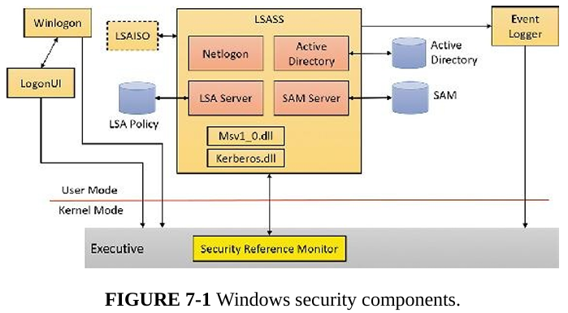
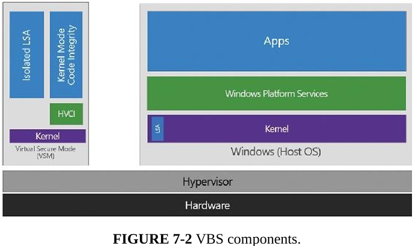
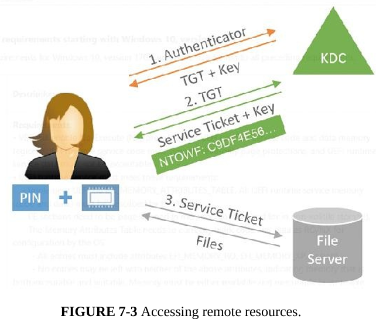
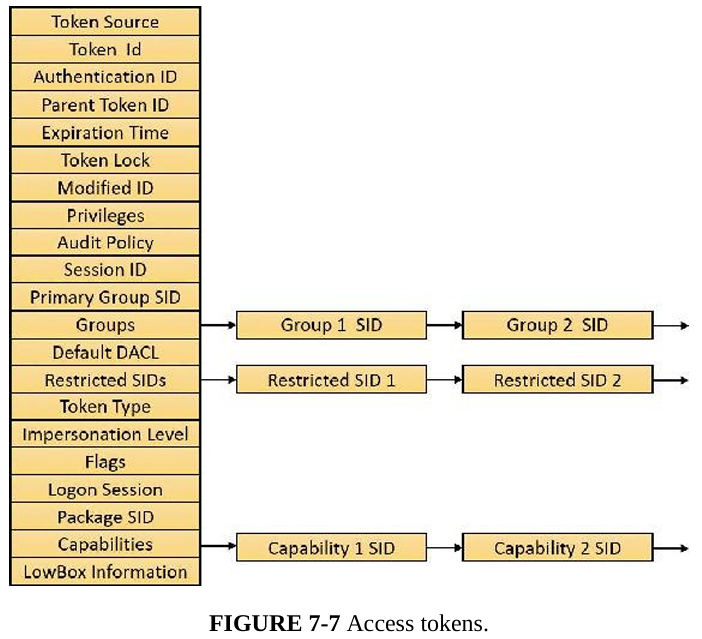

## 第一章 概念和工具

### 进程

包含下列元素

* 一块私有的虚拟地址空间

* 一个可执行的程序

* 一个已打开句柄的列表

* 一个安全上下文

* 一个进程ID

* 至少一个执行线程

### 线程

#### 线程

包含下列元素

* 代表进程状态的一系列CPU寄存器内容

* 两个栈
  
  * 用户模式下的栈
  
  * 内核模式下的栈

* 一个线程本地存储（TLS）

* 一个线程ID

* 线程也可以有自己的安全上下文

#### 纤程

轻量级线程，在用户模式下实现

需要先调用ConvertThreadToFiber，再调用CreateFiber创建纤程，使用SwitchToFiber显式切换纤程

但通常不建议使用纤程，因为对内核不可见，因此无法发出阻塞的系统调用，IO受限的纤程执行性能会非常差，且会共享TLS（但实际上纤程也可以创建本地存储FLS）

#### 用户模式调用线程（UMS）

仅适用于64位，提供了与纤程类似的用途但避免了大多数不足之处：对内核可见，因此可发出阻塞的系统调用，可共享或竞争资源；可以定期在用户态切换线程

当UMS需要进行系统调用时，会切换至它专属的内核模式线程，这一过程称为定向上下文切换


### 作业

进程模型的一个扩展，用于将一组资源作为整体进行管理和操作

### 虚拟内存

#### 32位


32位默认为2G，其中低位0x00000000~0x7FFFFFFF分配给用户进程。可以通过设置标志使用户地址空间扩展到3G，且提供了一种名为地址窗口化扩展（Address Windowing Extension）的机制让32位应用最多分配64G空间，但程序需要自行调整映射的2GB空间

#### 64位


### 终端服务和多会话

第一个会话通常是服务会话（会话0），包含系统服务承载进程。通过控制台登录建立的第一个会话是会话1，此后可以通过远程桌面或切换用户建立更多会话

Windows客户端只允许一个远程用户连接，Windows Media Center允许一个交互式会话和最多4个Windows Media Center扩展器会话

Windows Server允许两个并发远程连接，此外可以配置为终端服务器并支持更多会话

所有Windows客户端都支持多个会话，但一次只能使用一个会话，当用户选择断开而非注销时当前会话依然会在系统中保持活跃

### 安全性

windows提供了3种形式的访问控制

* 酌情决定的访问控制
  
  用户登录时会获得安全上下文，当用户试图访问某个对象时，系统会将其安全上下文与所要访问对象的访问控制列表进行对比。一些版本还提供基于属性的访问控制，即访问控制列表不一定识别某个用户或组，而是识别其定义的属性和声明

* 特权访问控制
  
  当酌情决定的访问控制无法满足需求时，该方法可以确保在所有者不可用时，他人依然可以访问受保护的对象

* 强制完整性控制
  
  若需要为同一个用户账户访问的受保护对象提供额外的安全控制，就需要使用这种机制

## 第二章 系统架构

### 架构概述


* 用户模式进程  包含4种类型
  
  * 用户进程
  
  * 服务进程
    
    即系统服务，由服务控制管理器启动
  
  * 系统进程
    
    不由服务控制管理器启动的系统进程，如任务管理器
  
  * 环境子系统服务器进程
    
    实现了操作系统环境的支持部分

* 内核模式组件
  
  * 执行体
    
    包含操作系统的基本服务（内存管理 进程线程管理 IO等）
  
  * 内核
    
    底层系统函数，如进程调度等；内核提供了一系列例程和基本对象，供执行体实现更高层的功能
  
  * 设备驱动程序
  
  * 硬件抽象层（HAL）
  
  * 窗口和图形系统
  
  * 虚拟机监控程序层

Windows核心组件的文件主要有下面几个

| 文件名                                            | 组件                   |
| ---------------------------------------------- | -------------------- |
| Ntoskrnl.exe                                   | 执行体和内核               |
| Hal.dll                                        | HAL                  |
| Win32k.sys                                     | Windows子系统的内核模式部分    |
| Hvix64.exe(Intel) \ Hvax64.exe(AMD)            | 虚拟机监控程序              |
| \SystemRoot\System32\Drivers                   | 核心驱动程序               |
| Ntdll.dll                                      | 内部支持函数，及执行体函数的系统服务分发 |
| Kernel32.dll Advapi32.dll User32.dll Gdi32.dll | 核心windows子系统dll      |

#### 可移植性

Windows采用分层式设计，且使用C语言保持不同架构间的可编译性。

Windows的可移植性主要由Ntoskrnl.exe和Hal.dll决定，其中HAL主要负责对不同主板的兼容，而如内存管理 上下文切换等与体系架构强相关的内容主要在Ntoskrnl实现。此外虚拟机监控程序也与架构相关，因此对不同架构采取了不同实现

#### 对称多处理器


Windows运行在对称多处理器上，因此操作系统和用户程序可以通过调度在任何处理器上运行

此外还支持4种现代多处理器系统

* 多核

* 同步多线程（SMT）
  
  即逻辑核，单核多线程

* 非一致性内存访问（NUMA）
  
  即处理器和缓存作为节点，通过缓存一致总线互联，每个节点都可以访问其他节点的缓存，但系统会倾向于将线程调度到同一节点中的处理器运行，并尽量在该节点内满足内存申请需求

此外ARM版windows还支持异质多处理器，即大小核

#### 可伸缩性

即对于多核资源和性能的调配能力，windows主要设计了下列能力

* 在任何可用处理器，及多颗处理器上运行操作系统代码

* 在单个进程内执行多个线程，且每个线程可以用不同处理器并发执行

* 内核中进行细粒度同步，以及设备驱动程序和服务器进程内部细粒度同步，使得更多组件可以并发运行

* 一些编程机制（如IO完成接口），以便实现高效的多线程服务器进程

#### 客户端和服务器版本之间的差异

主要差别就是不同版本对最大资源可能有着不同限制，此外调度rc策略上可能存在一定差别，其他都一样

#### 已检验版本

WDK提供了使用DBG标志编译的内核

### 基于虚拟化的安全架构概述

启用了VBS后的模式（或称为VSM，Virtual Secure Mode）


内核和用户代码同样运行在HyperV上，但启用VBS后会多出一个VTL1，其包含一个安全内核和隔离的用户模式（IUM）

安全内核有自己独立的二进制文件securekernel.exe，而IUM不仅是一个可约束普通用户模式DLL发起的系统调用的环境，也是一个可提供仅能在VTL1下执行特殊安全系统调用的框架，这些额外的系统调用是通过Iumdll.dll、Iumbase.dll（对标的是普通内核的kernelbase.dll）以及面向windows子系统的库文件实现的

IUM大多数时候会与普通用户模式共享win32 API，但写时复制机制会阻止VTL0程序更改VTL1使用的dll

VTL0和VTL1是隔离的，安全内核并没有实现完整的系统能力，而是选择性地转发系统调用，而任何IO操作（文件 注册表 图形等）都被禁止，也无法直接与驱动程序通信

安全内核可以通过SLAT（二级地址转换）和IOMMU机制对内存访问进行限制，可以阻止设备驱动程序通过DMA访问虚拟机监控程序或安全内核的物理内存

在这种架构下，boot loader首先安排合适的SLAT和IOMMU，定义VTL0和VTL1的执行环境，之后当处于VTL1时会再次运行boot loader，加载安全内核并进一步配置系统。之后才会通过VTL0运行常规内核

### 重要的系统组件


#### 环境子系统和子系统DLL

每个exe都会绑定到唯一的子系统。创建进程时，代码会在可执行文件头部检查子系统的类型代码，将新建进程告知正确的子系统。一般来说，exe不会直接与windows内核进行交互，而是通过子系统DLL，如windows子系统DLL（kernel32.dll advapi32.dll等）

调用子系统dll时，一般情形如下

* 函数直接在子系统DLL内以用户模式实现

* 函数需要对windows执行体进行一个或多个调用

* 函数要在环境子系统进程中执行一些工作

##### 子系统的启动

子系统启动信息一般存在注册表项

```
HKEY_LOCAL_MACHINE\SYSTEM\CurrentControlSet\Control\Session Manager\SubSystems
```

* Windows  定义了windows子系统的文件规范，键值Csrss.exe代表客户端/服务端运行时的子系统

* Optional  可选的子系统

* Kmode  Windows子系统内核模式部分的文件名（Win32k.sys）

##### Windows子系统

windows子系统是最主要的子系统，，与windows系统交互的各种函数主要都放在windows子系统中，其他子系统通过调用windows子系统实现显示IO

包含下列重要组件

* 对于每个会话，环境子系统进程Csrss.exe的一个实例将加载4个dll，Basesrv.dll Winsrc.dll Sxssrv.dll Csrsrv.dll，提供下列支持
  
  * 与进程和线程创建及删除有关的多种管理任务
  
  * Windows应用程序的关闭（ExitWindowsEx）

## 第七章 安全性

### 安全评级

#### 可信计算机系统评估标准

TCSES评级，windows满足所有C2级标准，主要包含下列组件

* 安全登录设施  用户能唯一地标识身份，且通过认证后才能登录计算机

* 任意访问控制  资源所有者可以向一位/一组用户提供执行不同类型访问操作的权利

* 安全审核  能够检测并记录与安全性有关的事件

* 对象复用保护  可防止用户访问已被其他用户删除的数据或曾被其他用户使用但已释放的内存

此外还满足两个B级的要求

* 可信路径功能  可防止木马拦截用户登录时输入的凭证。使用安全注意序列（Secure Attention Sequence，SAS）实现，在按下如Ctrl+Alt+Delete时会始终返回系统控制的登录界面，从而屏蔽木马的伪造界面

* 可信设施管理  可以根据管理职能提供相互分离的账户角色

### 安全系统组件

主要包含下列组件

* 安全引用监视器（Security Reference Monitor, SRM）  负责定义代表安全上下文的令牌数据结构，进行安全访问检查（Access Check）、操作特权以及生成各类安全审核信息

* 本地安全机构子系统服务（Local Security Authority Subsystem Service, LSASS）负责本地系统安全策略、用户身份认证以及将安全审核信息发给事件日志。主要由Lsass.exe加载的Lsasrv.dll实现

* LSAIso.exe  被Lsass使用，也叫做Credential Guard，用于存储用户的令牌哈希，是一个Trustlet进程

* Lsass策略数据库  包含本地系统安全策略设置，被存储在`HKLM\SECURITY`注册表下

* 安全账户管理器（Security Accounts Manager, SAM）负责管理包含本机定义用户名和组信息的数据库，由Lsass.exe加载的Samsrv.dll实现

* SAM数据库  包含已定义的本地用户和组的密码和其他属性信息，存储在`HKLM\SAM`

* Active Directory  存储了有关域对象的信息，包括与用户和组的密码与特权信息。由Lsass.exe加载的Ntdsa.dll实现

* 身份验证包（Authentication Package）包括在Lsass进程和客户端进程中运行的，以及实现Windows身份验证策略的DLL。后者检查用户凭据是否匹配，若匹配则向Lsass发送信息并告知用户的安全标识，Lsass使用这些信息生成令牌

* 交互式登录管理器（Interactive Logon Manager）用户模式运行Winlogon.exe负责响应SAS，并管理交互式会话

* 登录用户界面（Logon User Interface, LogonUI）用户模式运行LogonUI.exe，用于提供登录的用户界面

* 凭据提供程序（Credential Provider, CP）在LogonUI进程中运行的进程内COM对象，用于获取用户的各种认证方式提供的凭据，如密码、PIN码、指纹等。标准CP包括authui.dll  SmartCredentialProvider.dll  BioCredProv,dll  FaceCredentialProvider.dll

* 网络登录服务（Network Logon Service, Netlogon）服务由SvcHost中运行的Netlogon.dll提供，可建立到域控的安全通道，随后可发送安全请求

* 内核安全设备驱动程序（Kernel Security Device Driver, KSecDD）Ksecdd.sys,实现高级本地过程调用接口，其他内核模式安全组件，如加密文件系统可以通过其在用户模式下与Lsass通信

* AppLocker  AppId.sys和SvcHost中运行的AppIdSvc.dll，可供管理员决定用户和组允许使用哪些可执行文件、DLL和脚本



### 基于虚拟化的安全性

Virualization-Based Security，VBS。用于保护内核免于恶意驱动或有漏洞的驱动攻击

该模式下将OS划分为VTL0和VTL1（虚拟信任级别，Virtual Trust Level，VTL）。VTL0无法访问VTL1下的任何内容，甚至用户代码（Isolated User Mode, IUM）



VBS的主要组件

* 基于虚拟机监控程序的代码完整性（Hypervisior-Base Code Integrity, HVCI）以及内核模式代码完整性（Kernel-Mode Code Integrity, KMCI），用于驱动Device Guard

* LSA（Lsass.exe）和隔离的LSA（LsaIso.exe），用于驱动Credential Guard

VTL1的正常运行依赖安全启动功能，且需要保证虚拟机监控程序不受威胁 

#### Credential Guard

**主要用于保护用户凭据**

正常情况下，用户登录所需的组件如下

* 密码

* NT单向函数（NT One-Way Function, NTOWF）用于NTLM协议的识别，NTOWF是MD4哈希。该协议已经过时

* 票证授予票证（Ticket-Granting Ticket, TGT）Kerberos中的类似NTOWF的组件

不启用Credential Guard时，所有组件都在Lsass内存中

##### 保护密码

为了通过摘要式身份认证（WDigest）或终端服务/RDP等单一登录服务（Single Sign-On, SSO），密码需要在本地存储（一般采用对称加密的方式存储）因此理论上凭据都会保存在内存中，Credential Guard无法缓解，只能通过禁用这类SSO功能来保证安全性

##### 保护NTOWF/TGT密钥

登录会导致域控的密钥发行中心（Key Distribution Center, KDC）分发TGT及其密钥，以及NTOWF，进而使用TGT及密钥生成服务票证，或是使用NTOWF访问遗留的资源（部分还使用NTLM认证的旧资源）



Windows通过轻量级保护进程（Protected Process Light, PPL）架构来保护Lsass进程，但由于Lsass可能需要加载第三方dll以提供定制的认证方式，因此默认不开该选项。此外PPL只能保护用户模式下的攻击，无法防止通过恶意驱动等方式在内核态进行攻击

Credential Guard使用Lsaiso.exe解决了这个问题，该程序以Trustlet形式运行在VTL1下，以硬件方式隔离了对机密内存的访问

##### 保护通信

虽然存在Lsaiso，但认证时仍需要通过Lsass与服务器进行通信，因此催生了两个问题：

* Lsass如何发送与接收数据，使得攻击者无法截获凭证

* 如何防止攻击者伪装成客户端接收LSA发送的凭证

第一个问题答案是使用高级本地过程调用（Advanced Local Procedure Call, ALPC），VTL1的安全内核通过代理将NtAlpc*调用发送给常规内核，随后IUM程序通过ALPC协议实现了RPC的支持

第二个问题则使用类似TLS的协议实现，但仍有一些方式可能进行攻击

* 计算机在物理上失陷，纯文本密码在输入时或发送给Lsass时被拦截（使用Windows Hello缓解）

* NTLM不能防重放，因此若Lsass失陷，则可以捕获加密后的凭据，并且要求LSA为任意NTLM质询生成新的响应

* 对于Kerberos，在计算机被攻陷或会被抓包的情况下NTOWF（未被加密）可以被拦截并重用

* 一些计算机可能会禁用Credential Guard，从而导致“降级攻击”

##### UEFI锁定

为了防止Credential Guard被轻易禁用，需要通过UEFI锁启用Credential Guard，此时若该选项被改动，bitlocker和TPM会检测到。相应代码在SecComp.efi实现，需要管理员下载并加载到EFI

##### 身份验证策略和Armored Kerberos

上述模型基本可以保证“除非在登录前已被攻陷，或被从物理上进行了管理员访问，否则就很安全”，但有些场景需要更强的安全保证：被攻陷的计算机无法用于伪造或重播用户凭据，且若用户凭据被攻陷也无法在特定系统外使用

使用身份验证策略和Armored Kerberos可以让Credential Guard在更严格的安全模式下运行

该模式下，VTL 1安全内核将使用TPM生成一个与计算机硬件绑定的唯一密钥，在配置计算机首次加入域时使用该密钥生成计算机TGT密钥，该密钥被发送给KDC（这里应该是生成一对公私钥，公钥发送给KDC）。配置完成后用户使用自己凭据登录时，会与TPM生成的硬件相关凭据结合（仅LSAIso可访问）生成一个凭据并加密传输，KDC会发回用户TGT/密钥或NTOWF

该方法提供两个保证：

* 保证身份验证的用户使用了已知的计算机

* NTLM响应/用户票据来自于LSAIso而非Lsass

但仍存在攻击面：若计算机失陷，KDC响应被拦截（包含TGT和用户密钥），则在用户注销前都可以通过该凭据访问相应资源

#### Device Guard

**主要用于保护计算机免受各种类型的软硬件攻击**

Device Guard利用Windows代码完整性保护，如内核模式代码签名（Kernel-Mode Code Signing, KMCS）和用户模式代码完整性（User-Mode Code Integrity, UMCI），并通过虚拟机监控程序的代码完整性（Hypervisior-Base Code Integrity, HVCI）进行增强。此外也可以自定义代码完整性（Custom Code Integrity, CCI）

Device Guard采取下列策略保证安全性

* 如果强制使用KMCS，无论内核是否被攻陷，仅允许带签名的代码加载
  
  因为内核在加载驱动时，会通知VTL1下的安全内核使用HVCI验证驱动，仅有验证过的程序可以加载

* 如果强制使用KMCS，带有签名的代码加载后无法修改，内核本身也无法修改
  
  因为可执行文件的代码页会被hypervisor的二级地址转换（Second Level Address Translation, SLAT）标记为只读

* 如果强制使用KMCS，将严格禁止动态生成代码
  
  因为内核不能在SLAT页表中分配可执行的页

* 如果强制使用KMCS，不管是内核还是UEFI本身都不能修改UEFI的代码
  
  安全启动在加载时会验证UEFI是否正确签名，且UEFI运行时数据也无法标记为可执行，也是通过设置VTL1的页表项实现

* 如果强制使用KMCS，只有Ring0签名的代码可以执行
  
  该机制应该是防止在Ring0下执行Ring3代码，但书中描述了一种受限用户模式（Restricted User Mode, RUM）似乎可以执行

* 如果强制使用UMCI，仅带签名的用户模式可执行文件可以加载

* 如果强制使用UMCI，内核将不允许用户模式应用程序将现有可执行页标记为可写

* 如果强制使用UMCI，且签名策略要求硬编码保证（hard code guarantees），则严禁动态生成代码
  
  对于JIT场景，提供了两种选项：
  
  * 分配额外的可执行内存
  
  * 应用程序证书中包含一个特殊的增强型密钥用法（Enhanced Key Usage, EKU），允许动态生成代码

* 如果用户模式PowerShell为受限模式，所有可能使用动态类型、反射或其他语言特性来调用.net API执行任意代码的脚本都需要签名才能运行

SLAT页表项可在VTL1中获得保护，且其中包含了页的属性，Device Guard可将所有强制代码签名转移到VTL1内部，并通过对内存属性的设置保护（W^X模型，意思应该是写权限和执行权限只能有一种才通过检查），VTL1上的签名相关在SKCI.dll实现

若强制要求所有Trustlet具备包含隔离用户模式EKU的特定微软证书，则即使没有显式设置Credential Guard也会被启用，此时Device Guard运行在第三种模式下。否则具备Ring0权限的攻击者可以通过攻击KMCS机制加载恶意Trustlet来攻击LSAIso，此外，所有的用户模式代码强制签名都对Trustlet启用，该模式保证Trustlet在硬编码模式下运行

注意，系统从休眠状态恢复时，为了优化性能，HVCI不会重新验证每个页面，但SLAT需要重新构造。系统通过TPM保证休眠时存储的SLAT页表项不会被篡改，但若没有TPM，SLAT页表项存储密钥被写在UEFI中，可能被攻击者获取并解密

### 保护对象

#### 访问检查

当线程使用名称打开一个对象，会在对象管理器（Object Manager）查找对象，若该对象不属于附属命名空间（注册表、文件等），对象管理器在找到对象后会调用函数ObpCreateHandle，该函数在进程句柄表中创建一个项并关联该对象。函数主要进行下列操作

* ObpGrantAccess检查线程是否有权限访问该对象
  
  * 调用ObCheckObjectAccess初始化安全访问检查，此时需要传入线程安全凭据、线程请求的访问类型和而指向对象的指针。函数首先锁定对象的安全描述符和线程安全上下文，随后调用对象安全方法，获取对象的安全设置

* 若有，调用ExCreateHandle创建表项

一般内核对象会采用默认安全性，但如文件系统一般不采用默认安全性（因为不同的文件系统可能有不同的安全性要求），所以文件系统的安全性由IO管理器调用文件系统驱动的相应函数实现。注意，在附属命名空间打开的文件不会调用ObCheckObjectAccess，而只有当线程显式查询或设置文件安全性时（SetFileSecurity GetFileSecurity）才会调用文件对象的安全方法

#### 安全标识符

Windows使用安全标识符标识系统中执行操作的实体，包括用户、本地和域组、本地计算机、域、域成员、服务

SID为可变长度的数值，包含SID结构版本号，一个48位标识符机构值，和可变数量的32位子机构值和相对标识符（RID）。机构值标识颁发该SID的代理，一般位Windows本地系统或域，子机构值标识颁发机构的受托人（trustee）

安装Windows时，安装程序会为计算机颁发计算机SID，并为计算机上每个本地账户颁发SID（计算机SID+RID），用户账户和组的RID从1000开始，新建一个递增1。若计算机提升为域控则会使用计算机SID作为域的SID，若从域控降级为普通计算机则会新建SID。域下用户的RID也从1000开始。

Winlogon会为每个交互式登录会话创建一个唯一的登录SID，其典型用途是在ACE中访问客户端的登录会话。登录会话SID为S-1-5-5-x-y，其中x y为随机值

##### 预定义的SID

| SID      | 名称               | 用途                                          |
| -------- | ---------------- | ------------------------------------------- |
| S-1-0-0  | Nobody           | 当SiD未知时使用                                   |
| S-1-1-0  | Everyone         | 包含除匿名用户外所有用户的组                              |
| S-1-2-0  | Local            | 登录（物理登录）到系统本地终端上的用户                         |
| S-1-3-0  | Creator Owner ID | 用于可继承的ACE，表示一个特殊的SID，该SID在新建对象时会被创建者SID替换   |
| S-1-3-1  | Creator Group ID | 用于可继承的ACE，表示一个特殊的SID，该SID在新建对象时会被创建者的组SID替换 |
| S-1-5-2  | Network组         | 通过网络登录到本机的所有用户                              |
| S-1-5-18 | Local System     | 被服务使用                                       |
| S-1-5-19 | Local Service    | 被服务使用                                       |
| S-1-5-20 | Network Service  | 被服务使用                                       |

此外还有一些预定义的RID，如Administrator的RID为500，Guest的RID为501

##### 完整性级别

完整性级别可以覆盖自定义访问行为，以区分同一个用户所拥有的进程和对象

完整性级别可以是任意值，系统使用了下列6个级别

| 用户           | 级别      | 用途                                              |
| ------------ | ------- | ----------------------------------------------- |
| S-1-16-0     | 不受信任（0） | 用于Anonymous组启动的进程，会阻止大多数写操作                     |
| S-1-16-4096  | 低（1）    | 用于AppContainer进程和受保护模式的IE，会阻止对系统大部分对象的写操作       |
| S-1-16-8192  | 中（2）    | 用于在UAC启用的情况下启动的常规应用程序                           |
| S-1-16-12288 | 高（3）    | 用于在UAC启用的情况下，通过提权启动的管理类应用，或在UAC禁用的情况下，由管理员启动的应用 |
| S-1-16-16384 | 系统（4）   | 用于服务和其他系统及进程（Wininit Winlogon Smss等）            |
| S-1-16-20480 | 受保护（5）  | 默认未被使用，仅能通过内核模式调用设置                             |

AppContainer算是一个特殊级别，但权限基本等同于低

完整性级别的继承规则如下：

* 进程通常会继承父进程的完整性级别

* 若子进程所属的可执行文件完整性级别与父进程不同，则会继承两者中较低的那个完整性级别

* 父进程可以使用低于自己的级别的完整性创建新进程（DuplicateTokenEx->SetTokenInformation->CreateProcessAsUser）

需要注意的是，不仅进程定义了完整性级别，对象SACL的强制标签（Mandatory Label）也定义了对象本身的完整性等级

为了兼容老版本，对于不含完整性级别的资源会默认其完整性等级为“中”。若进程创建对象时未指定完整性等级，当进程完整性大于等于“中”时对象完整性等级设为“中”，小于“中”时按照进程完整性等级赋予

对象的强制标签还可以指定强制策略

| 策略            | 默认存在于         | 描述                                                  |
| ------------- | ------------- | --------------------------------------------------- |
| No-Write-Up   | 所有对象隐含        | 用于限制更低完整性级别进程对此对象的写访问                               |
| No-Read-Up    | 仅进程对象         | 用于限制更低完整性级别进程对此对象的读访问，用于进程对象时可禁止外部进程读取地址空间，进而防止信息泄露 |
| No-Execute-Up | 仅实现COM类的二进制文件 | 用于限制更低完整性级别进程对此对象的执行访问。用于COM类时可限制该COM类的启动-激活权限      |

##### 令牌

登录过程中Lsass会创建正在登录用户的初始令牌，随后判断正在登录的用户是否属于下列某个组的成员：

* 内置管理员

* 证书管理员

* 域管理员

* 企业管理员

* 策略管理员

* 架构管理员

* 域控制器

* 企业只读域控制器

* 只读域控制器

* 账户操作员

* 备份操作员

* 密码操作员

* 网络配置操作员

* 打印操作员

* 系统操作员

* RAS服务器

* 超级用户

* Windows 2000之前版本兼容访问

此外还需检查用户的特权

* SeBackupPrivilege

* SeCreateTokenPrivilege

* SeDebugPrivilege

* SeImpersonatePrivilege

* SeLabelPrivilege

* SeLoadDriverPrivilege

* SeRestorePrivilege

* SeTakeOwnershipPrivilege

* SeTcbPrivilege

若用户在上述组或拥有某个特权，Lsass会为该用户创建一个受限令牌，并为两者创建一个登录会话，标准用户令牌会被附加到Winlogon启动的一个或多个初始进程上

令牌的主要成员信息：



书中该部分还描述了一些令牌的基本信息，如SRM如何通过SID检查令牌对资源的访问权限及完整性等级、令牌的特权列表、DACL、模拟令牌等（在Windows Security Internals有详细描述，这里不赘述）

令牌中还包含针对线程和进程的强制策略，定义了强制完整性控制（Mandatory Integrity Control, MIC）的行为

* TOKEN_MANDATORY_NO_WRITE_UP  进程和线程无法对完整性等级更高的资源执行写访问，默认启用

* TOKEN_MANDATORY_NEW_PROCESS_MIN  启动子进程时检查可执行文件的完整性级别，将其与父进程完整性级别中的最小值作为子进程的完整性级别，默认启用

令牌的来源字段描述了令牌来自何处（如会话服务器、RPC服务器、网络文件服务器等）；令牌标识符（Token ID）是本地计算机为令牌分配的本地唯一标识符LUID；令牌验证ID（Authentication ID）则是令牌创建者分配的LUID，默认同一个登录会话的用户拥有同样的令牌验证ID；每次令牌内容被修改，Modified ID都会被刷新

##### 模拟

大部分内容在Windows Security Internals有详细描述

模拟级别除了Anonymous Identification Impersonation和Delegation外，还有一些自定义的值，如RPC接口提供了RPC_C_IMP_LEVEL_IMPERSONATE

如果客户端未指定模拟级别，则默认为Impersonation。CreateFile函数还可以接收两个与模拟设置相关的修饰符

* SECURITY_EFFECTIVE_ONLY  进行模拟时，可防止服务器启用或禁用客户端的特权或组

* SECURITY_CONTEXT_TRACKING  客户端对自己上下文的任何改动都会反映给模拟自己的服务器

##### 受限令牌

由CreateRestrictedToken创建，基于主令牌或模拟令牌创建的副本，可以进行如下修改

* 移除一些特权

* 将部分SID标记为“仅拒绝”（DenyOnly）

* 令牌中的SID可以标记为“受限制的”，此时会对这些SID进行二次访问检查，且第二次检查只检查受限制的SID，只有两次检查都通过才能访问对象

受限令牌可以用于运行不可信代码

##### 筛选的管理员令牌

UAC会使用受限令牌创建筛选的管理员令牌（Filtered admin token），该令牌会被所有应用程序继承

* 完整性级别为“中”

* 管理员和管理员类SID标记为“仅拒绝”

* 除了ChangeNotify Shutdown Undock IncreaseWorkingSet和TimeZone外其他的特权都会被移除

#### 虚拟服务账户

为了实现一定程度的隔离，每个服务都应用自己的账户运行。虚拟服务账户名称为`NT SERVICE\`，这类账户可以出现在访问控制列表中，也可使用组策略为其关联特权，但此类账户无法通过常规账户管理工具创建或删除或分配到组。Windows会自动为虚拟服务账户分配密码并定期更改

#### 安全描述符和访问控制

书中描述了安全描述符相关内容，在Windows Security Internals有详细描述

##### ACL的分配

对于给新对象分配ACL的问题，采取下列策略

* 若在创建时提供了安全描述符，则直接分配给新对象；但若对象有名称且位于容器对象中，系统会将可继承的ACE与当前的DACL进行合并（除非设置了SE_DACL_PROTECTED阻止继承）

* 若创建时未提供安全描述符，且对象有名称，会继承新对象所在容器的安全描述符的可继承ACE

* 若未提供安全描述符且对象没继承任何ACE，会从调用者令牌获取默认DACL

* 若未提供安全描述符且对象没继承任何ACE且调用者令牌没有默认DACL，则会创建不带DACL的对象

SACL类似

若容器类对象包含可继承ACE，系统会将可继承ACE自动传播到容器子对象的安全描述符（除非设置了SE_DACL_PROTECTED或SE_SACL_PROTECTED）。可继承ACE的合并规则为：任何显式应用于ACL的ACE都将优先于继承的ACE。传播可继承ACE时有以下规则

* 若无DACL的子对象继承了ACE，子对象DACL将仅包含继承来的ACE

* 若含空DACL的子对象继承了ACE，子对象DACL将仅包含继承来的ACE

* 对于Active Directory对象，若父对象中可继承的ACE被移除，子对象继承的该ACE将自动被移除

* 对于Active Directory对象，若自动继承导致DACL中所有ACE被移除，对象的DACL将为空（而非无DACL）

##### 可信ACE

受保护进程和轻量级受保护进程都需要让进程能够将对象设置为只允许受保护进程访问，此类ACE由特殊的SID指定，且要求满足一定保护等级并带有签名才能访问

| SID            | 保护等级     | 保护签名方   |
| -------------- | -------- | ------- |
| 1-19-512-0     | 轻量级受保护进程 | 无       |
| 1-19-512-4096  | 轻量级受保护进程 | Windows |
| 1-19-512-8192  | 轻量级受保护进程 | WinTcb  |
| 1-19-1024-0    | 受保护进程    | 无       |
| 1-19-1024-4096 | 受保护进程    | Windows |
| 1-19-1024-8192 | 受保护进程    | WinTcb  |

SID数字越大，令牌能力越多，且受保护进程的级别高于轻量级受保护进程

##### 确定访问权

确定对一个对象的访问权包含两个检查

* 强制完整性检查  进程不能访问完整性等级高于它的对象和其他进程

* 访问检查  DACL检查

> **用户界面特权隔离（User Interface Privilege Isolation, UIPI）**
> 
> 用于禁止进程向更高完整性级别的进程所拥有窗口发送窗口消息，除了下述消息：
> 
> ```
> WM_NULL WM_MOVE WM_SIZE WM_GETTEXT WM_GETTEXTLENGTH
> 
> WM_GETHOTKEY WM_GETICON WM_RENDERFORMAT WM_DRAWCLIPBOARD
> 
> WM_CHANGECBCHAIN WM_THEMECHANGED
> ```
> 
> 且可以禁止窗口挂钩（SetWindowsHookEx）和日志挂钩影响更高完整性级别的窗口
> 
> 但更高完整性等级的进程可以通过ChangeWindowsMessageFilterEx允许额外消息穿越该防护，主要用于一些自定义消息
