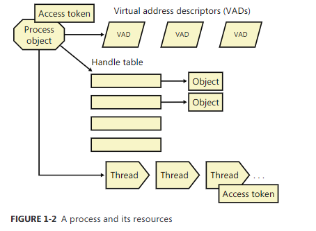
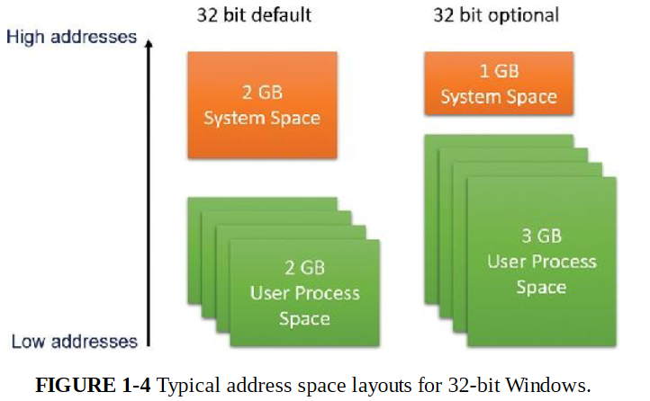
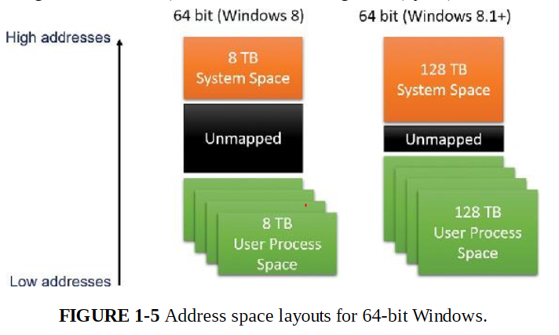
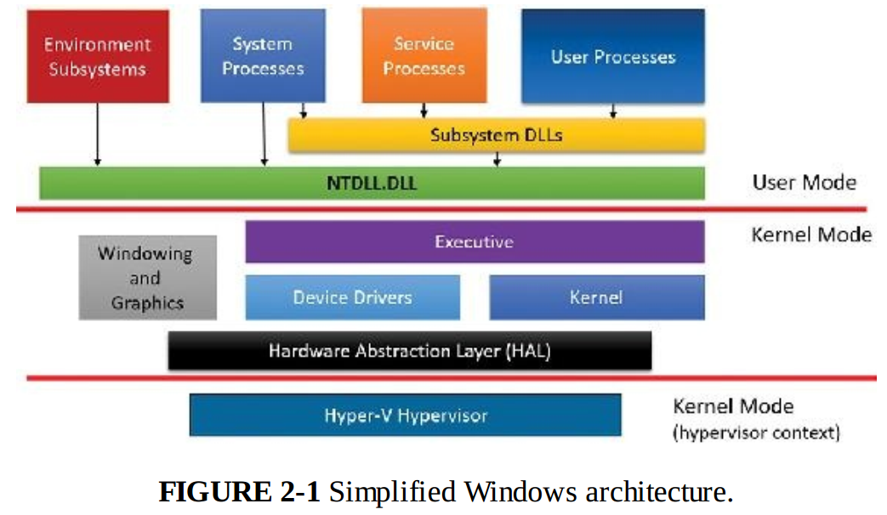
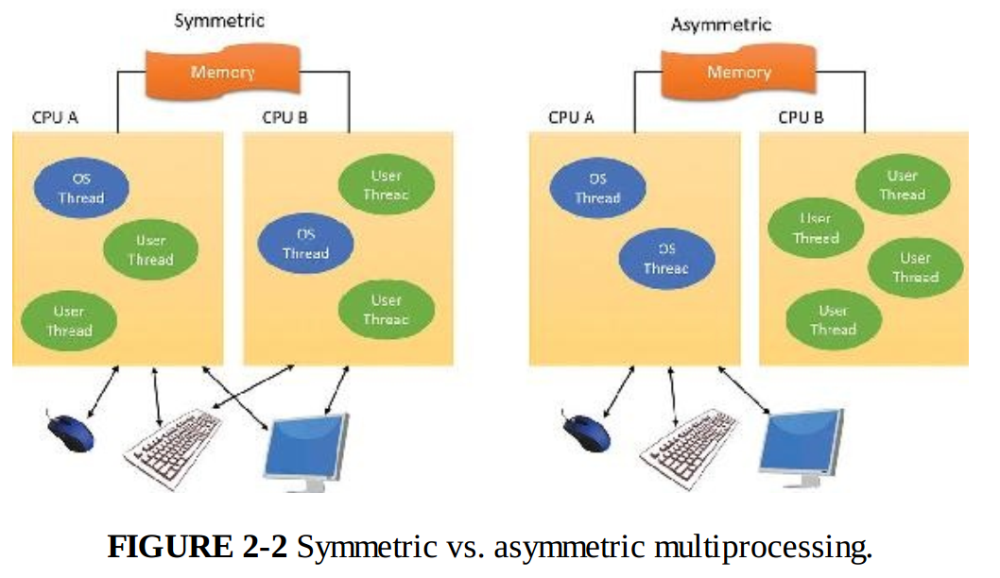
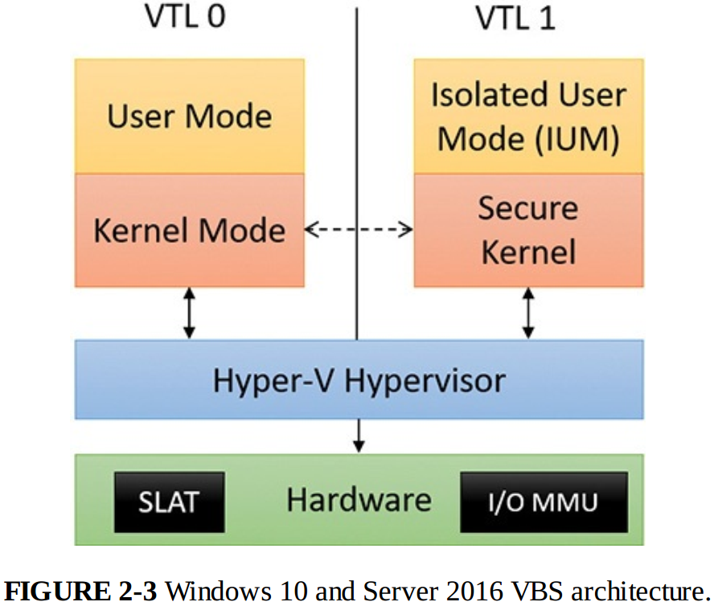
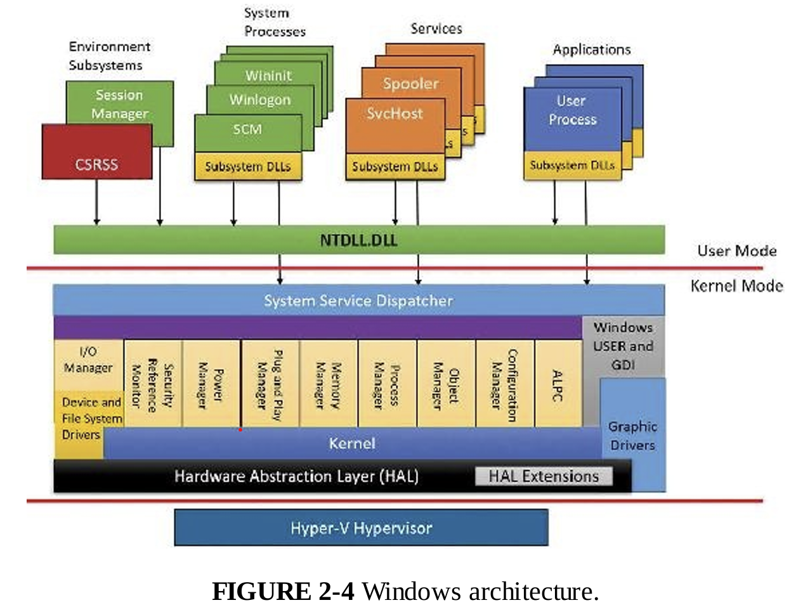

## 第一章 概念和工具

### 进程

包含下列元素

* 一块私有的虚拟地址空间

* 一个可执行的程序

* 一个已打开句柄的列表

* 一个安全上下文

* 一个进程ID

* 至少一个执行线程

### 线程

#### 线程

包含下列元素

* 代表进程状态的一系列CPU寄存器内容

* 两个栈
  
  * 用户模式下的栈
  
  * 内核模式下的栈

* 一个线程本地存储（TLS）

* 一个线程ID

* 线程也可以有自己的安全上下文

#### 纤程

轻量级线程，在用户模式下实现

需要先调用ConvertThreadToFiber，再调用CreateFiber创建纤程，使用SwitchToFiber显式切换纤程

但通常不建议使用纤程，因为对内核不可见，因此无法发出阻塞的系统调用，IO受限的纤程执行性能会非常差，且会共享TLS（但实际上纤程也可以创建本地存储FLS）

#### 用户模式调用线程（UMS）

仅适用于64位，提供了与纤程类似的用途但避免了大多数不足之处：对内核可见，因此可发出阻塞的系统调用，可共享或竞争资源；可以定期在用户态切换线程

当UMS需要进行系统调用时，会切换至它专属的内核模式线程，这一过程称为定向上下文切换



### 作业

进程模型的一个扩展，用于将一组资源作为整体进行管理和操作

### 虚拟内存

#### 32位



32位默认为2G，其中低位0x00000000~0x7FFFFFFF分配给用户进程。可以通过设置标志使用户地址空间扩展到3G，且提供了一种名为地址窗口化扩展（Address Windowing Extension）的机制让32位应用最多分配64G空间，但程序需要自行调整映射的2GB空间

#### 64位



### 终端服务和多会话

第一个会话通常是服务会话（会话0），包含系统服务承载进程。通过控制台登录建立的第一个会话是会话1，此后可以通过远程桌面或切换用户建立更多会话

Windows客户端只允许一个远程用户连接，Windows Media Center允许一个交互式会话和最多4个Windows Media Center扩展器会话

Windows Server允许两个并发远程连接，此外可以配置为终端服务器并支持更多会话

所有Windows客户端都支持多个会话，但一次只能使用一个会话，当用户选择断开而非注销时当前会话依然会在系统中保持活跃

### 安全性

windows提供了3种形式的访问控制

* 酌情决定的访问控制
  
  用户登录时会获得安全上下文，当用户试图访问某个对象时，系统会将其安全上下文与所要访问对象的访问控制列表进行对比。一些版本还提供基于属性的访问控制，即访问控制列表不一定识别某个用户或组，而是识别其定义的属性和声明

* 特权访问控制
  
  当酌情决定的访问控制无法满足需求时，该方法可以确保在所有者不可用时，他人依然可以访问受保护的对象

* 强制完整性控制
  
  若需要为同一个用户账户访问的受保护对象提供额外的安全控制，就需要使用这种机制

## 第二章 系统架构

### 架构概述



* 用户模式进程  包含4种类型
  
  * 用户进程
  
  * 服务进程
    
    即系统服务，由服务控制管理器启动
  
  * 系统进程
    
    不由服务控制管理器启动的系统进程，如任务管理器
  
  * 环境子系统服务器进程
    
    实现了操作系统环境的支持部分

* 内核模式组件
  
  * 执行体
    
    包含操作系统的基本服务（内存管理 进程线程管理 IO等）
  
  * 内核
    
    底层系统函数，如进程调度等；内核提供了一系列例程和基本对象，供执行体实现更高层的功能
  
  * 设备驱动程序
  
  * 硬件抽象层（HAL）
  
  * 窗口和图形系统
  
  * 虚拟机监控程序层

Windows核心组件的文件主要有下面几个

| 文件名                                            | 组件                   |
| ---------------------------------------------- | -------------------- |
| Ntoskrnl.exe                                   | 执行体和内核               |
| Hal.dll                                        | HAL                  |
| Win32k.sys                                     | Windows子系统的内核模式部分    |
| Hvix64.exe(Intel) \ Hvax64.exe(AMD)            | 虚拟机监控程序              |
| \SystemRoot\System32\Drivers                   | 核心驱动程序               |
| Ntdll.dll                                      | 内部支持函数，及执行体函数的系统服务分发 |
| Kernel32.dll Advapi32.dll User32.dll Gdi32.dll | 核心windows子系统dll      |

#### 可移植性

Windows采用分层式设计，且使用C语言保持不同架构间的可编译性。

Windows的可移植性主要由Ntoskrnl.exe和Hal.dll决定，其中HAL主要负责对不同主板的兼容，而如内存管理 上下文切换等与体系架构强相关的内容主要在Ntoskrnl实现。此外虚拟机监控程序也与架构相关，因此对不同架构采取了不同实现

#### 对称多处理器



Windows运行在对称多处理器上，因此操作系统和用户程序可以通过调度在任何处理器上运行

此外还支持4种现代多处理器系统

* 多核

* 同步多线程（SMT）
  
  即逻辑核，单核多线程

* 非一致性内存访问（NUMA）
  
  即处理器和缓存作为节点，通过缓存一致总线互联，每个节点都可以访问其他节点的缓存，但系统会倾向于将线程调度到同一节点中的处理器运行，并尽量在该节点内满足内存申请需求

此外ARM版windows还支持异质多处理器，即大小核

#### 可伸缩性

即对于多核资源和性能的调配能力，windows主要设计了下列能力

* 在任何可用处理器，及多颗处理器上运行操作系统代码

* 在单个进程内执行多个线程，且每个线程可以用不同处理器并发执行

* 内核中进行细粒度同步，以及设备驱动程序和服务器进程内部细粒度同步，使得更多组件可以并发运行

* 一些编程机制（如IO完成接口），以便实现高效的多线程服务器进程

#### 客户端和服务器版本之间的差异

主要差别就是不同版本对最大资源可能有着不同限制，此外调度rc策略上可能存在一定差别，其他都一样

#### 已检验版本

WDK提供了使用DBG标志编译的内核

### 基于虚拟化的安全架构概述

启用了VBS后的模式（或称为VSM，Virtual Secure Mode）



内核和用户代码同样运行在HyperV上，但启用VBS后会多出一个VTL1，其包含一个安全内核和隔离的用户模式（IUM）

安全内核有自己独立的二进制文件securekernel.exe，而IUM不仅是一个可约束普通用户模式DLL发起的系统调用的环境，也是一个可提供仅能在VTL1下执行特殊安全系统调用的框架，这些额外的系统调用是通过Iumdll.dll、Iumbase.dll（对标的是普通内核的kernelbase.dll）以及面向windows子系统的库文件实现的

IUM大多数时候会与普通用户模式共享win32 API，但写时复制机制会阻止VTL0程序更改VTL1使用的dll

VTL0和VTL1是隔离的，安全内核并没有实现完整的系统能力，而是选择性地转发系统调用，而任何IO操作（文件 注册表 图形等）都被禁止，也无法直接与驱动程序通信

安全内核可以通过SLAT（二级地址转换）和IOMMU机制对内存访问进行限制，可以阻止设备驱动程序通过DMA访问虚拟机监控程序或安全内核的物理内存

在这种架构下，boot loader首先安排合适的SLAT和IOMMU，定义VTL0和VTL1的执行环境，之后当处于VTL1时会再次运行boot loader，加载安全内核并进一步配置系统。之后才会通过VTL0运行常规内核

### 重要的系统组件



#### 环境子系统和子系统DLL

每个exe都会绑定到唯一的子系统。创建进程时，代码会在可执行文件头部检查子系统的类型代码，将新建进程告知正确的子系统。一般来说，exe不会直接与windows内核进行交互，而是通过子系统DLL，如windows子系统DLL（kernel32.dll advapi32.dll等）

调用子系统dll时，一般情形如下

* 函数直接在子系统DLL内以用户模式实现

* 函数需要对windows执行体进行一个或多个调用

* 函数要在环境子系统进程中执行一些工作

##### 子系统的启动

子系统启动信息一般存在注册表项

```
HKEY_LOCAL_MACHINE\SYSTEM\CurrentControlSet\Control\Session Manager\SubSystems
```

* Windows  定义了windows子系统的文件规范，键值Csrss.exe代表客户端/服务端运行时的子系统

* Optional  可选的子系统

* Kmode  Windows子系统内核模式部分的文件名（Win32k.sys）

##### Windows子系统

windows子系统是最主要的子系统，，与windows系统交互的各种函数主要都放在windows子系统中，其他子系统通过调用windows子系统实现显示IO

包含下列重要组件

* 对于每个会话，环境子系统进程Csrss.exe的一个实例将加载4个dll，Basesrv.dll Winsrc.dll Sxssrv.dll Csrsrv.dll，提供下列支持
  
  * 与进程和线程创建及删除有关的多种管理任务
  
  * Windows应用程序的关闭（ExitWindowsEx）
  
  * 
