## Setting up a powershell testing environment

### Configuring Powershell

这边设置了powershell的执行权限。windows默认为Restricted，该权限禁止所有未签名的ps脚本运行；设置成了RemoteSigned，该权限只禁止了从浏览器或邮件下载的ps脚本运行

```powershell
Set-ExecutionPolicy -Scope CurrentUser -ExecutionPolicy RemoteSigned -Force
```

安装升级相关模块

```powershell
Install-Module NtObjectManager -Scope CurrentUser
Update-Module NtObjectManager
```

导入模块

```powershell
Import-Module NtObjectManager
```

### An Overview of the Powershell Language

#### 变量 类型 表达式

##### 变量

以`$`开头，如`$var`

powershell预定义了一系列变量

```
$null
$pwd
$pid
$env
```

可以用`Get-Variable`获取所有变量

##### 类型

都对应.net下的类型

| Type      | .net Type                    | Example          |
| --------- | ---------------------------- | ---------------- |
| int       | System.Int32                 | 142 0x8e 0216    |
| long      | System.Int64                 | 142L 0x8eL 0216L |
| string    | System.String                | "Hello" ‘World’  |
| double    | System.Double                | 1.0 1e10         |
| bool      | System.Boolean               | $true            |
| array     | System.Object[]              | @(1, "ABC")      |
| hashtable | System.Collections.Hashtable | @{A=1; B="ABC"}  |

其中string可以使用`"`或`'`包裹值，其中`'`是纯字面量，`"`则可以在其中使用转义，如

```powershell
$var = 42
"The Value is $var"
```

输出为 `The Value is 42`此外，双引号还支持转义字符，注意windows使用`\`作为路径分隔符，因此转义以`开头

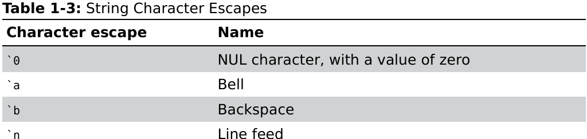

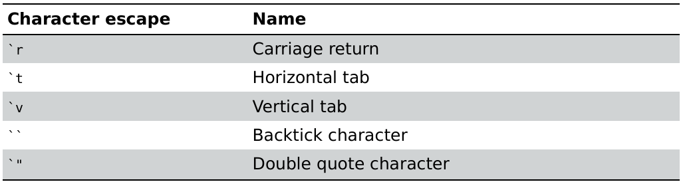

##### 表达式

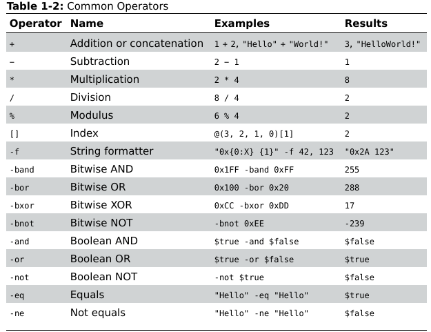

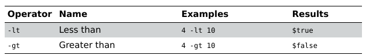

#### 执行命令

一般powershell函数的命名方式都为`[动词]-[名词]`，如`Get-Item`

传参方式有位置参数和关键字参数两种

```powershell
Get-Item C:\Windows
Get-Item -Path C:\Windows
$ret = Get-Item -Path C:\Windows
```

#### 查询指令与获取指令帮助

```powershell
# 查询指令
Get-Command -Name [pattern]
Get-Command -Module [ModuleName] -Name [pattern]

# 获取指令帮助文档
Get-Help [Command]
Get-Help [Command] -Parameter [ParameterName]
Get-Help [Command] -Examples
Get-Help [Command] -ShowWindow        # 会显示GUI帮助窗口

# 创建指令别名
New-Alias -Name [AliasName] -Value [Command]
```

#### 定义函数

```powershell
function Get-NameValue {
    param(
        [string]$Name = "",        # 指定参数类型，非必需
        $Value
    )
    return "$Name = $Value"
}


Get-NameValue -Name "Hello" -Value "World"
Get-NameValue "Hello" "World"
```

若未指定参数，则所有传入的参数会放入`$arg`变量，并使用`$arg[0]`这种方式调用

也可以将语句块赋值给一个变量，并由`&`或`Invoke-Command`调用

```powershell
$script = {Write-Output "Hello"}
& $script                 # 调用方式1
Invoke-Command $script    # 调用方式2
```

#### 对象的显示和处理

若不使用变量获取命令的结果，则会使用默认的formatter来输出对象的内容

可以通过一系列函数来筛选输出

* Select-Object  可以选择对象中的特定项

* Format-List  打印数组

* Format-Table  打印字典

* Get-Member  获取对象的特定成员

* Out-Host  分页显示

* Write-Host  直接写入到命令行，可以控制字体颜色等

* Out-GridView  打开显示字典的GUI

#### 筛选 排序 分组

* 筛选
  
  * Where-Object  提供一系列类似sql的模式进行筛选

* 排序
  
  * Sort-Object

* 分组
  
  * Group-Object

#### 导出数据

* Out-File

* Get-Content

* Export-Csv

* Export-CliXml

* 直接重定向

## The Windows Kernel

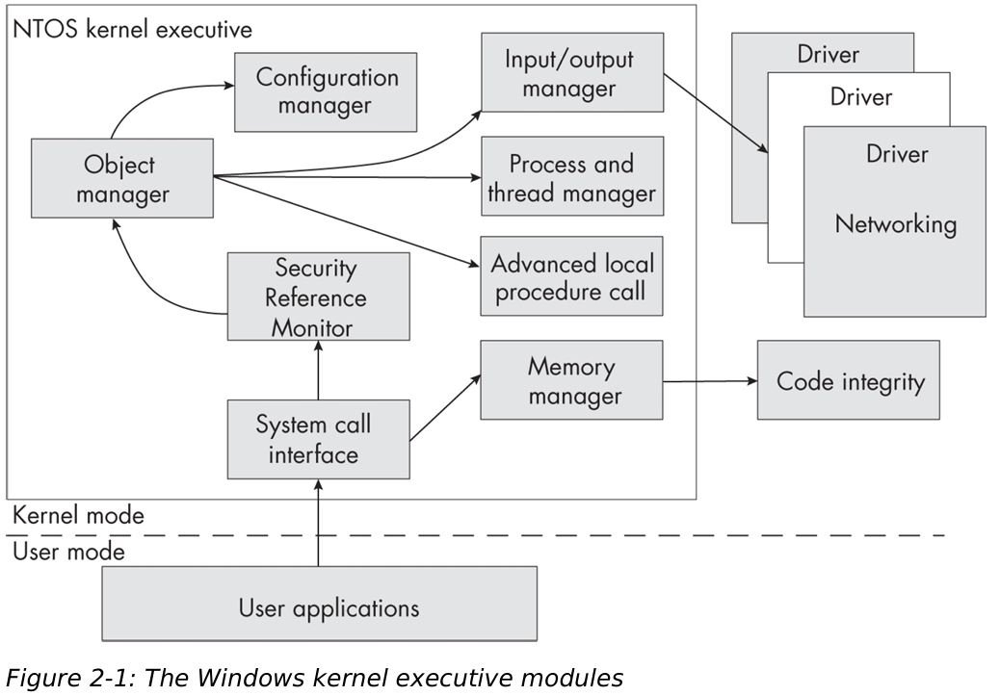

可以根据内核提供的API名来判断当前API是哪个模块提供的

| Prefix  | Subsystem                  | Example                   |
| ------- | -------------------------- | ------------------------- |
| Nt / Zw | System Call Interface      | NtOpenFile ZwOpenFile     |
| Se      | Security Reference Monitor | SeAccessCheck             |
| Ob      | Object Manager             | ObReferenceObjectByHandle |
| Ps      | Process and Thread Manager | PsGetCurrentProcess       |
| Cm      | Configuration Manager      | CmRegisterCallback        |
| Mm      | Memory Manager             | MmMapIoSpace              |
| Io      | Input/Output Manager       | IoCreateFile              |
| Ci      | Code Integrity             | CiValidateFileObject      |

### Security Reference Monitor

提供了一系列控制不同用户访问不同资源的机制

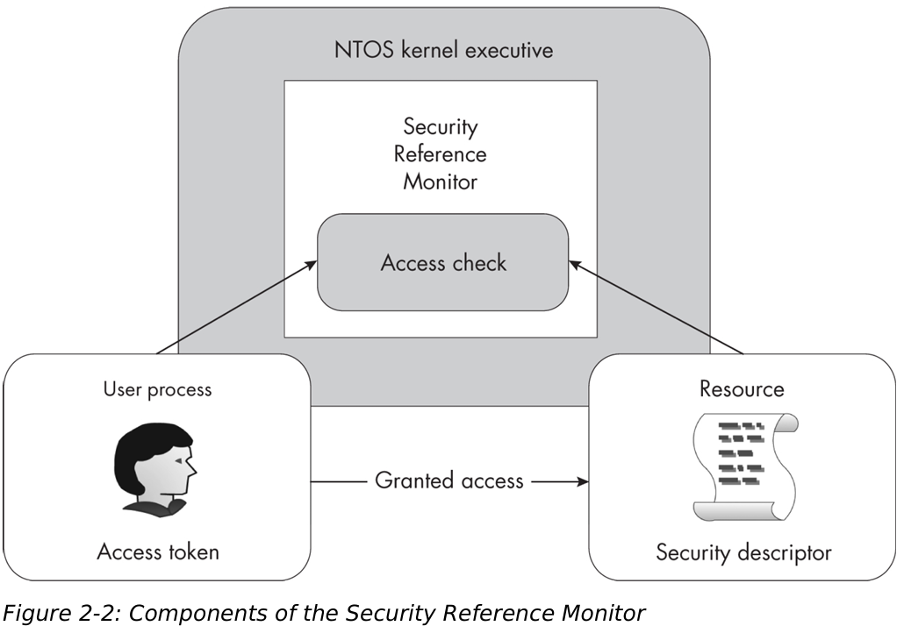

* Access Token   在进程创建时分配，定义了与该进程关联的用户身份，并由SRM管理

* Security Descriptor  定义了资源的访问权限

* Access Check  当用户进程试图访问资源时会触发该操作，该操作会对比Access Token和Security Descriptor，并判断最终是否可以访问，并且可以产生审计事件（默认关闭，因为相关事件数量太多）

#### SID与SDDL

用户和组都以SID（security identifier）表示，字面的SID在LSASS进程（Local Security Authority Subsystem）中被转换为二进制的SID

微软定义了一套语言 SDDL（Security Descriptor Definition Language）来表示SID，可以使用Get-NtSid来获取用户的SID。具体关于SID的内容在后面章节描述

### The Object Manager

在windows系统中，万物皆对象。许多内核对象都可以分配一个安全描述符来限制用户的权限

对象管理器用来管理这些内核对象，包括内存分配 生命周期等

#### Object Type

内核对象有众多类型，可以使用Get_NtType获取所有类型

#### The Object Manager Namespace

OMNS由Directory内核对象创建，因此结构类似文件目录；每个目录项都含有security descriptor，用于定义哪些用户可以访问以及创建该对象

可以使用`ls NtObject:\` 列出所有的OMNS对象

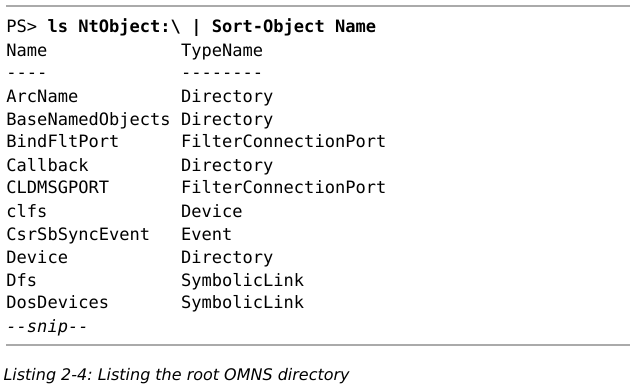

其中，Directory表示包含其他目录，SymbolicLink表示软链接到其他文件。可以查看其链接到的路径

```powershell
ls NtObject:\Dfs | Select-Object SymbolicLinkTarget
```

windows系统预定义了一系列OMNS目录

| Path              | 描述                               |
| ----------------- | -------------------------------- |
| \BaseNamedObjects | 用户对象的全局目录                        |
| \Device           | 设备的目录                            |
| \GLOBAL??         | 符号链接的全局目录，包括驱动器映射（drive mapping） |
| \KnownDlls        | knowndll映射                       |
| \ObjectTypes      | 命名对象类型（named object type）        |
| \Sessions         | 控制台会话                            |
| \Windows          | 与窗口管理器相关的对象                      |
| \RPC Control      | RPC端点（Remote Procedure Call）     |

#### System Calls

用户程序通过调用系统API间接在OMNS中创建对应的对象。一般相关的系统API由Nt或Zw开头。对于用户程序来说两者相同，对于内核程序来说，存在的一个区别是Zw前缀会更改安全检查的过程

相关系统调用一般是由 [操作动词][对象] 组成。操作包括

* Create

* Open

* QueryInformation

* SetInformation

##### System call中的安全属性

以NtCreateMutex为例

```c
NTSTATUS NtCreateMutant (
    HANDLE* FileHandle,
    ACCESS_MASK DesiredAccess,
    OBJECT_ATTRIBUTES* ObjectAttributes,
    BOOLEAN InitialOwner
);
```

其中第三个参数定义了对象的一些安全属性，OBJECT_ATTRIBUTES结构定义如下

```c
typedef struct _OBJECT_ATTRIBUTES {
  ULONG           Length;
  HANDLE          RootDirectory;
  PUNICODE_STRING ObjectName;
  ULONG           Attributes;
  PVOID           SecurityDescriptor;
  PVOID           SecurityQualityOfService;
} OBJECT_ATTRIBUTES;
```

* Length  长度，用于检查

* RootDirectory  是一个打开的内核对象句柄，该句柄用于查找ObjectName

* ObjectName  一个Unicode字符串，与RootDirectory共同组成内核对象路径
  
  ```
  如 \BaseNamedObjects\ABC，可以是
  RootDirectory = "\BaseNamedObjects", ObjectName = "ABC" 或
  RootDirectory = "", ObjectName = "\BaseNamedObjects\ABC"
  ```

* Attributes  对象的属性
  
  [_OBJECT_ATTRIBUTES (ntdef.h) - Win32 apps | Microsoft Learn](https://learn.microsoft.com/zh-cn/windows/win32/api/ntdef/ns-ntdef-_object_attributes)
  
  | Powershell Name             | 描述                                                                     |
  | --------------------------- | ---------------------------------------------------------------------- |
  | Inherit                     | 句柄可由当前进程的子进程继承                                                         |
  | Permanent                   | 仅适用于在对象管理器中命名的对象。若不指定该标志，关闭所有打开的句柄时会自动析构该内核对象；若指定该标志则不会。使用该标志可以永久化一个对象 |
  | Exclusive                   | 以独占方式访问对象                                                              |
  | CaseInsensitive             | 查找内核对象时忽略大小写                                                           |
  | OpenIf                      | 若存在对应内核对象，调用Create类API时优先打开现有对象                                        |
  | OpenLink                    | 仅被Configuration Manager使用。若当前对象是一个链接，则打开链接对象本身（而非打开链接引用的对象）            |
  | KernelHandle                | 句柄在系统进程上下文创建，只能在内核模式访问                                                 |
  | ForceAccessCheck            | 打开句柄时强制进行AccessCheck                                                   |
  | IgnoreImpersonatedDeviceMap | 解析DOS名称时使用，设备映射是DOS设备名与系统中设备间的映射                                       |
  | DontReparse                 | 分析关联对象的名称时不会遵循任何重新分析点                                                  |

```c
struct UNICODE_STRING {
    USHORT Length;            // 当前字符串长度
    USHORT MaximumLength;     // 总长度
    WCHAR* Buffer;
};
```

#### NTSTATUS Codes

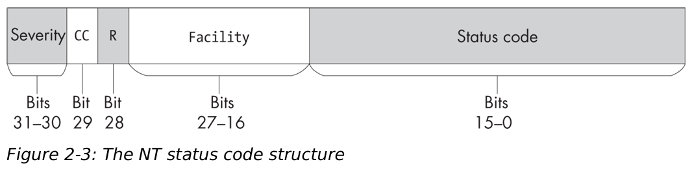

* Severity  表示返回值的严重性，若以32位有符号整数解析，错误相关的最高位都为1，因此相应的值为负数
  
  * STATUS_SEVERITY_SUCCESS  0
  
  * STATUS_SEVERITY_INFORMATIONAL  1
  
  * STATUS_SEVERITY_WARNING 2
  
  * STATUS_SEVERITY_ERROR 3

* CC  表示当前值是否由microsoft定义，为1表示是第三方自行定义的

* R  保留位，必须为0

* Facility  与错误相关的设备或子系统，微软预定义了50个相关的值
  
  * FACILITY_DEFAULT  0
  
  * FACILITY_DEBUGGER  1
  
  * FACILITY_NTWIN32  7

* Status Code  状态码

可以使用`Get-NtStatus`获取当前定义的状态码

#### Object Handles

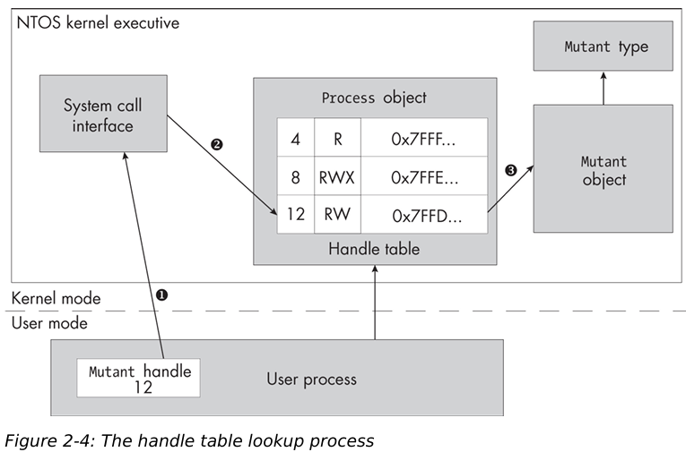

object manager用于管理内核对象，内核对象一般以句柄的形式返回给用户空间来标识对象，而在API接收到句柄参数时，一般需要先进行索引来找到句柄对应的内核对象（ObReferenceObjectByHandle）

在索引时，会运行两个检查

* 检查当前的用户是否有权限获取相应的对象

* 检查当前句柄指向的对象是否与API请求的对象类型一致

#### Access Masks

句柄表中存放了一个access mask，用于标识相应内核对象的访问权限。这个结构跟API中的DesiredAccess参数是一致的

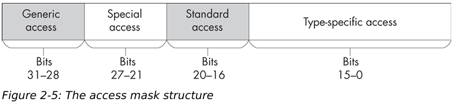

* Generic access  当使用DesiredAccess参数调用系统调用时会用到，包含四个访问权限
  
  * GenericRead
  
  * GenericWrite
  
  * GenericExecute
  
  * GenericAll

* Special access  大部分是保留的，但有下述特殊的属性
  
  * AccessSystemSecurity  读写对象的审计信息
  
  * MaximumAllowed  当进行access check的时候请求对象的最大权限

* Standard access  定义了标准的访问权限，包含
  
  * Delete  删除
  
  * ReadControl  读取对象的安全标识符
  
  * WriteDac  读取对象安全标识符的DAC
  
  * WriteOwner  写入对象的owner信息
  
  * Synchronize  等待内核对象，如该对象是个锁的情况

* Type-specific access  为不同的内核对象定义了相应的权限

注意，Access Mask对于用户是不可见的，内核对象都预定义了几种访问控制符号，这些符号对应了特定的Access Mask

```powershell
Get-NtType | Select-Object Name, GenericMapping
```

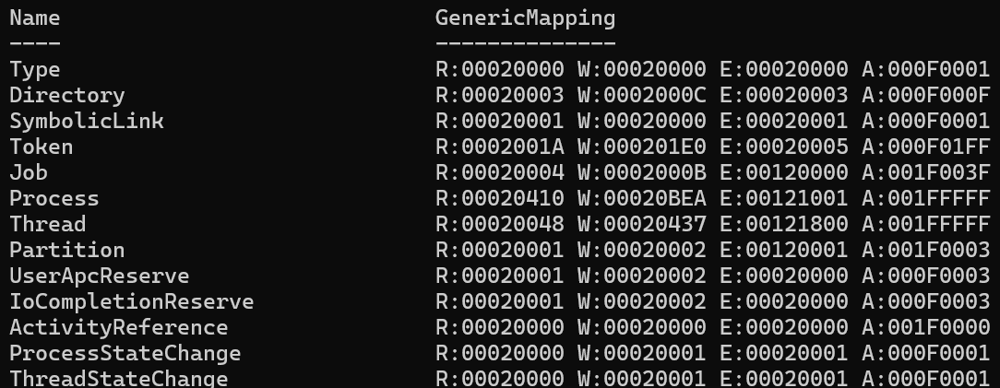

其中，R 读取  W 写入  E 执行  A 追加

书的84页进一步描述了怎么在powershell工具中获取不同对象预定义的Access Type，如何获取在SDK中对应的名字，以及如何查找名字对应的值

在WinAPI中，可以使用NtQuerySystemInformation获取所有handle，powershell中可以使用Get-NtHandle，书的88页说明了怎么使用powershell管理句柄

当内核对象不再被引用，其内存会被内核回收，若OMNS中存在相关内容也会被删除，但内核也允许创建永久对象，如在创建对象时指定Permanent或使用NtMakePermanentObject创建对象，此时需要有SeCreatePermanentPrivilege

在所有的内核对象中，File和Key是永久性存储的，因此其默认拥有永久的名字（路径），且不被OMNS管理。要删除的话必须显式使用相应的系统调用

#### Handle Duplication

可以使用NtDuplicateObject复制句柄，一般用于以下几个场景

* 增加句柄引用计数

* 将句柄传入其他进程

* 将权限受限的句柄传入其他进程，如本进程有读写权限，而传入其他进程的是只有只读权限的句柄。但不该依赖这种方法进行授权，因为若其他进程有权限访问这个资源，则它可以直接重新打开这个句柄对应的资源来获取写权限

第三种用法也说明同一个句柄在不同进程中可以有不同的Access Mask

在创建句柄时采用Inherit属性也类似句柄复制，可以使得子进程继承该句柄

此外若指定了ProtectFromClose，则进程中所有试图关闭句柄的操作都会失败

#### Query and Set Information System Calls

```c
NTSTATUS NtQueryInformationProcess(
    HANDLE Handle,
    PROCESS_INFORMATION_CLASS InformationClass,
    PVOID Information,
    ULONG InformationLength,
    PULONG ReturnLength
);

NTSTATUS NtSetInformationProcess(
    HANDLE Handle,
    PROCESS_INFORMATION_CLASS InformationClass,
    PVOID Information,
    ULONG InformationLength,
);
```

书94页说明了如何使用powershell调用这两个函数

### The Input/Output Manager

IO管理器主要就是管理与文件交互的驱动，而其他设备驱动本质上也都是文件驱动

一个driver（驱动）可以使用IoCreateDevice创建Device。一个驱动可以有0个（若不需要交互）到多个device

驱动都挂载在Device目录下，可以在powershell中使用下列指令列出驱动

```powershell
ls NtObject:\Device
```

实际上文件系统也是挂载在该目录下的，如notepad.exe实际上路径为

```
\Device\HarddiskVolume3\Windows\notepad.exe
```

其中`\Device\HarddiskVolume3`对应了文件系统的驱动，因此后面的路径`Windows\notepad.exe`作为参数被传给文件系统驱动

windows并不把网络协议栈作为系统调用实现，而是使用了一套称为AFD（Ancillary Function Driver）的驱动

### The Process and Thread Manager

进程和线程只能通过PID和TID进行打开和访问，而不能直接通过名字

PID为0的进程为Idle，是计算机空闲时运行的等待进程；PID为4的是System进程，该进程运行在内核态，当驱动或内核创建一个后台线程时就挂在该进程下

进程和线程的安全状态是分离的：即使没有权限访问进程，也有可能访问进程下对应的线程

### The Memory Manager

#### NtVirtualMemory Commands

基本内存操作及其需要的权限

| 操作     | 权限                      | 说明                      |
| ------ | ----------------------- | ----------------------- |
| 获取内存信息 | QueryLimitedInformation | NtQueryVirtualMemory    |
| 读取内存   | VmRead                  | NtReadVirtualMemory     |
| 写入内存   | VmWrite                 | NtWriteVirtualMemory    |
| 分配内存   | VmOpertion              | NtAllocateVirtualMemory |
| 释放内存   | VmOpertion              | NtFreeVirtualMemory     |
| 改变内存属性 | VmOpertion              | NtProtectVirtualMemory  |

内核中的内存页有三种状态：

* Commit  可用

* Reserve  保留

* Free  已释放

其中使用Reserve和Free内存都会导致crash，Reserve与Free的区别在于，Reserve相当于占了内存的位，之后还可以将该区域变为Commit

#### Section Objects

该对象是一种虚拟内存对象，一般用于

* 文件内存映射

* 共享内存

关键函数：NtMapViewOfSection

若在创建Section时指定OMNS路径，则可以被其他进程访问并用于共享内存，否则为匿名Section

Section的权限包含两个部分：创建Section时指定的权限与创建Section的内存映射时指定的权限，映射时的权限小于等于创建Section时的权限

此外，若知道其他进程的PID，可以将内存映射到这些进程

内存映射有三种类型

* Mapped  指定了文件的映射

* Anonymous  匿名映射

* Image  可执行文件的段映射

### Code Integrity

Windows提供了该子系统专门用于代码完整性校验（验签等）

一般签名有两种提供方式：嵌入在文件中或使用Catalog文件（.cat）

### Advanced Local Procedure Call

ALPC子系统提供了一套单独的LPC机制，为S/C架构，使用NtCreateAlpcPort创建服务端，NtConnectAlpcPort创建客户端连接

### The Configuration Manager

在OMNS为`\REGISTRY`

```powershell
ls NtObject:\REGISTRY
```

## User-Mode Applications

### Win32 and the User-Mode Windows APIS

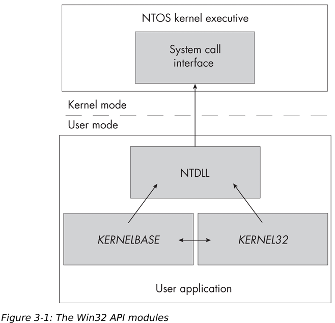

#### Searching for DLLs

在NT3.1中，查找顺序如下

* 可执行文件目录

* 当前工作目录

* System32

* Windows

* 环境变量

为了防止DLL劫持，在Vista改成了

* 可执行文件目录

* System32

* Windows

* 当前工作目录

* 环境变量

注意，可执行文件目录仍可能被劫持，因此对于特权进程，应该确保其目录只有特权用户可以写入。此外，还有一个潜在的安全问题：若传入LoadLibrary的名字不带`.dll`，函数会自动加上，如果传入的名字带了一个`.`，函数只会把`.`去掉；这里假设主程序在加载前校验了dll，但未加上扩展名（如LIB），而文件夹下存在`LIB.dll`，则会导致最终加载的文件与校验的文件不符

为了加快程序加载，内核在OMNS中为常用系统库设置了一个section `KnownDlls`，该段的dll都是加载在共享内存中的，由此也避免了系统库被劫持的问题

### The Win32 GUI

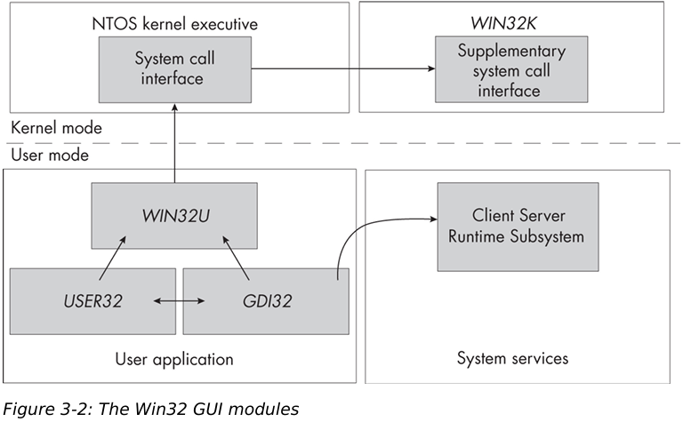

注意，这里GUI主要是由Win32K的驱动实现的。win10的时候kernel中的system call分发的代码嵌入到Win32U中以提高性能

此外，GUI API还需要跟特权进程CSRSSS交互（Client Server Runtime Subsystem）

#### GUI Kernel Resources

* Windows station  用于表示连接的屏幕与用户接口，比如鼠标键盘

* Window  与用户交互的GUI元素

* Desktop  用于表示桌面的对象

* Drawing resource  具体的GUI控件对象

在程序开始运行时，每个Process都会被分配一个Windows station（或使用NtUserSetProcessWindowStation指定），每个Thread都会被分配一个Desktop（或使用NtUserSetThreadDesktop）。一般来说所有的应用程序都在同一个WorkStation和Desktop下

Window则表示了一个应用程序的GUI单元，每个Desktop上有多个window，所有的窗口消息都在一个window中进行交互。window有被称为线程亲和性的特性，即只有创建窗口的线程可以处理消息，其他线程只能发送消息

#### Console Sessions

当用户登录时，Session Manager会为用户新建一个Console Session，该session会用于组织用户的Windows Station和Desktop对象。内核会在OMNS路径中创建该Session对象。Session对象由一个数字标记，从0开始

Session Manager在还未有用户登录时就会启动若干个进程，如CSRSS和WinLogon，来显示登录界面以及认证用户凭据

一般来说Windows只能拥有一个物理控制台（physical console），即连接了键盘鼠标的控制台；但通过RDP可以连接其他session。此外也可以切换物理控制台的登录用户，切换时先前用户的程序仍会在后台执行

每个Console Session都有独立的内存空间，因此不同Console Session可能存在多个同样的资源。

Session 0是给特权服务和系统管理使用的，因此该session一般不可能使用GUI

> SHATTER ATTACK
> 
> Vista前，服务和物理控制台都在session 0上，由于同一个session下的进程都可以向其他进程发送窗口消息，因此会导致称为SHATTER ATTACK的攻击：低特权的程序可以向高特权级程序发送窗口消息，如发送WM_TIMER可能触发高特权级进程调用消息提供的回调实现提权
> 
> Vista采用两种方法解决该问题：
> 
> * 将物理控制台从Session 0移除，使得用户程序无法直接与特权级程序交互
> 
> * 用户接口特权隔离（User Interface Privilege Isolation, UIPI），阻止低特权级程序与直接与高特权级程序交互

Console Session还有一个重要特性：当多个用户同时登录时，必会导致
