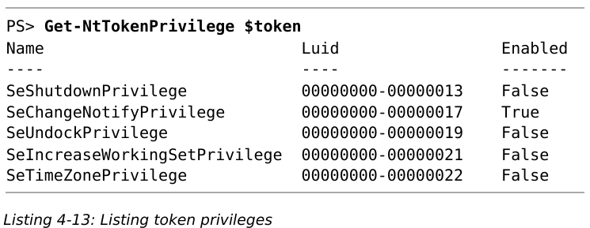
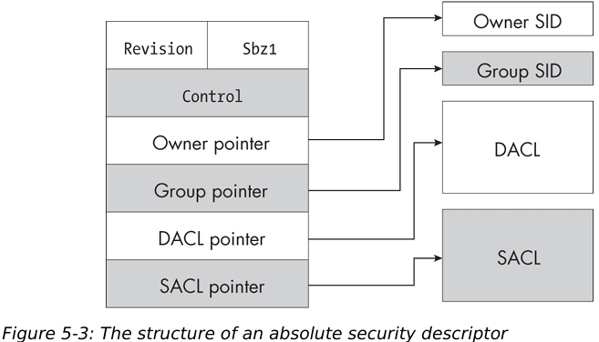
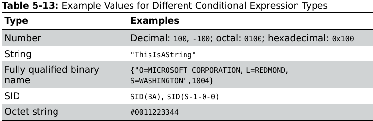
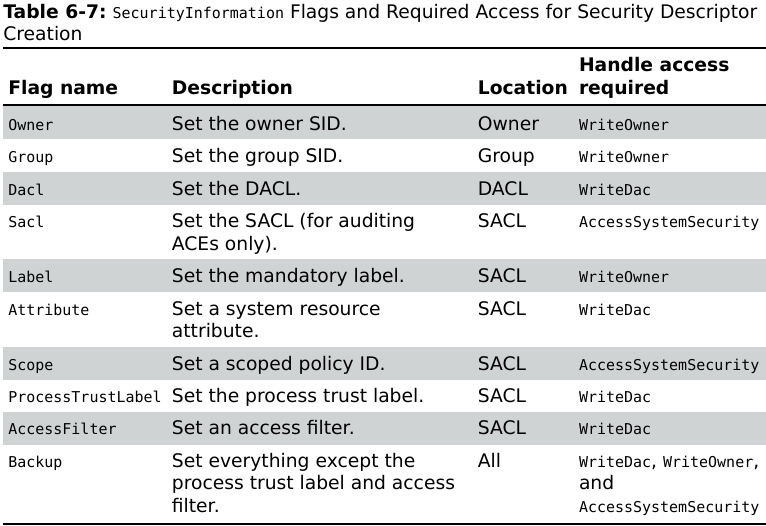

# PART I: AN OVERVIEW OF THE WINDOWS

## 1. Setting up a powershell testing environment

### Configuring Powershell

这边设置了powershell的执行权限。windows默认为Restricted，该权限禁止所有未签名的ps脚本运行；设置成了RemoteSigned，该权限只禁止了从浏览器或邮件下载的ps脚本运行

```powershell
Set-ExecutionPolicy -Scope CurrentUser -ExecutionPolicy RemoteSigned -Force
```

安装升级相关模块

```powershell
Install-Module NtObjectManager -Scope CurrentUser
Update-Module NtObjectManager
```

导入模块

```powershell
Import-Module NtObjectManager
```

### An Overview of the Powershell Language

#### 变量 类型 表达式

##### 变量

以`$`开头，如`$var`

powershell预定义了一系列变量

```
$null
$pwd
$pid
$env
```

可以用`Get-Variable`获取所有变量

##### 类型

都对应.net下的类型

| Type      | .net Type                    | Example          |
| --------- | ---------------------------- | ---------------- |
| int       | System.Int32                 | 142 0x8e 0216    |
| long      | System.Int64                 | 142L 0x8eL 0216L |
| string    | System.String                | "Hello" ‘World’  |
| double    | System.Double                | 1.0 1e10         |
| bool      | System.Boolean               | $true            |
| array     | System.Object[]              | @(1, "ABC")      |
| hashtable | System.Collections.Hashtable | @{A=1; B="ABC"}  |

其中string可以使用`"`或`'`包裹值，其中`'`是纯字面量，`"`则可以在其中使用转义，如

```powershell
$var = 42
"The Value is $var"
```

输出为 `The Value is 42`此外，双引号还支持转义字符，注意windows使用`\`作为路径分隔符，因此转义以`开头


##### 表达式


#### 执行命令

一般powershell函数的命名方式都为`[动词]-[名词]`，如`Get-Item`

传参方式有位置参数和关键字参数两种

```powershell
Get-Item C:\Windows
Get-Item -Path C:\Windows
$ret = Get-Item -Path C:\Windows
```

#### 查询指令与获取指令帮助

```powershell
# 查询指令
Get-Command -Name [pattern]
Get-Command -Module [ModuleName] -Name [pattern]

# 获取指令帮助文档
Get-Help [Command]
Get-Help [Command] -Parameter [ParameterName]
Get-Help [Command] -Examples
Get-Help [Command] -ShowWindow        # 会显示GUI帮助窗口

# 创建指令别名
New-Alias -Name [AliasName] -Value [Command]
```

#### 定义函数

```powershell
function Get-NameValue {
    param(
        [string]$Name = "",        # 指定参数类型，非必需
        $Value
    )
    return "$Name = $Value"
}


Get-NameValue -Name "Hello" -Value "World"
Get-NameValue "Hello" "World"
```

若未指定参数，则所有传入的参数会放入`$arg`变量，并使用`$arg[0]`这种方式调用

也可以将语句块赋值给一个变量，并由`&`或`Invoke-Command`调用

```powershell
$script = {Write-Output "Hello"}
& $script                 # 调用方式1
Invoke-Command $script    # 调用方式2
```

#### 对象的显示和处理

若不使用变量获取命令的结果，则会使用默认的formatter来输出对象的内容

可以通过一系列函数来筛选输出

* Select-Object  可以选择对象中的特定项

* Format-List  打印数组

* Format-Table  打印字典

* Get-Member  获取对象的特定成员

* Out-Host  分页显示

* Write-Host  直接写入到命令行，可以控制字体颜色等

* Out-GridView  打开显示字典的GUI

#### 筛选 排序 分组

* 筛选
  
  * Where-Object  提供一系列类似sql的模式进行筛选

* 排序
  
  * Sort-Object

* 分组
  
  * Group-Object

#### 导出数据

* Out-File

* Get-Content

* Export-Csv

* Export-CliXml

* 直接重定向

## 2. The Windows Kernel


可以根据内核提供的API名来判断当前API是哪个模块提供的

| Prefix  | Subsystem                  | Example                   |
| ------- | -------------------------- | ------------------------- |
| Nt / Zw | System Call Interface      | NtOpenFile ZwOpenFile     |
| Se      | Security Reference Monitor | SeAccessCheck             |
| Ob      | Object Manager             | ObReferenceObjectByHandle |
| Ps      | Process and Thread Manager | PsGetCurrentProcess       |
| Cm      | Configuration Manager      | CmRegisterCallback        |
| Mm      | Memory Manager             | MmMapIoSpace              |
| Io      | Input/Output Manager       | IoCreateFile              |
| Ci      | Code Integrity             | CiValidateFileObject      |

### Security Reference Monitor

提供了一系列控制不同用户访问不同资源的机制


* Access Token   在进程创建时分配，定义了与该进程关联的用户身份，并由SRM管理

* Security Descriptor  定义了资源的访问权限

* Access Check  当用户进程试图访问资源时会触发该操作，该操作会对比Access Token和Security Descriptor，并判断最终是否可以访问，并且可以产生审计事件（默认关闭，因为相关事件数量太多）

#### SID与SDDL

用户和组都以SID（security identifier）表示，字面的SID在LSASS进程（Local Security Authority Subsystem）中被转换为二进制的SID

微软定义了一套语言 SDDL（Security Descriptor Definition Language）来表示SID，可以使用Get-NtSid来获取用户的SID。具体关于SID的内容在后面章节描述

### The Object Manager

在windows系统中，万物皆对象。许多内核对象都可以分配一个安全描述符来限制用户的权限

对象管理器用来管理这些内核对象，包括内存分配 生命周期等

#### Object Type

内核对象有众多类型，可以使用Get_NtType获取所有类型

#### The Object Manager Namespace

OMNS由Directory内核对象创建，因此结构类似文件目录；每个目录项都含有security descriptor，用于定义哪些用户可以访问以及创建该对象

可以使用`ls NtObject:\` 列出所有的OMNS对象


其中，Directory表示包含其他目录，SymbolicLink表示软链接到其他文件。可以查看其链接到的路径

```powershell
ls NtObject:\Dfs | Select-Object SymbolicLinkTarget
```

windows系统预定义了一系列OMNS目录

| Path              | 描述                               |
| ----------------- | -------------------------------- |
| \BaseNamedObjects | 用户对象的全局目录                        |
| \Device           | 设备的目录                            |
| \GLOBAL??         | 符号链接的全局目录，包括驱动器映射（drive mapping） |
| \KnownDlls        | knowndll映射                       |
| \ObjectTypes      | 命名对象类型（named object type）        |
| \Sessions         | 控制台会话                            |
| \Windows          | 与窗口管理器相关的对象                      |
| \RPC Control      | RPC端点（Remote Procedure Call）     |

#### System Calls

用户程序通过调用系统API间接在OMNS中创建对应的对象。一般相关的系统API由Nt或Zw开头。对于用户程序来说两者相同，对于内核程序来说，存在的一个区别是Zw前缀会更改安全检查的过程

相关系统调用一般是由 [操作动词][对象] 组成。操作包括

* Create

* Open

* QueryInformation

* SetInformation

##### System call中的安全属性

以NtCreateMutex为例

```c
NTSTATUS NtCreateMutant (
    HANDLE* FileHandle,
    ACCESS_MASK DesiredAccess,
    OBJECT_ATTRIBUTES* ObjectAttributes,
    BOOLEAN InitialOwner
);
```

其中第三个参数定义了对象的一些安全属性，OBJECT_ATTRIBUTES结构定义如下

```c
typedef struct _OBJECT_ATTRIBUTES {
  ULONG           Length;
  HANDLE          RootDirectory;
  PUNICODE_STRING ObjectName;
  ULONG           Attributes;
  PVOID           SecurityDescriptor;
  PVOID           SecurityQualityOfService;
} OBJECT_ATTRIBUTES;
```

* Length  长度，用于检查

* RootDirectory  是一个打开的内核对象句柄，该句柄用于查找ObjectName

* ObjectName  一个Unicode字符串，与RootDirectory共同组成内核对象路径
  
  ```
  如 \BaseNamedObjects\ABC，可以是
  RootDirectory = "\BaseNamedObjects", ObjectName = "ABC" 或
  RootDirectory = "", ObjectName = "\BaseNamedObjects\ABC"
  ```

* Attributes  对象的属性
  
  [_OBJECT_ATTRIBUTES (ntdef.h) - Win32 apps | Microsoft Learn](https://learn.microsoft.com/zh-cn/windows/win32/api/ntdef/ns-ntdef-_object_attributes)
  
  | Powershell Name             | 描述                                                                     |
  | --------------------------- | ---------------------------------------------------------------------- |
  | Inherit                     | 句柄可由当前进程的子进程继承                                                         |
  | Permanent                   | 仅适用于在对象管理器中命名的对象。若不指定该标志，关闭所有打开的句柄时会自动析构该内核对象；若指定该标志则不会。使用该标志可以永久化一个对象 |
  | Exclusive                   | 以独占方式访问对象                                                              |
  | CaseInsensitive             | 查找内核对象时忽略大小写                                                           |
  | OpenIf                      | 若存在对应内核对象，调用Create类API时优先打开现有对象                                        |
  | OpenLink                    | 仅被Configuration Manager使用。若当前对象是一个链接，则打开链接对象本身（而非打开链接引用的对象）            |
  | KernelHandle                | 句柄在系统进程上下文创建，只能在内核模式访问                                                 |
  | ForceAccessCheck            | 打开句柄时强制进行AccessCheck                                                   |
  | IgnoreImpersonatedDeviceMap | 解析DOS名称时使用，设备映射是DOS设备名与系统中设备间的映射                                       |
  | DontReparse                 | 分析关联对象的名称时不会遵循任何重新分析点                                                  |

```c
struct UNICODE_STRING {
    USHORT Length;            // 当前字符串长度
    USHORT MaximumLength;     // 总长度
    WCHAR* Buffer;
};
```

#### NTSTATUS Codes


* Severity  表示返回值的严重性，若以32位有符号整数解析，错误相关的最高位都为1，因此相应的值为负数
  
  * STATUS_SEVERITY_SUCCESS  0
  
  * STATUS_SEVERITY_INFORMATIONAL  1
  
  * STATUS_SEVERITY_WARNING 2
  
  * STATUS_SEVERITY_ERROR 3

* CC  表示当前值是否由microsoft定义，为1表示是第三方自行定义的

* R  保留位，必须为0

* Facility  与错误相关的设备或子系统，微软预定义了50个相关的值
  
  * FACILITY_DEFAULT  0
  
  * FACILITY_DEBUGGER  1
  
  * FACILITY_NTWIN32  7

* Status Code  状态码

可以使用`Get-NtStatus`获取当前定义的状态码

#### Object Handles


object manager用于管理内核对象，内核对象一般以句柄的形式返回给用户空间来标识对象，而在API接收到句柄参数时，一般需要先进行索引来找到句柄对应的内核对象（ObReferenceObjectByHandle）

在索引时，会运行两个检查

* 检查当前的用户是否有权限获取相应的对象

* 检查当前句柄指向的对象是否与API请求的对象类型一致

#### Access Masks

句柄表中存放了一个access mask，用于标识相应内核对象的访问权限。这个结构跟API中的DesiredAccess参数是一致的


* Generic access  当使用DesiredAccess参数调用系统调用时会用到，包含四个访问权限
  
  * GenericRead
  
  * GenericWrite
  
  * GenericExecute
  
  * GenericAll

* Special access  大部分是保留的，但有下述特殊的属性
  
  * AccessSystemSecurity  读写对象的审计信息
  
  * MaximumAllowed  当进行access check的时候请求对象的最大权限

* Standard access  定义了标准的访问权限，包含
  
  * Delete  删除
  
  * ReadControl  读取对象的安全标识符
  
  * WriteDac  读取对象安全标识符的DAC
  
  * WriteOwner  写入对象的owner信息
  
  * Synchronize  等待内核对象，如该对象是个锁的情况

* Type-specific access  为不同的内核对象定义了相应的权限

注意，Access Mask对于用户是不可见的，内核对象都预定义了几种访问控制符号，这些符号对应了特定的Access Mask

```powershell
Get-NtType | Select-Object Name, GenericMapping
```


其中，R 读取  W 写入  E 执行  A 追加

书的84页进一步描述了怎么在powershell工具中获取不同对象预定义的Access Type，如何获取在SDK中对应的名字，以及如何查找名字对应的值

在WinAPI中，可以使用NtQuerySystemInformation获取所有handle，powershell中可以使用Get-NtHandle，书的88页说明了怎么使用powershell管理句柄

当内核对象不再被引用，其内存会被内核回收，若OMNS中存在相关内容也会被删除，但内核也允许创建永久对象，如在创建对象时指定Permanent或使用NtMakePermanentObject创建对象，此时需要有SeCreatePermanentPrivilege

在所有的内核对象中，File和Key是永久性存储的，因此其默认拥有永久的名字（路径），且不被OMNS管理。要删除的话必须显式使用相应的系统调用

#### Handle Duplication

可以使用NtDuplicateObject复制句柄，一般用于以下几个场景

* 增加句柄引用计数

* 将句柄传入其他进程

* 将权限受限的句柄传入其他进程，如本进程有读写权限，而传入其他进程的是只有只读权限的句柄。但不该依赖这种方法进行授权，因为若其他进程有权限访问这个资源，则它可以直接重新打开这个句柄对应的资源来获取写权限

第三种用法也说明同一个句柄在不同进程中可以有不同的Access Mask

在创建句柄时采用Inherit属性也类似句柄复制，可以使得子进程继承该句柄

此外若指定了ProtectFromClose，则进程中所有试图关闭句柄的操作都会失败

#### Query and Set Information System Calls

```c
NTSTATUS NtQueryInformationProcess(
    HANDLE Handle,
    PROCESS_INFORMATION_CLASS InformationClass,
    PVOID Information,
    ULONG InformationLength,
    PULONG ReturnLength
);

NTSTATUS NtSetInformationProcess(
    HANDLE Handle,
    PROCESS_INFORMATION_CLASS InformationClass,
    PVOID Information,
    ULONG InformationLength,
);
```

书94页说明了如何使用powershell调用这两个函数

### The Input/Output Manager

IO管理器主要就是管理与文件交互的驱动，而其他设备驱动本质上也都是文件驱动

一个driver（驱动）可以使用IoCreateDevice创建Device。一个驱动可以有0个（若不需要交互）到多个device

驱动都挂载在Device目录下，可以在powershell中使用下列指令列出驱动

```powershell
ls NtObject:\Device
```

实际上文件系统也是挂载在该目录下的，如notepad.exe实际上路径为

```
\Device\HarddiskVolume3\Windows\notepad.exe
```

其中`\Device\HarddiskVolume3`对应了文件系统的驱动，因此后面的路径`Windows\notepad.exe`作为参数被传给文件系统驱动

windows并不把网络协议栈作为系统调用实现，而是使用了一套称为AFD（Ancillary Function Driver）的驱动

### The Process and Thread Manager

进程和线程只能通过PID和TID进行打开和访问，而不能直接通过名字

PID为0的进程为Idle，是计算机空闲时运行的等待进程；PID为4的是System进程，该进程运行在内核态，当驱动或内核创建一个后台线程时就挂在该进程下

进程和线程的安全状态是分离的：即使没有权限访问进程，也有可能访问进程下对应的线程

### The Memory Manager

#### NtVirtualMemory Commands

基本内存操作及其需要的权限

| 操作     | 权限                      | 说明                      |
| ------ | ----------------------- | ----------------------- |
| 获取内存信息 | QueryLimitedInformation | NtQueryVirtualMemory    |
| 读取内存   | VmRead                  | NtReadVirtualMemory     |
| 写入内存   | VmWrite                 | NtWriteVirtualMemory    |
| 分配内存   | VmOpertion              | NtAllocateVirtualMemory |
| 释放内存   | VmOpertion              | NtFreeVirtualMemory     |
| 改变内存属性 | VmOpertion              | NtProtectVirtualMemory  |

内核中的内存页有三种状态：

* Commit  可用

* Reserve  保留

* Free  已释放

其中使用Reserve和Free内存都会导致crash，Reserve与Free的区别在于，Reserve相当于占了内存的位，之后还可以将该区域变为Commit

#### Section Objects

该对象是一种虚拟内存对象，一般用于

* 文件内存映射

* 共享内存

关键函数：NtMapViewOfSection

若在创建Section时指定OMNS路径，则可以被其他进程访问并用于共享内存，否则为匿名Section

Section的权限包含两个部分：创建Section时指定的权限与创建Section的内存映射时指定的权限，映射时的权限小于等于创建Section时的权限

此外，若知道其他进程的PID，可以将内存映射到这些进程

内存映射有三种类型

* Mapped  指定了文件的映射

* Anonymous  匿名映射

* Image  可执行文件的段映射

### Code Integrity

Windows提供了该子系统专门用于代码完整性校验（验签等）

一般签名有两种提供方式：嵌入在文件中或使用Catalog文件（.cat）

### Advanced Local Procedure Call

ALPC子系统提供了一套单独的LPC机制，为S/C架构，使用NtCreateAlpcPort创建服务端，NtConnectAlpcPort创建客户端连接

### The Configuration Manager

在OMNS为`\REGISTRY`

```powershell
ls NtObject:\REGISTRY
```

## 3. User-Mode Applications

### Win32 and the User-Mode Windows APIS


#### Searching for DLLs

在NT3.1中，查找顺序如下

* 可执行文件目录

* 当前工作目录

* System32

* Windows

* 环境变量

为了防止DLL劫持，在Vista改成了

* 可执行文件目录

* System32

* Windows

* 当前工作目录

* 环境变量

> 注意，可执行文件目录仍可能被劫持，因此对于特权进程，应该确保其目录只有特权用户可以写入。此外，还有一个潜在的安全问题：若传入LoadLibrary的名字不带`.dll`，函数会自动加上，如果传入的名字带了一个`.`，函数只会把`.`去掉；这里假设主程序在加载前校验了dll，但未加上扩展名（如LIB），而文件夹下存在`LIB.dll`，则会导致最终加载的文件与校验的文件不符
> 
> 为了加快程序加载，内核在OMNS中为常用系统库设置了一个section `KnownDlls`，该段的dll都是加载在共享内存中的，由此也避免了系统库被劫持的问题

### The Win32 GUI


注意，这里GUI主要是由Win32K的驱动实现的。win10的时候kernel中的system call分发的代码嵌入到Win32U中以提高性能

此外，GUI API还需要跟特权进程CSRSSS交互（Client Server Runtime Subsystem）

#### GUI Kernel Resources

* Windows station  用于表示连接的屏幕与用户接口，比如鼠标键盘

* Window  与用户交互的GUI元素

* Desktop  用于表示桌面的对象

* Drawing resource  具体的GUI控件对象

在程序开始运行时，每个Process都会被分配一个Windows station（或使用NtUserSetProcessWindowStation指定），每个Thread都会被分配一个Desktop（或使用NtUserSetThreadDesktop）。一般来说所有的应用程序都在同一个WorkStation和Desktop下

Window则表示了一个应用程序的GUI单元，每个Desktop上有多个window，所有的窗口消息都在一个window中进行交互。window有被称为线程亲和性的特性，即只有创建窗口的线程可以处理消息，其他线程只能发送消息

#### Console Sessions

当用户登录时，Session Manager会为用户新建一个Console Session，该session会用于组织用户的Windows Station和Desktop对象。内核会在OMNS路径中创建该Session对象。Session对象由一个数字标记，从0开始

Session Manager在还未有用户登录时就会启动若干个进程，如CSRSS和WinLogon，来显示登录界面以及认证用户凭据

一般来说Windows只能拥有一个物理控制台（physical console），即连接了键盘鼠标的控制台；但通过RDP可以连接其他session。此外也可以切换物理控制台的登录用户，切换时先前用户的程序仍会在后台执行

每个Console Session都有独立的内存空间，因此不同Console Session可能存在多个同样的资源。

Session 0是给特权服务和系统管理使用的，因此该session一般不可能使用GUI

> SHATTER ATTACK
> 
> Vista前，服务和物理控制台都在session 0上，由于同一个session下的进程都可以向其他进程发送窗口消息，因此会导致称为SHATTER ATTACK的攻击：低特权的程序可以向高特权级程序发送窗口消息，如发送WM_TIMER可能触发高特权级进程调用消息提供的回调实现提权
> 
> Vista采用两种方法解决该问题：
> 
> * 将物理控制台从Session 0移除，使得用户程序无法直接与特权级程序交互
> 
> * 用户接口特权隔离（User Interface Privilege Isolation, UIPI），阻止低特权级程序与直接与高特权级程序交互

Console Session还有一个重要特性：当多个用户同时登录时，必会导致名字冲突。因此Windows给每个Session创建了单独的BNO `\Sessions\<N>\BaseNamedObjects`和单独的Window `\Session\<N>\Windows`，其中`<N>`为session id。注意session 0没有单独的BNO，它用的是全局BNO

### Comparing Win32 APIs and System Calls

win32 API很多时候并不会直接wrap一个系统调用，而是会有一些区别

```c
HANDLE CreateMutexEx( 
    SECURITY_ATTRIBUTES* lpMutexAttributes, 
    const WCHAR*         lpName, 
    DWORD                dwFlags, 
    DWORD                dwDesiredAccess
);

NTSTATUS NtCreateMutant( 
    HANDLE*              MutantHandle, 
    ACCESS_MASK          DesiredAccess, 
    OBJECT_ATTRIBUTES*   ObjectAttributes, 
    BOOLEAN              InitialOwner 
); 
```

* Win32 API返回NTSTATUS，CreateMutexEx则直接返回handle。关于错误传播，内核函数通过NTSTATUS传播，可以调用`RtlNtStatusToDosError`，而Win32 API通过一个全局变量传播，可以使用`GetLastError`获取错误码

* Win32 API不接收OBJECT_ATTRIBUTES参数，而是将OBJECT_ATTRIBUTES的相关内容分成了两个参数进行接收
  
  * lpMutexAttributes  一个指向SECURITY_ATTRIBUTES
    
    ```c
    struct SECURITY_ATTRIBUTES { 
        DWORD  nLength; 
        VOID*  lpSecurityDescriptor; 
        BOOL   bInheritHandle; 
    }; 
    ```
  
  * lpName  对象名

* Win32 API中，名字参数lpName不是一个完整的OMNS路径，而是会自动地被放置到对应BNO文件夹下。如指定名字为`ABC`，则会放到`\Sessions\<N>\BaseNamedObjects\ABC`文件夹下。若想创建全局对象，则可以使用`Global\ABC`

* dwDesiredAccess与内核的DesiredAcce是直接映射，InitialOwner则由dwflags的一个枚举指定

#### Win32 Registry Paths

几个常用主键的OMNS路径

| 主键名                 | OMNS路径                                                                     |
| ------------------- | -------------------------------------------------------------------------- |
| HKEY_LOCAL_MACHINE  | \REGISTRY\MACHINE                                                          |
| HKEY_USERS          | \REGISTRY\USER                                                             |
| HKEY_CURRENT_CONFIG | \REGISTRY\MACHINE\SYSTEM\CurrentControlSet\Hardware Profiles\Current       |
| HKEY_CURRENT_USER   | \REGISTRY\USER\<SDDL SID>                                                  |
| HKEY_CLASSES_ROOT   | \REGISTRY\MACHINE\SOFTWARE\Classes  <br/>\REGISTRY\USER\<SDDL SID>_Classes |

> 注意：Win32API使用NUL结尾的字符串作为参数，而内核函数使用标记了长度的字符串作为参数，因此内核函数的路径可以包含NUL，这可能导致Win32API访问不到对应注册表，而内核函数可以情况，导致安全问题

#### DOS Device Paths

内核函数调用的是NT path，而Win32 API使用的是DOS path（即带盘符的路径）。NTDLL使用RtlDosPathNameToNtPathName做转换，例如`C:\Windows`会被转换成`\??\C:\Windows`，其中`\??`前缀称为DOS设备映射前缀（DOS device map prefix），它用于通知对象管理器查找盘符应分为两步：

* 查找用户的DOS设备映射目录 `Sessions\0\DosDevices\<AUTHID>`，其中AUTHID与session的token有关。注意这里所有的DOS设备映射都会放在session 0的目录下

* 若上一步没有找到，则会检查`\Global??`目录

由于会优先查找用户DOS目录，因此可以在这边创建磁盘的映射，且该映射可以将磁盘映射到某个目录下

##### Path Types

下面是几种路径的类型


由于DOS路径存在很多种不同写法，因此必须通过一个规范化（canonicalize）的过程进行转换。

> 像Linux这样的系统规范化主要在内核里做，但Windows将该过程前置到用户空间。这是因为Windows的subsystem设计初衷是可以兼容POSIX路径等，因此可以通过前置该规范化过程使得用户态的subsystem dll就可以处理这些路径问题

规范化包含下列处理过程：

* 处理`/`和`\`  Native路径只使用`\`作为分隔符，而DOS路径两者皆可，因此转换的一个主要操作就是将所有的正斜杠和反斜杠都转换为反斜杠

* 处理`.`和`..`  规范化过程会将所有的`.`删除，将`..`转换为上一级目录

* 若DOS路径以`\\?\`或`\??\`开头，则不会经过规范化过程，而是把其当作Native路径

> 文章提到在一些情况下`\??\`的写法可能会对Win32 API造成混淆，比如将其当作根驱动器路径下的文件而打开诸如`\??\C:\??\Path`的路径

默认状态下，DOS路径最长只能有260个字符，而Native路径长度为32767。但该限制可以通过一个注册表项修改，此外还需要程序的manifest文件支持LongPathAware选项，否则很多软件在编写时默认将260作为路径缓冲区的长度

### Process Creation

#### Command Line Parsing

最简单的一种创建进程的方式是将命令行传入CreateProcess

当传入命令行`notepad test.txt`时，操作如下：

* 按空格分割命令行字串（除非被双引号括起来），以第一个元素作为可执行文件名，若没有.exe后缀则加上

* 搜索可执行文件，在命令行中搜索可执行文件的顺序为：
  
  * 当前进程可执行文件所在目录
  
  * 当前工作目录
  
  * System32
  
  * Windows
  
  * 环境变量

* 若无法找到notepad.exe，则会将`"notepad test.txt"`整体作为文件进行查找，重新运行一遍上面查找可执行文件的逻辑。这里由于已经有`.txt`后缀，不会补上exe后缀。若notepad.exe被双引号括住则不会执行这一步

> 注意，这边可能有两类安全问题：
> 
> * 与DLL劫持类似的路径搜索问题
> 
> * 若第一个元素包含路径分隔符且无双引号，则会有一些额外的操作，如`C:\Program Files\abc.exe`（注意这里包含了一个空格）。程序会依次尝试搜索下列的文件
>   
>   * `C:\Program`
>   
>   * `C:\Program.exe`
>   
>   * `C:\Program Files\abc.exe`
>   
>   * `C:\Program Files\abc.exe.exe`
> 
> 这类安全问题的缓解方式为：在调用CreateProcess时对ApplicationName参数指定一个可执行文件路径

#### Shell APIs

```c
HINSTANCE ShellExecuteA(
  [in, optional] HWND   hwnd,
  [in, optional] LPCSTR lpOperation,
  [in]           LPCSTR lpFile,
  [in, optional] LPCSTR lpParameters,
  [in, optional] LPCSTR lpDirectory,
  [in]           INT    nShowCmd
);

BOOL ShellExecuteExA(
  [in, out] SHELLEXECUTEINFOA *pExecInfo
);

BOOL ShellExecuteExW(
  [in, out] SHELLEXECUTEINFOW *pExecInfo
);
```

使用ShellExecute函数与CreateProcess的最大区别在于，前者会为不同后缀名的文件查找其对应的处理软件，如传入某个txt文件，ShellExecute会拉起默认文本处理软件打开，而CreateProcess只会报文件不是可执行文件的错

后缀名对应的默认处理软件保存在注册表的HKEY_CLASSES_ROOT键中，ShellExecute执行时会搜索该注册表中对应的键。注册表中定义了多种行为，对应了对文件不同的操作，这些操作也可以作为参数传入ShellExecute

| 操作        | 描述                  |
| --------- | ------------------- |
| open      | 打开文件，是双击默认行为        |
| edit      | 编辑文件                |
| print     | 打印文件                |
| printto   | 使用指定的打印机打印          |
| explore   | 在文件管理器打开文件          |
| runas     | 以管理员身份打开，只适用于可执行文件  |
| runasuser | 以其他用户身份打开，只适用于可执行文件 |

### System Process

相当一部分系统服务是在用户空间运行的，这是因为内核代码难以编写，且出问题的话会导致crash

#### The Session Manager

Session Manager Subsystem（SMSS）是第一个用户态进程，其在系统启动时就开始运行，作用包含

* 加载known DLLs，创建section对象

* 启动其他子系统进程，如CSRSS

* 初始化基础的DOS设备，如串口

* 自动运行磁盘完整性校验

#### The Windows Logon Process

* 设置新的console session

* 显示用户登录界面

* 运行用户态字体驱动（user-mode font driver, UMFD）

* 运行桌面窗口管理器（desktop window manager, DWM）

#### The Local Security Authority Subsystem

LSASS，用于管理用户登录与认证

#### The Service Control Manaer

SCM，用于管理系统的服务。其中下列服务是一些系统关键服务

* Remote Procedure Call Subsystem（RPCSS）  用于管理 注册RPC端点，将RPC端口暴露到本地或网络

* DCOM Server Process Launcher  是RPCSS的一个关联项，曾经是RPCSS的一部分，用于启动本地以及远程的COM服务进程

* Task Scheduler  用于管理计划任务

* Windows Installer  用于安装程序和新特性

* Windows Update  用于升级

* Application Information  用于UAC控制（User Account Control）

# PART II: THE WINDOWS SECURITY REFERENCE MONITOR

ref: 

* [【windows 访问控制】一、访问令牌 - 小林野夫 - 博客园 (cnblogs.com)](https://www.cnblogs.com/cdaniu/p/15630161.html)

* [Windows 访问控制模型（一） | MYZXCG](https://myzxcg.com/2021/08/Windows-%E8%AE%BF%E9%97%AE%E6%8E%A7%E5%88%B6%E6%A8%A1%E5%9E%8B%E4%B8%80/)

## 4. SECURITY ACCESS TOKENS

### Primary Tokens

每个进程都会分配一个primary token（主令牌），该令牌用于描述进程的权限。当SRM进行access check时使用该token进行比较

可以使用`NtOpenProcessToken`获取当前进程的token，该操作需要QueryLimitedInformation权限

打开一个token对象后，可以请求下列权限

* AssignPrimary  将该token当作当前进程的primary token

* Duplicate  复制token对象

* Impersonate  模拟token对象

* Query  查询token的属性

* QuerySource  查询token对象的源（source）

* AdjustPrivileges  调整token对象的权限列表

* AdjustGroups  调整token对象的组列表

* AdjustDefault  调整未被其他权限覆盖的token对象属性

* AdjustSessionId  调整token对象的session ID

可以使用

```powershell
Show-NtToken -All
```

列出所有Token

Token包含一些重要属性


* User SID  用于标识用户，token中只保存了SID，上图中通过SID索引了用户名

* Token ID  Token对象的唯一标识符

* Authentication ID  标识了Token所属的logon session

* Origin Login ID  父logon session的身份验证标识符

* Modified ID  当Token值被修改时，该ID会变化

* Integrity Level  完整性级别，用于实现强制访问控制机制

* session ID  创建进程的session ID

当用户登录时，LSASS会为用户创建一个logon session（登录会话），该session会跟踪所有与该用户认证相关的资源（比如它会保存一份用户的credential）。logon session在创建时会分配一个独立的ID，这个ID就是每个进程中的Authentication ID，因此某个用户所有的进程都使用同一个ID（若某个用户在同一台机器上认证了两次，如注销后重新登录，则SRM会分配新的Authentication ID）

origin login ID标明了哪个logon session创建了token，若在计算机上登录了另一个账号，则该属性将用于调用该token的身份验证标识符（意思应该就是登录了另一个账号会更换session，但仍然可以使用这个域来调用原token）

SRM预定义了四个Authentication ID

| Authentication ID | User SID | Logon session username       |
| ----------------- | -------- | ---------------------------- |
| 00000000-000003E4 | S-1-5-20 | NT AUTHORITY\NETWORK SERVICE |
| 00000000-000003E5 | S-1-5-19 | NT AUTHORITY\LOCAL SERVICE   |
| 00000000-000003E6 | S-1-5-7  | NT AUTHORITY\ANONYMOUS LOGON |
| 00000000-000003E7 | S-1-5-18 | NT AUTHORITY\SYSTEM          |

> **LOCALLY UNIQUE IDENTIFIERS (LUID)**
> 
> 所有的token ID都是64位唯一值，可以调用NtAllocateLocallyUniqueId获取此类ID

### Impersonation Tokens

Impersonation Token（模拟令牌），对于系统服务来说很重要，因为它允许一个进程暂时模拟其他令牌来获取对资源的访问权限

模拟token被分配到线程粒度而非进程，一共有三种方法为一个线程分配模拟令牌

* 显式获取一个令牌对象，赋予Impersonate权限并使用SetThreadToken为该线程设置token

* 显式从一个含有DirectImpersonation权限的线程对象获取模拟令牌对象

* 隐式模拟一个RPC请求

第三种是最常见的形式，一个例子是，某个服务创建了一共命名管道服务器，程序就可以模拟一个客户端通过ImpersonateNamedPipe连接到该服务；当客户端在命名管道发出一个请求，内核会根据要调用的线程和进程捕获一个模拟上下文（Impersonation context），该模拟上下文会将模拟令牌分配给调用ImpersonateNamedPipe的线程。模拟上下文的内容可以基于线程上已有的模拟令牌，也可以是基于进程的主令牌

##### Security Quality of Service

相关文档 [客户端/服务器访问控制 - Win32 apps | Microsoft Learn](https://learn.microsoft.com/zh-cn/windows/win32/secauthz/client-server-access-control)

SQoS，用于控制其他服务是否能够模拟当前线程的令牌，场景主要是服务端为了安全，希望使用客户端的安全上下文而不是服务端本身的安全上下文来访问资源

当打开命名管道服务器 DDE服务器等，可以在OBJECT_ATTRIBUTES结构的SecurityQualityOfService域传入SECURITY_QUALITY_OF_SERVICE结构来指定一些访问控制属性，该结构包含3类属性

* 模拟等级（Impersonation Level），用于控制当前线程令牌是否可以被模拟
  
  * Anonymous  服务无法模拟或标识客户端
    
    最小的访问权限，只允许有限的几个服务访问线程令牌，其他服务打开或查询令牌的操作都会被拒绝
  
  * Identification  服务可以获取客户端的标识和特权，但不能模拟客户端
    
    允许服务打开 查找令牌 用户ID 用户组和权限，但模拟令牌无法访问任何安全资源
  
  * Impersonation  服务可以在本地系统上模拟客户端的安全上下文
    
    允许服务打开和操作用户的令牌，可以访问本地用户的所有远程资源，但若用户是一个远程认证的用户，则无法访问其资源（如SMB）
  
  * Delegation  服务可以在远程系统上模拟客户端的安全上下文
    
    最高权限，可以访问远程认证用户的资源（但还需要远程服务器有相应配置）

* 上下文跟踪模式（Context Tracking Mode）
  
  开启该模式时，服务会静态地获取用户的令牌（即调用者进程的主令牌），否则动态获取，在动态获取的情况下调用者可以传入一个模拟令牌（只有在Impersonation或Delegation等级下才能传入）

* 有效令牌模式（effective token mode）
  
  若不启用，服务可以在其中更改传入令牌的权限和组，之后再应用这个令牌

> 模拟等级为Anonymous与使用ANONYMOUS LOGON令牌登录不一样，前者无论资源的安全等级设置为什么都无法通过access check
> 
> Kernel实现了一个函数NtImpersonateAnonymousToken使程序可以获取ANONYMOUS用户的token

默认情况下若打开IPC时不设置SQoS结构，调用者默认以Impersonation、上下文跟踪开启、有效令牌模式关闭 的方式启动。当一个线程尝试获取另一个线程的模拟上下文时，该线程的模拟等级必须大于等于被捕获线程的模拟等级，这可以防止一个低模拟等级的用户伪装成一个高模拟等级的用户调用RPC

```powershell
# 获取当前线程主令牌
$token = Get-NtToken
# 创建模拟等级Impersonation的模拟令牌，并试图获取OMNS根目录
# 该操作可以成功
Invoke-NtToken $token {
    Get-NtDirectory -Path "\"
} -ImpersonationLevel Impersonation

# 以Identification等级访问，该操作会失败
Invoke-NtToken $token {
    Get-NtDirectory -Path "\"
} -ImpersonationLevel Identification
```

##### Explicit Token Impersonation

有两种显式获取模拟令牌的方法

* 若当前能获取一个含有Impersonate权限的模拟令牌，则可以调用NtSetInformationThread将该令牌赋予给某个线程

* 若要模拟的线程有Direct Impersonation权限，则可以调用NtImpersonateThread将该线程的模拟令牌分配给其他线程。该函数调用后内核会获取被模拟线程的模拟上下文执行目标线程，就像隐式模拟中通过命名管道进行调用一样

### Converting Between Token Type

可以通过NtDuplicateToken复制（duplication）的方式在两种token类型（即主令牌和模拟令牌）间转换，该操作会对token进行深拷贝，区别于线程句柄的复制操作（该操作只引用先前的token）。复制token需要Duplicate权限

```powershell
# 将一个主令牌以Delegation模拟等级复制为一个模拟令牌
$imp_token = Copy-NtToken -Token $token -ImpersonationLevel Delegation

# 将该模拟令牌复制为主令牌
$pri_token = Copy-NtToken -Token $imp_token -Primary
```

复制操作与模拟等级相关，无法复制一个Anonymous或Identification模拟等级的令牌，这样可以防止程序通过将一个低模拟等级的模拟令牌复制为主令牌来绕过SQoS检查

```powershell
# 将一个主令牌以Identification模拟等级复制为一个模拟令牌
$imp_token = Copy-NtToken -Token $token -ImpersonationLevel Identification

# 下面操作会报错
$pri_token = Copy-NtToken -Token $imp_token -Primary
```

### Pseudo Token Handles

token有三种伪句柄（pseudo handle），以此让程序可以在不打开自身token句柄的情况下查询token属性，括号里是句柄值。该特性主要是方便进程或线程查询自身的token属性

* Primary (-4)  当前进程主令牌

* Impersonation (-5)  当前线程模拟令牌，若当前线程没有进行模拟则会返回错误

* Effective (-6)  若当前线程在模拟，则返回模拟令牌，否则返回主令牌

```powershell
# 使用模拟等级为Anonymous的令牌以伪句柄方式获取主令牌。该操作将返回正常的用户
Invoke-NtToken -Anonymous {Get-NtToken -Pseudo -Primary | Get-NtTokenSid}

# 使用模拟等级为Anonymous的令牌以伪句柄方式获取模拟令牌。该操作将返回NT ANONYMOUS
Invoke-NtToken -Anonymous {Get-NtToken -Pseudo -Impersonation | Get-NtTokenSid}
```

### Token Groups

ref:

* [TOKEN_GROUPS (winnt.h) - Win32 apps | Microsoft Learn](https://learn.microsoft.com/zh-cn/windows/win32/api/winnt/ns-winnt-token_groups)

若管理员需要为每一个用户设置可以访问的资源，则一般会使用分组的功能进行管理

从SRM的视角来看，一个组也由一个SID标识，并可以定义对各个资源访问权限

令牌组定义如下

```c
typedef struct _TOKEN_GROUPS {
  DWORD              GroupCount;
#if ...
  SID_AND_ATTRIBUTES *Groups[];
#else
  SID_AND_ATTRIBUTES Groups[ANYSIZE_ARRAY];
#endif
} TOKEN_GROUPS, *PTOKEN_GROUPS;
```

SID_AND_ATTRIBUTES结构包含一个SID和对应的属性，属性描述了对应SID的特性，包括

* Enabled EnabledByDefault  该组SID启用（默认启用）
  
  当设置Enabled时，表示令牌组SID被启用，当对token进行access check时SRM会考虑令牌组权限。拥有EnabledByDefault属性的令牌组SID默认被启用

* Mandatory  无法禁用该组SID
  
  当拥有AdjustGroups权限时，可以通过NtAdjuestGroupsToken禁用令牌组SID；但无法禁用包含Mandatory属性的令牌组SID。所有正常的用户令牌组都设置了该属性，但一些系统令牌组没有设置该属性
  
  在传递模拟令牌时，若某个令牌组失能，且传递模拟令牌时没有打开[有效令牌模式](#Security Quality of Service)，则在传递的令牌中会删除这些失能令牌组的信息

* LogonId  SID是Logon SID
  
  标记Logon SID。例如使用runas作为不同用户运行一个进程时，新进程的token中Logon ID项与调用runas的进程是相同的，这个行为使得SRM可以授予该进程某个会话特定资源的访问权限

* Owner  SID是令牌的所有者，或可以将SID分配为令牌所有者
  
  系统上所有的安全资源都有一个所属的用户SID或组SID，token在创建资源时会默认将拥有该属性的SID设为owner

* UseForDenyOnly  SID是受限令牌中的仅拒绝SID
  
  考虑下列情况，一个文档希望A组的用户可以访问，B组的不能访问，如果一个用户c既属于A又属于B，那么它可以禁用自己的B组属性来访问文档，而若为该用户添加UseForDenyOnly属性可以防止其访问文档，从而解决这个问题

* Integrity IntegrityEnabled  SID是强制完整性SID / 强制完整性启用SID
  
  该SID用于标识token的完整性等级（integrity level）。系统预定义了7个默认的完整性等级
  
  
  
  

* Resource 表示组SID是一个domain local SID

token还可以拥有设备组（device groups），当用户登录远程服务器或资源时这些SID被加入到组中

### Privileges

组是系统管理员用来控制用户访问资源权限的工具，而特权则是让用户可以暂时通过安全检查来访问大多数资源的方法



当拥有AdjustPrivileges权限时，可以使用NtAdjustPrivileges修改token权限

在用户程序中，使用NtPrivilegeCheck检查特权，内核程序中则使用SePrivilegeCheck

下列是一些系统可用的特权

* SeChangeNotifyPrivilege  允许用户接收文件/注册表变化的通知，此外可以用于通过traversal检查

* SeAssignPrimaryTokenPrivilege / SeImpersonatePrivilege  允许用户直接通过对主令牌 / 模拟令牌赋值的检查。该权限必须在当前进程主令牌上启用才生效

* SeBackupPrivilege / SeRestorePrivilege  允许用户在打开注册表/文件时直接通过检查，主要用于备份/恢复程序，避免操作时无法获取对应文件权限

* SeSecurityPrivilege / SeAuditPrivilege  前者允许用户获取AccessSystemSecurity权限，该权限可以修改资源的审计配置；后者则允许用户程序产生审计事件

* SeCreateTokenPrivilege  该权限允许用户使用NtCreateToken生成任意令牌

* SeDebugPrivilege  允许用户在打开一个进程或线程对象时直接通过检查

* SeTcbPrivilege  包含了一系列内核相关操作

* SeLoadDriverPrivilege  允许程序通过NtLoadDriver加载驱动（该特权无法绕过诸如驱动签名检查等机制）

* SeTakeOwnershipPrivilege / SeRelabelPrivilege  首先该特权允许用户获取资源的WriteOwner权限，其中SeTakeOwnershipPrivilege允许用户成为资源的owner，SeRelabelPrivilege可以直接通过对资源的强制标签（mandatory label）检查

### Sandbox Tokens

windows通过三类token提供了一套沙箱机制来限制进程对资源的访问

#### Restricted Tokens

使用NtFilterTolen或CreateRestrictedToken创建，上述API生成一系列指定的限制令牌来限制对资源的访问。在进行access check的时候，该过程不仅可以接收正常的SID组，也可以接收限制令牌列表

NtFilterToken函数还可以将进程的SID组转为UseForDenyOnly属性，且删除其特权。可以通过创建限制令牌，结合删除原令牌的一些权限来实现沙箱功能

```powershell
$token = Get-NtToken -Filtered -RestrictedSids RC -SidsToDisable WD -Flags DisableMaxPrivileges
# 
Get-NtTokenGroup $token -Attributes UseForDenyOnly
# Name     Attributes
# ----     ----------
# Everyone UseForDenyOnly
Get-NtTokenGroup $token -Restricted
# Name                    Attributes
# ----                    ----------
# NT AUTHORITY\RESTRICTED Mandatory, EnabledByDefault, Enabled
Get-NtTokenPrivilege $token
# Name                    Luid              Enabled
# ----                    ----              -------
# SeChangeNotifyPrivilege 00000000-00000017 True
$token.Restricted
# True
```

创建了一个限制令牌，该令牌被映射到RC（NT AUTHORITY\RESTRICTED），并指定了WD（Everyone组）的属性为UseForDenyOnly，最后指定了一个选项来尽量取消该token的特权。后面四行代码都是展示创建的令牌的属性

#### Write-Restricted Tokens

也属于限制令牌的一种，但只限制了写权限。可以通过在NtFilterToken中传入WRITE_RESTRICTED创建。但这种限制令牌实用性比较低，因为它无法阻止应用读取敏感信息

```powershell
$token = Get-NtToken -Filtered -RestrictedSids WR -Flags WriteRestricted
```

使用WR，表示该令牌会被映射到NT AUTHORITY\WRITE RESTRICTED

#### AppContainer and Lowbox Tokens

使用NtCreateLowBoxToken创建，当创建该类token时，需要指定一个Package SID和capability SID列表，前者类似正常令牌中的User SID，后者则类似于限制令牌的SID

capability SID分为两类

* Legacy  包含了一系列简单的预定义SID来限制程序可使用的资源

* Named  该类SID的RID由给定字串派生，如上面的WR代表`NT AUTHORITY\WRITE RESTRICTED`，这类别名见书中附录B

下表展示了Legacy中预定义的SID


### What Makes an Administrator User

在linux中，UID为0的root用户拥有最高权限，可以做任意操作。但在windows中Administrator并不可以执行任意操作，相反是可以限制Administrator的各种权限的。windows中与root拥有类似权限的用户是system

Administrator有三个主要特性

* 当某个用户被配置为Administrator，默认会将其加入`BUILTIN\Administrators`组

* Administrator会被赋予一些额外的权限，如SeDebugPrivilege

* Administrator运行的完整性等级为High，系统服务则运行在System等级

书中提供了一些方法判断一个token是否为Administrator，包括Elevated属性、一些可用的特权以及一些特殊的RID

完整性等级为High的token不一定是Administrator，反过来Administrator也可能运行在低完整性等级，但某些特权要求进程运行在高完整性等级

### User Account Control

Windows默认在安装时第一个创建的账户具有Administrator权限，但在Vista之前没有对相关行为进行限制，导致用户可能默认使用的都是Administrator账号。Vista之后引入了UAC机制，该机制下默认用户仍是Administrator，但默认会禁用Administrator组相关权限，当需要运行Administrator程序时系统会弹出UAC窗口，若通过则提权运行该程序

若一个程序默认需要管理员权限执行，则会调用RPC函数RAiLaunchAdminProcess，另一种显式采用管理员权限运行进程的方式是使用runas执行ShellExecute

#### Linked Tokens and Elevation Type

对于Administrator用户，windows采用一种称为split-token的方式，该token分为两部分

* Limited  非特权的token，用于运行大多数程序

* Full 为一个Administrator token，只有在提权后才能用

split-token有一个域将上述两部分token链接，称为linked token

#### UI Access

Vista的另一个安全机制是用户接口权限隔离（User Interface Privilege Isolation，UIPI），可以防止低权限用户与高权限用户程序进行交互。但这里有一个问题，就是程序需要跟键盘 鼠标等进行交互，因此token可以设置一个叫UI access的标志，若设置了该标志则与桌面环境进行交互时不需要经过UIPI

需要通过ShellExecute函数创建有UI access权限的进程

#### Virtualization

UAC机制带来的一个问题是，一些老程序会往现在只有管理员有权限的文件夹或注册表写入，因此引入了一个标志位，当该标志位使能时，会将这些程序对系统文件夹的读写重定位到用户目录下，如`C:\Windows`重定位到`C:\Users\<User>\AppData\Local\VirtualStore\Windows`

### Security Attributes

一个token的安全属性可能包含三类：local / user claims / device claims

可能有下列数据类型

每个安全属性值都可以有下述标志位


几乎所有进程的token都含有`TSA://ProcUnique`这个安全属性，该安全属性会在进程创建时分配一个LUID。以该属性为例

```powershell
> Show-NtTokenEffective -SecurityAttributes
SECURITY ATTRIBUTES
-------------------
Name             Flags                  ValueType Values
----             -----                  --------- ------
TSA://ProcUnique NonInheritable, Unique UInt64    {568, 1508775258}
```

这里的安全属性值由两个UInt64组成，标志为NonInheritable和Unique，前者代表该安全属性不会被传递给该进程创建的新进程token，后者代表当内核发现同名安全属性时不能进行自动合并

设置local安全属性需要SeTcbPrivilege，user claims和device claims则只能在创建token时设置

### Creating Tokens

LSASS在用户登录时会为其创建token，同时也有其他可以创建token的场景，比如一些用于服务的虚拟账号

当拥有SeCreateTokenPrivilege时，可以使用NtCreateToken创建任意令牌

ref: [NtCreateToken - NtDoc (m417z.com)](https://ntdoc.m417z.com/ntcreatetoken)

```c
NTSYSCALLAPI
NTSTATUS
NTAPI
NtCreateToken(
    _Out_ PHANDLE TokenHandle,
    _In_ ACCESS_MASK DesiredAccess,
    _In_opt_ POBJECT_ATTRIBUTES ObjectAttributes,
    _In_ TOKEN_TYPE Type,
    _In_ PLUID AuthenticationId,
    _In_ PLARGE_INTEGER ExpirationTime,
    _In_ PTOKEN_USER User,
    _In_ PTOKEN_GROUPS Groups,
    _In_ PTOKEN_PRIVILEGES Privileges,
    _In_opt_ PTOKEN_OWNER Owner,
    _In_ PTOKEN_PRIMARY_GROUP PrimaryGroup,
    _In_opt_ PTOKEN_DEFAULT_DACL DefaultDacl,
    _In_ PTOKEN_SOURCE Source
    );
```

* Type  主令牌还是模拟令牌

* AuthenticationId  令牌的Authentication ID，可以任意设置

* ExpirationTime  令牌在多久后失效

* User  User SID

* Groups  令牌组的SID列表

* Privileges  需要的特权列表

* Owner  可选，指向新创建对象默认owner的SID，其中owner必须是一个用户或用户组，且包含SE_GROUP_OWNER属性

* PrimaryGroup  可选，指向新创建对象默认primary group的SID，该值必须是前面Groups参数指定的组中包含的用户或组

* Source  该token的创建者

此外，通过调用NtCreateTokenEx还可以提供下列额外参数

* DeviceGroups  设备的SID列表

* DeviceAttributes  device的安全属性列表

* UserAttributes  用户的安全属性列表

* MandatoryPolicy  用于指定token的强制完整性策略

### Token Assignment

如果一个普通用户可以分配任意主令牌或模拟令牌，则在涉及模拟令牌的场景中可以任意访问其他用户的资源。因此SRM设计了一套机制限制那些没有SeAssignPrimaryTokenPrivilege和SeImpersonationPrivilege的普通用户的权限

#### Assigning a Primary Token

进程以以下三个方式分配主令牌。主令牌只能在进程开始前设置，一旦进程开始，就不能对其进行更改

* 从父进程继承，最常见

* 创建进程时，如使用CreateProcessAsUser

* 在进程执行前通过NtSetInformationProcess设置

若不是以父进程继承的方式传递，则令牌需要有AssignPrimary的访问权限，并且会以句柄的形式赋值给进程。在赋值令牌前SRM会进行其他检查以防止进程获得高权限token（除非调用者的主令牌有SeAssignPrimaryTokenPrivilege）

内核函数SeIsTokenAssignableToProcess执行令牌检查，首先会检查待分配令牌的完整性等级是否小于等于当前进程的主令牌，其次会检查令牌是否为调用者主令牌的子令牌，或是否为调用者主令牌的同级令牌（基于现有令牌的相同认证会话创建的令牌，其父令牌ID和认证ID与现有令牌相同），其中还会检查当前认证会话是否为特殊的同级会话（一个罕见的配置，具体见书）。该函数不会检查当前token的用户SID


runas命令就是使用CreateProcessWithLogon函数，从系统服务创建一个对应用户的进程

书上使用一个实例讲解了令牌检查的一些特性，建议理解一下

#### Assigning an Impersonation Token

前文讲述模拟令牌时说过如何分配模拟令牌，若是显式创建，则句柄必须有Impersonate权限

模拟令牌的检查由SeTokenCanImpersonate完成，该检查比较复杂


注意，windows系统允许B进程给A进程的线程分配模拟令牌，因此需要说明下面关于主令牌检查都是线程所在进程的主令牌，而非线程令牌对应的主令牌

* 若令牌模拟等级为Identification或Anonymous，或令牌的认证ID为anonymous用户，直接通过（因为这些设置不会导致安全风险）

* 若有SeImpersonatePrivilege权限，则直接通过

* 比较主令牌和模拟令牌的完整性等级，仅当主令牌大于等于模拟令牌时通过

* 比较认证ID（Authentication ID）和初始登录ID（origin login ID）
  
  * 若模拟令牌的初始登录ID等于主令牌的认证ID，则通过
    
    > 本章之前讨论过，普通用户的初始登录ID都被设置为SYSTEM用户的认证ID，这是因为认证进程是以SYSTEM用户运行的。因此SYSTEM进程只要满足完整性等级的检查就可以模拟任何用户的令牌，即使没有SeImpersonatePrivilege权限
  
  * 否则继续下列检查

* 检查主令牌的用户SID是否等于模拟令牌的用户SID，若不等则拒绝，否则继续下列检查
  
  > 该项检查用于防止进程在没有获得其他用户凭据的情况下获取该用户的模拟令牌。若需要模拟其他用户，LSASS在生成模拟令牌时会将其初始登录ID设置成调用者的认证ID，从而让有相应凭据的调用可以直接通过上一个检查

* 检查Elevated标志，若模拟令牌设置了该标志而主令牌没有，则拒绝
  
  >  该检查用于防止通过获取一个管理员令牌来提权，在win10前没有这项检查

* sandboxing相关检查。若模拟的是一个lowbox令牌，其package SID必须相同，或是主令牌的限制package SID
  
  > 该检查确保调用者获取的模拟令牌沙箱限制不会比原来的lowbox令牌少。但该检查并不比较capabilities列表，因为对于一个限制令牌，其只能创建一个限制令牌，对于写限制令牌也一样。SRM使用其他机制来防止获取一个限制更少的sandbox令牌

* 检查当前会话是否为session 0，若是则拒绝
  
  > 该项检查用于防止用户获取一个session 0的模拟令牌

**注意：** 若检查没有通过，函数不会直接拒绝分配令牌，而是将传入的令牌复制一份，并且将其模拟等级设置为Identification。因此即使分配失败，线程仍然可以检查令牌的属性

## 5. SECURITY DESCRIPTORS

### The Structure of a Security Descriptor

```c
typedef struct _SECURITY_DESCRIPTOR {
  BYTE                        Revision;
  BYTE                        Sbz1;
  SECURITY_DESCRIPTOR_CONTROL Control;
  PSID                        Owner;
  PSID                        Group;
  PACL                        Sacl;
  PACL                        Dacl;
} SECURITY_DESCRIPTOR, *PISECURITY_DESCRIPTOR;
```

由七个部分组成

* Revision  版本，总为1

* Sbzl  可选的资源管理标志，由活动目录（Active Directory）使用

* Control  控制位，定义了安全描述符定义的哪些组件可用、安全描述符和组件如何建立以及当将安全描述符应用到对象时应如何处理)
  
  

* Owner  【可选】所有者SID，可以是单用户也可以是用户组。owner有对自己资源的完全控制，并且系统会防止资源对owner锁定的操作

* Group  【可选】组SID，基本没用，以前用来适配POSIX子系统的

* Sacl  【可选】自由访问控制列表（discretionary access control list, DACL），包含一系列访问控制入口（Access Control Entry，ACE），用于定义资源的访问权限，具体见后文

* Dacl  【可选】系统访问控制列表（security access control list, SACL），也包含一系列ACE，用于定义资源的安全审计事件，以及一些其他信息

当控制位为DaclPresent/SaclPresent时，设置的DACL/SACL才生效，可以指定其为NULL，表示该ACL没有定义安全性，SRM会忽略该ACL。与之区分，不包含ACE的称为empty ACL，此时定义了ACL但没有包含ACE

### The Structure of a SID

ref: [安全标识符 | Microsoft Learn](https://learn.microsoft.com/zh-cn/windows-server/identity/ad-ds/manage/understand-security-identifiers)


包含四个部分

* Revision  总是为1

* Relative identifier count  SID中包含的RID数量

* Security authority  标识符颁发机构，可以是任意值，windows预定义了下列值)
  
  

* Relative identifiers  标识用户或组的32位数

书中用下列几个例子来说明SID的组成

* `BUILTIN  S-1-5-32`  Revision:1，标识符颁发机构5，包含一个RID 32，该RID为domain SID

* `BUILTIN\Users  S-1-5-32-545`  32为domain SID，545为该组下该用户的SID

### Absolute and Relative Security Descriptors

内核支持两种安全描述符格式，绝对和相对，根据属性SelfRelative来决定当前描述符采用的哪种表示


两种格式的头都是一样的，为32位，分别为8位版本，8位资源管理标志和16位控制位

两种格式的区别只在于后面4个元素的存储方式，绝对格式后面存了4个指针指向对应的元素，相对格式则使用偏移量来表示




下面是一个例子


### Access Control List Headers and Entries

#### The Header

ACL由一个头部和多个ACE组成


ACL头部定义如下


Sbz1和Sbz2为保留位，Revision则支持下列值，若版本不一致则ACL不可用

* Default  默认版本，值为2，支持所有基本ACE类型

* Compound  值为3，在基本ACE类型的基础上添加对一些复合ACE类型的支持

* Object  值为4，在Compound基础上添加对一些对象的支持

#### The ACE List


对包含头部和具体的数据，头部对于所有类型的ACE都一样

ACE flags主要定义了ACE的继承规则


下面为所有的ACE类型


三类ACE结构如下

* Normal ACE，即Default指定的格式
  
  * Access Mask（32bit）
  
  * SID（变长）

* Compound ACE，模拟时使用，它可以同时向模拟的调用方和进程用户提供访问权限（这句话没太懂），新版windows中似乎被弃用
  
  * Access Mask（32bit）
  
  * Compound ACE type（16bit）  设为1，表示该ACE用于模拟
  
  * Reserved  （16bit）为0
  
  * Server SID（变长）对应服务用户的SID
  
  * SID（变长）模拟用户的SID

* Object ACE，用于Active Directory Domain Services。Active Directory使用128位GUID来表示一个目录服务对象类型（directory service object type）
  
  * Access Mask（32bit）
  
  * Flags（32bit）用于指示存在下列哪些GUID
  
  * Object Type（16Byte）目录服务对象类型的GUID
  
  * Inherited Object Type（16Byte）继承的对象GUID
  
  * SID（变长）

一条ACE可能比上面描述的结构大，因为ACE可能会需要一些额外空间来放置一些非结构化数据，如callback类型的ACE，定义了在进行access check时需要使用的条件表达式

Win8前内核没有对callback类型的条件表达式支持，因此需要调用AuthzAccessCheck函数来处理这类回调，而Win8之后不仅保留了原来的方法，还内置了一些条件表达式解析

### Constructing and Manipulating Security Descriptors

#### Creating a New Security Descriptor

介绍了怎么用powershell创建安全描述符并且添加属性和ACL

#### Ordering the ACEs

由于access check的检查顺序，ACL的排序需要满足一些排序规则。注意SRM本身并不会对ACL的排序进行检查，其相信传入的ACL排序满足规范

* 所有Denied类型的ACE必须在Allowed类型前

* 所有Allowed类型的ACE必须在Allowed类型的对象ACE前

* 所有Denied类型的ACE必须在Denied类型的对象ACE前

* 所有非继承的ACE必须在设置了Inherited标志的ACE前

书中还展示了如何使用powershell检查并重新按规范排序ACL

#### Formatting Security Descriptors

该节主要讲了如何在powershell中打印安全描述符

#### Converting to and from a Relative Security Descriptor

该节主要讲了如何在powershell中将二进制数组转换为安全描述符

### The Security Descriptor Definition Language

安全描述符定义语言（SDDL）

ref: [Security Descriptor String Format - Win32 apps | Microsoft Learn](https://learn.microsoft.com/en-us/windows/win32/secauthz/security-descriptor-string-format)

#### SID

由下列几个元素组成

* S  前缀字母，用于表示该字符串是一个SDDL SID

* 版本号，SID的revision字段，为1

* 标识符颁发机构，SID的security authority字段，有下列预定义值
  
  

* 两个RID（relative identifier），用于表示用户组和用户

SID本质类似文件夹的层级结构，`S-1`是统一的，第三个值表示颁发机构，第四个值（RID 0）表示用户组，第五个值（RID 1）代表用户

#### 安全描述符

SDDL也可以用于定义安全描述符，但需要注意的是，某些安全描述符的控制位或者ACE类型并没有对应的SDDL描述，因此SDDL并不能定义所有种类的安全描述符

##### 基本构成

包含四类前缀

* O  Owner SID

* G  Group SID

* D  DACL

* S  SACL

系统预定义了一些SID的别名


##### ACL

其中ACL定义的格式为

```
ACLFlags(ACE0)(ACE1)...(ACEn)
```

ACLFlags位包含了安全描述符的控制位（Control）中与DACL和SACL有关的位


##### ACE

每个ACE的格式如下

```
(Type;Flags;Access;ObjectType;InheritedObjectType;SID[;ExtraData])
```

Type部分取值如下，SDDL都采用缩写来代表对应的类型


第二个值为Flags，即ACE的flags域，取值与对应缩写的表为


第三个值为Access，该值可以是八进制/十进制/十六进制数，也可以是一个Access string列表


注意上表并没有包含所有的访问权限标志，这是因为SDDL一开始是为描述目录服务对象（Directory Service Object）设计的

为了扩展SDDL的描述能力，语言也额外提供了一些对注册表和文件的访问权限标志的别名


第4、5个值为ObjectType和InheritedObjectType，用于object ACE中。SDDL使用字符串格式的GUID，下列为一些预定义的GUID


第6个值为SID，即ACE的SID域

最后一个组件是一些可选的附加信息，比如在callback ACE中指定了条件表达式，或是在ResourceAttribute ACE中指定了安全属性

##### 条件表达式

SDDL语法定义了四类条件表达式元素

* Simple  用于引用本地安全属性，如`WIN://TokenId`

* Device  用于声明设备，如`@Device.ABC`

* User  用于声明用户，如`@User.XYZ`

* Resource  用于资源属性，如`@Resource.QRS`

表达式中的类型有5类



一元运算符主要包含下列几种

| 运算符                             | 描述                                          |
| ------------------------------- | ------------------------------------------- |
| Exists ATTR                     | 是否存在安全属性ATTR                                |
| Not_Exist ATTR                  |                                             |
| Member_of {SIDLIST}             | 令牌组是否包含SIDLIST中所有的SID                       |
| Not_Member_of {SIDLIST}         |                                             |
| Device_Member_of {SIDLIST}      | 令牌设备组（token device group）是否包含SIDLIST中所有的SID |
| Not_Device_Member_of {SIDLIST}  |                                             |
| Member_of_Any {SIDLIST}         | 令牌组是否包含SIDLIST中的任意SID                       |
| Not_Member_of_Any {SIDLIST}     |                                             |
| Device_Member_Any {SIDLIST}     | 令牌设备组是否包含SIDLIST中的任意SID                     |
| Not_Device_Member_Any {SIDLIST} |                                             |
| !(EXPR)                         | 逻辑非                                         |

二元运算符主要包含下列几种

| 运算符                         | 描述                   |
| --------------------------- | -------------------- |
| ATTR Contains VALUE         | 安全属性ATTR是否包含值VALUE   |
| ATTR Not_Contains VALUE     |                      |
| ATTR Any_of {VALUELIST}     | 列表中是否存在任意值等于安全属性ATTR |
| ATTR Not_Any_of {VALUELIST} |                      |
| ATTR == VALUE               | 安全属性ATTR是否等于VALUE    |
| ATTR != VALUE               |                      |
| ATTR < VALUE                |                      |
| ATTR <= VALUE               |                      |
| ATTR > VALUE                |                      |
| ATTR >= VALUE               |                      |
| EXPR && EXPR                | 逻辑与                  |
| EXPR \|                     | EXPR                 |

下面以一个包含条件表达式的callback ACE为实例

```
(ZA;;GA;;;WD;(WIN://TokenId == "XYZ"))


类型: AllowCallbackObject
flags: 无
Access: Generic All
ObjectType: 无
InheritedObjectType: 无
SID: Everyone
条件表达式: WIN://TokenId == "XYZ"
```

##### Resource ACE

这类ACE格式如下

```
"AttrName",AttrType,AttrFlags,AttrValue(,AttrValue...)
```

* AttrName  安全属性的名称

* AttrType  安全属性类型，包含下列值
  
  

* AttrFlags  一个hex数，表示安全属性标志（flags）

* AttrValue  一个或多个值，与安全属性类型相关

##### Mandatory Label

SACL中定义的一种ACE，主要的格式与普通ACE基本相同，除了两个点

* Access域用于表示强制性策略，包括
  
  | Access string | Access name   | Access mask |
  | ------------- | ------------- | ----------- |
  | NX            | No Execute Up | 0x00000004  |
  | NR            | No Read Up    | 0x00000002  |
  | NW            | No Write Up   | 0x00000001  |

* SID域用于表示mandatory label的完整性等级，主要有下列值
  
  | SID alias | Name              | SDDL SID     |
  | --------- | ----------------- | ------------ |
  | LW        | 完整性等级 Low         | S-1-16-4096  |
  | ME        | 完整性等级 Medium      | S-1-16-8192  |
  | MP        | 完整性等级 Medium Plus | S-1-16-8448  |
  | HI        | 完整性等级 High        | S-1-16-12288 |
  | SI        | 完整性等级 System      | S-1-16-16384 |

##### 实例

下面通过一个实例来解析安全描述符的各个组件

```
O:WD
G:WD
D:AI(D;;GA;;;AN)(A;;CCDC;;;S-1-5-21-2318445812-3516008893-216915059-1002)(A;;CC;;;WD)
S:P(AU;FA;SD;;;WD)(ML;;NW;;;LW) 

Owner: Everyone
Group: Everyone
DACL: 属性 DaclAutoInherited
    ACE0: 
        类型: Denied
        flags: 无
        Access: Generic All
        ObjectType: 无
        InheritedObjectType: 无
        SID: NT AUTHORITY\ANONYMOUS LOGON
    ACE1:
        类型: Allowed
        flags: 无
        Access: Create Child/Delete Child
        ObjectType: 无
        InheritedObjectType: 无
        SID: S-1-5-21-2318445812-3516008893-216915059-1002
    ACE2:
        类型: Allowed
        flags: 无
        Access: Create Child
        ObjectType: 无
        InheritedObjectType: 无
        SID: Everyone
SACL: 属性 SaclProtected
    ACE0:
        类型: Audit
        flags: FailedAccess
        Access: Delete
        ObjectType: 无
        InheritedObjectType: 无
        SID: Everyone
    ACE1:
        类型: MandatoryLabel
        flags: 无
        Access: No Write Up
        ObjectType: 无
        InheritedObjectType: 无
        SID: 完整性等级Low
```

## 6. READING AND ASSIGNING SECURITY DESCRIPTORS

### Reading Security Descriptors

可以调用NtQuerySecurityObject

```c
__kernel_entry NTSYSCALLAPI NTSTATUS NtQuerySecurityObject(
  [in]  HANDLE               Handle,
  [in]  SECURITY_INFORMATION SecurityInformation,
  [out] PSECURITY_DESCRIPTOR SecurityDescriptor,
  [in]  ULONG                Length,
  [out] PULONG               LengthNeeded
);
```

* Handle  要获取安全描述符的内核对象句柄

* SecurityInformation  要获取的安全描述符属性，不同属性需要不同的权限来获取
  
  

绝大多数操作都需要ReadControl权限，而只有Sacl只要求AccessSystemSecurity，但要获取该权限我们需要申请SeSecurityPrivilege特权，即读取审计日志在windows系统中是一个特权操作

### Assigning Security Descriptors

#### Assigning a Security Descriptor During Resource Creation

内核在创建一个新资源时会分配一个安全描述符，对于不同资源安全描述符的存放位置不同，比如文件的安全描述符需要存放在硬盘中，而一些临时的内核对象由对象管理器管理安全描述符

内核提供了一系列函数为新的资源分配安全描述符，其中最常用的函数是SeAssignSecurityEx，该函数对应的ntdll导出函数为

```c
NTSYSAPI
NTSTATUS
NTAPI
RtlNewSecurityObjectEx(
    _In_opt_ PSECURITY_DESCRIPTOR ParentDescriptor,
    _In_opt_ PSECURITY_DESCRIPTOR CreatorDescriptor,
    _Out_ PSECURITY_DESCRIPTOR *NewDescriptor,
    _In_opt_ GUID *ObjectType,
    _In_ BOOLEAN IsDirectoryObject,
    _In_ ULONG AutoInheritFlags, // SEF_*
    _In_opt_ HANDLE Token,
    _In_ PGENERIC_MAPPING GenericMapping
    );
```

* Creator security descriptor  可选参数，新分配的安全描述符基于该描述符

* Parent security descriptor  可选参数，新资源父对象的安全描述符

* Object type  可选，正在创建对象类型的GUID

* Container  指示新资源是否是container

* Auto-inherit  一系列标志位，定义了继承的行为

* Token  创建者令牌的句柄

* Generic mapping  一个映射表，表示了通用访问权限到内核类型特定访问权限的映射

> 下面以CreateMutant创建锁对象为例，说明这类函数是以什么参数调用SeAssignSecurityEx的
> 
> * Creator security descriptor  SECURITY_ATTRIBUTES结构的lpSecurityDescriptor属性
> 
> * Parent security descriptor  父目录的安全描述符，对于匿名锁对象来说为NULL
> 
> * Object type  没设置
> 
> * Container  设为False
> 
> * Auto-inherit
>   
>   * 若父安全描述符的控制位包含DaclAutoInherited位，且创建者无安全描述符或描述符中DACL缺失，则设为AutoInheritDacl
>   
>   * 若父安全描述符的控制位包含SaclAutoInherited位，且创建者无安全描述符或描述符中SACL缺失，则设为AutoInheritSacl
> 
> * Token  若调用者是模拟线程，则设置为模拟令牌，否则设置为调用者的主令牌
> 
> * Generic mapping  设置为mutant特定的映射
> 
> 这里没有设置Object type的原因是该参数并不被对象管理器或IO管理器使用，该属性主要用于控制Active Directory的继承

Auto-inherit参数除了上述两个值，还可以取下列值


SeAssignSecurityEx函数最重要的参数就是父安全描述符和创建者安全描述符，下面同样以NtCreateMutant为例讨论各种情况，在书中有具体的powershell实例讲解，这里只记录了实例中归纳出的行为

##### Setting Only the Creator Security Descriptor

若指定了lpSecurityDescriptor属性，且是匿名的锁对象，则在创建安全描述符时不会指定Parent security descriptor，因此auto-inherit标志不会被设置

此时安全描述符会从传入的token获取Owner和PrimaryGroup属性作为安全描述符的owner和group；当函数获取token的owner作为owner SID时，会检查creator的owner SID是否包含于token的user SID或group SID，若不是则无法分配；除非token拥有SeRestorePrivilege权限，或是Auto-inherit参数设置了AvoidOwnerCheck标志（直接调用内核函数创建对象时不会设置该标志）才能绕过该检查

对于group则不会有安全检查，因为group在access check中并没有什么作用

但SACL有相关限制：若在creator安全描述符的SACL中定义了审计类ACE，则内核将申请SeSecurityPrivilege

在使用诸如NtCreateMutant的函数创建内核对象时，最终得到的内核对象安全描述符中DACL权限可能与我们传入的Creator安全描述符的DACL权限不同，如书中举的例子，Creator的DACL中只有一个有`GenericRead`权限的ACE，但创建出的锁对象DACL对应的ACE则是`ModifyState|ReadControl`权限。这是因为内核在创建对象时会传入一个权限映射表，将通用的安全描述符权限映射为相应内核对象的特定权限。除非ACE设置了`InheritOnly`标志取消这类映射行为

##### Setting Neither the Creator nor the Parent Security Descriptor

Owner和Group同样直接从token继承，DACL则采用token定义的默认DACL

> 注意，如果直接创建一个匿名锁对象，且不提供创建者和父安全描述符，则内核会创建一个没有安全信息的锁对象，这是因为内核允许一些对象不包含任何访问控制信息，因为并不是所有内核对象都会在不同进程间共享，如匿名锁对象理论上不会共享，因此也没有必要设置其访问控制属性
> 
> 但对于匿名对象，仍有可能通过进程间通信共享对象句柄来实现匿名对象的共享，此时应该注意程序的安全性，因为对于没有安全描述符的对象而言，即使可以在传句柄前移除一些权限来控制其他进程的行为，其他进程仍可以通过复制句柄来重新获取这些权限。此外win8以后NtDuplicateObject添加了一个参数，用于告诉内核如果之后还有复制句柄的操作，会拒绝所有申请额外权限的请求

##### Setting Only the Parent Security Descriptor

在这种情况下就需要考虑继承相关的规则

* 若父安全描述符没有设置任何Control位
  
  * Owner和Group从传入的token继承，与父安全描述符无关
  
  * ACE，主要由ACE Flags控制对象继承的行为
    
    总体而言，如下表：对象分为container对象和非container对象，ACE flags在不同类型对象中有不同的继承规则
    
    | Parent ACE flags                                          | Non-container object | Container object                   |
    | --------------------------------------------------------- | -------------------- | ---------------------------------- |
    | None                                                      | 不继承                  | 不继承                                |
    | ObjectInherit                                             | None                 | ObjectInherit<br/>InheritOnly      |
    | ContainerInherit                                          | 不继承                  | ContainerInherit                   |
    | ObjectInherit<br/>NoPropagateInherit                      | None                 | 不继承                                |
    | ContainerInherit<br/>NoPropagateInherit                   | 不继承                  | None                               |
    | ContainerInherit<br/>ObjectInherit                        | None                 | ContainerInherit<br/>ObjectInherit |
    | ContainerInherit<br/>ObjectInherit<br/>NoPropagateInherit | None                 | None                               |
    
    * 若没有设置继承相关的ACE标志，则从token继承默认DACL
    
    * 若设置了ObjectInherit（一般用在锁对象等），则新对象会直接继承该ACE的访问权限
      
      ```
      父描述符ACE
          BUILTIN\Users: (Allowed)(ObjectInherit, InheritOnly)(GenericAll)
      新描述符的ACE
          BUILTIN\Users: (Allowed)(None)(Full Access)
      ```
    
    * 若设置了ContainerInherit（一般用在文件夹对象等），则新对象不仅会继承该ACE的访问权限，还会复制一份该ACE用于子对象的继承
      
      ```
      父描述符ACE
          BUILTIN\Users: (Allowed)(ContainerInherit, InheritOnly)(GenericAll)
      新描述符的ACE
          BUILTIN\Users: (Allowed)(None)(Full Access)
          BUILTIN\Users: (Allowed)(ContainerInherit, InheritOnly)(GenericAll)
      ```
      
      但若ACE设置了NoPropagateInherit标志，则不会复制
    
    * 若设置了ObjectInherit，但新对象是个Container对象，则新对象会传递该ACE，并且自动设置一个InheritOnly属性
      
      ```
      父描述符ACE
          BUILTIN\Users: (Allowed)(ObjectInherit)(GenericAll)
      新描述符的ACE
          BUILTIN\Users: (Allowed)(ObjectInherit, InheritOnly)(Full Access)
      ```

* 若父安全描述符设置了Control位，这里主要讨论DaclAutoInherit
  
  ```
  父描述符ACE
  <DACL> (Auto Inherited)
      BUILTIN\Users: (Allowed)(ObjectInherit, InheritOnly)(GenericAll)
  新描述符的ACE
  <DACL> (Auto Inherited)
      BUILTIN\Users: (Allowed)(Inherited)(Full Access)
  ```
  
  使用该控制位进行继承与上面讨论的使用ACE标志进行继承除了粒度不一样，还有一个区别就是在用户模式下可以获知哪些ACE是由其他安全描述符继承的

> 注意，在继承时存在ACE标志位对于不同类型的安全描述符定义不一致的问题。如书中的例子，父安全描述符（Directory类型）的ACE使用的标志位为GenericAll，但直接继承到Mutant对象时，该ACE对应的属性则为`ModifyState|Delete|ReadControl|WriteDac|WriteOwner`，这是因为对于Directory类型而言，GenericAll的值为0x000F000F，而对于Mutant类型可用的属性掩码为0x001F0001，因此继承时会将属性值更改为0x000F0001。这是个比较严重的问题，因为这意味着继承后的Mutant对象ACE缺少了Synchronize权限
> 
> 对于这个问题，有两类情景
> 
> * 对于父安全描述符与新描述符类型相同的情况，可以直接在创建时指定通用的访问权限，在调用RtlNewSecurityObjectEx创建新对象时就会根据传入的GenericMapping将其映射为特定对象的对应访问标志
> 
> * 对于父安全描述符与新描述符类型不同的情况，父安全描述符的访问标志已经转换为了特定对象的访问标志。对于这种情况可以对ACE额外设置一个InheritOnly标志，该标志表示该条ACE只用于继承，而不用于对象本身的访问控制，这种情况下在创建父安全描述符时不会对ACE标志进行转换，即其标志还是通用标志

##### Setting Both the Creator and Parent Security Descriptors

情况比较复杂，分几类讨论

* 父安全描述符未设置Control位
  
  * 父安全描述符没有可继承的DACL
    
    * 使用类似于仅设置Creator的继承模式，即若Creator存在DACL，则直接复制，否则使用token的默认DACL
  
  * 父安全描述符存在可继承的DACL
    
    * Creator无DACL，则继承父安全描述符的DACL
    
    * Creator有DACL，则复制Creator的DACL，注意即使Creator的DACL为空也会采取该策略，而不是继承父安全描述符的DACL

* 父安全描述符设置了DaclAutoInherit / SaclAutoInherit
  
  * Creator无DACL，则继承父安全描述符的DACL，并且会设置ACE的Inherited标志
  
  * Creator有DACL，则继承规则如图：新的DACL会合并Creator的非继承ACE和父安全描述符的可继承ACE（注意，从父安全描述符继承来的ACE会设置Inherited标志）
    
    
    
    > 还有一点需要说明的是，内核一般在创建的描述符时不会设置DaclAutoInherited标志，除非父安全描述符设置了该标志且新描述符不含DACL

* Creator安全描述符设置了DaclProtected / SaclProtected，则无论父安全描述符的ACE是否可继承，都将只复制Creator安全描述符的ACE，并且清除ACE中的Inherited标志

* Creator安全描述符设置了DaclDefault，该方式的一个场景是：我们无法预知父安全描述符是否有可继承ACE，但我们也不希望使用token提供的默认DACL（如对于文件和注册表，默认DACL包含临时登录SID，该SID不应该被保存到硬盘，否则可能导致用户越权），则可以使用该选项来提供一个默认DACL，此时当父安全描述符没有可继承ACE时会采用Creator安全描述符提供的ACE

##### Replacing the CREATOR OWNER and CREATOR GROUP SIDs

有些情况下可能需要在继承时更改ACE的SID，如对于共享文件夹的情况，任何用户都能在共享文件夹上创建子文件，但希望只有创建者能访问自己的文件，此时应该如何设置共享文件夹的安全描述符（共享文件夹的安全描述符会作为父安全描述符传入）

为了解决上述场景，系统预定义了4个SID，当继承ACE时遇到这四类SID，会被替换为对应的实际SID

* CREATOR OWNER (S-1-3-0)  替换为token的owner

* CREATOR GROUP (S-1-3-1)  替换为token的primary group

* CREATOR OWNER SERVER (S-1-3-2)  替换为服务的owner

* CREATOR GROUP SERVER (S-1-3-3)  替换为服务的primary group

需要注意的是，若指定了ContainerInherit标志，也会像先前讨论的一样展现出传播的特性，即

```
父安全描述符
    CREATOR OWNER: (Allowed)(ContainerInherit, InheritOnly)(GenericWrite)
新安全描述符
    BUILTIN\User: (Allowed)(None)((CreateObject|CreateSubDirectory|ReadControl)
    CREATOR OWNER: (Allowed)(ContainerInherit, InheritOnly)(GenericWrite)
```

##### Assigning Mandatory Labels

Mandatory Label ACE包含资源的完整性等级。当我们使用一个完整性等级大于等于Medium的token创建安全描述符时，该描述符默认不会有mandatory label，否则会自动分配该标签

可以显式创建Mandatory Label，但要求Mandatory Label ACE指定的完整性等级小于等于token的完整性等级，除非将AutoInherit标志设为AvoidPrivilegeCheck，或creator的token有SeRelabelPrivilege

Mandatory Label同样可以设置继承ObjectInherit ContainerInherit以及InheritOnly，同样在继承时也需要遵循上述的完整性等级规则，且也可以通过同样方式绕过该规则

创建安全描述符时，可以通过指定AutoInherit标志为MaclNoWriteUp MaclNoReadUp MaclNoExecuteUp来设置Mandatory Label


##### Determining Object Inheritance

当父安全描述符包含object ACE时，由于object ACE包含两类GUID：

* ObjectType GUID  用于access check

* InheritedObjectType GUID  用于继承

在创建新的安全描述符时，根据创建时是否指定了ObjectType参数，以及父安全描述符中ACE的InheritedObjectType值来判断是否应该继承该object ACE

* 若没有指定ObjectType参数，但指定了InheritedObjectType，则直接继承

* 若指定了ObjectType参数
  
  * 若没有指定InheritedObjectType，则继承
  
  * 若指定了InheritedObjectType，则若InheritedObjectType的GUID值等于ObjectType参数，就继承，否则不继承


除此之外，还需要根据ACE本身的标志（ObjectInherit等）决定是否可以继承

GUID也可以是一个列表，当以列表形式给出时，继承规则与单GUID是类似的

#### Assigning a Security Descriptor to an Existing Resource

若需要修改已经存在的资源的安全描述符，则需要打开对应资源的句柄，使用NtSetSecurity修改。并且只有满足下表中权限的进程可以修改相应的安全描述符属性



NtSetSecurity底层调用内核的SeSetSecurityDescriptorInfoEx，前者与安全描述符的类型无关，而后者则需要指定类型。SeSetSecurityDescriptorInfoEx有一个用户态的导出函数RtlSetSecurityObjectEx，主要参数如下：

* Modification security descriptor  用于接收输出的新安全描述符

* Object security descriptor  原来要修改的安全描述符

* Security information  要修改的安全描述符属性

* Auto-inherit  修改AutoInherit属性

* Generic mapping  与类型相关的属性映射表

该函数主要操作就是将原来安全描述符的指定属性复制到新的描述符

修改安全描述符的操作与创建差不多，需要进行所有者SID和Mandatory Label相关的检查

SeSetSecurityDescriptorInfoEx不能修改哪些SecurityRequired设置为False的对象的安全描述符（因为这类对象没有安全描述符）

还有一个ACE标志Critical，windows内核会检查并阻止删除标记了Critical的ACE（但原文的意思好像是说修改安全描述符时就可以去掉该标志了）

### Win32 Security APIs

上面说过的一些对安全描述符操作的内核函数或者NTDLL函数有对应的用户态Win32 API

| 函数名                           | 描述                                          | 对应的内核函数                |
| ----------------------------- | ------------------------------------------- | ---------------------- |
| GetKernelObjectSecurity       | 读取安全描述符属性                                   | NtQuerySecurityObject  |
| SetKernelObjectSecurity       | 设置安全描述符属性                                   | NtSetSecurityObject    |
| CreatePrivateObjectSecurityEx | 新建安全描述符                                     | RtlNewSecurityObjectEx |
| SetPrivateObjectSecurityEx    | 修改资源的安全描述符                                  | RtlSetSecurityObjectEx |
| GetNamedSecurityInfo          | 通过路径获取安全描述符                                 |                        |
| SetNamedSecurityInfo          | 通过路径设置安全描述符                                 |                        |
| GetInheritanceSource          | 获取当前安全描述符继承的源描述符（注意该函数只能作为信息参考，无法保证返回值的准确性） |                        |

有一个需要注意的问题：当使用NtSetSecurityObject对一个文件/文件夹进行操作时，所有新的可继承ACE都不会传播到其子目录，但若使用SetNamedSecurityInfo则会遍历所有子文件夹和子文件，并且更新对应的安全描述符

可以通过设置SecurityInformation的ProtectedDacl和ProtectedSacl来阻止ACL的自动继承；该位有点类似一个屏蔽位，当该位设置时，会屏蔽掉继承的属性，但若取消设置该位则会自动还原并将继承的属性合并到现有的ACL中

> 注意，auto-inherit特性可能导致一些安全风险，比如CVE-2018-0983，特权程序的一个功能是调用SetNamedSecurityInfo重置用户传入的文件夹的安全描述符，而用户可以构造一个链接到系统文件夹的文件，从而使程序重置系统文件
> 
> 类似的漏洞是可能重现的，因此在设计类似功能时需要严格检查用户传入的路径，若是非特权用户最好是直接模拟其token进行操作

### Server Security Descriptors and Compound ACEs

服务安全描述符，内核支持两个控制标志来表示这类描述符：ServerSecurity DaclUntrusted，这种描述符只能在创建安全描述符时指定（创建对象或显式分配安全描述符）

* ServerSecurity  表明调用者准备模拟其他用户的token
  
  > 这个控制位解决下述场景的安全问题：
  > 
  > 若一个普通的安全描述符在模拟过程中被创建，其owner和group SID会被设置为模拟令牌的SID，这会导致其对应创建的资源owner也被设置为模拟的用户，这可能是非预期的
  > 
  > 当设置ServerSecurity标志时，在这种情况下创建的安全描述符owner和group SID会被设置为主令牌的SID，且会把DACL中所有Allowed ACE变为AllowedCompound ACE

* DaclUntrusted  与ServerSecurity一起使用。默认情况下认为DACL中的compound ACE是可信的，并会将其复制到新描述符中；但若设置了该位，则会将compound ACE的SID设置为主令牌的owner SID

### A Summary of Inheritance Behavior

DACL的继承规则，前两列为创建时的设置，后两列分别为设置了Auto-inherit和未设置Auto-inherit的结果

| 父ACL     | 创建者ACL | 设置了Auto-inherit | 未设置Auto-inherit |
| -------- | ------ | --------------- | --------------- |
| 无        | 无      | 使用令牌默认ACL       | 使用令牌默认ACL       |
| 无        | 已设置    | 使用创建者ACL        | 使用创建者ACL        |
| 无可继承ACE  | 无      | 使用令牌默认ACL       | 使用令牌默认ACL       |
| 存在可继承ACE | 无      | 使用父ACL          | 使用父ACL          |
| 无可继承ACE  | 已设置    | 使用创建者ACL        | 使用创建者ACL        |
| 存在可继承ACE | 已设置    | 使用创建者和父ACL      | 使用创建者ACL        |
| 无可继承ACE  | 保护     | 使用创建者ACL        | 使用创建者ACL        |
| 存在可继承ACE | 保护     | 使用创建者ACL        | 使用创建者ACL        |
| 无可继承ACE  | 默认     | 使用创建者ACL        | 使用创建者ACL        |
| 存在可继承ACE | 默认     | 使用父ACL          | 使用父ACL          |

对于创建者ACL的几种状态：

* 已设置（Present）：表示安全描述符设置了ACL（即使为NULL或空ACL）

* 保护（Protected）：设置了DaclAutoInherit或SaclAutoInherit

* 默认（Defaulted）：设置了DaclDefaulted或SaclDefaulted

## 7. THE ACCESS CHECK PROCESS

### Running a Access Check

#### Kernel-Mode Access Checks

由SeAccessCheck函数实现，包含下列参数

* Security descriptor  安全描述符，需要包含owner和group SID

* Security subject context  调用者的主令牌和模拟令牌

* Desired access  调用者需要的访问权限

* Access mode  设置为UserMode或KernelMode

* Generic mapping  内核对象使用的权限映射表

返回值包含

* Granted access  用户获取的权限

* Access status code  权限检查的结果（NT状态码）

* Privileges  权限检查时需要的特权

* Success code  布尔值，若为TRUE则说明权限检查成功

若Granted access与Desired access存在差异，则success code会被设置为STATUS_ACCESS_DENIED

# reference

* [授权 - Win32 apps | Microsoft Learn](https://learn.microsoft.com/zh-cn/windows/win32/secauthz/authorization-portal)
- [【windows 访问控制】一、访问令牌 - 小林野夫 - 博客园 (cnblogs.com)](https://www.cnblogs.com/cdaniu/p/15630161.html)

- [Windows 访问控制模型（一） | MYZXCG](https://myzxcg.com/2021/08/Windows-%E8%AE%BF%E9%97%AE%E6%8E%A7%E5%88%B6%E6%A8%A1%E5%9E%8B%E4%B8%80/)
* [TOKEN_GROUPS (winnt.h) - Win32 apps | Microsoft Learn](https://learn.microsoft.com/zh-cn/windows/win32/api/winnt/ns-winnt-token_groups)

* [NtCreateToken - NtDoc (m417z.com)](https://ntdoc.m417z.com/ntcreatetoken)

* [安全标识符 | Microsoft Learn](https://learn.microsoft.com/zh-cn/windows-server/identity/ad-ds/manage/understand-security-identifiers)

* [Security Descriptor String Format - Win32 apps | Microsoft Learn](https://learn.microsoft.com/en-us/windows/win32/secauthz/security-descriptor-string-format)
